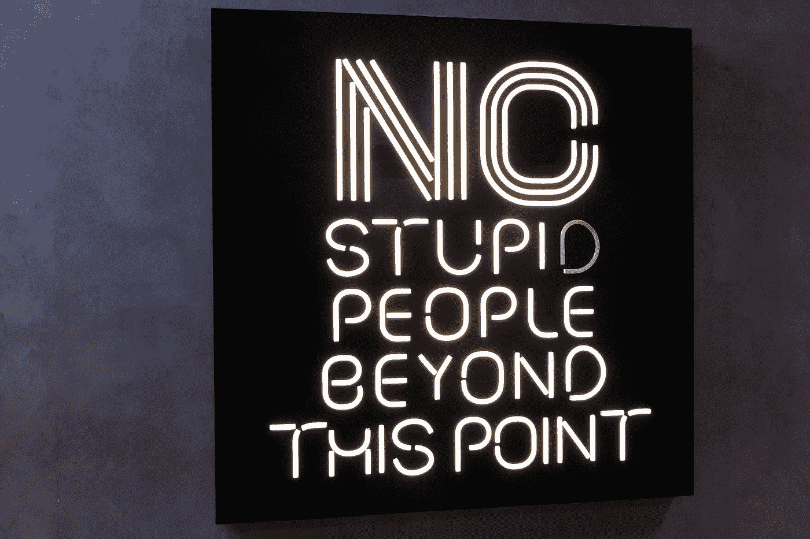

# 加密货币简介:让你加密流畅的资源

> 原文：<https://medium.com/hackernoon/6-resources-that-will-make-you-crypto-fluent-dcba3365c25>

## 加密货币速成班

让我们回到基础。跟随这篇文章，获得你需要了解的关于区块链和它周围的加密货币的一切。

Photo by [Nick Fewings](https://unsplash.com/@jannerboy62?utm_source=medium&utm_medium=referral) on [Unsplash](https://unsplash.com?utm_source=medium&utm_medium=referral)

区块链和加密货币仍处于初级阶段。没有多少行业标准、认证或信任标志。没有一个组织像商业改善局那样让消费者知道哪些信息来源是可信的或不可信的。加密信息来源的碎片化格局使得散户投资者难以自我教育，并从根本上阻止了规避风险的机构投资者进入市场。

我正在学习“区块链初学者”课程，但在完成之前，我决定汇编那些在我第一次进入这个领域时对我有帮助的资源。我希望它们能为你提供同样的洞察力和清晰度。

**我把它分成了两个主要部分:**

1.  白皮书
2.  网站

这里列出的一切都是免费的。我真诚地相信，这些资源是您学习基础知识、了解区块链技术和基于该技术构建的加密货币的最新信息所需的一切。如果你对区块链不像对交易加密货币那样感兴趣，[这里有一个链接，链接到一个提供交易教育课程的 Discord 服务器](https://discord.gg/eyNx8tS)。

## 加密速成班

Image by [Joanna Kosinska](https://unsplash.com/@joannakosinska?utm_source=medium&utm_medium=referral) on [Unsplash](https://unsplash.com?utm_source=medium&utm_medium=referral)

在我们深入资源之前，我想澄清一些事情。我收到了很多关于区块链术语的问题，以及“区块链”和“加密货币”之间的区别。

**区块链** *之于* **加密货币** *就好比* **互联网** *之于* **电子邮件**。

加密货币一词被广泛用于描述所有的区块链项目，主要是因为第一批区块链项目旨在单独充当货币。直到以太坊这样的项目出现，我们才开始看到区块链项目有着不同于取代法定货币的愿望。正如我所说，没有一个行业标准或“区块链圣经”明确定义所有这些术语——但这是我的理解，作为一个生活、呼吸和吃 crypto 的人，我认为我是一个相当不错的参考点。

**比特币** *是一种* **加密货币**。

**比特币** *是用* **区块链技术打造的，** *类似于一辆汽车****是用* **一台内燃机**打造的。**

> **除了发动机，制造汽车还需要其他材料，如金属。比特币工作还需要其他材料，比如作为节点运行的计算机。**

***如果说****是互联网的****那么* **比特币** *就是* **paypal** 。******

*****如果说* **区块链** *是* **互联网***那么* **以太坊** *就是* **HTML。******

*****如果说* **区块链** *是* **互联网***那么* **莫内罗** *就是一个* **VPN******

****诚然，这些例子有点过于简化。他们没有考虑到这样一个事实，即许多加密货币都有自己的区块链——每种货币都有特定的优缺点。以太坊有自己的区块链，例如:加密货币要么建立在预先存在的区块链之上，要么就是它们自己的区块链。****

*****比特币是它自己的区块链。*****

****阿克斯皮雷是建造在以太坊区块链上的令牌。****

****我相信您现在已经厌倦了例子和类比，所以让我们进入参考资料。****

## ****白皮书****

****每当有人问我如何学习区块链或一般加密，我告诉他们完全相同的事情。****

1.  ****读 10 遍比特币白皮书****
2.  ****把以太坊白皮书读 10 遍。****

****现有超过 1600 种加密货币，我并不是说阅读这些白皮书就能让你理解所有的加密货币(其中一半并没有真正做任何创新)。它的作用是让你了解**推动这个行业的基础技术**是如何工作的，以及**为什么**是一个游戏规则改变者。****

****你之所以需要阅读这两份白皮书，是因为它们呈现了这个行业诞生的两大创新:**分布式总账**和**智能合约**。****

****我强烈认为，在学习这个领域的任何东西之前，你应该先学习分布式分类账和智能合约。反复阅读这些白皮书，以至于你可以向一个 10 岁的孩子解释它们的概念。****

****[链接比特币白皮书](https://bitcoin.org/bitcoin.pdf)****

****[链接以太坊白](https://github.com/ethereum/wiki/wiki/White-Paper)****

## ****网站****

****既然你已经了解了什么是区块链，为什么它如此重要，这里有一些网站可以帮助你了解在这个领域取得成功所需的最新消息和数据。****

1.  ****[**CoinMarketWatch**](http://coinmarketwatch.com)**—CoinMarketWatch 是我每天早上第一个去的网站。它按照市值的大小列出了每种加密货币，并为每种货币提供了单独的页面，提供了更多信息/有用的链接来了解它们。他们还在为他们即将推出的 [dApp、Sindric](http://sindric.io) 开发人工智能情绪分析工具和其他交易者资源。******
2.  ******[**CoinMarketCal**](https://coinmarketcal.com/)—CoinMarketCal 是重视基本面胜过技术分析的交易者和投资者的必需品。它列出了行业中发生的所有有新闻价值的事件，用户可以对事件投赞成票或反对票，以表示事件实际发生的确定程度。这个行业是如此受情绪影响，有时人们会推出假消息或事件来操纵一枚硬币的价格。CoinMarketCal 通过让社区决定来分散验证事件有效性的能力。******
3.  ****[**共析**](https://coinalyze.net/) —共析在我的电脑后台不断运行。CoinMarketCap 非常适合鸟瞰加密市场，但 Coinalyze 更深入。它可以让你为某些硬币的价格变化设置警报(一旦你看到这个市场有多波动，你就会知道这一点是至关重要的)，还可以自动扫描所有列出的加密货币，并在它们出现时识别技术分析指标——这样你就不必像我过去那样在 TradingView 上花几个小时绘制图表。****
4.  ****[**crypto panic**](https://cryptopanic.com/)—crypto panic 将区块链和 crypto 的所有热门新闻聚合到一个仪表板中。它从 Reddit、博客、主流媒体以及互联网的所有角落和缝隙中获取文章。我喜欢 CryptoPanic 的一点是，它采用了与 CoinMarketCal 相同的共识机制——它让用户对不同新闻的可信度(和权重)进行投票。****
5.  ****[**Reddit**](http://www.reddit.com) —不管是恨还是爱，Reddit 往往是我第一个发现突发新闻的地方。这也教会了我区块链最重要的一个方面，那就是社区。每种加密货币都有一个子货币，一些比另一些更活跃。研究一个特定的硬币 subreddit 会让你深入了解其社区对代币及其未来的看法——这在这样一个情绪驱动的市场中尤为重要。从这些子区域开始，当你完成的时候，继续往兔子洞走。
    **/r/ethtrader** —投机&新闻
    **/r/比特币** —动态&高层新闻
    **/r/btc** —给那些希望获得/r/比特币(它是比特币现金的)
    **/r/以太坊** —动态&高层新闻
    **/r/加密货币【的人******