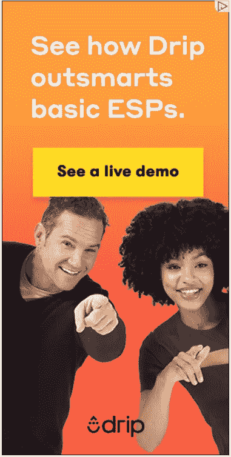

# 了解顾客需求的 6 个 SaaS 调查问题

> 原文：<https://medium.com/hackernoon/6-saas-survey-question-to-get-inside-your-customers-head-2e6b2cac16f5>

一个问题总是在烦扰人，一个调查问题也是如此。

我总是听到它。特别是在 SaaS(软件即服务)领域，当谈到改善入职和转换时，我们如何衡量客户满意度？

有哪些客户满意度调查问题的例子？

# 你如何调查客户满意度？

这个问题的答案很简单，但并不直接。

那么，问题是什么？

“要开始提高转化率，我需要知道些什么？”

(或者，“你需要知道什么？”如果你要带一个局外人或顾问。)

通常情况下，他们会开始考虑基于事实的答案，比如“我们需要包含这个特性”或者“我们的目标是小企业主。”

*问题？这根本不够。*

看，如果在写一点文案或重新设计任何东西之前，你需要一件东西，它不是一个“成熟的模板”或一系列功能……**它是你的用户故事。**

User Story Mapping

对你的前景的真实描述是一幅静态的图画，而一个故事包含了情境、地点、人物、感觉、情感、斗争、挫折、过去、现在和未来。它是动态的。

因此，除了简单的“我们的目标是 _ _ _ _ _ _ _ _ _ _”之外，你应该能够填写以下段落中的空白处:

*“约翰的生活本来很顺利，但是有一天 ______ 发生了，他知道他必须 ______。他尝试了 ______ 和 ______ 来解决这个问题，但没有成功，因为 ______。他是如此的 ______，以至于他告诉他的搭档，“亲爱的，______ .”*

当他通过 ______ 发现/听说{贵公司}时，他决定试一试。他立即报名，希望 ______。能够 ______、______ 和 ______ 让一切变得不同。现在他终于可以说，' ______ . '”

看看了解这个简单的 2 段故事是如何给你提供关于如何定位你的企业及其信息的洞察力的？

您的信息需要根据客户的过去、现在和未来来讲述。他们最清楚。

现在，你可以准备一份简单的调查发给你最近的买家，而不是试图猜测这个故事实际上是什么。这正是我们今天正在做的事情:创建一个客户满意度调查，深入到您的客户的头脑中。

我会给你免费的客户满意度调查问题的例子。

准备好了吗？

酷毙了。

注意了。

只有 6 个产品反馈问题，我们将从头到尾填补你的用户故事的空白。

我们不会给你确切的客户满意度调查格式，但我们会给你样本和现实生活中的例子，你可以从中得到启发。

这是一个新产品调查的完美例子，目的是了解真正的客户需求。

# 了解客户需求

**SaaS 调查问题 1:“你生活中发生了什么让你选择加入我们？”**

Joanna Wiebe 是 copy hacker&air story 的创始人，她的感谢页面将这个问题放在了最前面，这是有原因的。

Copy Hackers survey question

这个问题的力量在于你从潜在客户最初的精神状态和故事中获得的洞察力。

她称之为“加入已经在你的客户头脑中发生的对话。”*我喜欢称之为第一场。*

人们总是在寻找与他们头脑中已经有的东西相关的东西。如果他们看到与自己相关的东西，就更有可能抓住他们的注意力。

这就是为什么这个问题的答案对于标题、主题行和其他在顾客旅程的最初阶段吸引注意力的东西特别有帮助。

例如，有一个我很乐意帮助的时间跟踪工具——一个 Pomodoro 计时器，你可以很容易地与 Trello、Asana 和其他项目管理工具集成。

我发现用户经常说这样的话，“是的，这个番茄定时器是我一直在寻找的”或者“最后，一个简单有效的集成。”

猜猜欢迎邮件的主题是什么？

就这样。

了解客户故事的第一幕可能会改变游戏规则。

这就是用废话轰炸你的用户和设置一种同情的语气，让你的用户可以自信地说，“这些人懂我。”

# 了解客户旅程

**SaaS 调查问题 2:“你会如何向你的伴侣描述你正在经历的情况？请具体一点。”**

在他的旗舰书籍 [*《广告文案手册*](https://www.amazon.com/Copywriters-Handbook-Step-Step-Writing/dp/0805078045)中，鲍勃·布莱说，用文字将潜在客户转化为客户只需要三件事:

1.  引起他们的注意
2.  沟通
3.  劝说

第一个问题的答案可能会给你与用户问题相关的线索——这样你就可以引起他们的注意，让他们点击。

然而，下面这个方面需要两个经常被忽略的特征:**清晰&简单。**

这是一些科技企业失败的地方。

SaaS 的创始人和营销人员通常参与产品的创造，他们被术语和该软件所有令人惊叹的功能所困扰。

但是当你退后一步，听你的潜在客户如何向一个可能没有技术背景或行业经验的亲近的人解释他们的情况时，这是一个完全不同的故事。

*他们将如何表述他们的现状和问题？他们会将它与什么进行比较？*

我知道你们中的一些人有复杂的解决方案，而且通常有老练的买家，他们应该理解你们的行话。

这很好。有时候。

无论哪种方式，有了这个问题的答案，你就有了强有力的洞察力，知道你可以利用什么样的类比和比较来使你的信息和概念更容易理解。

# 根据客户的需求选择合适的工具

**SaaS 调查问题 3:“你尝试过什么解决方案？请解释为什么它们不完全适合你。”**

大家都知道。(或者我是这么认为的。)

你的潜在客户不马上刷信用卡的首要原因是他们有选择。几十个，甚至几百个选项可供选择。

*了解他们用自己的话表达的需求和选择之间的差距是非常有价值的。*

记住这些信息，你需要通过你的网站、广告或者在最初的几封电子邮件中直接提出来。

看看这个由 ESP(电子邮件服务提供商)公司[滴滴](https://drip.com/)重新定位的广告:

这些人知道他们在做什么。

从事可能是 SaaS 竞争最激烈的行业之一——电子邮件营销服务——他们解决主要潜在客户的异议:**你与竞争对手有什么不同/更好。**

这让你可以利用你的客户在竞争中发现的无用之处，这将立即让你大放异彩，同时给他们希望的灯塔，他们需要给你一个机会。

关于过去的问题够多了。是时候谈谈他们跳上船后的真实感受了。

# 客户满意度调查问题示例

**SaaS 调查问题 4:“对你和你的团队来说，最重要的三个特征是什么——这三个特征如果被删除，可能会让你立即寻找另一个解决方案？”**

这并不奇怪，迟早你会需要强调你的一些特点。(关键词=一些≠全部。)

这里的问题是知道*要强调什么*特性。

大多数潜在客户并不关心你产品的大部分特性。人们真正关心的功能可能只有**二到四个**。然而，大多数人都是这样做的:

他们列出了一大堆功能，用一个接一个的图标和所谓的好处填满了他们的登录页面。然后，他们继续用电子邮件发送一个又一个特征，直到油箱里的汽油用完。

这很少移动指针。

其他人试图自己去猜测这些关键特征是什么，结果却说错了。

很明显，最快最准确的知道方法就是直接问。这就是我们在这里所做的。

我个人建议你问一个选择题，让这个问题对你的客户和你自己都简单一些。

因此，您需要对这些功能有所了解。

我喜欢用一个框架来缩小特性列表，这个框架就是 **FUR** (代表频率、紧急程度、范围)。

用数据(如果你有资源)或直觉(如果你想即兴发挥)找出答案:

*   **频率:**人们使用频率较高的功能有哪些？
*   **紧迫性:**人们在注册后想立即尝试哪些功能？他们最需要什么功能？
*   **Reach:** 你的整个客户群中有多少人使用某个特定的功能？你的用户中最常见的行为是什么？

有了这些问题的答案，你应该能够成功地将你的列表缩小到 12 个以下。我个人认为 7-8 是理想的。

只是记得添加一个“其他”选项。说到了解市场，犯错总比什么都不问好。

# 分解它

另一种了解这个列表并对其进行优先排序的方法是将这个问题分成两到四个独立的问题，让用户选择他们最重要的功能，第二重要的功能，等等。

你不需要知道前三个特性是什么，而是要知道，例如，哪个特性在大多数情况下被评为第一。(这一点仅凭一道选择题是无法知道的。)

这是最重要的问题之一，因为毫无疑问，这些见解会将你的信息转移到真正重要的事情上。

# 用户入职体验

**SaaS 调查问题 5:“想象一下你第一次注册的时候。你想做的第一件事是什么，或者你想达到的结果是什么？”**

第一印象就是一切。他们可以创造或破坏生活和商业中的机会。

了解潜在客户的期望可以帮助你立即将他们的现实与期望相匹配。

这意味着，一旦你确切知道他们期望做什么或得到什么，你就可以轻松地:

1.  告诉他们就这么做。
2.  告诉他们采取另一项行动(并告诉他们为什么他们想做的事情还不重要)。

这个可能有点难以理解。所以让我告诉你一个个人故事。

几个月前，我报名参加了[计划会议](https://www.scheduleonce.com/)。

我需要安排一次与潜在客户的通话。本质上，我希望注册，登录，复制一个链接，粘贴到电子邮件中，然后继续我的生活。

我有点赶时间。(你知道，当一个潜在客户问你要一个与你日程安排的链接，而你却没有，这种事情就会发生。)

无论如何，当我注册 ScheduleOnce 的免费试用时，他们开始带我参观他们的整个界面。没关系。但我只是想要一个链接发送给一个潜在客户。

然后他们给了我总共 12 个视频来“开始”…

这也没关系。但我只是想发送一个潜在客户的链接。这意味着我希望(1)连接我的日历(2)选择我的可用性(3)获得一个链接。

就是这样。我不想要别的。

有多少客户也是这种情况？我们不知道。所以我们要问。

因为如果你开始一段一段地，一段一段地谈论你的整个平台，在我做我需要做的事情之前，我就要离开了。(抱歉，这就是现在人们在网上的行为。)

所以，确保你知道你的客户对你有什么期望。给他们。尽快。

# 窥探而不是询问

一种更数据驱动的方法是收集用户数据，分析用户注册后的具体行为。

这可以通过像 [MixPanel](https://mixpanel.com/) 这样的解决方案来定量完成。或者你可以用像 [Smartlook 这样的解决方案在视频上看到你的用户。](https://www.smartlook.com/)

这不仅可以帮助你摆脱头脑，了解用户的期望，还可以帮助你发现功能转换关系(例如，激活“X”功能的人转换的可能性增加 25%)。

你拥有的数据越多，你就能获得越多的洞察力。而且你能得到的可操作的见解越多越好。

# 描绘更光明的未来

**SaaS 调查问题 6:“想象一下，我无意中听到你谈论为什么下个月对一个家庭成员来说这是一个成功。我到底会听到你说什么？”**

如果你问人们为什么决定购买，或者成功对他们意味着什么，他们可能会开始用“哦，功能 X”或“用户体验”来证明自己。

但是正如我们在问题#2 中看到的，当他们不得不与不一定理解这些术语的人交谈时，答案是完全不同的。

这是我最喜欢的一个，因为它揭示了你不知道的想法。

在这里，您可以真正了解用户成功的样子，并将其用于您的优势。

从一开始就在你的信息中清晰地描绘出一幅更光明的未来，你就不会出错。

不过，你可能想向最近的顾客问这个问题。如果你在 B2B 领域，考虑把“家庭成员”换成“亲密团队成员”，如果这听起来更合适的话。

# 客户满意度调查应该持续多长时间？

调查客户满意度不是一门科学。

没有经验法则，也没有理想的长度。

有太多的因素需要考虑并影响理想的长度。

不过，我们可以建议保持最低限度。去掉所有无用的或“很好”的问题，抓住你想关注的重点。

请记住，您的客户回答调查的时间不会超过 5 到 10 分钟。

# 接受挑战:问这些产品调查问题

你可以采访你的客户——我个人鼓励这样做。但是有时你想确保你有一个更有代表性的样本量(并且你想快速获得信息)。

方法是通过**调查**，由[收集调查反馈。](https://feedier.com/blog/ultimate-customer-feedback-guide/)

从上面窃取我们的客户满意度问卷样本。

根据您的品牌定制这些问题，并利用这些问题和一些可用的[调查工具](https://feedier.com/blog/feedier-and-other-feedback-tools/)发送一份引人入胜的调查。

Feedier 在这方面做得很好。

我建议你下周向至少 100 名精选的、积极参与的用户发送一份这样的调查。你会惊讶于你所获得的洞察力。

## **关于作者**

Isaac Perdomo 帮助 SaaS 企业建立了一个用电子邮件代替销售人员的转换机器。白天电子邮件转换文案。人们在晚上很开心。他认为 SaaS 是商业的未来，经常可以看到他让他的客户在竞争对手面前大放异彩，或者吃掉另一本商业书籍。在[脸书](https://www.facebook.com/isaaccruzp)上与他联系，或者在他的网站 [CopyOnboard](http://copyonboard.com/) 上了解更多信息。

*最初发表于*[*Feedier*](https://feedier.com/blog/customer-satisfaction-survey-question/)*内部。*