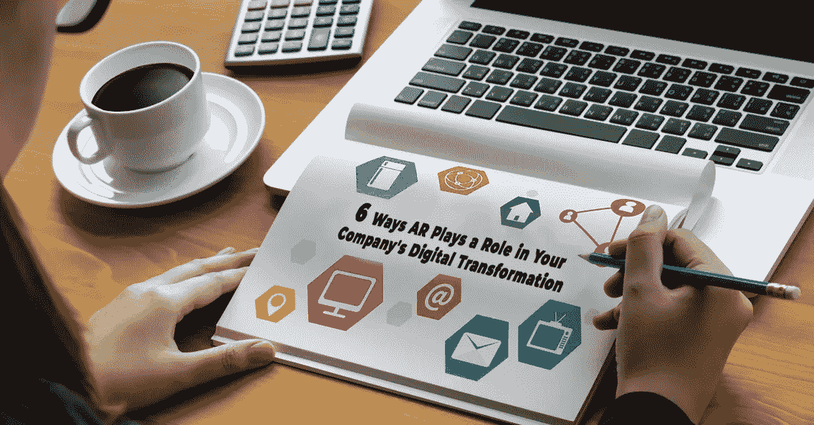

# AR 在您公司的数字化转型中发挥作用的 6 种方式

> 原文：<https://medium.com/hackernoon/6-ways-ar-plays-a-role-in-your-companys-digital-transformation-1a6b265d635f>

增强现实革命已经到达了一个新的点，企业采用盖过了消费者世界。市场领导者已经开始将他们的注意力从利基产品转移到以工业化设计的原型为基础的战略上。

增强现实已经在游戏、媒体、营销甚至旅游等多个领域占据了上风。简而言之，这项技术为当前时代的新业务或现有业务提供了大量机会。

## 一些事实:

据统计数据显示，到 2020 年底，增强现实有望获得近 10 亿用户。智能 AR 眼镜的全球出货量预计到 2020 年将达到 540 万台。到 2020 年，全球 AR 市场也有望增长到 900 亿美元。

在接下来的几十年里，增强现实/虚拟现实和沉浸式技术的进步将为技术带来更直观的方式来改善我们的生活。在未来，我们与数字信息交互的手段将不再是硬件或屏幕，而是更多的情感和手势。

许多公司现在已经将重点从试验 AR/VR 设备转移到在企业中建立任务关键型应用程序。面向消费者的娱乐投资仍在继续，然而真正的行动越来越多地发生在工作场所。

增强现实正在许多行业的运营部门产生影响深远的变化，以下是增强现实如何改变企业运作方式的 6 种方式。

# 全天候获取信息

有了 AR 技术，随时随地检索信息成为可能。这些技术如此先进，以至于用户只需使用一些身临其境的设备，就能从任何地方快速回到过去。

它可以完全增强个人对现实的感知，具有修改数据、改变视图和其他视觉和声音元素的能力。

# 用实时指令代替用户手册

随着 AR 的出现，产品手册将很快成为过去。纸质手册需要正确的图解和正确的文字解释。

智能手机支持的 AR 程序将能够轻松识别覆盖文本或视频指令。AR 眼镜将提供这方面的最佳体验，允许免提，根据用户动作实时观看指令。

# 增强现实将改变每个行业的管理

AR 将彻底改变任何行业中主管执行任务的方式。例如，想象一下主管在地板上走着，在他们的眼前有一个战斗机飞行员风格的显示器。

想象一下，当他们可以快速读取绩效数据来帮助员工解决复杂问题，甚至识别落后的员工时，他们的效率会有多高。

在 AR 的帮助下，主管不仅能够实时检测问题，还能清楚地知道他们必须在哪里投入时间和精力才能获得最佳结果。简而言之，AR 将为监督者配备分析和观察的超能力。

# AR 在改变零售业支付流程方面的潜力

随着 AR 技术从创新走向成熟，它将彻底改变客户体验和我们所知的零售行业。AR 支持更广泛的支付授权码，这些授权码可以定期轮换使用，以误导欺诈者。

例如，期望通过视网膜扫描来确认身份或支付有效性的最终用户可能会被要求提供手部动作或声纹。

adaptive authentication 这个有趣的概念最适合于可能检测到异常的高风险交易。在这个消费主义时代，商家面临着对增强体验的日益增长的需求，强大的双因素身份认证将成为规范。

使用这种技术传输的所有私人数据都可以通过几种现有的事务控制(如令牌化或 3D 安全)得到有效保护。

# 增强现实将改变产品设计和制造

MyStemKits 的总裁 Laron Walker 认为，AR 将改变工程和产品设计。在筒仓中开发产品、延长反馈周期或昂贵的原型制造的日子已不复存在。

AR 将允许 3D 建模软件将其设计表面从 PC 扩展到现实世界。建模者将实时改变他们的设计，同时也让利益相关者即时反馈。

在包装用于 3D 打印或其他形式的制造之前，这些设计在功能和形式方面都将是完美的。因此，这将降低制造成本，并缩短上市时间。

# AR 在医疗保健中的作用

几年前，物联网因其在转变[医疗保健行业](https://hashedin.com/case-study/digital-supremacy-for-healthcare-brand/)中的作用而引起轰动。现在，AR 也在寻找进入医疗保健领域的方法。

例如，AR 可以用来改善目前进行手术的方式。这不是一个闻所未闻的事实，精度是至关重要的因素时，手术进行。

事实是，它可以决定干预的成败。为了使外科医生更加精确，可以利用 3D 可视化从不同角度实时显示器官。

# 结论

增强现实工具或应用的主要目的是消除用户的痛点，创造个性化的客户体验。AR 在商业模式中的成功实施也会严重影响消费者对未来商店的看法。

某些游戏应用程序(如 Pokemon Go)的疯狂流行表明，许多用户已经准备好接受这项技术，并热切期待使用支持 AR 的设备。

有一点非常明确，那就是在不久的将来，我们将会看到 ar 应用在房地产、时尚、汽车和零售市场等各个行业的采用率将会上升。