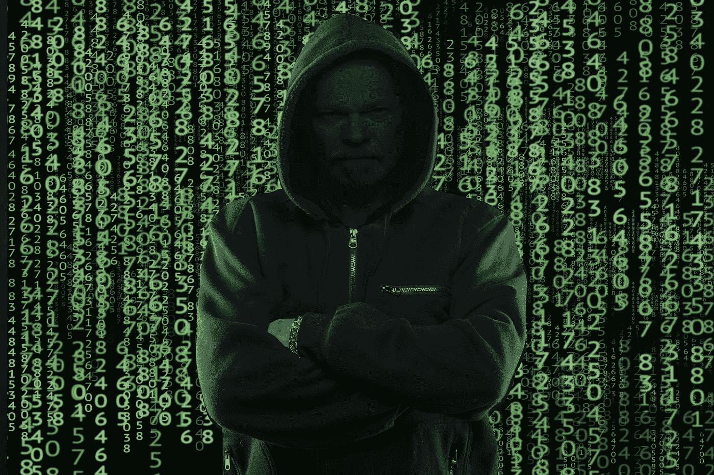
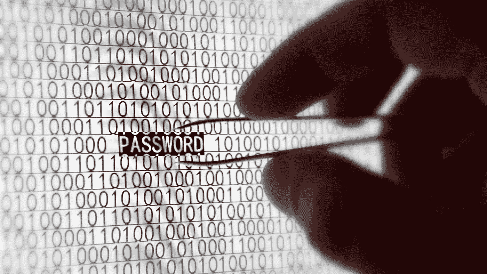
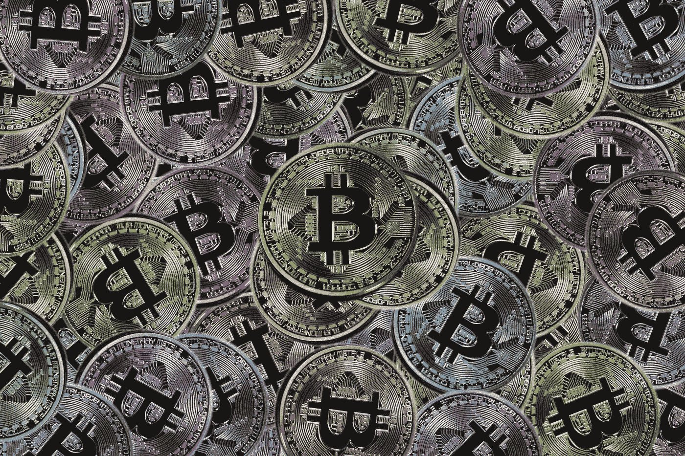

# 被加密货币诈骗的 6 种方式

> 原文：<https://medium.com/hackernoon/6-ways-to-get-scammed-with-cryptocurrencies-910c968a0f98>

你知道吗，仅在 2018 年的前几个月，人们就在加密货币相关的骗局中损失了超过 5.32 亿美元。现在你知道了！[【来源】](https://www.coindesk.com/crypto-scams-cost-consumers-billions-dollars-year-ftc-says/)

This is the image I found when looking for “Cybercriminal”. These guys are usually much, much scrawnier.

在这个行业中，有无数种方法可以让你赔钱，从糟糕的投资策略到被金融大鳄欺骗。我有机会与区块链和加密领域的数十人互动，其中既有合法商人，也有胡扯小贩、彻头彻尾的骗子，甚至小偷。

害群之马所利用的是普遍缺乏了解。他们利用了一些投资者不存在的教育和懒惰，以及市场角色过山车令人生畏的波动。这些人知道他们的目标受众，我可以担保。

与普遍的看法相反，进入区块链利基市场的门槛并不高。这 101 条中的大部分内容(比如词汇、技术背后的原理、协议之间的差异等)可以在一瞬间被理解。有很多友好的资源可以利用，更不用说当地社区和维基项目了。

然而，很少有人真的去这么做。所以我的假设是，他们参与整件事是为了赔钱，而不是赚钱。嘿，人各有志。

另一方面，骗子呢？他们努力销售粗略的*使用我的直接比特币节点在两周内将你的投资增加 233%*并花费无数时间将新人引入令人发指的庞氏骗局。这些人有动力，应该找到他们要找的人。

**总结一下:**有些乡亲想让地球另一边的骗子发财，还说骗子在加班加点地跟他们撮合。这里有供给和需求。我明白这一点，我的目标是始终帮助人们进入他们正在寻找的经济关系。

这就是为什么我在这里收集了利用加密货币的最突出的方法，以推动财富转移。

*让我们从任何人现在都可以去爱上的东西开始:*

# **1。网络钓鱼**

这是现存最流行的网络犯罪形式，在加密货币领域也同样适用。网络钓鱼是一种常见的方式，通过伪装成无害和可信的方式向您的设备发送恶意软件、勒索软件或其他形式的讨厌的东西。比如，他们可能会克隆一个你经常输入密码的网站，在电子邮件附件中发送恶意代码，或者通过伪造公共 wi-fi 网络潜入你的电脑。

I am pretty sure these guys don't use pincers. You never know, though.

一些网络钓鱼者甚至更加狡猾，他们可以伪造加密货币钱包提示，以欺骗您插入种子短语或私钥。MetaMask 曾经发生过这种情况，欺诈者将使用这种以太坊浏览器钱包的 PC 作为目标，通过添加一个窗口要求用户确认他们的种子短语来劫持他们的帐户。一些人这么做了，很快他们所有的资金都被抽走了。

如果你想快速摆脱多余的资金，网络钓鱼是一种快速简单的方法。不过，这通常是一起完成的，并不是特别聪明。

*还有更优雅的方式来丢失您的密码……*

# **2。好得难以置信的机会**

我已经在两周前提到了你的投资总额增加了 233%，你可以根据你所处的利基市场和你对市场的总体敞口找到不同的版本。这些并不像网络钓鱼诈骗那样广撒网，通常只是贪欲的简单玩法。

我们这些初入市场的人可能会听到:

> -嘶，嘿，有个我发现的采矿秘密，因为【随机技术废话】带来了 10 倍的投资

而那些工作时间较长的人可能更倾向于这样的事情:

> -内部消息，哟！[lappy-coin # 17245]将于本周末登上月球，在此以折扣价购买！

其中一些变得相当复杂和个人化——正如俗话所说，阳光充足的地方吸引阴暗的人。如果你首选的赔钱方法涉及半匿名的陌生人和粗略的报价，这一个肯定会击中现场给你！

*说到黑幕优惠，不过……*

# **3。** **【初始硬币发行(ico)】**

ico 是区块链领域的创新创业公司获得项目信息并直接从投资者和未来用户那里获得资金的一种方式。至少，这是每一个推出一个的人要告诉你的。

他们也碰巧是一个创新的方式，为许多骗子迅速资助他们的下一次巴哈马之旅。

Even though they look shiny, colorful, and different, these are all exactly the same thing. Poetic.

现在，这里的这一个不是你的钱的一个确定的方法。你可能偶然发现一个有能力的团队，偶然投资一枚硬币/代币，或者运气好，从价格的意外上涨中获利。毕竟，这东西是有风险的。

为了使你的资本损失可能性更大，我建议只把你的钱给那些没有创新想法、没有媒体曝光、没有可信顾问的 ico。他们的白皮书也应该充满毫无意义的文字沙拉。你对参与项目的人和他们的计划了解得越少越好。

当硬币/代币进入交易所，其价值化为乌有时，你就会知道你的财务决策是多么糟糕。

*实际上，既然我们提到了这个，你不妨用…*

# **4。** **见不得人的交往**

交易所是人们通常购买代用币并进行交易/投资的地方。因此，你可以将你不太受欢迎的货币兑换成比特币，然后如果你愿意的话，再以美元卖出。知名的大交易所是相当安全的，尽管大多数人仍然不建议持有大量的此类股票，因为没有人投保意外事故和黑客攻击险。

但是，嘿，你知道吗，有一些网页模板可以让你在几天之内几乎不花一分钱就完成一个交易。现在你知道了。因此，如果你想失去你的密码，下一步行动非常简单:只需在一些无名交易所注册，在那里交易你所有的资金，然后祈祷好运。你很快就会发现自己无法收回任何东西，你的任务也就完成了。

*当你相信别人会帮你保管钱的时候，为什么不试一试…*

# **5。** **假采矿作业**

你会得到投资某人采矿作业的提议，通常是在一些第三或第二世界国家。他们会给你看那个农场的照片，并向所有的神发誓，你只是在购买他们的 CPU 能力，所有采矿的收益都将直接进入你的钱包。简单的东西，对不对？

你把钱寄给他们，他们提供硬件，然后你就可以让他们发财了。

I actually know someone in Ukraine who legit builds farms in places like this. You never know.

像往常一样，这些人提供的证据越少，信誉越好，对你的密码丢失的探索就越有利。如果他们要求提前支付一大笔钱，而你得到的承诺是几个月或几年后才能取款，这就是加分。

你可能会开始注意到一个共同的主题:你对钱包和资金的控制越少，你看到它们蒸发的可能性就越大，而且对此无能为力。

*这给我们带来了最简单的方法来交出你辛苦赚来的密码…*

# **6。** **粗心大意**

在当前的市场中，会有很多很多的机会被骗。大多数会比我能想到的任何东西都更有创意。

这些是你个人特有的，可能与社会工程、小众兴趣、糟糕的时机等有关。如果你闭上眼睛，坚持尽可能少控制钱包的原则，你将成为绝佳的猎物，实现你想要的赤贫。

正如开篇所提到的，使用加密货币赚钱和赔钱的机会是无穷无尽的。

你想怎么做就怎么做。

*亚历克斯·帕廷(Alex Partin)通过说出具体的人和项目，成功地击败了永远与这篇文章约会的冲动。对于他更多的时事评论，你可以在*[*https://alexpartin.com*](https://alexpartin.com)订阅每日提示和见解