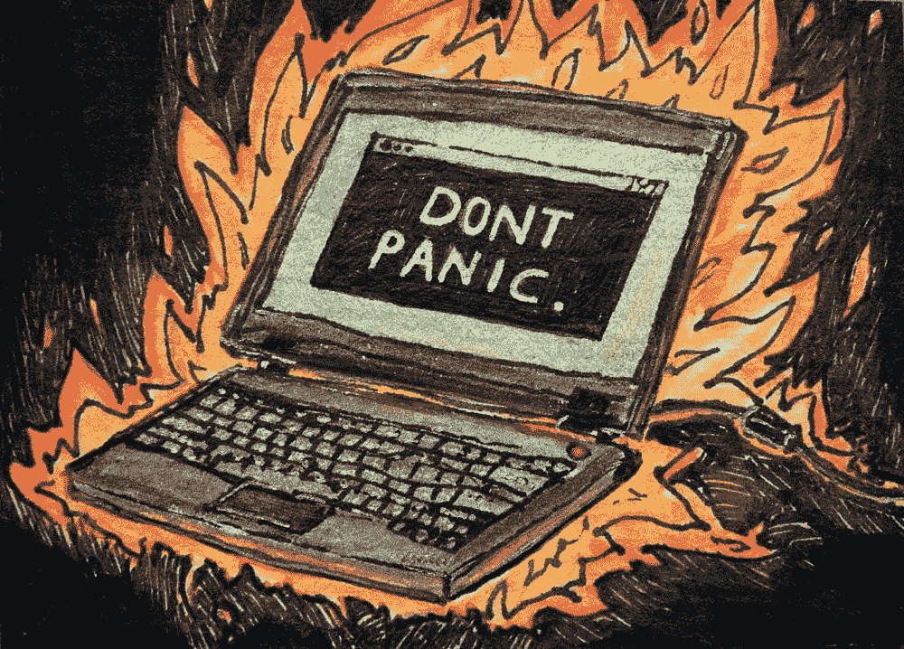

# 交易加密货币时控制情绪的 6 种方法

> 原文：<https://medium.com/hackernoon/6-ways-to-keep-your-emotions-under-control-when-trading-cryptocurrencies-1ca05f504cf0>

## 这个指南旨在帮助你避免让你的情绪左右你的交易。

购买和交易加密货币可能是一种情感体验。它的节奏很快，有许多不同种类的交易和购买。一些人试图通过短期日内交易从加密货币价格的波动中赚钱。其他人则希望持有长期投资，并希望他们购买的加密货币能够保值。

所有这些都让购买和交易加密货币变得有趣，并可能有利可图。但它也可以被指责为 FOMO 和 FUD，这造成了基于情感而非事实做出决定的风险。为了降低风险并避免在加密货币市场中损失资金，控制情绪至关重要。下面的指南旨在帮助你避免让你的情绪左右你的交易。

## 1.想办法

在开始交易之前，最重要的是，在投资加密货币时，要清楚自己的目标是什么。在购买任何加密货币之前，问自己这些问题:

*   一般来说，购买 crypto 符合您的财务状况吗？你有其他存款吗？如果不是，加密是开始投资的最佳方式吗？启动一辆安全的汽车会更有意义吗？
*   你能承受失去你想用来购买密码的钱吗？
*   你了解加密货币市场的风险和波动性吗？
*   你将如何使用你的加密货币:购买和持有，还是交易？

## 2.做你的研究

对你可能购买的加密货币及其底层技术进行背景研究至关重要。请务必阅读该项目的白皮书。寻找由优秀技术和活跃社区支持的加密货币。尽管这两件事不能保证成功，但它们会帮助你更好地理解你要买的东西。

## 3.选择正确的交易交易所

选择[正确的平台](https://hackernoon.com/which-is-the-right-cryptocurrency-exchange-for-you-ecf0cc8f9477)是关于根据你的计划找出哪一个将帮助你达到你的目标。他们中的一些人有几十个硬币可供购买和交易，而其他人只列出几个。有些允许你将加密货币兑换成法定货币，而有些则不允许。有些允许你用法定货币购买加密货币，而有些则不允许。找出最适合你的是至关重要的。以下是一些需要考虑的因素:

**地点:**在您的国家使用交易所有助于满足法律要求。在银行用当地法定货币存款或取款也更容易。

**可用的硬币和交易对:**看看你要用的交易所。有哪些硬币？什么交易对？可以用法定货币存款购买加密货币，还是只能用另一种加密货币如比特币购买？如果你正在寻找一个长期投资，一个基本配对的交易所将是最好的。另一方面，如果你想用日间交易来投机市场，你可能需要一个有高级交易功能的交易所。

**安全:**平台安全至关重要。网站有什么样的登录程序？越严格越好。确保平台尽一切可能保护你的资金免受黑客攻击。在线查看与该平台相关的新闻以及任何报告的风险。安全性的另一部分是联系交易所的支持团队，如果出现任何问题或您需要帮助，他们会帮助您取得联系。

## 4.了解你的极限

你必须知道你能花多少钱，并且*保持在限额内*。你想花多少取决于你的计划(见上面第一点)。投资加密货币具有很大的风险，所以你应该只花你能承受的损失。一旦你设定了极限，就要坚持下去。不要因为一时兴起或因为 FOMO 而决定多花钱。这会导致[灾难。](https://news.bitcoin.com/trader-gets-six-figure-loan-buy-crypto-holdings-drop-85/)

## 5.利用限价单

如果加密货币价格快速下跌，限价单可以保护你免受损失。限价单允许您设置在出售前允许您的加密货币价格下跌的最低限制。限价单也有助于锁定收益。

例如，你以每枚 20 美元的价格购买一枚硬币。如果你预计价格会快速上涨，你可以在 19.99 美元设置限价单。如果价格大幅下跌，平台会自动以 19.99 美元出售你的硬币。如果硬币的价值上升到每枚 25 美元，您可以将限价单更改为 24 美元。大多数交易所都有限价单系统。在你开始购买加密货币之前，先测试一下限价单系统。这不是一门完美的科学，但限价单有助于限制损失和确保收益。

## 6.不要沉迷于市场图表

目前，价格波动剧烈是加密货币行业的本质。这是交易密码吸引人的一部分。价格可以在几秒钟内发生变化，这创造了盈利机会。与此同时，波动可能是情绪的过山车。观看市场图表会导致你的血压上升，并引发情绪反应，导致恐慌抛售或因 FOMO 而高价买入。虽然市场图表很有价值，但我根据经验认为，在购买加密货币时，一天 24 小时盯着它们并不是控制情绪的最佳方式。

## 结论

购买和交易加密货币可能会令人兴奋，并可能有利可图。但它也伴随着风险和高度情绪。上面列出的几点可以帮助你保持头脑冷静。

*订阅我的频道* [*中*](/@minadown) *和* [*推特*](https://twitter.com/minad21) *如果你喜欢我的文章，想了解区块链和加密货币项目。

如果您对本文有任何疑问，请在下面的版块发表评论。谢谢大家！*