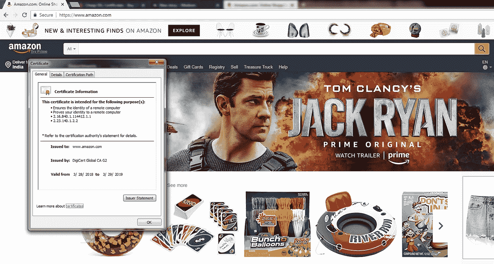
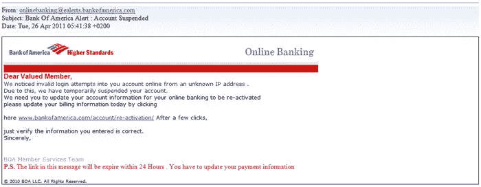

# 6 种保护您在线财务信息安全的方法

> 原文：<https://medium.com/hackernoon/6-ways-to-keep-your-financial-information-secure-online-e72e27d6f28e>

## 网上银行。网购。信用卡。手机钱包。今天，我们拥有一切可以想象的金融服务形式。自从亲自去银行以来，便利性已经大大提高了。伴随着便利而来的是一长串的危险。一个小小的错误就能让你所有的血汗钱都输给无法识别、无法抓住的黑客。

与 2016 年相比，2017 年网络攻击增加了 200% [。在未来几年，随着客户越来越多地转向数字媒体，这一数字可能会大幅攀升。](https://revisionlegal.com/data-breach/2017-security-breaches/)

你也不能放弃便利，因为从咖啡店到便利店，塑料卡和移动钱包都是被接受的货币形式。那么，你能做些什么来保证你的在线财务信息的安全呢？

我们会告诉你怎么做。

# 1.仅从可信网站购物

这应该是常识吧？不幸的是，当我们看到一个不可抗拒的交易时，我们所有的常识和谨慎的想法都会随风而逝。在网上购物时，记住一件事，如果交易看起来好得不真实，它可能也不真实。

黑客以交易为诱饵，收集你的信用卡信息和个人凭证。一旦他们窃取了你的财务和个人信息，他们就会接管你的账户。

事实上，有两种特定类型的电子商务欺诈有着相似的运作方式:

1.  **三角欺诈** —利用虚假店面窃取客户的信用卡信息，进行额外的未授权购买或电汇
2.  **商家欺诈** —客户支付了产品费用，却从未收到产品！

如果你不想成为这些欺诈和许多其他形式的国际欺诈的牺牲品，最好确保该商店是一个真正的商店。

*如何检查一个网站是否值得信任？*

寻找 HTTPS 地址栏。这就是亚马逊 HTTPS 酒吧的样子。

Amazon Secure with HTTPS (SSL) Certificates

点击绿色挂锁符号，查看该网站是否真的是您认为已登陆的网站。绿色挂锁符号和地址栏是 [SSL 证书](https://www.ssl2buy.com/)的一部分，用于加密网站免受黑客和网络安全攻击。有了 HTTPS 酒吧，你至少知道你正在访问的网站是真实的。

# 2.为在线交易设置提醒

如果有人拿了你的网上银行凭证，并设法进入你的账户，该怎么办？嗯，你可以随时配置短信和电子邮件提醒，提醒每次交易发生。您还可以为失败的登录尝试设置警报，这是一种跟踪侵入您帐户的[暴力攻击](https://www.techopedia.com/definition/18091/brute-force-attack)的绝佳方式。

如果交易不是由您执行或在您不知情的情况下执行，请立即通知您银行的客户服务部。如果是用你的信用卡进行的，要求银行冻结该卡，直到进一步通知。

*但是，你怎么可能丢失或把你的银行证书偷偷给别人呢？*

通过网络钓鱼或者其他方式，你犯了一个错误，在某个地方写下了凭证。

# 3.不要回复钓鱼邮件。最好删除它们。

网络钓鱼电子邮件由骗子发送，将您带到看起来与在线银行门户或会员网站相同的虚假页面。令人难过的是，钓鱼网站的外观和感觉完全一样。对于一个未经训练的人来说，这些差异很难发现。

查找发件人电子邮件 id、收件人以及链接的标题，如果邮件正文中嵌入了任何链接的话。

*出路何在？不要回复邮件。如果你必须访问一个银行网站，输入地址并直接登录。*

如果你不得不通过链接访问，请确保网站的拼写、邮件的发件人都是真实的。钓鱼邮件看起来和原始邮件一模一样，但是有一些漏洞，只要花点力气就能发现。

# 4.不要写下您的登录凭证！

您的银行一定已经向您强调了不要在任何可以看到的地方存储、书写或记录您的登录凭据的重要性。尽管努力创造意识，大多数网上银行用户仍然以书面形式存储他们的登录凭证，并且通常在众目睽睽之下。如果你真的想把它写在任何地方，确保它被写成一种代码，可以帮助你记住它，但不会被其他人发现。

# 5.记录你的信用评分

你知道哪种方法是了解别人是否代表你累积债务和信用卡交易的最佳方法吗？检查你的信用评分。信用评分是一个数字，表明你的信誉，或你偿还贷款的能力。你的信用评分越健康，将来就越容易获得贷款或抵押贷款。

如果你有健康的信用记录，你就可能成为身份盗窃的有利目标。通过定期检查您的信用评分来保护自己免受身份盗窃和其他网络安全攻击。

# 6.避免使用公共电脑或无线网络

没有什么叫做免费的午餐。如果你有免费的 wifi，它可能一点也不安全。或者，如果你使用公共电脑，比如在浏览中心进行网上交易，就要小心了。你的 cookies 甚至整个浏览日志都可能被黑客利用来进入你的银行账户。你最好避免使用公共电脑或无线网络，这样你的银行账户和钱才是你的，也是你唯一的。

# 最后的想法

你的财务信息和个人信息具有巨大的价值。黑客总是在窃取它们来获利。用我们描述的简单方法保护你自己免受网上银行的危险。