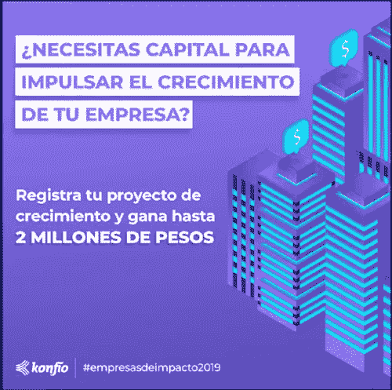
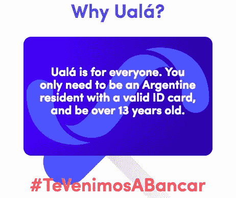

# 促进你的金融科技创业的 6 种方法

> 原文：<https://medium.com/hackernoon/6-ways-to-promote-your-fintech-startup-6aad24445253>

你花了几个月的时间开发了一个解决复杂财务问题的产品。你知道成百上千的人，也许甚至上千的人可以从你的解决方案中受益，只要他们知道就好了。你的早期用户正在向他们的密友和家人传播这个消息，但这可能不足以帮助你扩大规模。

如果你认为数字营销不适合你，因为金融科技不是一个“性感”的行业，请再想想。与其他行业的初创公司相比，一个精心策划的营销计划可能对金融科技初创公司更加有利，原因如下:

1.  金融科技产品往往难以理解。
2.  您的客户需要快速解决方案；他们不想寻找选择。好的营销和搜索引擎优化会让你的产品在你的客户需要的时候很容易被找到。
3.  营销可以为通常“不性感”的商业模式创造一个圆滑的形象。

即使你知道营销对你的金融科技初创公司的价值，你可能也不知道从哪里开始。这里有几个很好的方法来宣传你的新金融科技公司。

# 1.使用视觉营销策略。

图像可以帮助简化复杂的主题。使用信息图表或简短的讲解视频来展示你的产品是如何工作的，并在网上吸引更多的注意力。你的大多数客户更愿意看一个两分钟的视频来分解你的产品的功能，而不是阅读一份 12 页的白皮书来详细说明它的用途。

[*来源*](https://www.facebook.com/konfio/photos/pb.572233349502275.-2207520000.1538749667./1991623587563237/?type=3&theater)

例如，墨西哥小企业贷款初创公司 [Konfio](https://www.facebook.com/konfio/?__tn__=kC-R&eid=ARC7QxAGeD8WACRGrRT1hRCEXFoRCXX_E-kJtaAocvrz6UYRUzI-6gYdnZxhhZCdwUhRPcgUxyVwuIti&hc_ref=ARTwp5a4cLKIYc9HOsMyIq0e-3ZmL54AnM2waPiQ40V6dKMBSUYgjwhnjaEmSsT9PWg&fref=nf&__xts__[0]=68.ARAlrr2TGDwLB_dbbgUyeM3uTwroFtwfJVbcibkKiQsboWDyaipeni1DGtNVXACp49etbftLhoYPUS8lBu32hm4Gm0_n-6AV6WJQT83MlJEFs8SsUV10ELNPNXp-JZg11EWbasnXCtvf6IqRjRqeNMK3IVpjwqJnBjw8cdBRGWYrbBh99WmVPA) ，使用简单的品牌图片和 [30 秒的脸书本地视频来解释如何使用他们的应用程序。这些视频不仅具有相关性，因此客户可以准确理解产品如何帮助他们，而且它们还针对社交媒体观看进行了优化，包括字幕和移动响应。](https://www.facebook.com/konfio/videos/461174934405977/)

如果你在脸书或推特上使用视频，一定要把视频直接发布到平台上；本地视频的覆盖面比 YouTube 链接高出 86%。

# 2.不要拘泥于几个关键词。

如果你是一家小型创业公司，没有人知道你或者知道你做什么。根据用户可能在网上搜索的内容创建一个大型关键词库，以帮助他们找到你。

当你的目标受众寻找你的公司时，他们可能会问什么样的问题？这个答案将取决于你的客户是个人还是企业；销售经理搜索产品的方式与郊区妈妈不同。

假设您的客户正在拉丁美洲寻找西班牙语的支付处理解决方案。他们不太可能在做出选择之前浏览谷歌搜索结果页面，比较各种产品。在这种情况下，他们可能会选择哥伦比亚的 PayU 公司，该公司处理在线支付，在谷歌上与该解决方案相关的关键词排名很高。在你开始写作之前，想想你的理想客户的搜索意图，这样他们会先看到你。

# 3.在社交媒体上击败银行。

[87%](https://us.nttdata.com/en/services/consulting-services) 的用户在社交媒体上或通过他们的应用程序认为银行笨拙、无用、令人讨厌。这些频道是联系年轻观众的好方法，他们往往更快地接受技术。说你的理想用户的语言，帮助他们理解为什么你的产品与他们相关。

[英国数字银行 Revolut](https://www.revolut.com/?lang=en) 是一家拥有强大、年轻的社交媒体的金融科技公司的绝佳例子。他们在推特[上做出回应，玩得不亦乐乎，发布迷因、gif 和其他与流行文化相关的内容。Revolut 还利用他们的社交渠道提供更直接的客户服务，直接通过 Twitter 回答问题和关注。](https://twitter.com/RevolutApp/status/1047154637336457216)

# 4.不要害怕强烈的信息。

作为一家金融科技初创公司，你需要关注法规，这样你才不会被关闭。然而，你不应该牺牲你的信息，以至于它变得无力和没有说服力。特别是脸书，倾向于拉下加密货币领域金融科技公司的广告或页面，所以说出你的观点，但要理解规则，这样你才不会被关闭。

阿根廷新银行推出了完全免费的移动信用卡，挑战了世界上最稳固的银行系统之一。通过在所有渠道提供强大的价值主张，他们在开业的第一年就接触了 40 多万阿根廷人。创始人皮尔保罗·巴比耶里毫不避讳地在[表示](https://latamlist.com/2018/10/04/international-investors-flock-to-back-argentine-neobank-uala/)乌拉计划在明年淘汰阿根廷的银行。

# 5.关注客户维系。

虽然获得新客户有助于您的发展，但您的收入来自现有客户。获得一个新客户的成本是留住一个客户的五倍。确保你继续教育和服务已经在使用你的服务的顾客。制作内容，帮助他们利用您的所有服务，并在您创建新活动时优先考虑他们关注的问题。

智利加密货币交易平台 [CryptoMKT](https://www.cryptomkt.com/en) 为其在拉丁美洲开展业务的每个国家创建了单独的教育页面，让用户了解其市场的最新定价和趋势。他们还详细解释了如何购买每种加密货币，以帮助买家理解一个特别复杂和新颖的话题。

# 6.让你的营销人员做他/她的工作！

金融科技团队通常分散在客户服务、市场营销甚至产品管理部门。如果你的营销团队能够专注于向你的目标受众发布关于你的服务的消息，你的品牌将会成长得更快。

虽然你的营销团队不能完全从你公司的内部运作中抽身出来，但他们应该把大部分时间花在创造和分享关于你公司的信息上。如果你让你的营销人员负担过重，你的内容就不会那么有效，你也不会从他们工作的全部效果中受益。

尽管数字营销在许多行业已经变得极具竞争力，但金融科技营销仍然是一个开放的竞技场。全球范围内的金融科技初创公司在营销方面落后于其他初创公司，这意味着你有机会通过在正确的渠道上分发内容、教育用户和传递强有力的信息来击败竞争对手。遵循这些最佳实践，帮助你的客户了解并充分利用你的服务，让你的金融科技发展得更快。

关于作者

*Sophia Wood 在 Launchway Media 担任营销经理，在 Magma Partners 从事运营工作，为拉丁美洲的初创公司提供支持。*