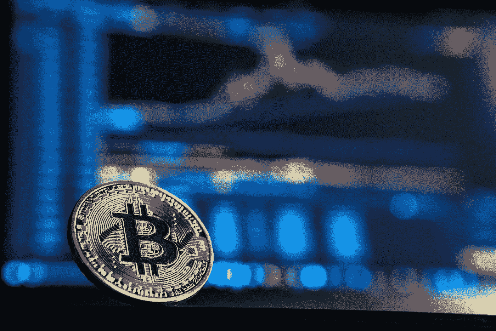

# 7+最佳加密货币交易平台| 2019

> 原文：<https://medium.com/hackernoon/7-best-cryptocurrency-exchanges-2018-9a160127a14d>

如果你听说过加密货币这个词，那么有 99%的可能性你也熟悉加密货币交易平台。即使你没有，我敢肯定比特币已经引起了你的注意。

> 比特币和其他加密货币以交易为目的在加密货币交易所上市。

# 什么是加密货币交换平台？

你不能简单地去银行要求任何数字货币。相反，你需要一个合适的数字平台来进行比特币、以太币、Ripple 或者事实上任何密码的交易。毕竟，这是创造数字货币的全部意义。加密货币交易平台是这样的在线门户网站，允许您根据交易类型将一种数字货币(加密货币)兑换成另一种货币，甚至是法定货币。

无论你是新手还是有经验的个人，加密货币的流行及其丰厚的回报都会让你好奇，想在市场上试试运气。然而，这些数字货币的买卖经常会让你思考一些问题，比如——我如何开始赚钱？加密货币交易平台哪个交易最好？嗯，有志者事竟成。谈到加密交换，有许多选择，所有这些选择都有其特定的优点和缺点。

你不需要马上选择你在谷歌搜索上看到的第一个交换选项。花点时间研究一下，因为市场上不同的加密交易平台在功能和交易风格方面各不相同。为了节省您的时间，我在下面列出了不同类型的加密货币交易平台，可以帮助您获得更好的想法:

1.  传统的加密交易:如果你认为自己在股票市场上有足够的交易经验，传统的加密交易可能对你来说很熟悉。这些平台的运作方式类似，只是它们交易的是加密货币，而不是法定货币。他们还以平台费的形式收取交易的一小部分。例- [北海巨妖](https://www.kraken.com/)
2.  **加密经纪人:**顾名思义，这些平台允许你根据经纪人设定的价格进行加密货币交易。使用这些交易所的费用略高于传统交易所，但相对来说更容易使用。例- [比特币基地](https://cryptocurrencyfacts.com/exchanges/coinbase/)
3.  **交易平台(直接):**与传统平台不同，这些交易平台允许您以点对点的方式进行交易。它们将您的卖出/买入价格与其他用户下的订单进行匹配，一旦两者金额匹配，就可以进行交易。
4.  **加密货币基金:**如果你希望投资数字资产而不购买，加密货币基金就是为你准备的。它们允许公众通过加密货币基金买卖专业管理的加密资产。例——[GBTC](https://grayscale.co/bitcoin-investment-trust/)。

市场仍在展示其潜力，因此，你需要做的就是找到合适的交易所并开始投资。

以下是 7 大加密货币交易平台列表，供您参考

# [币安](https://www.binance.com/login.html)

如果你的重点在于加密对加密的交易，币安是你可以继续下去的选择。币安是全球最受欢迎的加密货币交易所之一。它是从中国发展而来的，向全世界的交易者提供它的特性和功能。除此之外，它还将为您提供令人印象深刻的产品以及极低的交易费用。虽然币安平台在交易所领域还不算太老，但它已经占据了一席之地，并通过跻身当前十大加密货币交易所平台而获得了快速增长。币安拥有大量比特币、以太坊和系绳配对的替代币。

该交易所提供自己的硬币称为 BNB(币安硬币)。作为一个集中的交易所，你可以得到体面的折扣，同时进行交易，在自己的令牌，即 BNB。在通过交易所投资之前，你主要关心的可能是费用结构。感谢币安，因为它提供的标准交易费仅为 0.1%，如果在 BNB 进行支付，还可以进一步降低。此外，您可以在 web 和移动(Android 和 iOS)界面上注册和操作，这些界面非常简单和友好。

# [库币](https://www.kucoin.com/#/signup)

与币安相似， [KuCoin](https://www.kucoin.com/#/signup) 也扎根于中国。虽然，在镇压后，它搬到了香港，并开始通过其附属计划急剧增长。由于 KuCoin 拥有 cryptos 早期采用者的声誉，你可能会考虑长期持有它。你的长期 HODL 计划会让你赚很多钱。

通过 KuCoin exchange，您还可以获得一个简单、轻松的体验，以及不同的流行和稀有加密货币，如 DragonChain、IOTA 等。如果你喜欢移动应用，你可以在 KuCoin 上轻松交易，因为它有安卓和 iOS 的应用。为了进行 KuCoin 交易，您可以先存入任何密码，然后立即开始交易。在手续费方面，KuCoin 也是每笔交易拿 0.1%，其中一半可以通过交易所提供的独特分红制度由你拿走。

## 比特雷克斯

Bittrex 是一个总部位于美国的加密交易平台，允许您在大量的交易对中进行交易。你还可以在平台上获得所有主要的加密货币，包括 litecoin、darkcoin 和 nextcoin。除此之外，它还提供以太坊和 Neucoin。如果您正在寻找一个提供可靠安全性的平台，那么 Bittrex 是您的正确选择，因为它提供 2FA，并且受到良好的监管，符合美国的规则。

Bittrex 以处理全球所有加密交易所中最大的比特币交易量而闻名，它允许你以大约 0.25%的服务费来决定交易费率。此外，由于 Bittrex 的验证过程非常快，允许您在没有任何重大停顿的情况下开始交易过程，因此将节省您的大量时间。该平台支持两种类型的账户，即基本账户和高级账户，提款金额分别高达 3 BTC/天至 100 BTC/天。

要在 Bittrex 上注册，您只需通过您的电子邮件 ID 简单登录即可。但是，为了提取资金，您需要通过 KYC 的过程，并提交您的个人信息，如身份证和电话号码。另一个值得注意的事情是，Bittrex 是一个“仅加密”的交易所，因此，它不允许你用法定货币交易。

## [比索文](https://bit.ly/2JvmQ1R)

Bithoven.com 于 2019 年初推出，[是一个快速发展的加密货币交易平台，在许多经验丰富的新手交易者中有条不紊地获得了欢迎和认可。crypto exchange 提供大量受支持的加密货币用于交易，订单簿中的高流动性组合以及由 TLS/SSL 加密和 2FA 提供的有保证的安全性。加密交易所完全按照高行业标准运营，并符合所有强制性反洗钱/KYC 监管要求，从而消除了潜在的洗钱风险。](https://bit.ly/2JvmQ1R)

基本上，[Bithoven.com](https://bit.ly/2JvmQ1R)允许你在注册后立即开始交易加密货币。它开展了一项持续的促销活动，你可以免费获得 100 DOGE，这样你就可以测试交易平台的功能，其直观的用户界面，并在无数的交易对，实时报告和方便的图表中进行选择。交易佣金占 0.2%，认证用户每日提款限额为 100 BTC。Bithoven.com 提供场外交易服务，该服务面向愿意执行 10 万 USDT 以上的大宗交易的高交易量交易者。

通过在加密交易所进行交易，您可以绝对肯定整个交易过程是自动化的，并在最大程度上得到校准，因此这是建立和完善您的加密货币交易组合的完美起点。Bithoven.com[的使命是促进加密货币的采用，让加密交易变得容易和负担得起。总之，他们的专业客户服务团队随时准备处理任何问题，并提供专业的建议和帮助。](https://bit.ly/2JvmQ1R)

# [Bitfinex](https://www.bitfinex.com/)

需要一站式商店来满足您所有的加密交易需求吗？你可以把赌注押在 BFX 的 Bitfinex 上。Bitfinex 是一个流行的加密货币交易平台，让您可以方便有效地进行交易。Bitfinex 的总部设在香港，自 2012 年成立以来已经发展到一个很高的水平。作为加密货币的可靠来源，Bitfinex 的日交易量净值约为 10 亿美元。

作为一个密码交易世界的新手，你可能正在寻找一个容易理解的平台。然而，BFX 有一个高度可定制的界面平台，与新手相比，它更适合有交易经验的用户。

除了比特币，你还可以通过 BFX 的全规格钱包服务获得几乎所有流行的替代币和加密币。如果你没有找到你需要的或者有疑问，你可以很容易地提出支持票，平均来说，在一天内解决。

你可以根据自己的需求选择平台，然而，大多数寻找交易平台的人更喜欢 BFX，因为它提供了独特的功能，如保证金贷款、通过场外交易服务进行匿名交易、自动化交易 API 以及 Android 和 iOS 的移动应用程序。

# [波洛涅克斯](https://poloniex.com/signup)

[Poloniex](https://poloniex.com/signup) 于 2014 年成立，从那时起就成为密码交易的首选平台。你可能需要关注这个总部位于美国的平台，因为它为用户提供了一百多种加密货币进行交易。交易所的独特之处可能是像你这样的人最喜欢的选择，因为它拥有最大的以太交易量，因为它独立支持以太坊和 BTC 市场。

与 Bitterex 类似，Poloniex 也是一个仅加密的交易所，它允许您通过存款进行交易。此加密交换的费用取决于您的选择(无论您是创建者还是接受者),相应地可以是 0.15%到 0.25%。寻找各种替代硬币的交易者可以根据他们的要求检查 Poloniex。虽然你会得到一个直观的移动友好的网站来放置你的交易；在移动应用程序方面没有选项。

如果你是一个长期的专业交易者，Poloniex 可能适合你，但如果你是一个新手进入市场，这可能有点挑战性。你还会发现各种系统的数据分析工具，包括图表，帮助用户做出明智的交易决定。

# [Gate.io](https://gate.io/login)

加密交易所名单中一个相对较新的名字， [Gate.io](https://gate.io/login) 交易所于 2017 年开始运营。它旨在为用户提供独一无二的硬币和无忧无虑的体验。此外，投资者可以在该平台的网站上找到与他们选择的硬币相关的信息以及市场趋势。他们的网站使用两种语言，即英语和汉语。

该平台为您提供了良好的图表、交易历史以及功能订单簿，您可以根据自己的偏好价格下单。当您的金额与相反匹配的订单匹配时，您的订单将自动得到部分或全部满足。作为一个新的市场参与者，Gate.io 目前允许你免费注册和创建帐户。它还允许您的最低交换费，即只有 0.2%。

谈到安全性，Gate.io 利用冷存储和热钱包来存储资金。客户端帐户提供了双因素身份验证和一些密码。

# [Bibox](https://www.bibox.com/login/register)

成立于 2017 年的 [Bibox](https://www.bibox.com/login/register) 是一个新的加密交易所，它利用加密算法来帮助优化加密交易和交易。如果你是一个新手，你可以在 Bibox 上找到很多信息，因为它是一个建立数字货币意识的知识工具。

在 Bibox 上，你只能以加密资产的形式进行交易，因此没有法定交换的空间。它允许您在以太坊、比特币、Tether 和 Dai 等市场上交易加密货币。Bibox 的独特之处在于它使用智能人工智能算法来确保最佳交易。此外，你可以在 Bibox 上用它自己的代币进行交易。

如果你不想持有代币，你将被收取 0.1%的小额费用。此外，对于存款密码，您将不会被收取任何费用，但在取款时，您需要支付 1%的费用，最低取款额为 15 美元。总的来说，Bibox 为您提供了一个易于使用的平台，有大量的加密货币资产可供交易。

# 投资前要记住的事情

既然你对市场上可用的加密交易平台类型了如指掌，你可能会认为是时候开始投资了。但是还没有！像股票交易和货币交易一样，加密交易不是小菜一碟。你需要学习基础知识，收集所有必要的信息，并在最终走向投资之前做好准备。以下是在完成交易前需要检查的事项:

*   **地位**——如今许多人使用加密交易所进行交易。其中一些也是专业交易者。你可以从这些人那里收集见解和反馈，也可以通过博客、视频评论等形式收集在线资源。并检查你愿意投资的交易所的排名和声誉。
*   **费用-** 几乎所有的交易所都在其网站上公布了有关其费用结构的信息。您可以查看并获得更多关于加密交换所涉及的不同费用的知识，包括存款、交易和取款。
*   **验证标准-** 由于加密货币不受政府监管，在交易所交易容易遭到黑客攻击和身份滥用。因此，所有可靠的交易所都会以这样或那样的形式要求您验证您的个人身份，以进行存取款。为了更加安全，避免洗钱和欺诈，您必须在交易所注册时选择身份验证步骤。
*   **地点限制-** 交易平台存在风险。由于这个原因，一些交换机将它们的功能的可用性限制在特定的位置。在投资交易所之前，你必须仔细阅读条款、条件和政策，以避免陷入这样的困境。
*   **支付方式-** 加密货币交易所允许你通过不同的支付方式进行加密交易，如借记卡、信用卡、电汇，甚至贝宝。然而，不同交易所提供的支付方式的数量可能不同。你应该选择一个为你提供多种支付方式的平台，而不是只有一种支付方式的平台。
*   **汇率-** 与支付选项和费用类似，加密交换平台在汇率方面也有所不同。通过花更多的时间了解不同平台提供的费率，你可以节省一大笔钱。

# 结论

当谈到加密交易时，你会有很多选择来买卖你的数字资产。然而，对您来说，学习、研究然后将您的资金投资于这些加密货币交易平台是极其重要的，因为交易所是独立的实体，并受到风险的影响。

为了保证你的加密投资的安全，你可以把你的记录放在一个单独的硬件钱包里，并跟踪你的交易筹码。一些加密货币交易平台的功能可能与其他平台不同，这就是为什么找到符合您需求的平台非常重要。一旦你确定了满足你要求的交易所，就开始交易吧。

投资愉快！

注意:如果你碰巧知道一些我在帖子中错过的其他密码交换，请写信给我，地址是 shefali.writeup@gmail.com。