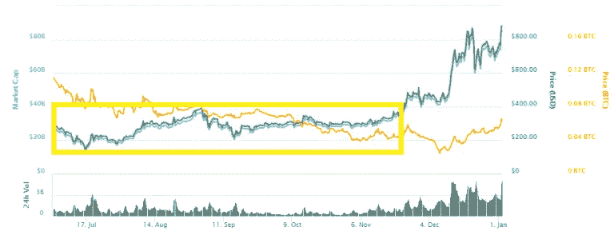
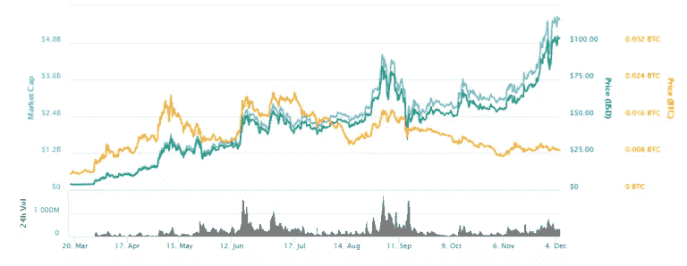

# 7 个加密交易技巧和常见错误

> 原文：<https://medium.com/hackernoon/7-crypto-trading-tips-and-common-mistakes-a50108fbc96c>

比特币和 Altcoins 交易就像一条汹涌的河流。这是一个不间断的、快速变化的过程，通常伴随着重大的后果性事件。如果你逆流而游，你可能会完全消失。为了提高交易技巧和对市场的理解，最好从别人的错误中吸取教训。下面这篇文章是基于在加密领域的主要经验和在过去几年中拥有数千个加密交易头寸后撰写的。当然，在这个过程中也犯了错误。我们可以开始了吗？

# 订单簿—如何正确放置命令

让我们来讨论一下订单簿的正确使用方法。一枚硬币的价值是由买卖双方最后一次交易决定的，或者是由供求关系决定的。这些供应和需求命令被安排在一个表格中，更好地被称为订单簿。在加密领域，一切都与波动性有关。因此，按照我们在[加密交易文章](https://cryptopotato.com/8-must-read-tips-trading-bitcoin-altcoins/)中给出的提示，当你进入一个位置时，建议你设置卖出水平来获利。或者，当你想同时做的时候，设置一个止损来减少损失。但是我们如何确切地知道在哪里放置这些命令呢？为了确定阻力区和支撑区，我们从最基本的层面分析图表开始。初学者的[技术分析](https://cryptopotato.com/bitcoin-crypto-advanced-technical-analysis/)文章将有助于这项任务。我们确定我们想获利的点(阻力位)，同时确定支撑位。通过参考订单簿，我们将找到实际放置这些命令的最佳级别。注意，如果支撑位被打破，是时候止损了。

确定卖出水平以获利:使用订单簿，我们确定我们之前分析过的阻力区域。很可能在这些点周围存在大量的阻力(卖出指令的“墙”)。诀窍是提前一步以略低的价格发出卖出指令，这样万一需求开始侵蚀供应墙，我们的指令已经发出并卖出获利。

确定止损水平，以尽量减少损失:在订单簿中，我们确定了我们之前也分析过的支撑点。这些地点周围很可能存在巨大的支持性需求(买家“墙”)。这是设置止损指令的最佳区域，尽管它应该比高需求区域低一点。只有当卖方设法降低价格，买方的“墙”被打破时，他们才会听从我们的指挥。买家之墙对我们的指挥来说是一种保护。

可以同时下达“止盈”和“止损”指令吗？截至本文撰写时，除了一些杠杆交易交易所，如 [Bitmex](https://cryptopotato.com/bitmex-exchange-trade-video-tutorial/) 之外，当前的交易交易所不支持同时放置这两个命令。在一个完美的世界里，我们可以设定交易的止损和获利水平，降低大幅亏损的可能性。在那之前，我们将满足于我们所拥有的——我通常为头寸的某些部分设置止盈水平，同时为其他部分设置止损水平。

# 图表分析—替代硬币与比特币和美元

主要替代货币的交易量再次超过美元。因此，分析这些替代硬币的图形时，应该将它们与比特币图形和美元价值图形进行比较。在 CryptoPotato 上，我们确保在每周市场报告中这样做。如果我们仅仅分析比特币价值图，我们肯定会错过以太坊的积累期大约 300 美元(回想一下 2015 年比特币积累的 300 美元？).在写这篇文章的时候，以太坊正在一个月后交易，一个以太的价格超过了 1000 美元。

以太坊累积到大约 300 美元(图中黄色区域)直到暴涨。

# 我针对你的情绪

交易中有一条牢不可破的规则，就是永远不要把自己的情绪牵扯到交易中。这是一条基本原则，适用于任何长期交易者，尤其是短线交易者。想象一下根据 [DCA 策略](https://cryptopotato.com/time-buy-bitcoin-meet-dca/)购买比特币:假设比特币价格在三天内暴跌了 40%。现在怎么办？显然，现在是购买第二部分硬币(根据 DCA)并平均初始交易进场价格的时候了。但相反，我认识的几乎所有人都在减持的“可怕”时刻临阵退缩，没有完成第二股的购买。为什么会发生在我们身上？一个字——情绪。情绪，在这种情况下——害怕失去，影响我们，完全扰乱我们的行动计划。如果你是上面例子中不买第二只股票的人之一(是的，大多数人)——你应该考虑一下你作为交易者的未来，特别是加密交易者。在一次不成功的交易后，或者在你卖出一枚价格飞涨的硬币后，克服情绪也很重要(FOMO)。总而言之，不要为错过的利润后悔，也不要为失去的交易感到内疚。给自己设定一个行动计划和一系列目标，并据此行动——就像你是一台预编程的计算机一样。人类不是理性的生物。

这样一个计划的建议是:在下达目标卖出指令后，假设硬币已经到达第一个目标，你需要平仓一半。同时，把止损提高到最初的进场水平(这样你就一点都不会亏了)。在第二个目标水平，你应该平仓四分之一。现在，一旦你把基金的钱“带回家”，你很可能会留在这个位置上，只留下四分之一的利润。在这一点上，利润游戏变得无限。两周内上涨 2000%的硬币在密码界并不罕见。当你只玩你的利润时，你是安全的，这变得容易得多。

# 下跌的东西不一定会再次上涨

另一个常见的错误是根据崩溃的硬币相对于比特币的价值来搜索它们，希望它们会回到其辉煌的价格。新闻快讯——有些硬币距离它们的峰值水平还有几光年的距离。以极光为例；2014 年 3 月，创下了 0.14 比特币兑换 1 极光的历史新高。截至发稿时，Aurora 的交易价格为 99.9%的折扣——0.00014 比特币。(该死的)极光能向上移动 1000 倍吗？你永远不会知道。你当然不能假设一枚硬币低于其峰值价格是一个机会，而不是一把下跌的刀。也有硬币消失了，慢慢退出了连续交易——这种情况值得考虑(特别是低市值和低交易量的替代硬币)。

# 时间就是金钱

就事件和发生次数而言，加密市场中的一周相当于传统证券交易所中的三个月。一个想跳进加密交易深水区的人，不仅要每天跟踪，还要每小时跟踪。不是每个人都能玩这个游戏。然而，你需要考虑在这个过程中投入的时间。有时候，做一个长期投资者比做一个日常交易者更划算。顺便说一下，作为一个每日交易者，这并不意味着你每天都要买卖和交易。交易可以在几分钟内到达目的地，也可以在几个月内到达。想想你愿意投入的研究和跟踪市场的时间。记住你的时间有边际成本，或者换句话说，你的时间有价格标签。如果你已经决定把你的时间和精力放在每天的交易上，最好从小剂量开始，在增加投资金额之前检查一下表现。这是加密的另一个好处——可以进行微交易。与资本市场不同，如果你关注苹果股票，你需要购买相当于几千美元的最低份额，在 crypto 中，你可以进行几美分的交易。

# 第一个错误:我买 Ripple 是因为它的价格相对以太坊便宜

新手的一个常见错误是看硬币的价格，而不是市值。正如你通过市值表现来评估一家公司一样，市值表现是通过将股票数量乘以每股价格来计算的，Altcoins 也是如此。流通中的现有硬币数量乘以硬币价格。对于像 Ripple 这样的低价硬币来说，购买者只会受到心理上的影响。一个波纹等于一美元，会产生十亿个波纹，或者一个波纹等于一千美元，会产生百万个波纹单位，这两者没有区别。因此，从现在开始，在 CoinMarketCap 上审查投资硬币时，主要看更实质性的数字，即市值，而不要太关注一枚硬币的价格。

# 第二个错误:不要把所有的鸡蛋放在一个篮子里

密码真是不可预测。虽然获得了数百%的利润，但该部门现在经受住了，未来还将继续抹去数百亿美元。当比特币对美元贬值时，替代币通常会经历同样的过程。简单的数学表明，即使持有部分替代货币投资组合，如以太币和莱特币，通常也不足以避免在比特币抛售后投资组合的美元价值大幅缩水。

在 2015 年和 2016 年初，当比特币保持稳定——就像比特币一样稳定——每 BTC 约 300 美元时，游戏正在交易替代币，以获得更多比特币。人们曾预计比特币未来会涨得更高(皮格马利翁效应)。拥有一种波动性相当大的基础资产，比如比特币，让我们需要从比特币价值和美元价值两方面比较我们的投资组合表现。许多交易员在过去一年里减少了他们持有的比特币数量(嘿，当以太坊从比特币的历史高点下跌 70%时，这并不困难……)，尽管它有很好的美元收益率。比特币的增长为加密市场赚了很多钱，导致其总市值在去年增长了 30 倍！作为交易者，保持比特币作为你的基础资产很重要，但也不要忘记美元价值，有时要获利。您应该总是看到更大的画面—加密只是您投资选项的一个层次。还有股票市场、房地产、债券和更多的投资机会。在加密投资组合以及整个家庭投资组合中分散风险是很重要的。

# 第三个错误:比特币涨了很多，我买莱特币

正如上面提到的，有两种方法可以考察替代币的投资——与比特币的对比和与美元的对比。这是那些错过了比特币列车，并希望在其他替代硬币上兑现的人的常见错误。这些投资者必须以美元为单位来检查投资，因为他们兑换美元或法币来购买密码(而不是用他们已经拥有的比特币购买)。

这里有什么问题？看一下下面的 Litecoin 图表，显示了其 2017 年 3 月至 12 月的表现:

黄线代表莱特币在比特币价值中的价格，绿线代表莱特币的美元价格，蓝线代表 LTC 的美元总市值。

就比特币而言，第一个假设是，当比特币价值增加时，替代比特币的价值会减少，这是正确的。补充说明:这并不总是正确的；当中国取缔加密交易所时，资金从所有的加密机构流出——比特币下跌，替代币下跌更多。

美元方面，如你所见——莱特币的价格随着比特币一起上涨(但幅度较小)。提醒一下大多数引用“比特币大幅上涨，我会购买莱特币”的人，用 FIAT 购买莱特币(或者通过转换为比特币，然后立即转换为莱特币——这是相同的)。因此，从图表中学习并保持相同的行为，当比特币的价值下降时，Altcoins 的美元价值也将下降(尽管百分比可能会更低，但仍会下降)。

# 最后

优秀的交易者承认自己的错误，更重要的是，分析并从中学习，从而提高他们理解市场的技能。那么你是哪种交易者呢？你在文章中找到自己了吗？我们很乐意在下面的评论区听到您的意见，欢迎您与您认为相关的任何人分享这篇文章。

也欢迎大家继续阅读上一篇文章——[8 比特币和 Altcoins 交易必读提示](https://cryptopotato.com/8-must-read-tips-trading-bitcoin-altcoins/)。

*原载于 2018 年 1 月 9 日*[*cryptopotato.com*](https://cryptopotato.com/7-crypto-trading-tips-common-mistakes/)*。*