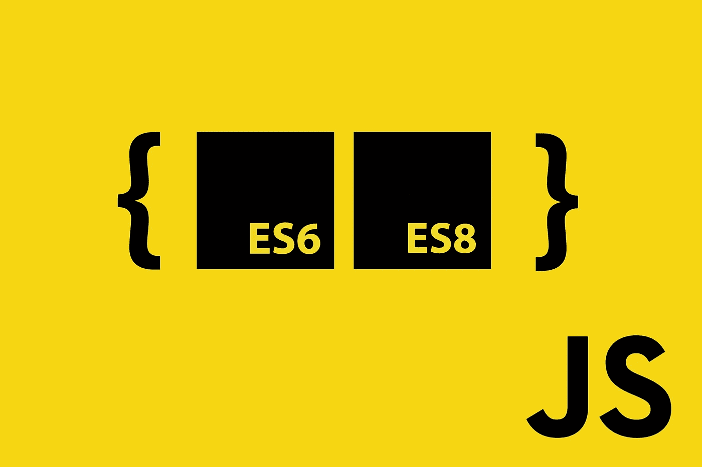
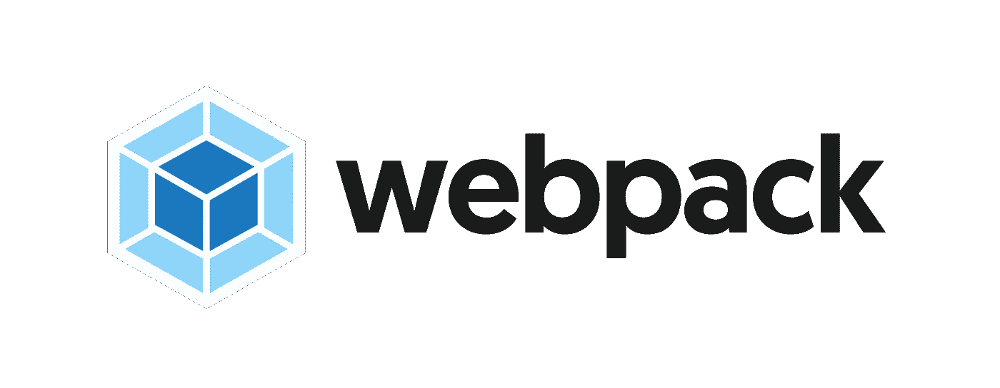
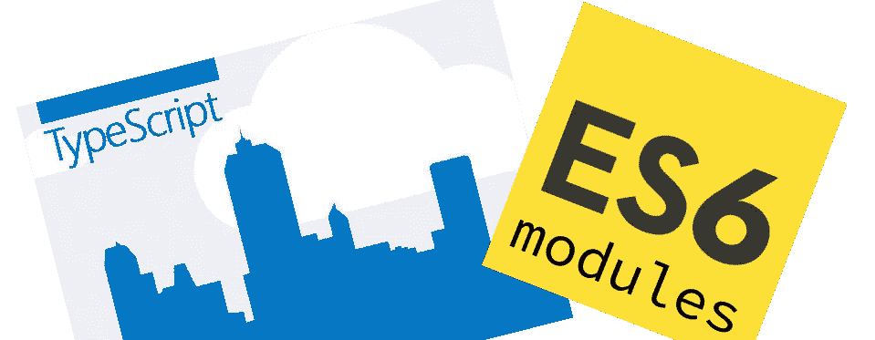

# 今天使用 ES 模块的 7 种不同方式！

> 原文：<https://medium.com/hackernoon/7-different-ways-to-use-es-modules-today-fc552254ebf4>

es 模块是 JavaScript 的未来，但与开发人员竞相利用的许多其他 es@next 特性(主要得益于像 [babel](https://babeljs.io/) 这样的构建工具)不同，与现有的 NPM 模块一起使用 ES 模块要困难得多。

本教程的目的是提供一组完整的例子，说明编写 es 模块的不同方法，同时不丢失与当今 NPM 上存在的大量 commonjs 模块库的互操作性。

在开始之前，对 es 模块和 CommonJS 格式之间的区别有一个坚实的理解是很重要的。如果你还没有，请在继续之前查看一下[index.js](https://medium.com/u/c845cd91bc98#1 <a class=)

Approach #1 [load-image.js](https://github.com/transitive-bullshit/npm-es-modules/blob/master/1-naive/lib/load-image.js)

该功能非常简单，但理解起来很重要，因为下面所有的例子都将使用*完全相同的代码*。下面是相应的浏览器代码:

Approach #1 [browser.js](https://github.com/transitive-bullshit/npm-es-modules/blob/master/1-naive/browser.js)

Approach #1 [browser-load-image.js](https://github.com/transitive-bullshit/npm-es-modules/blob/master/1-naive/lib/browser-load-image.js)

在这种方法中，我们为 es 模块使用普通的`.js`文件扩展名，并且没有翻译。

这相对简单明了，但打破了我们的几个模块目标:

*   在 node.js 中不可用，因为它的`main`字段是 es 模块，而它应该是 commonjs 文件。
*   不能通过 webpack 或 rollup 在浏览器中使用，因为它的`browser`字段是一个 es 模块，而它应该是一个 commonjs 文件。
*   这种方法的唯一优点是简单，如果您只是在私有模块上工作，这可能已经足够好了。
*   警告:除非您使用严格的本地或私有模块，否则我们强烈建议您不要在实践中使用这种方法。这是一个从 commonjs 过渡到 ES 模块时不要做什么的例子，如果你使用这种方法公开发布一个模块，JavaScript 之神会发现并羞辱你。
*   不幸的是，虽然 es 模块在未来几年越来越受欢迎，我相信这个问题会得到解决，但是 npm 生态系统中并没有任何东西可以阻止你发布这样的坏模块。

## 2.纯巴别塔方法

这个[方法](https://github.com/transitive-bullshit/npm-es-modules/tree/master/2-babel)使用 [babel](https://babeljs.io/) 和 [babel-preset-env](https://babeljs.io/docs/plugins/preset-env/) 将所有 Node.js 和浏览器源文件传输到`dist/`中。

这种方法的核心是 package.json 中的**构建**脚本:

Approach #2 excerpt from [package.json](https://github.com/transitive-bullshit/npm-es-modules/tree/master/2-babel)

*   源文件以`.mjs`结尾
*   设置相对简单
*   Babel 将所有源文件传输到 ES5 和 commonjs
*   测试是在 transpiled 源代码上运行的，这使得调试稍微有些困难
*   目前，我们的`main`和`browser`是支持`node >= 4`(或者我们在 babel-preset-env 配置中指定的任何内容)的 commonjs 导出，而`module`导出是支持`node >=8`的 es 模块，因为它使用了`async await`。
*   不幸的是，AFAIK，package.json `engines`不支持指定`main`支持某个节点版本，而`module`支持不同的模块版本，我甚至认为这是一个糟糕的做法。
*   为了解决这个问题，我们可以像这里一样指定最低节点版本为`node >= 8`，或者添加第二个 babel 步骤，将节点版本传输到 esm 文件夹，尽管我觉得这有点笨拙。

## 3.ESM+汇总方法

这个[方法](https://github.com/transitive-bullshit/npm-es-modules/tree/master/3-esm-rollup)使用 [esm](https://github.com/standard-things/esm) for Node.js 和 [babel](https://babeljs.io/) + [rollup](https://rollupjs.org/guide/en) 编译浏览器源文件。

[esm](https://github.com/standard-things/esm) is amazing!

Approach #3 [main.js](https://github.com/transitive-bullshit/npm-es-modules/blob/master/3-esm-rollup/main.js) node commonjs entrypoint which loads the esm [module.mjs](https://github.com/transitive-bullshit/npm-es-modules/blob/master/3-esm-rollup/module.mjs) via [esm](https://github.com/standard-things/esm).

Approach #3 [ollup.config.js](https://github.com/transitive-bullshit/npm-es-modules/blob/master/3-esm-rollup/rollup.config.js) for compiling the browser version to bundled commonjs.

*   源文件以`.mjs`结尾(唯一的例外是 commonjs 入口点`main.js)`
*   支持所有三个目标`main` `module`和`browser`
*   编译的唯一目标是`browser`，这使得调试 Node.js 版本更加容易
*   还要注意，我们在 [ava](https://github.com/avajs/ava) 单元测试配置中需要 [esm](https://github.com/standard-things/esm)

## 4.ESM+Webpack 方法

这种[方法](https://github.com/transitive-bullshit/npm-es-modules/tree/master/4-esm-webpack)使用 [esm](https://github.com/standard-things/esm) for Node.js 和[babel](https://babeljs.io/)+[web pack](https://webpack.js.org/)编译浏览器源文件。它与前面的方法相同，只是它关闭了 webpack 的 rollup。

Approach #4 [webpack.config.js](https://github.com/transitive-bullshit/npm-es-modules/blob/master/4-esm-webpack/webpack.config.js) for compiling the browser version to bundled commonjs.

*   源文件以`.mjs`结尾(唯一的例外是 commonjs 入口点`main.js)`
*   支持全部三个目标`main` `module`和`browser`
*   编译的唯一目标是`browser`，这使得调试 Node.js 版本更加容易
*   还要注意，我们在 [ava](https://github.com/avajs/ava) 单元测试配置中需要 [esm](https://github.com/standard-things/esm)

## 5.纯累积方法

这个[方法](https://github.com/transitive-bullshit/npm-es-modules/tree/master/5-rollup)使用 [babel](https://babeljs.io/) + [rollup](https://rollupjs.org/guide/en) 编译所有 Node.js 和浏览器源文件。这种方法从[方法#3](https://github.com/transitive-bullshit/npm-es-modules/tree/master/3-esm-rollup) 中获取汇总配置，并通过为 browser 和 Node.js 目标提供单独的汇总配置而更进一步。

不包括冗余配置，直接检查源代码[这里](https://github.com/transitive-bullshit/npm-es-modules/tree/master/5-rollup)。

*   源文件以`.mjs`结尾
*   支持所有三个目标`main` `module`和`browser`
*   这三个目标都是通过 rollup 编译的，Node.js 和浏览器有两个独立的配置
*   这是我们第一个支持`node >= 4`(或者我们在 babel-preset-env 配置中指定的任何东西)而不是`node >= 8`的模块
*   源映射与编译后的目标一起生成

## 6.纯 Webpack 方法

这个[方法](https://github.com/transitive-bullshit/npm-es-modules/tree/master/6-webpack)使用[babel](https://babeljs.io/)+[web pack](https://webpack.js.org/)编译所有 Node.js 和浏览器源文件。这种方法采用了来自[方法#4](https://github.com/transitive-bullshit/npm-es-modules/tree/master/4-esm-webpack) 的 webpack 配置，并通过为 browser 和 Node.js 目标提供单独的 webpack 配置而更进一步。

**警告**:该方法目前是一个损坏的 WIP，其输出行为不正确。所有其他方法都按预期工作。

不包括冗余配置，直接检查源代码[这里](https://github.com/transitive-bullshit/npm-es-modules/tree/master/5-rollup)。

*   源文件以`.mjs`结尾
*   支持所有三个目标`main`、`module`和`browser`
*   遗憾的是， **webpack 不支持输出 es 模块目标** ( [问题](https://github.com/webpack/webpack/issues/2933))。
*   `main`和`browser`目标已编译，但`module`目标因该问题无法编译。
*   支持`node >= 8`，而[汇总](https://github.com/transitive-bullshit/npm-es-modules/blob/master/5-rollup)版本也能够通过编译`module`目标来支持`node >= 4`。
*   除非你有一个好的特定于项目的理由来使用 webpack 而不是 rollup，否则我强烈建议使用 rollup 来捆绑 ES6 模块库(至少在这个 webpack 问题得到解决之前)。

## 7.打字稿方法

这个[方法](https://github.com/transitive-bullshit/npm-es-modules/tree/master/7-typescript)使用[类型脚本](https://www.typescriptlang.org/)来传输所有 Node.js 和浏览器源文件。

TypeScript Approach #7 [index.ts](https://github.com/transitive-bullshit/npm-es-modules/blob/master/7-typescript/src/index.ts)

TypeScript Approach #7 [load-image.ts](https://github.com/transitive-bullshit/npm-es-modules/blob/master/7-typescript/src/load-image.ts)

*   源文件以`.ts`结尾
*   支持所有三个目标`main` `module`和`browser`
*   需要两次编译，一次用于目标`commonjs`，一次用于目标`esm`
*   目前，commonjs 用户需要添加默认的需求语句:`require('npm-es-modules-7-typescript').default`。如果你知道如何防止这种情况，请告诉我。
*   结果模块支持`node >= 4`(或者我们在`tsconfig.json`中指定的任何东西)而不是`node >= 8`
*   请注意，我对 TypeScript 相当陌生，所以如果我做了什么笨拙的事情，请让我知道。

> 总的来说，如果您想最大限度地提高兼容性，使用 TypeScript 似乎是最干净、最经得起未来考验的方法。

# 推荐

咻，好多 JavaScripts 啊…

现在总结一下我从创建这个细目分类中学到的东西，以及我对编写自己的下一代 NPM 模块的实用建议:

*   如果你只关心 Node.js 的兼容性，而不关心浏览器的使用，并且想要一些非常简单的东西，那么要么现在使用标准的 commonjs，要么使用 [esm](https://github.com/standard-things/esm) ，就像[方法#3](https://github.com/transitive-bullshit/npm-es-modules/tree/master/3-esm-rollup) 一样，不使用汇总的东西。
*   如果你只关心 Node.js 的兼容性，而不是浏览器的使用，但也想支持 Node.js 的旧版本，那么使用[纯巴别塔方法#2](https://github.com/transitive-bullshit/npm-es-modules/tree/master/2-babel) 。
*   如果您只关心浏览器的使用，您可能可以通过编写 ES 模块而不使 transpilation 复杂化，因为任何现代前端工具链都会为您处理构建工作。
*   如果你既关心 Node.js 又关心浏览器兼容性，那么就使用 [ESM+Rollup 方法#3](https://github.com/transitive-bullshit/npm-es-modules/tree/master/3-esm-rollup) 或 [ESM+Webpack 方法#4](https://github.com/transitive-bullshit/npm-es-modules/tree/master/4-esm-webpack) ，这取决于你在 Rollup 和 Webpack 之间的偏好。依我看，对于库来说，Rollup 是比 webpack 更好的选择，因为它更专注于处理库，而 webpack 试图做所有的事情。
*   如果您既关心 Node.js 又关心浏览器兼容性，并且希望支持 Node.js 的旧版本，那么使用 [Pure Rollup 方法#5](https://github.com/transitive-bullshit/npm-es-modules/tree/master/5-rollup) 。
*   最后，如果你想完全适应未来，并通过静态分析来提高代码质量，我强烈建议使用[类型脚本方法#7](https://github.com/transitive-bullshit/npm-es-modules/tree/master/7-typescript) ，它可以处理所有之前的用例以及其他一些用例。

# 结论

我希望这个指南对你有所帮助！你可以在 GitHub [这里](https://github.com/transitive-bullshit/npm-es-modules)找到所有的源代码，包括 7 种方法的可用模块。

有关这个主题的更多信息，请查看以下资源:

*   [NodeJS 中的原生 ES 模块:现状和未来方向](/@giltayar/native-es-modules-in-nodejs-status-and-future-directions-part-i-ee5ea3001f71)
*   [ES 模块:由](https://hacks.mozilla.org/2018/03/es-modules-a-cartoon-deep-dive/)[林·克拉克](https://medium.com/u/d3391efe481a?source=post_page-----fc552254ebf4--------------------------------)创作的卡通深潜
*   [基于巴别塔的 npm 包的最小设置](http://2ality.com/2017/07/npm-packages-via-babel.html)
*   [如何编写和构建 2018 年的 JS 库](/@kelin2025/so-you-wanna-use-es6-modules-714f48b3a953)作者 [Anton Kosykh](https://medium.com/u/7d8e23d71c9d?source=post_page-----fc552254ebf4--------------------------------)

有没有我漏掉的方法或建议？请在评论中分享给我！❤️

## 在你走之前…

如果您喜欢这篇文章，请点击👏下面，并与他人分享，这样他们也可以享受它。