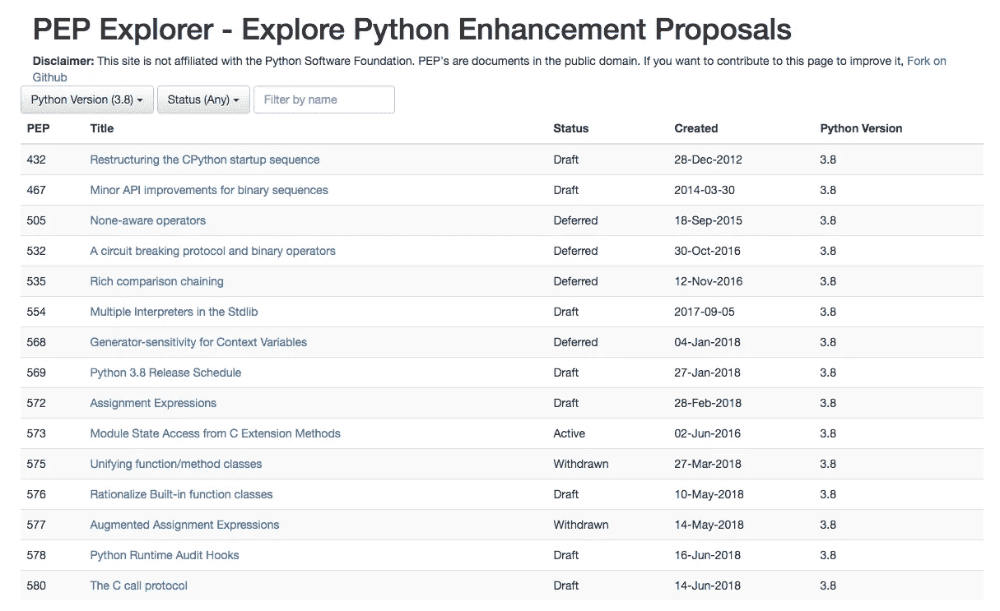
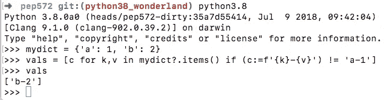

# 到目前为止，Python 3.8 中提出了 7 个特性

> 原文：<https://medium.com/hackernoon/7-features-proposed-so-far-in-python-3-8-acb0d97c83c8>

Python 3.7 出来了。如果你想了解更多，请观看我的 Pluralsight.com 课程。

Python 3.7 受益于新的功能和优化。从我们目前对 3.8 的了解来看，这将是一个类似的故事。这一次，大多数新功能都是针对 C 扩展和模块开发的。

基于现有的 Python 增强提议，或已经提交的 3.8 版本的“pep”，我们很好地掌握了哪些特性可能会被包括在内。[我在这里为 3.8 做了一个 PEP-Explorer 用户界面。](https://tonybaloney.github.io/pep-explorer/#3.8_Any)



**许多提交的 pep 处于草案状态**，这意味着实施细节**尚未最终确定**。此外，pep 在获得批准之前，必须得到大师或 BDFL 的批准。

[我们将在 2019 年初看到第一个测试版](https://www.python.org/dev/peps/pep-0569/)，它将在 2019 年 6 月左右“功能冻结”。

# 解释器的启动时间将会得到改善


Python 的启动时间总是很“慢”，这在解释型语言中很常见。即使对于预编译(即 Python 文件与现有的。pyc cache)脚本，如果您正在启动多个进程，Python 解释器启动所花费的时间可能是个问题。

如此图所示(越低越快)，Python 3 的启动速度比 2.7 慢，PyPy 甚至更慢，因为 JIT 初始化过程。

人们已经尝试过优化启动，但是没有什么“剧烈的”改变。据传 3.8 是这种改进的目标版本， [PEP 432 解释了将启动过程分成几个阶段的清晰策略。这个想法是，当从命令行或通过 WSGI 进程运行`python`时，它将运行相同的初始化序列，不管你是想运行单元测试、探索 REPL、运行 1 函数还是执行预编译脚本。](https://www.python.org/dev/peps/pep-0432/#implementation-strategy)

研究表明，由于 Python 导入路径的复杂性和典型安装中库的数量，Python 的大部分启动时间都由 I/O 决定。

PEP432 本身不会提高启动性能，但是随着另一个(*尚未编写，我只是猜测它会*)，PEP 提出预编译的脚本如何可以缓存或配置它们的导入序列和状态，将会产生巨大的差异。

## 有多个口译员

通过与启动时间的联系， [PEP 554 提出了](https://www.python.org/dev/peps/pep-0554/#api-summary-for-interpreters-module)一个新的标准库模块，`interpreters`它将公开已经存在的 C-API，以便在单个进程中拥有多个 Python 解释器。这允许在比整个 Python 进程更少的开销内隔离代码。

PEP 554 还建议扩展现有的 API，以允许数据解释器之间更好的共享。

这可能是这样的:

```
import interpreters
interp = interpreters.create()
print('before')
interp.run('print("during")')
print('after')
```

# “无意识”操作符

任何 C#、Perl、PHP 或 Swift 开发人员都可能熟悉空操作符，它们可以用于许多目的。我最喜欢的 C#之一是空感知三元运算符。在这个例子中，水果的值被赋给`val`的值，除非它为空，在这种情况下，赋给它`"watermelon"`的值。

```
var fruit = val ?? "watermelon";
```

[PEP505 为`None`值提出了](https://www.python.org/dev/peps/pep-0505/) 3 个 Python 等价物，它们与这个 C#示例类似，但具有 Python 风格。

```
if val is None:
 fruit = "watermelon"
else: 
 fruit = val# now becomes in PEP505..
fruit = val ?? "watermelon"
```

无感知属性访问

```
if val.fruit is not None:
  fruit = val.fruit.name()
else: # now becomes in PEP505
fruit = val.fruit?.name()
```

类似地，在不确定是否设置了的情况下，对值进行切片或索引。

```
list_of_things = get_values()  # could be ``list`` or None
first = list_of_things?[0]
```

另一个关注类似行为的 PEP 是 [PEP 532](https://www.python.org/dev/peps/pep-0532/) 。

# 生成器敏感的上下文变量

Python 3.7 中包含的 PEP 567 引入了上下文变量，它是上下文本地状态，类似于线程本地存储。它们可以很好地处理类似线程的环境，比如 asyncio 任务。

Nathaniel Smith(Trio fame)开发的 PEP 568 基于 PEP567，但增加了生成器上下文敏感性。这对那些使用 asyncio 并希望使用生成器的人来说是个好消息。我现在不怎么用 asyncio，所以这个对我来说有点难。

# 为 C 扩展方法扩展 API

Python 有`@staticmethod`和`@classmethod`，类方法通常用纯 Python 定义，但也可以用 C 编写

*   PyType_GetModule
*   PyType _ DefiningTypeFromSlotFunc
*   PyType_GetModuleState
*   PyErr _ PrepareImmutableException

# 赋值表达式

这是 3.8 版本中最有争议的提议，并且它的一种形式已经被批准。

PEP 572 建议对 Python 语法进行修改，以启用“赋值表达式”。理解这种变化需要理解 Python 中的**语句**和**表达式**之间的区别。

Python 有许多类型的**简单的**语句，每一个都以换行符结束(除非你使用分号，比如`import pdb; pdb.set_trace()`)。

*   导入声明- `import foo`
*   流和传递语句，例如`break`
*   表情语句，如`x = y`、`x += y`

Python 也有表达式，在中找到了**的某些类型的语句**

*   If 语句的语法为`if TEST: SUITE`，其中`SUITE`是一组嵌套空格的语句，`TEST`是一个比较表达式或一系列，使用`and`、`or`和`not`关键字。
*   For 语句的语法为`for EXPRESSION LIST in TESTS: SUITE`
*   删除报表，`del EXPRESSSION`
*   用 as 语句`with TEST as EXPRESSION: SUITE`
*   列表和字典理解

不能做的是把语句放到表达式里，因为语句不返回任何东西。所以`if x = y:`不起作用

```
>>> x = 1
>>> y = 2
>>> if x=y:
File "<stdin>", line 1
if x=y:
^
SyntaxError: invalid syntax
```

PEP 572 建议用一个新的`:=`操作符和一种新的赋值表达式语法来改变这种情况。

以这个例子为例，你有一个产品列表，你想计算总运费。目前在 Python 中，如果你在一个列表理解中使用一个`if`语句，你不能用一个语句来赋值。

使用这种新语法，您可以。本例中的重要部分是在 list comprehension 中创建一个新名称`cost`，它是`to_usd`函数调用的产物。

## 想试试这个新语法吗？

我用赋值表达式语法和无值合并操作符语法构建了一个分支:[https://github . com/tonybaloney/cpython/tree/python 38 _ wonderland](https://github.com/tonybaloney/cpython/tree/python38_wonderland)



# 对内置函数类的更改

PEP576 建议扩展内置函数和方法的类，使其更像 Python 函数。具体来说，内置函数和方法将获得对声明它们的模块的访问权，内置方法将获得对它们所属的类的访问权。

为什么需要这样做？如果你正在开发一个 Python 模块，比如 Cython，并且想用 C 开发函数，你有两个选择:

*   使用内置的 CPython 函数，如`len`、`print`等。这是首选方法，但是对于可以在模块中访问的数据有缺点(如果用 Python 实现，就没有这种缺点)，或者
*   构建您自己的 len、print 等版本。这通常是个坏主意。

这个提议给 C API 增加了两个变化:

1.  添加了一个新函数`PyBuiltinFunction_New(PyMethodDef *ml, PyObject *module)`来创建内置函数。
2.  `PyCFunction_NewEx()`和`PyCFunction_New()`被弃用，如果可以将返回一个`PyBuiltinFunction`，否则返回一个`builtin_function_or_method`。

PEP 还提出了一个新的内置类`builtin_function`

[一个相关的 PEP，573 期待](https://www.python.org/dev/peps/pep-0573/#background)扩展用 C 编写的扩展方法可以访问的 API，使它们能够看到模块的状态，而不必调用昂贵的`PyState_FindModule`操作。同样，该实现对 Cython 非常有用，但实际效果可能会有所不同。

[另一个相关的 PEP，580](https://www.python.org/dev/peps/pep-0580/) ，与`builtin_function_or_method`、`method_descriptor`、`method`和`function y`内置实例的扩展类型开发有关

这些类都不是子类。因此，任何基于方法、内置等假设的优化。无法制造。

573 建议用新的“C 调用”协议来代替对`builtin_function_or_method`和`method_descriptor`的检查。

使用这种新协议意味着用户开发的扩展类型将获得与内置相同的优化优势，例如 Python 3.7 中添加的新的快 20%的 LOAD_METHOD 操作码。

# Python 运行时审计挂钩

[PEP 578 提议在 CPython 运行时](https://www.python.org/dev/peps/pep-0578/)中添加挂钩，这些挂钩将使开发者能够:

*   安全软件
*   调试软件
*   剖析软件，可能还有一些我想不出来的例子

“挂钩”到核心运行时事件并执行扩展代码。该 API 将被添加到`sys`模块中，既可以任意调用钩子，也可以配置自己的钩子。一旦添加，挂钩就不能移除或更换。

```
# Add an auditing hook
sys.addaudithook(hook: Callable[[str, tuple]])

# Raise an event with all auditing hooks
sys.audit(str, *args)
```

示例和建议的事件包括 exec、import、compile 和 object。__setattr__。PEP 对基本的低级挂钩(如代码对象的执行)以及高级挂钩(如网络套接字的打开和 URL 的调用)提出了一些建议。

听到最后一句话，我可以听到各地的安全爱好者都皱起了眉头。**我是这个 PEP** 的超级粉丝，因为它可以为 CPython 带来一些优秀的第三方插件来锁定执行环境。类似于 SELinux 对 Linux 内核的处理。

钩子将实现对事件的响应，典型的响应是记录事件，异常中止操作，或者通过操作系统退出调用立即终止进程。

以下是我能想到的一些使用示例

*   检测核心对象和函数的猴子补丁
*   默认情况下，对所有非根用户禁用/记录网络套接字的打开
*   远程 URL 连接的陷阱/代理打开
*   检测导入操作以捕获运行时及其测试的导入树。