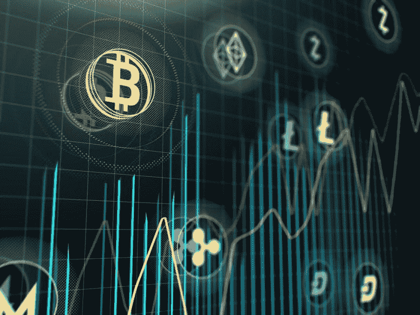

# 我关注的 6 种低市值加密货币(低于 2 亿美元)

> 原文：<https://medium.com/hackernoon/7-low-cap-cryptocurrencies-under-200-million-usd-i-have-my-eye-on-8bdbf950bf43>

有超过 2000 种加密货币可供使用，很难知道哪些有未来的利润潜力。不幸的是，很难确定哪些是值得投资的。处于发展初期的“低市值”或“小盘股”加密货币可以带来最高利润。“低市值”是“低市值”的简称市值是指一枚硬币流通供应量的总价值。市值的计算方法是将硬币的当前价格乘以市场上的总数。在这篇文章中，我认为低于 2 亿美元的市值是“低”的

虽然低面值硬币有很大的增长潜力，但它们也比高面值加密货币风险更大。原因是低市值密码未经证实，往往基于愿景和承诺的潜力。然而，潜在的回报抵消了这种风险。看到小盘币能涨 10 倍、20 倍，甚至 100 倍，也不是不现实。

为了帮助缩小范围，本文概述了 6 个我认为在未来两年有巨大增长潜力的低市值项目。

## 基本注意力标志

这是一个很有前途的项目。BAT token 是广告商、出版商和用户之间的记账单位。勇敢浏览器是 BAT 的代名词，它与 BAT 令牌无缝集成。这款浏览器可以抵御恶意软件，保护用户上网时的隐私。英美烟草解决了许多人可能会遇到的问题，例如移动设备用户因设备上的有害广告而面临的数据使用和能源使用成本。它寄希望于这样一个事实，即用户将会欢迎一个阻止出售他们个人信息的追踪器和广告的浏览器。我倾向于同意。BAT 团队在科技行业也有丰富的经验，这是加密货币领域成功的关键。

***买蝙蝠上***

## *文献学(MTC)*

*区块链技术在医疗保健领域有很多机会。医疗费用昂贵且难以获得，尤其是在偏远地区。敏感的医疗记录存储在传统的数据库中，容易被黑客攻击和滥用。Docademic 旨在解决这些问题。它正在创建一个国际医疗平台，在这个平台上，拥有智能手机的人可以通过手机的摄像头与医生会面，并接受医疗建议。该平台将其数据存储在区块链上，并要求 MTC 令牌从区块链检索数据。这个标志也值得注意，因为约翰·迈克菲在社交媒体上吹捧它。*

****买 MTC 上***[***Kucoin***](https://bit.ly/2uhEX0V)*

## *西亚科恩(SIA)*

*Sia 将云存储从集中式提供商手中拿走，放在个人手中。它提供了一个分散的点对点存储服务，任何人都可以出租他们多余的硬盘空间。Sia 的用户包括提供商(主机)和客户(用户)。通过该平台，用户向主机委托存储空间，主机因其在 Siacoin 中的服务而获得报酬。提供商可以设定他们的价格，宣传他们的可靠性水平，并为存储中出现的问题或文件丢失设定惩罚标准。网络上的所有服务都以 Siacoin 支付，Sia 平台上的所有交易都通过提交合同和存储证明来保护。*

****买 SIA 上*** [***币安上***](https://bit.ly/2EqGqdZ)*

## *SONM (SNM)*

*SONM 实际上是一个去中心化的亚马逊网络服务。通过它所谓的“雾计算”(基本上是去中心化的云计算)，任何人都可以使用 SONM 架构托管网站、开发应用程序、进行机器学习和执行计算。随着与惠普的合作已经签署，SONM 硬币在主要交易所上市，SONM 可以蚕食亚马逊的市场。*

****购买 SNM 上***[***Kucoin***](https://bit.ly/2uhEX0V)*

## *SelfKey(钥匙)*

*SelfKey 是一个自主身份服务。通过 SelfKey 身份钱包，个人和公司可以安全地管理他们的数字身份。所有数据都存储在用户的本地设备上，而不是存储在 SelfKey 服务器或区块链上。只有当用户选择共享数据时，数据才是可访问的。目前，SelfKey 通过一个简单的 KYC 入职流程，让用户轻松满足“了解您的客户”(KYC)的要求。未来，SelfKey marketplace 有潜力在未来提供更多服务，特别是处理护照申请、公民身份申请、银行账户创建、提交居留申请等。*

*SelfKey 宣布与荷属安的列斯群岛和开曼群岛的银行建立合作关系，并发布了 T2 self key market place 的 alpha 版本。2018 年初宣布了与 Polymath 的[合作](https://www.investinblockchain.com/selfkey-polymath-partnership/)。*

**[***Kucoin***](https://bit.ly/2uhEX0V)**

## **龙链(DRGN)**

***龙链*最近获得了很多关注。它提供区块链即服务，允许企业实施区块链技术来保护其数据库并执行智能合同，而无需技术专业知识。*龙链*也作为 ico 的平台。超过 200 个项目计划通过龙链独家推出 ICO。龙链 ICOs 将接受美国投资者，只需要一个 KYC(了解你的客户)的过程。**

*****购买龙链***[***Kucoin***](https://bit.ly/2uhEX0V)**

## **结论**

**这就是我认为在未来一年半内值得关注的低市值加密货币清单。祝你投资好运，确保永远不要拿你输不起的资金冒险。**

***订阅我的* [*中*](/@minadown) *和* [*推特*](https://twitter.com/minad21) *频道如果你想了解更多关于区块链和加密货币项目的信息，

如果你对这篇文章有任何疑问，请在下面的版块评论。谢谢大家！***