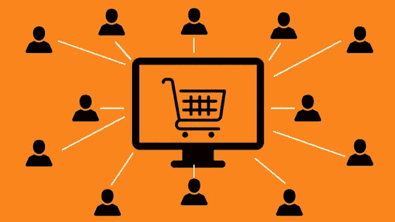
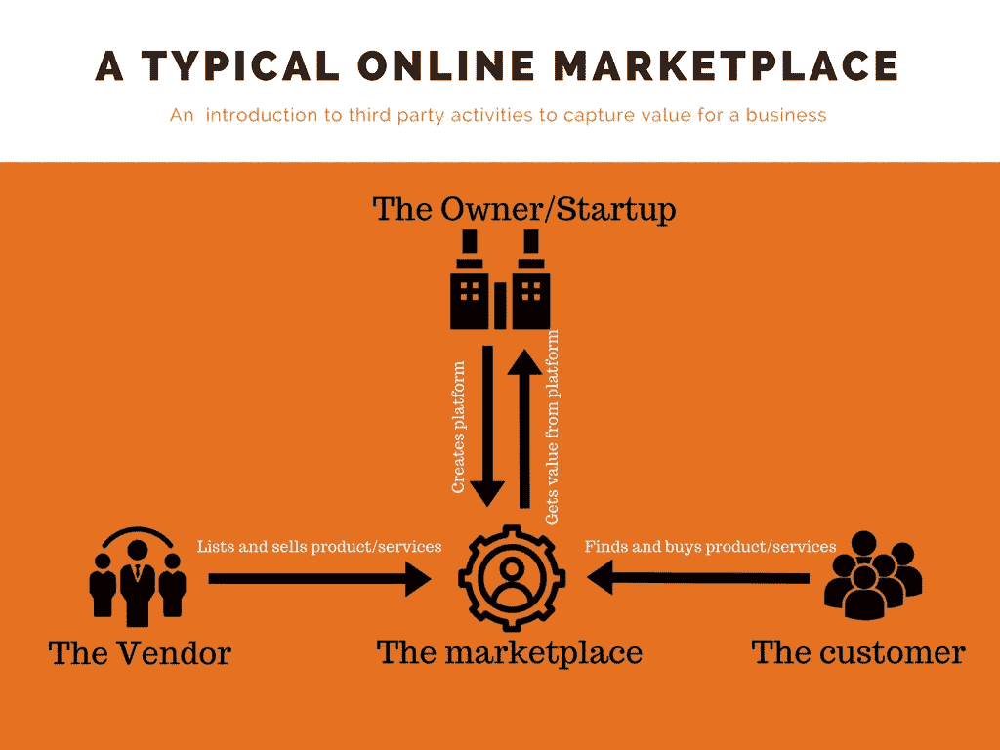

# 7 种与在线市场模式相关的货币化策略

> 原文：<https://medium.com/hackernoon/7-monetisation-strategies-associated-with-online-marketplace-model-130ad8e83653>

一个理想的网上市场应该有一个赚钱的技术来运作。资金主要需要来自你所服务的社区——你网站的用户。

但是什么是在线市场呢？在线市场是一个平台，允许第三方列出他们的产品或服务，以便为平台所有者或整个企业获取价值。

A visual marketplace model

大多数时候，除了一些约会和易货网站之外，这种价值是以货币形式表示的。

> 选择一种盈利策略，在很大程度上取决于你的目标受众和你的市场产品。

让我们回顾一下市场货币化的不同选择，并就如何为你的想法选择合适的市场商业模式给出指导。

主要类别选项包括

1.  佣金/交易免费
2.  上市费
3.  其他费用

**1。商业/交易费**

使商业交易能够直接在平台上发生的市场可以决定对供应商或客户进行的每一次成功交易收取一定百分比(%)或固定费用

有两种佣金可供选择

*   向供应方(供应商)收费—这是从每笔成功交易的供应商余额中扣除费用的部分。易贝、优步和 Etsy 都从他们平台上发生的每笔交易中向供应商收取佣金。
*   向需求方(客户)收费—这是指对每笔成功交易向客户收取的额外费用。一个非传统的例子是 Takeaway.com，它对用户的在线支付收取额外费用。这一策略之所以成功，是因为荷兰消费者更喜欢在线支付，而不是现金支付，他们愿意为此支付额外费用。

Airbnb 是一个向市场双方(需求和供应)收费的平台

通常建议从基于佣金的模式开始，然后随着业务的增长，转向或结合其他策略。

**2。上市费用**

这是向供应商收取的费用，用于向市场提供他们的产品/服务。这种技术在 craigslist 等分类广告平台上很常见。

你可以选择使用向新列表收费的常规列表收费技术或者收取额外费用的额外列表收费技术**来使供应商的列表在搜索结果中更加明显。一个很好的例子是 OLX 的做法。**

其他不受欢迎的技术包括:

**3。引导费**

当交易发生在平台之外时，这种技术是可取的。这种模式(也称为按销售线索付费)非常有效，供应商可以免费浏览市场上的客户需求列表。只有当他们想要访问客户详细信息时，他们才会为每个详细信息或介绍付费。换句话说，这个典型的平台提供免费的发现，并通过促成介绍来赚钱。

向其用户提供信用系统也是有意义的，在该系统中，用户预付使用费，然后将信用用于平台内的特定服务。像图钉这样的交友网站和专业网站很好地运用了这一技巧。

**4。可变佣金和可变上市费**

在这种情况下，百分比(%)削减是不固定的，这允许服务捆绑包中的变化，并可能随着供应商要求的每个额外服务而产生更高的费用。例如，Booking.com 允许供应商/销售商取消常规佣金。

**5。订阅/会员费**

这是一种向用户收取经常性费用来访问市场的模式。这可以向客户或供应商收取费用。这种模式最适合提供高价值产品的市场。像易贝这样的大型市场能够仅仅因为卖方出现在市场上就向其收取订阅费。订阅模式可以细分为免费增值和高级。

**6。支持费用**

一旦市场有了大量的参与者，向供应商提供支持服务并不是一个坏主意，即使这些支持可能与你的核心产品没有直接关系。然后，这些支持服务可以货币化。

例子包括亚马逊向其卖家提供融资，优步向优步司机提供融资以购买汽车，或者食品配送平台向餐馆出售供应商并谈判折扣。

**7。广告**

这主要包括销售针对你的用户的广告。虽然，需要大尺度才有意义。像亚马逊这样的平台目前正在试验这种策略。

两种或多种模式/技术的结合可能是增加收入流的好主意，即使许多初创公司一开始坚持一种模式。值得注意的是，各种模式的组合最适合像易贝这样的大型市场，他们能够将佣金、上市费(普通和高级)以及订阅费等模式结合到其商业模式中。

在决定之前，考虑其他市场，如 Airbnb、craigslist 等，了解各种类型的商业模式是一个好主意。然而，这种方法不应该基于别人在做什么，而应该理解你的利基，与利基相关的价值观，并采用适当的模式。

*原载于 2018 年 4 月 10 日*[*【nyocha.org】*](https://nyocha.org/2018/04/10/7-monetisation-strategies-associated-with-online-marketplace-model/)*。*