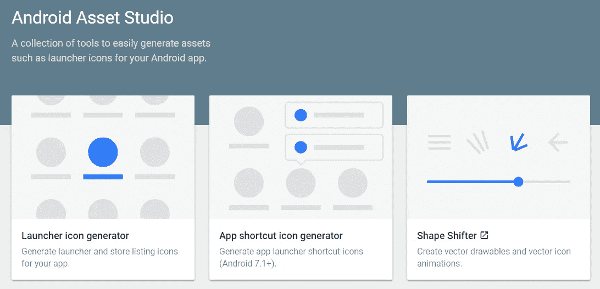

# 2018 年开发者 7 大必备工具

> 原文：<https://medium.com/hackernoon/7-must-have-tools-for-designers-developers-2018-48d26e7d8f52>

# [展开](https://undraw.co/)

开源、免费、主题化的插图。库存图像的最佳替代品。

Choose an illustration, change its theme, export as an .svg or .png

# [Visual Studio 代码](https://code.visualstudio.com/)

开源、跨平台的代码编辑器，设计时考虑了 web 开发。附带 Intellisense 和集成 Git 控件。开箱即用，无需安装大量第三方扩展，如 Atom。

# [Hyper](https://hyper.is)

基于 React.js 构建的跨平台终端，开源，可定制，甚至可检查。

[https://hyper.is](https://hyper.is)

# [谷歌字体](https://fonts.google.com)

可定制的，超快的网络字体。

Import fonts as you go

# [上传实验室](https://uplabs.com)

我最喜欢的寻找设计灵感的地方。

My upvoted items on uplabs, [https://www.uplabs.com/users/foreggs/](https://www.uplabs.com/users/foreggs/)

# [安卓资产工作室](https://romannurik.github.io/AndroidAssetStudio/)

令人敬畏的材料设计 Android 资产，大多是图标。

# [松弛](https://slack.com)

最适合团队编程任务、管理任务等等。

