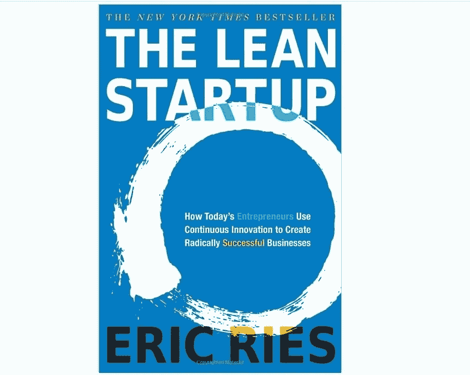
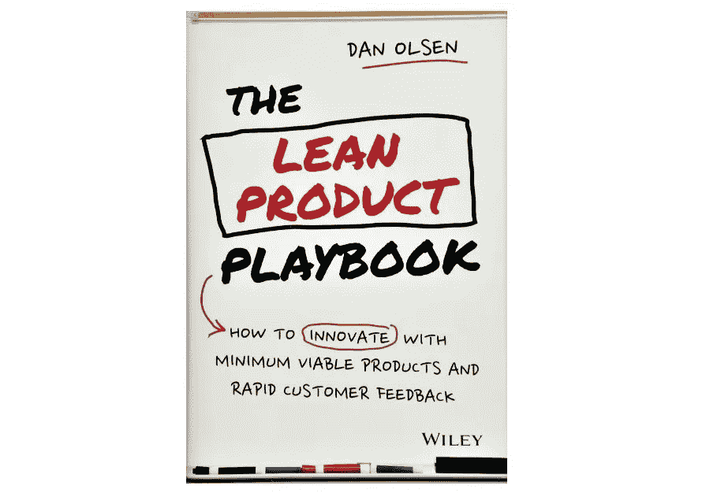
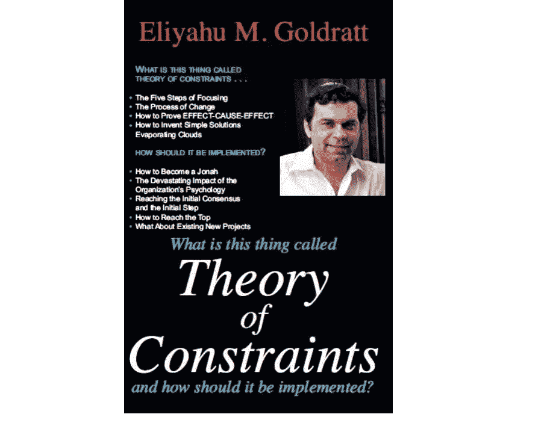
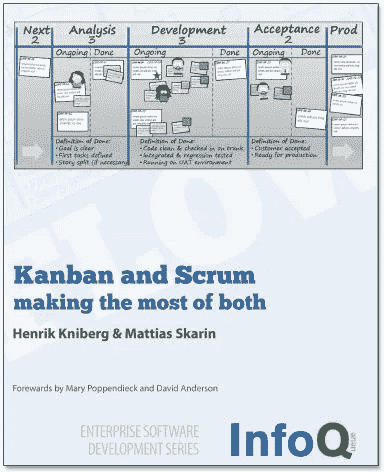
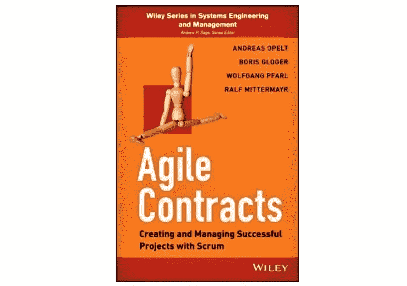
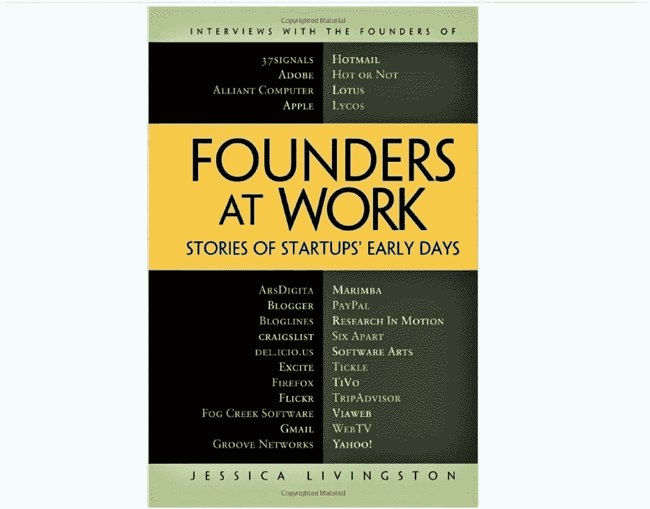
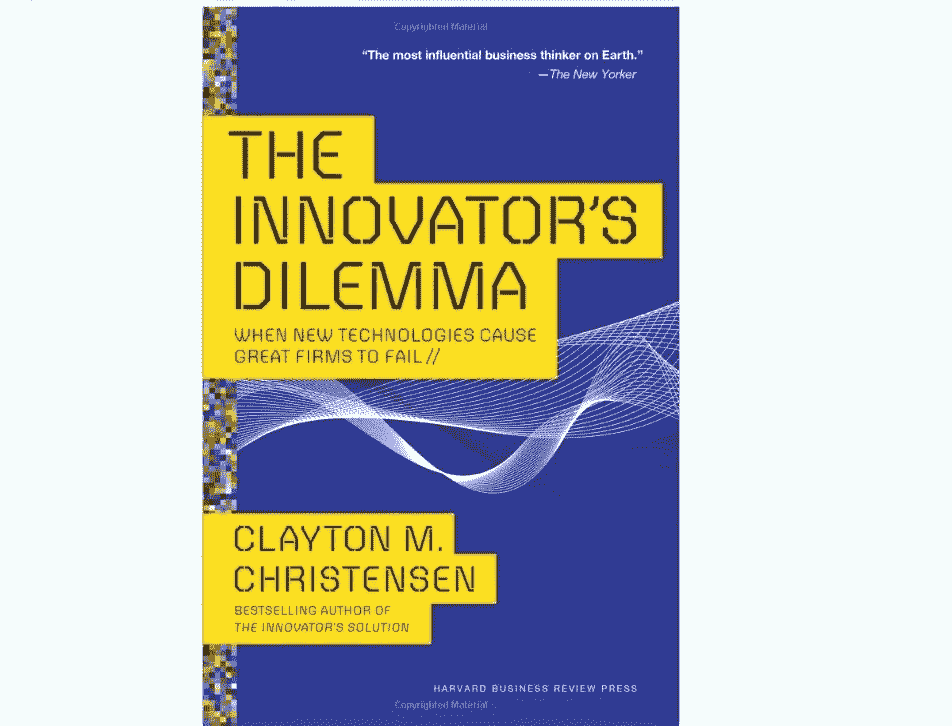

# 创业领导者必读的 7 本关于敏捷项目管理的书

> 原文：<https://medium.com/hackernoon/7-must-read-books-about-agile-project-management-for-startup-leaders-6d002db61b5f>

与全世界分享思想、经验和想法从未像现在这样简单。与此同时，在所有空洞的闲聊中找到真正有用的信息变得越来越难。

这篇文章是一个例外——它将告诉你如果你想了解更多关于敏捷经营企业的方法，你应该读哪些书，你应该什么时候读，以及你能从中学到什么。不多不少。所以让我们开始吧。

1.[《精益创业》作者 Eric Ries](https://www.amazon.com/Lean-Startup-Entrepreneurs-Continuous-Innovation/dp/0307887898/ref=sr_1_3?ie=UTF8&qid=1535970960&sr=8-3&keywords=The+Lean+Startup)

**谁需要这本书？**这本书就像是敏捷圣经，所以无论你是初学者还是有经验的管理者，你都应该读一读。

**你应该什么时候读？**“精益创业”是你通往敏捷之路的[伟大起点](https://www.daxx.com/article/how-to-build-remote-agile-team)。即使你没有任何关于敏捷框架或项目管理的背景知识，你也可以阅读它。

它涵盖了哪些主题？这是一本以商业为导向的书，教你确定产品的目标市场，围绕潜在客户的需求建立你的业务。你会发现如何创造全新的事物并保持创新。此外，Eric Ries 解释了如何应用日本精益方法，敏捷和 Scrum 的前身。

2.[“精益产品行动手册:如何用最少的可行产品进行创新”，作者 Dan Olsen](https://www.amazon.com/Lean-Product-Playbook-Innovate-Products/dp/1118960874/ref=sr_1_1?ie=UTF8&qid=1535970842&sr=8-1&keywords=The+Lean+Product+Playbook)

谁需要这本书？当你刚开始创业时，读这本书肯定更好，因为它会帮助你避免数百个常见的陷阱。然而，即使你是一个有经验的企业家，你也会发现这本书很有帮助。

**应该什么时候读？就在 Eric Ries 的《精益创业》之后。**

**讨论了哪些话题？**奥尔森强调了定义潜在客户需求的重要性，以确保更好地锁定客户。作者还解释了 MVP 的概念，它有助于将你的产品快速推向市场。

3.[《约束理论》作者艾利·M·高德拉特](https://www.amazon.com/Theory-Constraints-Eliyahu-M-Goldratt/dp/0884271668/ref=sr_1_1?ie=UTF8&qid=1535972801&sr=8-1&keywords=Theory+of+Constraints&dpID=51ZMWZG4YJL&preST=_SY291_BO1,204,203,200_QL40_&dpSrc=srch)

**谁需要这本书？对于那些已经开始创业的人来说，这本书将是最有用的。**

**你应该什么时候读？当你遇到任何类型的商业相关问题，需要一个可靠的指导方针时，请阅读这本书。**

**讨论了哪些话题？**“约束理论”是基于一种管理范式，这种范式认为任何可管理的系统在实现更多目标方面都受到非常少的约束的限制。Goldratt 就如何持续改进您的业务流程提供了大量可行的建议，并为复杂的问题提供了简单的解决方案。

4.[“看板和 Scrum:充分利用两者”,作者 Henrik Kniberg 和 Mattias Skarin](https://www.amazon.com/Kanban-Scrum-Enterprise-Software-Development/dp/0557138329/ref=sr_1_3?ie=UTF8&qid=1535971600&sr=8-3&keywords=Kanban+and+Scrum&dpID=41CLbwnyCBL&preST=_SY291_BO1,204,203,200_QL40_&dpSrc=srch)

谁需要这本书？对于渴望学习 Scrum 基础知识的人来说，这本书是完美的。

**应该什么时候读？**完成前两本书后..

**讨论了哪些话题？****作者以一种直白的方式，基于两者的优缺点，解释了何时以及如何使用 Scrum 和看板。同时，这本书相当简洁，它不会用不必要的细节来烦你。**

**5.[“敏捷合同:用 Scrum 创建和管理成功的项目”，作者 Andreas Opelt、Boris Gloger 和 Wolfgang Pfarl](https://www.amazon.com/Agile-Contracts-Successful-Engineering-Management/dp/B00E6T45AW/ref=sr_1_2?ie=UTF8&qid=1535971788&sr=8-2&keywords=Agile+Contracts+Andreas+Opelt%2C+Boris+Gloger%2C+and+Wolfgang+Pfarl&dpID=41zwkt8NDtL&preST=_SY291_BO1,204,203,200_QL40_&dpSrc=srch)**

****

**谁需要这本书？想使用敏捷但在整合方面有困难的公司。**

**你应该什么时候读？没有具体的建议。**

****讨论了哪些话题？**这本书证明了即使在最不利的环境中也有可能实现 Scrum。作者解释了当你使用固定价格合同时，如何最大化利益相关者的互动并从敏捷中获益。简而言之，不管你的环境如何，你都将学会如何利用 Scrum。**

**虽然阅读这些书肯定不会让你成为敏捷大师(只有实践才能做到)，但它们足以让你开始实施敏捷框架，并享受其众多好处。**

**6.[“工作中的创业者:创业初期的故事”，作者杰西卡·利文斯顿](https://www.amazon.com/Founders-Work-Stories-Startups-Early/dp/1430210788/ref=sr_1_fkmr0_1?ie=UTF8&qid=1535972064&sr=8-1-fkmr0&keywords=%E2%80%9CFounders+at+Work%3A+Stories+of+Startups)**

****

****谁需要这本书？**那些希望创办自己的公司的人，以及那些正在经历业务困难时期的人。**

**你应该什么时候读？你可以同时阅读这本书和本文中提到的其他理论书籍。**

****涵盖了哪些主题？这本书收集了一些对著名科技公司创始人的采访，分享了他们从一开始的成功之路。读这本书你绝不会感到无聊，因为它充满了商业运作的真实例子。利文斯顿的书是令人振奋的鼓舞人心的信息汇总，但不是如何建立自己的成功的直接指南——毕竟，每个公司都有自己独特的方式。****

**7.[《创新者的困境:当新技术导致大公司失败》作者克莱顿·M·克里斯坦森](https://www.amazon.com/Innovators-Dilemma-Technologies-Management-Innovation/dp/1633691780/ref=sr_1_1?ie=UTF8&qid=1535972442&sr=8-1&keywords=The+Innovator%E2%80%99s+Dilemma%3A)**

****

**谁需要这本书？老牌企业主。**

****应该什么时候读？**每当您对在组织中实施新技术有疑问时。**

****涵盖哪些主题？作者认为，如果你在每次新技术出现时都重组业务流程，你可能会损害你的公司。读完这本书后，你会知道何时以及如何对新技术说不——即使你的一些客户会说你这么做很老套。Christensen 触及了超越敏捷的问题，以举例说明如何实现业务连续性。****

# **结论**

**虽然阅读这些书肯定不会让你成为敏捷大师(只有实践才能做到)，但它们足以让你开始实施敏捷框架，并享受其众多好处。**