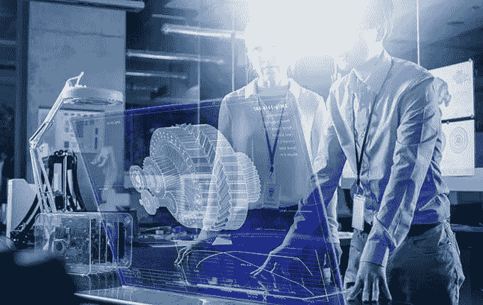

# 塑造现代全球工作场所的 7 大技术趋势

> 原文：<https://medium.com/hackernoon/7-technology-trends-shaping-the-modern-global-workplace-e64e6701ad00>

今天，有许多技术和应用可以提高我们的生产力。这是随着工作场所的数字化的继续。许多人认为我们还有很长的路要走，但我们确实已经看到了一些值得我们关注的大趋势。

[**人工智能**](https://hackernoon.com/artificial-intelligence/home)

CMS Wire 表示，[人工智能(AI)在当今数字工作场所中的作用](https://www.cmswire.com/digital-workplace/understanding-the-role-of-artificial-intelligence-in-the-digital-workplace/)将变得如此普遍和根深蒂固，以至于它几乎看不见。事实上，到 2028 年，许多人认为人工智能将不会是我们简单而主动地与之互动和管理的东西，而是会完全融入我们生活的每一部分(包括工作场所内外)，人工智能和人类智能之间的界限将变得难以区分。

公司用作操作记录系统的系统将成为他们工作的基础。当这种情况发生时，任何关于需要完成的工作的决定，以及工作进度的指示和对正在进行的工作进行的自动调整都将在没有任何人工干预的情况下发生。

**与新的机器人同事一起工作**

Align 表示，即使我们目睹人工智能在我们的工作生活中变得越来越普遍，它也会在我们甚至没有意识到的情况下在后台发生的事情中变得越来越普遍。这是因为人工智能为优化和决策提供了大量巨大的机会。今天，即使是最简单的自动化任务，用于驱动或增强人类活动，也变得必不可少。人工智能的发展节省了资金，同时有助于更深入的学习。随着这种情况的发生，商业继续以这样一种方式发展，它将改变游戏以及随之而来的一些道德规范。

**更多地使用云技术**

Fuze 说，正如我们今天所知，云的使用继续增长并渗透到技术中。这在我们办公室的许多不同方面都可以看到——包括数据存储、协作、软件和基于云的电话系统。所有这些东西都在不断变得更加复杂，看不到尽头。这对你的[商务电话系统来说尤其如此，因为它在我们的现代工作场所变得越来越必要](https://www.dialpad.com/office/small-business-phone/overview)。在今年和可预见的未来，随着对云服务的真正需求的发展，我们应该会看到强劲的增长。向云的持续迁移也将让企业变得更加灵活，这样他们就可以随着需求的变化而扩大或缩小规模。

**虚拟现实(VR)和增强现实(AR)时代**

尽管移动员工人数增长强劲，但将虚拟现实(VR)带入工作场所将是一个挑战，因为许多人仍将其视为一种新奇事物。有很多企业拥有完全人工智能集成所需的计算能力。因此，期望高管戴上虚拟现实头盔参加会议还为时过早。当你有一个移动办公室时，电话、电子邮件和视频仍然是举行会议最常见的方式。然而，Biz Community 表示，虚拟现实(VR)和增强现实(AR)创新可能不会太久就会影响工作场所。这在南非得到了证明，在那里，大约 61%的员工已经愿意在他们的职业生活中使用 VR/AR 进行一些事情，例如在现实的虚拟环境中进行新技能的培训，解决问题，以及为客户创造新的想法。此外，超过一半的南非员工(52%)认为将人工智能引入他们的工作场所将使他们的工作更容易。

**异地办公地点**

我们也看到了当今数字工作场所对“远程工作”的定义发生了深刻的变化预计在未来 10 年内，没有人会再使用这些术语(远程工作或远程工作者)。相反，人们将在一个动态的数字平台上工作，作为一个工作场所，以全高清 3D 全息图的形式报道工作。这意味着与人或投射到你工作场所的人互动将不再有任何区别。每个员工都有自己的“合作机器人”，充当他们的礼宾员、勤杂工、分析师和预测者。

**网络安全威胁**

在 2018 年，确保您所有内容的安全也很重要。随着远程工作人员数量的增加，这一点变得尤为重要，这也将增加在任何给定时间点连接到企业基础架构的设备数量。这些设备将带来[网络威胁数量的增加，企业也将看到](https://www.democratandchronicle.com/story/money/2017/11/10/cyber-threats-against-small-businesses-rise/847417001/)。这意味着我们所知的网络边缘正处于不断变化的状态。对于今天的安全技术来说也是如此，这些技术最初是设计来保护网络本身的。

许多人认为，2018 年，我们还将看到复杂的网络攻击数量激增，这些攻击使用不同寻常的载体组合来破坏公司网络。这将改变我们看待供应链攻击的方式，因为它在今天将变得更加常见。然而，仅仅通过终端安全来识别设备并不足以真正减轻由于拥有分布式工作场所而将会发生的威胁。

**机器人流程自动化**

自 2017 年以来，机器人过程自动化(RPA)已成为一项重要技术。2018 年，它将在劳动力市场扮演更重要的角色。自 2017 年以来，所有这一切都发生了变化，这一年许多大企业首次采用了 RPA。现在，其中一些公司想考虑引入人工智能元素。当这种情况发生时，企业将不会缺少实施 RPA 的机会。事实上，许多还没有这样做的企业也将开始采用它。

当 RPA 与其他成熟的技术(例如文档捕获)相结合时，它将获得更大的吸引力。随着企业对这项技术越来越熟悉，他们将会更好地理解它在业务流程自动化中的地位。大多数企业现在都意识到了这一点，因为他们觉得需要更仔细地了解 RPA 的优势，以及各种提供商如何提供不同类型的处理—从半结构化和非结构化内容到高度结构化的内容。软件机器人与机器学习、文档分类和数据提取服务的结合相当强大。