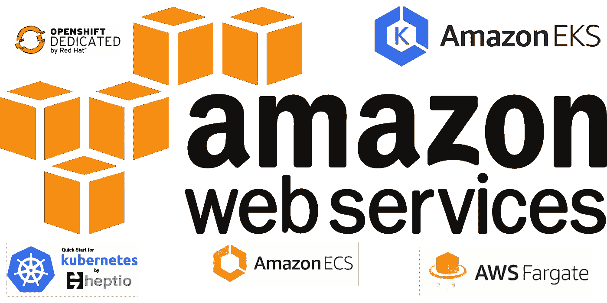

# 在 AWS 上做容器的 7 种方法

> 原文：<https://medium.com/hackernoon/7-ways-to-do-containers-on-aws-532f812196f1>

最近有人问我在 [AWS](https://hackernoon.com/tagged/aws) 上运行容器的不同方式的选择和优缺点。当我解释完之后，我想把它写下来可能是有意义的，也许对更多的人有用。

*两个小提示:这不是一个全面的指南，我肯定我已经忘记了一些选项。让我知道。此外，在管弦乐方面，我把自己限制在 Kubernetes。YMMV。*

## I . EC2 上的手卷香草容器

自从 EC2 和 Docker 出现以来，这个选项就一直存在。您使用 EC2 来启动一个或多个虚拟机，安装 [Docker](https://hackernoon.com/tagged/docker) ，并且——特别是如果您有多个可以启动容器的虚拟机——使用 shell 脚本、Fleet、Puppet、Chef 等来管理容器的生命周期。第一波基于容器的应用(从 2013 年末开始)基本上使用了这种方法。

*优点:*

*   完全控制

*缺点:*

*   从 2018 年的观点来看，很大程度上被认为是过时的
*   手工创建的临时编排层很难维护和扩展
*   您必须(手动)进行升级

## 二。EC2 上基于安装程序的香草 Kubernetes

从概念上来说，建立在前面的配方之上，可以使用安装程序，如 [kubeadm](https://kubernetes.io/docs/setup/independent/create-cluster-kubeadm/) 、 [kops](https://github.com/kubernetes/kops) 或 [kubicorn](http://kubicorn.io/) 在 EC2 上安装 vanilla Kubernetes。

*优点:*

*   细粒度控制
*   快速且证据充分

*缺点:*

*   需要升级管理，并且并非所有路径都经过了同样好的测试和/或记录

## 三。模板 Kubernetes

存在许多模板化的解决方案，例如 [Heptio 的 Kubernetes](https://aws.amazon.com/quickstart/architecture/heptio-kubernetes/) 快速启动，它允许你通过几次点击或命令来启动一个 Kubernetes 集群。

*优点:*

*   非常快速简单

*缺点:*

*   根据解决方案的不同，使用可能最适合开发和测试，但不一定适合生产

## 四。EC2 上的 Kubernetes 分布

许多供应商正在 AWS 上提供他们的 Kubernetes 发行版。如果您不想或不能做出必要的决定(如使用哪个 SDN 等),这是一个很好的选择。)并希望从附加的、更高级别的功能中受益，如构建管道和注册中心或多租户。一些例子是:

*   牧场主(通过[市场](http://rancher.com/deploying-rancher-from-the-aws-marketplace/)
*   [构造](https://aws.amazon.com/blogs/compute/kubernetes-clusters-aws-coreos-tectonic/)
*   [OpenShift 专用](https://www.openshift.com/dedicated/index.html)

*优点:*

*   端到端由发行版负责
*   通常:不需要操作，包括升级

*缺点:*

*   在您可以使用此设置的内容和位置方面，可能有一些限制
*   价格

## 动词 （verb 的缩写）亚马逊弹性容器服务(ECS)

> [https://aws.amazon.com/ecs/](https://aws.amazon.com/ecs/)

ECS 从 2014 年开始提供，直到去年还是亚马逊希望你运行容器的主要方式。ECS 拥有专有的架构和 orchestrator，被从 Ubisoft 到 TIBCO 的许多客户所使用。

*优点:*

*   与 AWS 的深度集成
*   充分理解，久经考验

*缺点:*

*   鉴于存在新的选择(见下文),不清楚它将走向何方

## 不及物动词 AWS Fargate

> [https://aws.amazon.com/fargate/](https://aws.amazon.com/fargate/)

[介绍](https://aws.amazon.com/blogs/aws/aws-fargate/)在 2017 年末的最近一次 re:Invent 上，Fargate 似乎是门户药物。它被称为“无集群容器产品”和其他东西，并且(除了 Azure 容器实例之外)在其他云提供商中没有直接的对等物。

*优点:*

*   超级好用
*   平台中更复杂/更完整产品的良好开端

*缺点:*

*   为某个用例定价和优化奖品有时很难解决

## 七。库贝内特斯(EKS)的亚马逊弹性集装箱服务

> [https://aws.amazon.com/eks/](https://aws.amazon.com/eks/)

和法盖特一样，EKS 最终被发现了。与 Fargate 不同，EKS 在 2018 年初撰写本文时，仍只能作为注册预览计划的一部分。我真的不能说太多——直到我尝试过——除了它看起来很有趣，我很高兴 AWS 做出了这一举动。

你怎么想呢?关于你在 AWS 上使用容器的方式，有什么故事要分享吗？也许一些经验报告或更深入的见解对你有用，或者人们应该知道在 AWS 上运行容器？在这里分享或在 Twitter 上 ping 我( [DMs 开放](https://twitter.com/mhausenblas))。

更新(2018–02–01):正如 Mark Coleman 所指出的，随着 [https://hyper.sh](https://hyper.sh/) 存在一个 Fargate 等价物，并且从 2016 年开始！