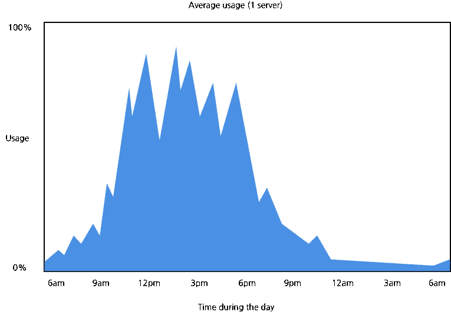
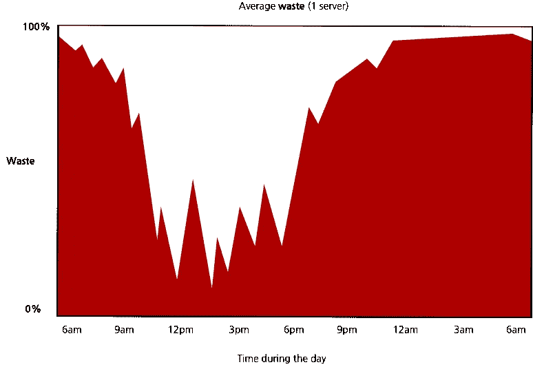
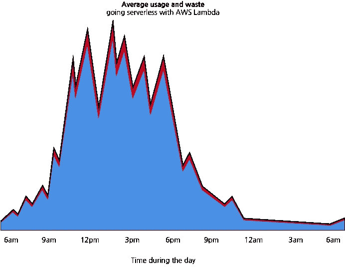

# 您的企业将从无服务器中获益的 7 种方式

> 原文：<https://medium.com/hackernoon/7-ways-your-business-will-benefit-through-serverless-522b3f628a33>

每一个新的技术术语的开头都充满了开发人员的兴奋。通过令人兴奋和陌生的技术术语，可能很难说这个新的流行词会给你的业务带来什么好处。

无服务器是目前新的顶级技术术语之一。这要追溯到 2014 年。随着亚马逊关于 AWS Lambda 的发布，一项计算机服务声称:

*   没有要管理的服务器
*   持续扩展和平衡
*   自动故障转移
*   亚秒计量(只为已用时间付费，不为预留时间付费)

如果你不是一个精通技术的人(或者你正在向一个人解释无服务器)，这些东西可能没有多大意义。它们听起来像一堆技术词汇，承诺帮助你以更低的价格服务更多的顾客。这可能已经够好了，但如果仅仅如此，就不会有那么多的吵闹声了。

那么，无服务器在商业上意味着什么，它能在哪些方面给你的企业带来好处？

1.  更短的上市时间
2.  提高效率
3.  你的固定成本变成了可变成本
4.  减少浪费
5.  更容易旋转(更灵活)
6.  更好的服务稳定性
7.  更好地管理开发和测试

我们来解释一下。

# 1.更短的上市时间

对于许多公司来说，将应用程序交付给市场是一条漫长的道路。除了产品规划、设计和开发，您还必须考虑所需的基础设施、设置和容量。

有了无服务器，您不再需要担心基础架构的租赁和购买、设置和容量规划。这些步骤已从您的产品开发流程中删除，现在由您的无服务器平台提供商负责。你“只”需要考虑如何正确地计划、设计和开发你的应用程序。这大大缩短了您的上市时间，因为开发周期更短。

# 2.通过只为已用时间而不是预留时间付费来提高效率

假设你想买一辆车。
对你和你的家人来说，这是一款不错但也很高效的手机。

但是销售员说你想要的车必须一直开着。

不管你是否在使用它。

开足马力。

Your car alternator may fail if you turn it on and off a lot, but your serverless function won’t.

你会觉得这家伙可能疯了。你为什么要买这样一辆车？

> 汽车的工作方式实际上就是你的软件目前运行的大多数基础设施的工作方式。

*开足油门。*

让我们来看看下面这个为你的产品提供支付服务的例子。
通常，要运行这样的服务，你需要租用或购买一台服务器。服务器将需要一直运行，处于空闲状态，直到收到付款请求。服务器的平均使用情况如下图所示。

顶部边框表示您的服务器可以支持的最大请求量。左轴显示估计的平均服务器使用率，从 0 到 100%。底部轴显示一个工作日的时间。

这看起来很好，因为这是您的服务器通常“需要”工作的方式。不管请求的数量有多少，如果你想要一个正常运行的服务，你“需要”支付服务器空闲和工作时间。

但是，如果我们简单地颠倒视角，您会得到相同服务器的平均浪费，如下图所示。

目前，无论您是租用虚拟服务器还是拥有数据中心**，您都在浪费**资源*。无论您的应用程序是否被使用，您都是在为预留时间支付**。**

**该图* ***并未*** *显示废物的不同维度。内存、磁盘空间、功耗等。有了这些，浪费就更大了。*

无服务器改变“游戏”，所以您**只为**使用**的时间支付**。

该图显示，在无服务器的情况下，您的容量会随您的使用情况而变化。因此，将浪费降至最低。

这可能看起来不错，但是 Y 轴在哪里？为什么要去掉前面的黑色边框呢？

Y 轴和灰色框已移动，因为在无服务器的情况下，容量会由无服务器供应商根据您的使用情况自动调整。无服务器使服务器容量不再是您的问题。这包括容量规划、基础设施、设置和大型 DevOps 团队。

# 3.您的固定成本变成了可变成本

想象一下，您的公司每天有 1000 万用户请求。每个用户请求还会进行几个内部调用，总计 3000 万个请求。(这是一个来自客户端的简化的现实世界用例，所以我们不详细讨论)

为了处理这个卷，您现在需要租赁一批虚拟服务器或者设置您自己的数据中心。每月产生数百到几千美元的基础设施成本。*如果我们加上一个由 DevOps 工程师组成的团队来设置和处理您的基础架构的成本，数据中心的成本，维护等，那么成本会高得多。*

无服务器计算服务根据使用的请求时间向您收费。平均 [AWS](https://hackernoon.com/tagged/aws) Lambda 定价为每一百万个请求 0.20 美元。看起来非常便宜，但这还不是你的总数。AWS Lambda 是一项计算服务，所以您还需要数据存储、通知服务等。此外，无服务器(带有 AWS Lambda)建议将您的应用程序分成许多较小的服务。导致内部电话数量激增，每天总计至少翻一番或 6000 万次请求。这听起来很多，但计算服务、数据存储和您可能需要的其他服务的费用将在每月 900 美元左右。

但这仍然不是成本降低的来源。成本降低是因为无服务器使您的固定成本变成了可变成本。

> **无服务器让你的固定成本变成可变成本。**

固定成本是与产出无关的成本。它们包括建筑物、机器、租金。可变成本随产量而变化。

传统服务器迫使您拥有固定成本。
不管有没有用法。

使用无服务器，您的费用因使用情况而异。
如果今天你有 6000 万个请求，而明天没有请求，你今天会给
大约 100 美元，明天给**零**。

# 4.减少浪费

当开发多个产品时，某些功能会被反复开发。例如，支付处理或用户认证。

想象一下，一家汽车制造公司一遍又一遍地为每一款新车型制造自己的轮胎。这辆车的价格相当于一级方程式赛车的价格。

具有 AWS Lambda 功能的无服务器使您的团队专注于将产品服务开发为独立的组件。然后可以有效地重用这些组件，减少时间和精力的浪费。

# 5.更容易旋转(更灵活)

企业，尤其是创业公司，经常需要改变他们的产品或想法。当旋转时，通常你需要改变你的目标受众。有时甚至会重新思考应用程序的工作方式。现在很多应用都是紧耦合的，这是个大问题。即使是产品过程中的微小变化也会导致痛苦的重构或重写。

无服务器增加了产品的灵活性。Serverless(带 AWS Lambda)推荐你把你的应用分成很多小的独立服务。从而增加产品的灵活性。然后，如果您需要将您的产品转向不同的市场，您只需重构您需要的服务。

# 6.提高服务稳定性

作为独立的结果，你新分离的服务更加稳定。为什么

目前，大量应用程序被捆绑在大块中。您可以将它们描述为打包到单个块中的捆绑服务或应用程序。巨石柱没那么糟糕。但是他们有一个重大缺陷。单个服务崩溃可能导致整个系统崩溃。就像洗五颜六色的衣服一样，一块布的颜色会破坏其他的颜色。

# 7.更好地管理开发和测试

构建由许多独立服务组成的应用程序将有助于您:

*   更好的项目概述。
*   更简单的测试
*   更好的估计

## 更好的项目概述

将您的应用程序开发为独立的服务将有助于您更好地衡量您的进展。您将更好地理解您的服务是如何工作的以及如何相互交互的。

## 更简单的测试

将您的应用程序设计成多个单一的责任单元使它们更容易测试。通常在开发时，您还需要设置多个环境并为它们付费。使用无服务器设置多个环境既免费又简单。

## 更好的估计

单独的单个单元通常具有较小的范围。小范围单元更容易估计、开发和测试。

> 尽管如此，没有单一的方法、技术或策略是万能的，这完全取决于你的**背景**。

# 无服务器的潜在副作用是什么？

无服务器确实给餐桌带来了很多好处。尽管如此，没有单一的方法、[技术](https://hackernoon.com/tagged/technology)或战略是银弹，这都是基于你的背景。同样，无服务器也有潜在的副作用，可能不适合你的公司或你的情况。

## 1.供应商锁定

在无服务器环境中运行您的应用程序可以将您的应用程序和服务与您的平台提供商紧密耦合。即使您的业务逻辑不依赖于服务本身，它仍然需要直接连接到平台提供者服务。由于无服务器平台提供商之间的接口和协议差异，任何潜在的应用程序向其他无服务器平台的迁移都将是一次痛苦的重写。*你可以通过应用六边形建筑来减轻一些不好的影响。*

## 2.SLA —服务水平协议

目前，对于某些无服务器服务，没有强有力的服务级别协议。就 AWS Lambda 而言，目前还没有正常运行时间或运营协议。Gojko Adzic 和 Robert Chatley 的一篇论文发现，AWS Lambda 的正常运行时间大约为 99.6%。这对几乎所有企业来说都足够了。但是对于需要更高可用性的关键任务，Lambda 可能并不合适。AWS 没有公布 Lambda 的官方正常运行时间数据。

## 3.维护许多小型服务可能会很麻烦

有些人可能会争论这一点。维护和调试许多较小的服务，而不是几个捆绑的应用程序，确实需要更多的关注和奉献。尤其是对于大型企业环境。*您可以通过将自动化测试设置为特权并使用* [*AWS X 射线*](https://aws.amazon.com/xray/) *来避免它。*

## 4.服务启动可能稍慢

因为您的无服务器提供商会自动扩展您的应用程序，如果您长时间没有任何活动，当新的请求到达时，您的一些应用程序实例可能会关闭。这种情况要求您的服务“冷”启动，这可能会导致高达 1s 的更高延迟。当然，延迟取决于环境。Node.js、Python 的延迟低于 1 秒，而 Java 的延迟稍高(在 3 到 10 秒之间)。

希望你喜欢这篇文章，非常感谢反馈！

感谢你的分享，评论和批评！

如果你喜欢这本书，可以随意看看我和斯洛博丹·斯托亚诺维奇合著的《Node 和 Claudia.js 的无服务器应用》。由曼宁出版社出版。

 [## Node 和 Claudia.js 的无服务器应用程序

### 首先是流行语:无服务器计算。AWS Lambda。API 网关。Node.js .微服务。云托管功能…

manning.com](https://manning.com/books/serverless-apps-with-node-and-claudiajs) 

我想对我的朋友[斯洛博丹·斯托亚诺维奇](/@slobodan)、[戈杰科·阿季奇](https://gojko.net)、[维多利亚·里克尔梅](https://www.linkedin.com/in/victoria-riquelme-montiel-30458692/)和[维克多·图巴](https://twitter.com/viktortuba)表示深深的感谢，他们帮助我审阅、重组并分享了他们对如何改进这篇文章的见解。

你也可以在 [Twitter](https://twitter.com/simalexan) 、 [LinkedIn](https://www.linkedin.com/in/simalexan/) 和 [Github](https://github.com/simalexan) 上找到我。