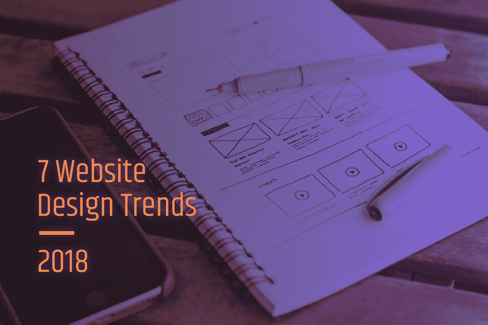
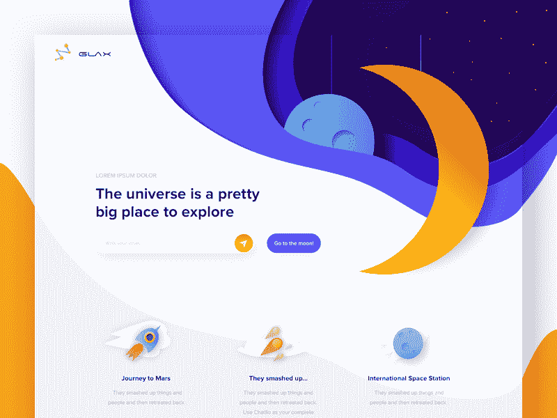

# 2018 年 7 大网站设计趋势

> 原文：<https://medium.com/hackernoon/7-website-design-trends-for-2018-d91b6578f381>

想象一个场景:一个客户问他们应该做些什么来提高他们的有机排名。在勤奋的技术审计、市场分析和转换漏斗审查之后，你必须给出一些艰难的建议:

“你必须重新设计你的网站架构”，或者

“你必须完全迁移你的站点”，或者甚至

“你必须重新思考你的商业模式，因为目前你没有提供任何重要的价值。”

在价值主张成为业务增长和销售的主要贡献者后，网站设计变得越来越重要。Once 可以通过在他们的网站上灌输 2018 年的最新设计趋势来增加他们网站的价值。

以下是最新的趋势。

*   **3D 动画**

另一种方法是把你的网站变成一个独立的宇宙，在不断的运动中加入现实元素。3D 动画抓住了注意力，增加了在网站上的停留时间。

曾经这么棒的互动效果就是 [particle.js](https://vincentgarreau.com/particles.js/) 。这个脚本是免费的，在 Kupanzone 可以看到一个这样的伟大实现。

*   **Cinemagraphs**

最高质量的图片将不再让任何人感到惊讶。然而，生活图片肯定会做到这一点。想象一个交互式网站设计，通过让网站上的一些元素移动来给网站增加一点魔力。

当你试图用视觉形式传达复杂的信息时，静态图像通常是不行的。毕竟，复杂性往往会随着时间的推移而展开——一个静态的用户界面图像只能告诉你里面有什么，而不能告诉你如何使用它。

输入<cinema>元素。</cinema>

*   **讲故事**

设计师和内容专家需要认识到网站不同目标人物角色的不同动机，并相应地指导他们。

一旦你的网站讲述了引人入胜的故事，可以增加人们的参与度。2018 年，

整个网站应该反映一个与你的品牌密切相关的互动故事。

你还会注意到在许多网站 ui 中出现了“闪烁”或“振动”的颜色。虽然这些颜色组合创造了令人难以置信的惊人效果——包括当你滚动时似乎在你眼中挥之不去的幽灵般的余像——但这是在故事中添加背景的一个好方法。

*   **虚拟现实视频**

未来比你想象的更近。现在从 VR 视频开始。以最有利的角度展示你的产品和服务的内容会让你吸引更多的顾客。

*   **界面情绪**

当网站设计理解你，预见你的心情，知道你想要什么:这多酷啊？让你的网站改变颜色，就好像它能读懂人们的思想。听起来很难，但完全可行。

举个非常简单的例子，当用户向网页深处滚动时，网站可以改变它的颜色。

*   **富有表现力的排版**

2018 要求你的排版成为你信息的表达。丰富多彩，富有创意，与众不同。你的类型反映了你需要的一切，从旅游癖到餐饮。只要选择正确的元素，并将它们与你的设计语言相结合。

回到非视网膜屏幕和糟糕的字体支持的糟糕的旧时代，在你的 web 界面中坚持使用无衬线字体是非常有意义的。但是随着屏幕和字体渲染技术——更不用说自定义字体支持——变得更加强大，我们开始看到越来越多的精致字体占据中心舞台。或者至少是更重要的配角。

*   **UX 写作**

首先，问一个简单但关键的问题:你的网站的目的是什么？提示:仅仅因为其他人都在做，T4 就开发一个新网站或重新设计是不够的。你需要确定你的网站要实现的目标。

如果简洁是智慧的灵魂，那么 UX 写作就是你 2018 年网络发展的灵魂。使文字内容清晰准确。有了 UX 写作，你可以提高你的销售，并节省大量的网页空间。

遵循这些为你的商业网站设计目的驱动的简单原则，用户将被驱动到一个目的明确的无缝旅程，他们甚至不会意识到他们已经到达了预期的目的地。无论这意味着通过你网站上的下载内容将他们转化为销售线索，还是简单到成为他们记住的未来业务关系的名称，都要知道你的最终目标，并让它指导你所做的一切。