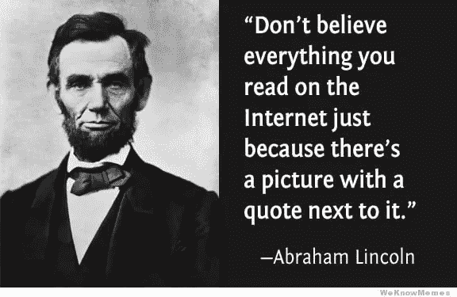
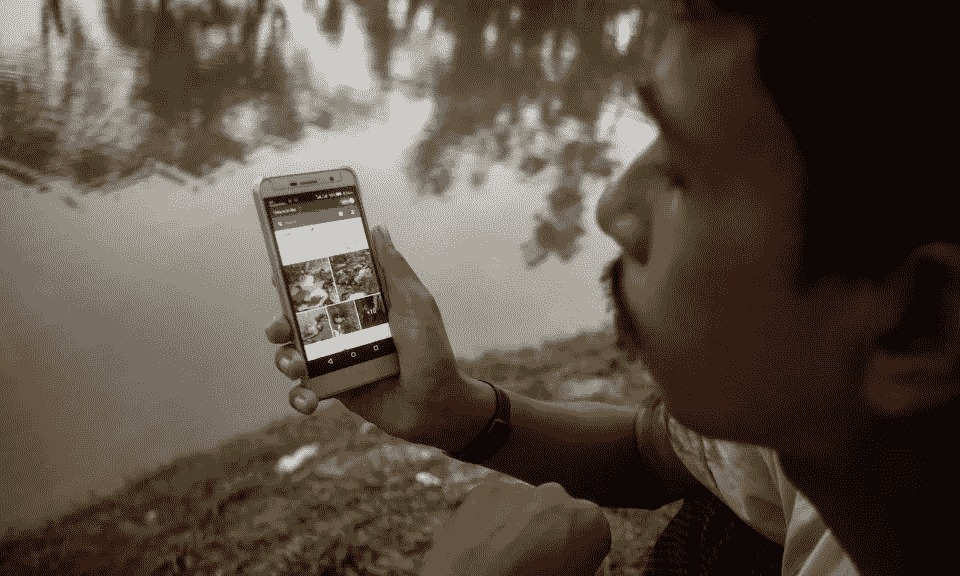
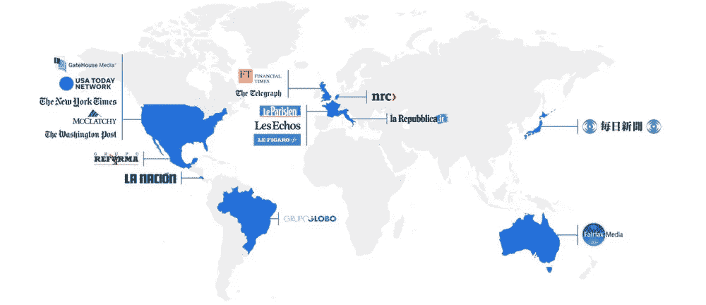

# 70%的人担心假新闻——以及谷歌如何打击假新闻

> 原文：<https://medium.com/hackernoon/70-of-people-worry-about-fake-news-and-how-google-combats-it-e9d7a03ecca8>

你上一次读到这样的标题是什么时候，*‘一名携带艾滋病毒的恋童癖牧师强奸了 30 名儿童，在教堂外被发现钉死在十字架上’*。我打赌不久前。这个标题听起来很诱人，尤其是因为它令人厌恶且不光彩。我们都有过这样的经历，在浏览我们的社交媒体订阅源时，遇到了带有夸张标题的共享新闻故事。我们中的一些人会不相信地点击并阅读附带的文章，而另一些人会立即分享它而不核实来源。

尽管挑剔的读者会花几分钟时间在谷歌的指导下进行尽职调查，以揭示一个故事的真实性，但到那时，可能已经太晚了——这个故事可能已经像病毒一样传播开来，获得了数百万次页面浏览量。

**真相**:上面的故事是由一个以假账闻名的阴谋网站发布的。[教会表示，他们没有这个名字的牧师的记录，也没有大主教管区发生过这样的事件。](https://www.cbsnews.com/news/fake-news-completely-untrue-headlines-this-week/)

在这篇文章中，我想谈谈两个例子，假新闻不仅吞噬了人们在线浏览网页的时间，还造成了经济上的愤怒。然后继续讨论谷歌计划如何解决这个问题。

“假新闻”、“事后真相”、“另类事实”等词汇将永远与 [2016 年总统大选](https://www.statista.com/topics/2722/2016-election/)联系在一起。假新闻之所以有害，有三个原因:

1.  它宣扬虚假的事实，进而对人们的看法产生负面影响。
2.  它掩盖了更重要的，紧迫的和真实的故事，必须达到人民。
3.  它贬低了新闻和媒体作为一个整体的可信度。 *(* [*)几乎 50%的人很少或者不相信他们在社交媒体上读到的*](https://www.statista.com/statistics/620130/online-news-sources-trustworthiness/) *)*

# 1.马来西亚航空公司 17 号航班遇袭

当地时间 2014 年 7 月 17 日下午 4 点 20 分左右，马航 MH17 航班在乌克兰东部上空被击落。298 名乘客全部遇难，其中包括许多儿童。谁发射了导弹？

一个由荷兰领导的国际调查小组周四表示，2014 年在乌克兰东部击落马来西亚航空公司(Malaysia Airlines)一架客机的导弹来自俄罗斯军方，这为荷兰检察官起诉克里姆林宫与导致机上 298 人丧生的袭击事件有关提供了可能性。就连独立的俄罗斯报纸《新报》似乎也不怀疑谁该对此负责。“原谅我们，荷兰，”这是报纸头版的醒目标题。

A Dutch Reporter reading out report on Malaysia Flight 17

然而，[俄罗斯媒体迅速传播关于乌克兰的错误信息，称他们有罪。几个小时内，社交媒体开始传播关于飞机坠毁原因的对立解释。西方媒体称是亲俄分裂分子击落的。另一方面，俄罗斯政府指责乌克兰军方。](https://www.euronews.com/2018/09/17/russia-says-flight-mh17-downed-by-ukraine-owned-missile)[这篇文章](https://www.washingtonpost.com/news/monkey-cage/wp/2018/09/20/who-spread-information-disinformation-about-the-mh17-crash-we-followed-the-twitter-trail/?utm_term=.d27b77841c7a)讲述了华盛顿邮报在袭击后对推特进行的分析。

# 2.缅甸种族灭绝

缅甸主要是佛教徒(88-90%的人口)，少数人信仰其他宗教，包括少数穆斯林(4%)。该国经历了 2016 年发生的大屠杀。2016 年 11 月下旬，[人权观察](https://en.wikipedia.org/wiki/Human_Rights_Watch)发布了[卫星图片](https://en.wikipedia.org/wiki/Satellite_image)显示，五个村庄约 1250 所罗辛亚房屋被安全部队烧毁(估计约 90000 人流离失所)。为什么？*假新闻*，如果你到现在还没猜到的话。在这一事件中，使用的主要媒介是脸书。

A Rohingya man looks at Facebook on his cell phone at a temporary makeshift camp after

一个人说伊斯兰教是对佛教的全球性威胁。另一个分享了一个关于一名穆斯林男子强奸一名佛教徒妇女的虚假故事。然而，脸书的帖子并不是来自普通的互联网用户。相反，根据该国前军事官员、研究人员和文职官员的说法，这些人来自缅甸军方，他们将社交网络变成了种族清洗的工具。

军方利用了脸书在缅甸的广泛影响力，它在缅甸被广泛使用，以至于该国[1800 万互联网用户中的许多人将硅谷社交媒体平台与互联网](https://en.wikipedia.org/wiki/Internet_in_Myanmar)相混淆。脸书最终对此做了些什么，但那时许多账户已经造成了损害。有些假账号甚至有 130 万粉丝。

# 谷歌如何打击假新闻

作为一个[每天处理超过*35 亿次搜索*](http://www.internetlivestats.com/google-search-statistics/) 的搜索引擎，谷歌明白它在清除假新闻，尤其是突发新闻时所肩负的重大责任。在数字时代，新闻机构比以往任何时候都面临着让自己变得可信的压力。

谷歌表示，计划在未来三年花费 3 亿美元来提高其平台上新闻的准确性和质量。他们称之为**谷歌新闻倡议。**

国民总收入侧重于三个目标:

1.  提升和加强新闻质量
2.  发展商业模式，推动可持续发展
3.  通过技术创新增强新闻机构的能力

那些听起来太模糊了——让我来分解一下。他们计划:

**1。提升和加强新闻质量:**类似于他们如何删除 YouTube 上的仇恨内容，谷歌计划使用这项技术来突出显示来自经验证的新闻来源的相关内容，称为“顶层”。为此，他们推出了反信息实验室。

> “通过将软件工程师、设计师和(dis)信息专家联系起来，我们相信我们可以开发出现代而智能的解决方案来解决这个古老的问题。我们的第一个项目是创建一个虚假信息专家的在线“社交网络”。一个“反信息中心”。该中心将学术界和反信息专家以及设计师和软件开发人员联系在一起，为对该主题感兴趣的人创建了一个全球论坛。”

**2。** **发展商业模式推动可持续增长:**随着数字媒体的接管，[人们发现人们更倾向于为高质量的内容付费](http://www.digitalnewsreport.org/survey/2017/paying-for-news-2017/)，这给了新闻机构除广告之外的第二个收入来源。谷歌正在通过创建一个名为[‘订阅谷歌’](https://blog.google/outreach-initiatives/google-news-initiative/introducing-subscribe-google/)的新项目来发挥作用，这是一种让人们轻松订阅各种新闻媒体的方式，帮助出版商吸引谷歌和网络上的读者。

The publications present in Subscribe with Google

目前，他们正处于测试 DoubleClick 中基于机器学习模型的[“订阅倾向”](https://www.doubleclickbygoogle.com/articles/building-beyond-insights-engine/)信号的早期阶段，以使出版商更容易识别潜在订户，并在正确的时间向他们提供正确的报价。

**3。通过技术创新为新闻机构赋能:**如果技术进步不能用来解决当今的现实问题，那它还有什么用？谷歌遵循这一信条，并试图利用他们的技术来提高新闻编辑室的效率。

例如，他们正在使用他们的自然语言处理 API 来帮助赫斯特报纸每天对 3000 多篇文章进行排序、标记和分类。[他们还与*南华早报*](https://www.blog.google/topics/journalism-news/experimenting-vr-south-china-morning-post/) 合作，使用谷歌地球创建身临其境的虚拟现实体验，展示香港的历史演变。但还不止这些——还有更多。

> 最后，我们还将发布 today [Outline](http://www.getoutline.org/) ，这是一款来自 [Jigsaw](https://jigsaw.google.com/) 的开源工具，可以让新闻机构为记者提供更安全的互联网接入。Outline 使新闻机构可以很容易地在私有服务器上建立他们自己的 VPN 不需要技术知识。

# 作为公民，我们能做什么？

这里有一篇哈佛暑期学校的文章，给你 4 个辨别假新闻的小贴士。总而言之，

1.  审查出版商的可信度
2.  注重质量(大写&标点喜欢？！？！？是一大禁忌)
3.  检查来源
4.  ***最重要的是，使用类似*******的事实核查网站。****

**

********************************************************************

****全球互联网用户 37.73 亿，社交媒体用户 27.89 亿。据报道，自 2012 年以来，全球互联网用户数量*** [***增长了 80%以上，社交媒体用户数量同比增长 21%***](https://wearesocial.com/sg/blog/2017/01/digital-in-2017-global-overview)***。但所有这些都伴随着一颗苦果:假新闻。如果主要的科技公司不马上开始对抗这种情况，可以肯定地说，我将会对我以后读到的每一篇文章都持怀疑态度。****

*********************************************************************

**如果你觉得这个有用，做* [***关注我***](/@poojabalasubramani) *获取更多文章。你知道你可以鼓掌不止一次吗？试试吧！:)我喜欢写社会问题、产品、科技行业以及我在美国读研究生的经历。这里是我的* [***个人博客***](http://poojabalasubramani.wordpress.com/) ***。****

**和我联系的最好方式是通过**[***insta gram***](https://www.instagram.com/thecuriousmaverick/)*和* [***脸书***](https://www.facebook.com/pooja.balasubramani?ref=bookmarks) *。我在那里分享一些有趣的内容。想了解更多我的职业生活，可以查看我的*[***LinkedIn***](https://www.linkedin.com/in/soundarya-balasubramani/)*。快乐阅读！***