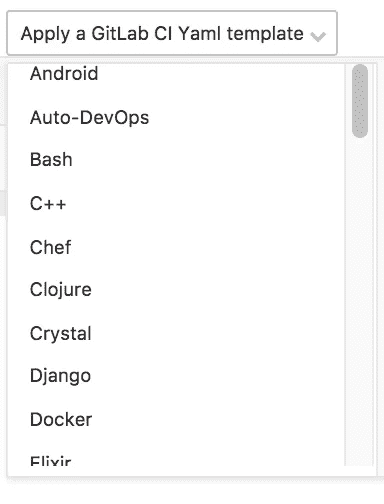

# 71 秒建立你的免费定制网页挂钩(一步一步说明)

> 原文：<https://medium.com/hackernoon/71-seconds-to-build-your-free-custom-webhook-illustrated-step-by-step-7a09b9e240ba>


> 声明:我与 gitlab 没有任何关系，也没有从我提供的任何推荐中获得报酬，事实上，本教程经过最小的调整就可以与 Bitbucket-CI、Travis-CI、Circle-CI 和其他工具一起使用。

如果你想跳过下面的讨论，直接看说明，滚动到显示 ***让我们开始吧。***

所以谷歌正在[打击安卓应用后台服务](/exploring-android/exploring-background-execution-limits-on-android-oreo-ab384762a66c)。

难怪我正在使用的比特币应用程序没有提醒我最近的价格下跌。

在许多情况下，您希望服务持续检查某个条件，并在满足该条件时向您发出警报。类似于网钩的东西。

当你 [google webhook](https://webhooks.pbworks.com/w/page/13385124/FrontPage) 时弹出的第一个定义是:

> 一个 **WebHook** 是一个 HTTP 回调:一个 HTTP POST，在某件事情发生时发生；通过 HTTP POST 的简单事件通知。当某些事情发生时，实现 WebHooks 的 web 应用程序会向 URL 发送一条消息。

在上一个教程中，我们已经解决了使用 gitlab 运行周期性作业的[。](/@YYC_Ninja/56-seconds-to-get-gitlab-to-do-periodic-jobs-for-you-6a731b977559)

在这个非常相似的教程中，我们将添加条件，我们将创建一个 webhook:

*   一个周期性的工作将每天运行:获取比特币价格
*   它将检查是否满足一个条件:如果比特币价格大于 x 小于 y
*   如果满足条件，它将发布一个警报:我们将这个 POST 请求定向到一个 http 请求检查器，以查看它的运行情况，但是我们也可以通过适当的身份验证，将它定向到另一个服务，如 IFTTT 或 Zapier，使它触发数百个连接的服务。例如，如果比特币在特定的价格范围内，让你的智能灯变绿，甚至触发一首歌曲播放。

[在另一篇文章](/@YYC_Ninja/99-seconds-to-make-bitcoin-call-your-phone-number-a8cbd9740f76)中，我们详细讨论了如何将同一个项目连接到 IFTTT，并让 IFTTT 在比特币价格达到特定范围时通过电话、电子邮件或推特提醒我们。


IFTTT allows you to connect to hundreds of services and smart appliances, l[ist of IFTTT services](https://ifttt.com/search/services)

创建网页挂钩有很多方法，但这是我最喜欢的方法，因为:

1.  这很简单，整个教程可以在浏览器中完成，你可以使用你的手机，在 71 秒内你就会有一个正常工作的 webhook。
2.  它可以在几秒钟内设置好:我不需要自己设置服务器，甚至不需要云实例，所以我可以专注于创建我需要的东西，而不是纠结于系统管理任务。
3.  尽管从始终在线的计算机或服务器(如 Raspberry Pi)上运行 cron 作业也很容易。这并不适用于所有人，尤其是旅行者和数字游民。
4.  它提供了更多的自由和多功能性:你显然可以使用 IFTTT 来触发事件，IFTTT 非常灵活，有一个很好的 API 和一个很好的免费层，但你会受到 IFTTT 提供和不提供的集成的限制，而且你会受到他们的限制，例如免费 IFTTT 每天最多发布 100 条推文，尽管这很好，但你不能与实际的 Twitter 每天 2400 条推文相比。
5.  这可以持续下去，对于其他服务，你最终会收到账单，要么在你超过某个配额后，要么因为只要 gitlab 继续在共享构建运行程序上提供每月 2000 分钟的免费构建时间，它就可以运行。这足以让我们的示例代码每天运行 16 次，也就是每月每 90 分钟运行一次。另一方面，在撰写本文时，Bitbucket 每月只提供 50 分钟的服务。


Bitbucket hosted CI free includes 50 min /month build time

5.Gitlab 将代码回购与构建系统集成在一起，当然你可以在 Github 上托管你的代码，并使用 Travis 或 Circle-CI 进行构建，但我希望只需登录一次，就可以管理回购和构建过程，而且我不必使用 ssh 密钥来访问另一个服务。

6.Gitlab 允许私人回购:Travis CI 允许为个人项目免费无限构建分钟，但我最近检查的 Travis-CI 只支持公共回购的免费构建。

7.Gitlab 使用容器来允许用户创建他们的构建堆栈，因此尽管对于本教程我们使用一个简单的 bash 文件，但实际上您可以指定一个容器来测试、构建和部署您的 Android 应用程序、使用 Maven 或 Gradle 的 Java 应用程序、Ruby、Node、Python、Django 和一长串应用程序，更好的是 Gitlab 有现成的标准模板来自动为您设置构建堆栈。我已经在这里分叉了[一个现成的模板列表。](https://gitlab.com/ninjayoto/gitlab-ci-yml)

所以本质上你提供你的代码，Gitlab-CI 提供合适的环境来构建你的代码(你只需要调整 Gitlab-CI 提供的 YAML 文件模板)。这里是[官方 Gitlab-CI 示例页面](https://docs.gitlab.com/ce/ci/examples/README.html)。

如果你对浏览器自动化感兴趣，Joyz 有一个很酷的教程[,介绍如何使用 Gitlab-CI 自动启动一个准备好 chrome-headless 的 docker 容器来运行 Selenium 测试。](https://medium.freecodecamp.org/4-steps-to-build-an-automated-testing-pipeline-with-gitlab-ci-24ccab95535e)



8.项目生成文件。gitlab-ci.yml 与其他许多服务中使用的配置文件非常相似，包括 Travis-CI、Bitbucket-CI Circle-CI 等，甚至 Jenkins 也有 YAML 文件插件。如果需要的话，这使得迁移变得容易。

9.并不是说我们使用了开放的 API 来检索比特币价格，这并不意味着我们局限于不需要私钥或令牌认证的 API。

像其他服务一样，您可以将私钥作为变量存储在 Gitlab-CI 中，例如 MY_API_PRIVATE_KEY，然后在您的。调用 API 时要验证的 gitlab-ci.yml 文件。


you can store private keys as variables in Gitlab-CI to authenticate API calls

如果您这样做，请确保将您构建管道设置为 private，否则其他人将能够以纯文本形式看到您的密钥。

> 让我们开始吧:

> **级别**:所有级别
> 
> **需求**:任何网络浏览器

1.  在 G[itlab.com](https://gitlab.com/users/sign_in)签到(或创建新账号)(10 秒)

2.**创建新项目:**点击 ***新建项目*** 按钮创建新的回购协议，在名称字段中输入 *btc-webhook* 或任何其他名称。(9 秒)


然后点击 ***创建项目*** 进行保存(1 秒钟)


3.**在这个新项目中创建一个***BTC-price-alert . sh***文件:**点击 ***新建文件*** ，将下面的代码片段复制粘贴到 *btc-price-alert.sh* 文件中，然后点击保存(10 秒)


```
#!/bin/bash
echo 'request Bitcoin price';
x=$(curl [https://min-api.cryptocompare.com/data/price?fsym=BTC\&tsyms=CAD](https://min-api.cryptocompare.com/data/price?fsym=BTC\&tsyms=CAD))echo 'removing all non digit from the response'
x=${x//[^0-9\.]/}echo 'Bitcoin price is CA$ '"$x"echo 'removing decimals from the price'
x=${x%.*}echo 'checking if the price within the defined range' if [ "$x" -ge 10000 -a "$x" -lt 14000 ]; then 
        echo 'price is within range, will post an alert'
        curl -i -X POST [https://putsreq.com/wkDdMQWhaOyalisaIe49](https://putsreq.com/wkDdMQWhaOyalisaIe49) --data 'price='"$x"

    else echo 'Price is not within range, no alert posted this time'fi
```

> 这将检查比特币的价格是否在 10，000 加元以上和 14，000 加元以下。可以随意定制。

4.**创建另一个文件，调用它。gitlab-ci.yml 文件:** (20 秒)点击 home 菜单图标，返回你的项目主页。


*click on the plus icon next to your project’s name and* ***select New File*** *from the menu*


copy and paste the following snippet into the .gitlab-ci.yml file then click save

```
test: script: - bash btc-price-alert.sh
```

> 这是一个简单的命令，用来运行我们创建的 bash 文件

点击 ***提交修改*** 按钮，这将触发其构建并运行。

5.**安排每天查看价格:**点击 CI/CD 图标展开菜单，选择 Schedules 为您的 webhook 设置一个名称和一个定时器。(11 秒)


click on **New schedule** button


Type in a name for the new schedule **daily-bitcoin-price-alert**, select to run it daily, or whenever you want it to run, then click **Save**


Your scheduled job has been saved

6.**恭喜恭喜！你完成了**。如果价格在你指定的范围内，网页挂钩就会发出警告。请访问 putsreq.com 的[链接，查看它的运行情况。(10 秒钟)](https://putsreq.com/wkDdMQWhaOyalisaIe49/inspect)


这项工作将每天运行，只要你的免费 2000/月建设分钟没有用完。

你可以在这里找到[示例代码](https://gitlab.com/ninjayoto/btc-webhook)和之前阅读的作业[构建日志](https://gitlab.com/ninjayoto/btc-webhook/-/jobs)

> 我们还可以更上一层楼

如果你还想把你的 webhook 和 IFTTT 集成在一起，这很容易做到

这将是[即将到来的教程](/@YYC_Ninja/99-seconds-to-make-bitcoin-call-your-phone-number-a8cbd9740f76)的主题