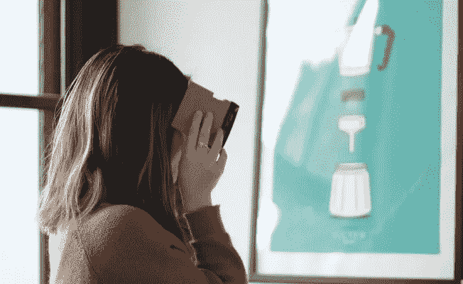
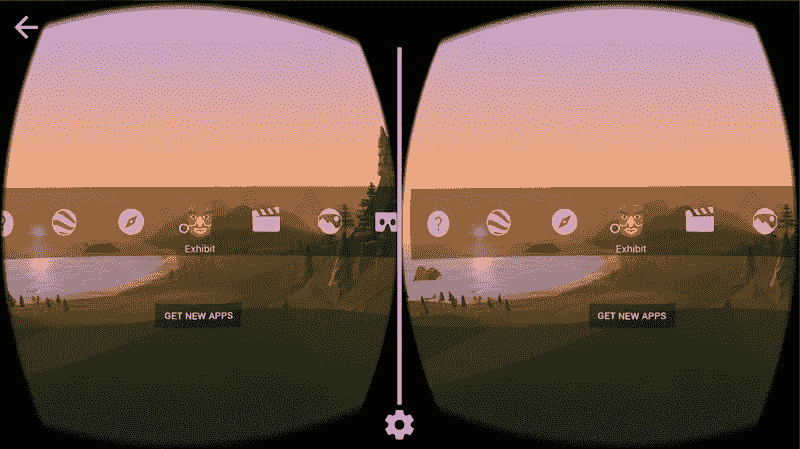
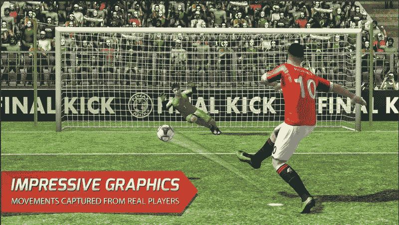
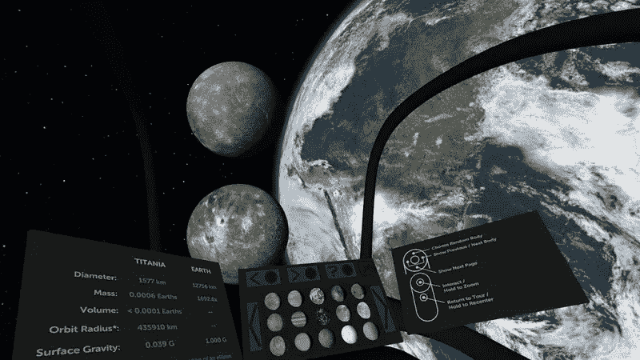
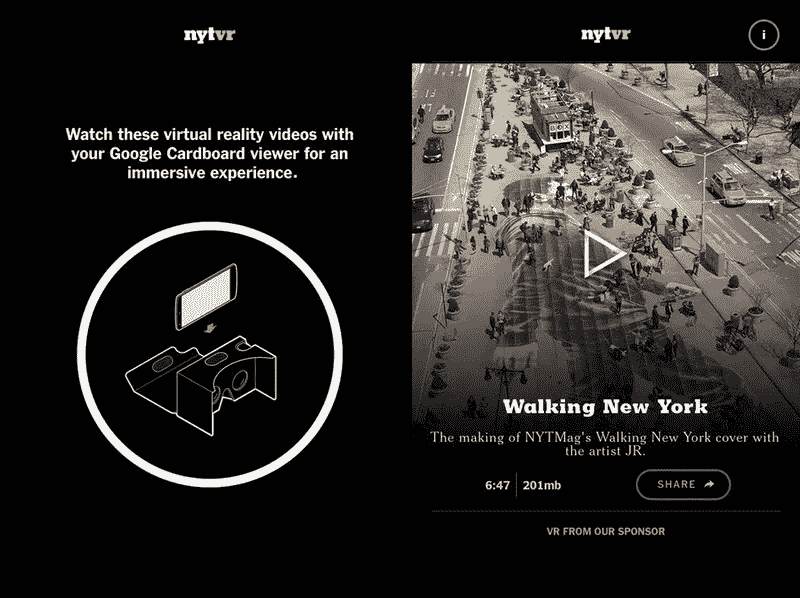
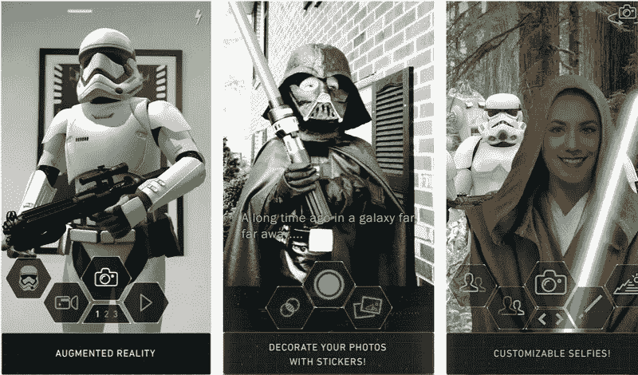

# Google Cardboard 的 8 个最佳应用

> 原文：<https://medium.com/hackernoon/8-best-apps-for-google-cardboard-71343b829e97>

Google Cardboard 是 VR 行业的一场革命。这是一项令人难以置信的简单技术:一对镜片、一块磁铁和一个纸板盒。尽管谷歌 Cardboard 的设计很原始，但它创造了相当深刻的虚拟现实体验。

让我们来发现虚拟现实市场提供的最好的谷歌纸板应用程序。其中大部分是免费增值应用，有可选的应用内购买或广告来帮助发行商赚钱。

# 谷歌纸板应用

不知道从哪里开始？试试 Cardboard 的[官方免费谷歌应用](https://play.google.com/store/apps/details?id=com.google.samples.apps.cardboarddemo)。

基本上，它是一个智能手机的 VR 界面。这个应用程序非常适合配置和启动您最喜欢的体验。你可以用它来搜索谷歌 Cardboard 的新应用。

此外，GCA 有几个演示。它们包括但不限于:

*   **我的视频**——这款应用为你创建了一个巨大的屏幕来欣赏你的视频。
*   **地球—** 开发者在 GCA 中集成了 Google Earth 功能；你可以环绕地球飞行，从上面探索我们的星球。
*   **Exhibit —** 该应用程序展示文物供您检查。
*   北极之旅——这是一次北极体验；带着 GCA 的北方观光令人叹为观止。

# YouTube 应用程序

大多数移动用户已经在他们的设备上安装了 YouTube 软件。如果你没有，那么，是时候安装它了！

YouTube 有一整个 VR 宇宙。你会惊讶地发现，在这个免费的应用程序中，你可以找到多少 360 度的视频内容。从艺术家工作室广播到 360 度山地探险，我们相信您会找到自己喜欢的东西。无论你是 iPhone 用户还是 Android 设备用户，都绝对值得一试。

# 灯笼

如果你正在寻找具有真正平静的沉浸式体验的最佳 Android VR 应用，请看看[灯笼](https://play.google.com/store/apps/details?id=org.androidworks.livewallpaperwatervr&hl=en)。

这个应用传达了元宵节庆祝的和平气氛。这是中国、印度尼西亚、马来西亚、新加坡和其他一些东亚国家的传统节日。

免费的灯笼应用程序创建了一个真正迷人的场景，可定制的灯笼数量和完整的昼夜循环。试试看，享受水上和空中小亮片的和谐舞蹈。

# 最终踢腿虚拟现实

移动虚拟现实技术正在不断改进。如今，应用程序不仅让你成为虚拟世界的观察者，也让你成为第一人称游戏玩家。 [Final Kick VR](https://play.google.com/store/apps/details?id=com.ivanovichgames.finalkickVR) 是一款激动人心的足球游戏，可在 Android 和 IOS 上免费下载。

你在这场比赛中与最好的足球队竞争。你的目标是得分和从点球中“拯救”你的球门柱。这就是为什么我们认为**最终一击是最好的谷歌纸板游戏之一:**

*   **直观的控制—** 有些设备无法连接蓝牙垫；由于这款游戏只需戴上耳机就能轻松玩，它比其他游戏有着无可争议的优势。
*   **像样的图形—** 逼真的物理效果和令人惊叹的图形效果非常有趣。
*   **多样化的游戏，甚至离线** — Final Kick VR 提供 100 支足球队的 20 场比赛，没有互联网连接。
*   **免费—** 虽然有些游戏会强迫你进行应用内购买，但 Final Kick 的付费功能是 100%可选的。

如果你是一个足球迷，并且寻求身临其境的虚拟现实体验，请下载 Final Kick VR 并试用它。

# 太空巨人

你是一个对太空好奇的人吗？你想探索我们宇宙的奇迹吗？考虑将这个惊人的应用程序添加到你手机上的 Cardboard 应用程序集合中。

免费安装和使用，这个应用程序将成为你的导游参观我们的太阳系和其他几个星球。《太空巨人》将太空物体缩小到它们的百万分之一大小，所以很容易比较它们。

《太空巨人》同时带来视觉和听觉上的满足。动态配乐跟随您的旅程，并帮助您更深入地沉浸在无限的外层空间。

应用内购买解锁 50 分钟画外音。在整个旅游过程中，导游会随时通知你。这个可选的功能使太空旅行既有趣又有教育意义。

请记住，该应用会消耗大量的器件功率。确保关闭尽可能多的不必要的后台任务。软件提供商涵盖了 Google Play 中[应用页面的主要问答点。不要忘记浏览它们。](https://play.google.com/store/apps/details?id=com.drashvr.titansofspacecb)

# 探险

[Expeditions](https://play.google.com/store/apps/details?id=com.google.vr.expeditions) 是 Google Play 教育部分的顶级 Google Cardboard 应用之一。但是不要轻易放弃信息内容。我们坚信探险会向你证明教育是有趣和令人兴奋的。

这个免费应用有什么特别之处？首先，Expeditions 支持团队旅游，这意味着你可以和你的朋友一起使用它进行虚拟旅行。只需通过 Wi-Fi 网络连接您的设备，您就可以开始工作了！

超过 200 个预设探险的不断增长的列表，身临其境的 VR 体验，以及一些用于创建教育课堂体验的功能，允许您作为教师使用探险！花点时间和你的家人或朋友一起去发现世界各地的历史名胜。

# 纽约时报虚拟现实

[NYT VR](https://play.google.com/store/apps/details?id=com.im360nytvr&hl=en_GB) 是一款充满获奖 VR 电影和沉浸式视频体验的应用。看新闻从来没有这么有趣过！

《纽约时报》的应用程序使用 VR 以令人兴奋的方式告诉你世界上的一切。潜入现实的 360 度视频的军事冲突在西亚，看到令人难以置信的镜头，金国威爬上世界贸易中心的塔尖，或任何其他常规新闻！

如果你有低端互联网连接，你可以流式播放视频或下载它们，所以你的虚拟现实体验没有任何舒适度限制。

如果你喜欢新闻或者只是寻找一个新鲜的虚拟现实，纽约时报应用程序将是你最好的纸板应用程序之一。

# 星球大战

考虑到《星球大战》系列如此受欢迎，我们将《T4》这部杰作列入了最佳纸板应用名单。大量的正面反馈、多样且吸引人的游戏、免费的内容——所有这些都是优秀应用的标志。让我们找到更多关于这个遥远星系的连接器。

《星球大战》应用程序为你提供互动任务、突发新闻、富媒体和社交更新——所有关于我们最喜爱的星系的信息。以下是值得一提的最惊人的特点:

*   **侧面主题界面**——无论你选择光明面、黑暗面，甚至是机器人设计，《星球大战》VR 都以主题视觉和声音设计让你愉悦；你只需要看到这种出色的动画效果。
*   **聚合供稿—** 该应用允许集中订阅官方社交频道和创作者博客。
*   **成为杰克库间谍—** 这一令人敬畏的连载特写让你沉浸在《星球大战:原力觉醒》中。
*   **探索银河内容—** 阅读官方新闻，观看创作者访谈和星球大战主题视频、幕后花絮等。

《星球大战》应用程序无疑是该系列粉丝的一大负担。看看吧，愿原力与你同在！

# 底线

Google Cardboard 技术发展越来越快。VR 应用程序现在同时具有娱乐和教育品质。请记住，深度沉浸式虚拟现实体验需要耳机。

慢慢来，选择一个列出的应用程序，开始您的奇妙的虚拟现实之旅。这是一个享受美好时光和开阔眼界的绝佳机会。

就个人而言，我们热爱虚拟现实应用，尝试它们，并为我们的客户创造新的应用！我们建议任何人沉浸在这一美妙的技术。

*最初发表于*[T5【applikeysolutions.com】](https://applikeysolutions.com/blog/8-best-apps-for-google-cardboard)*。*