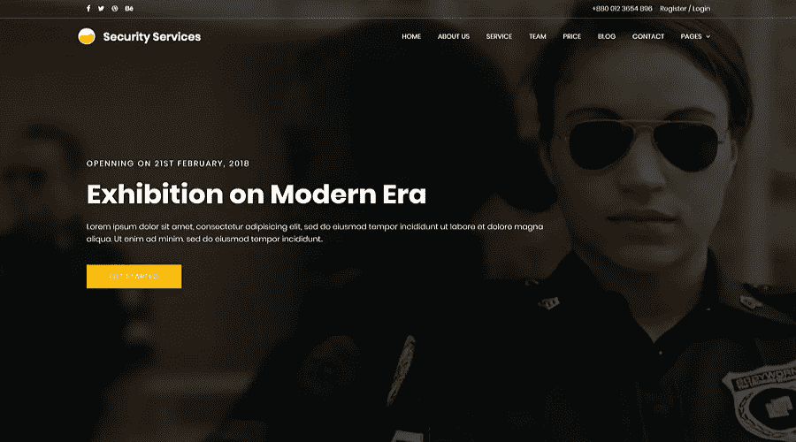
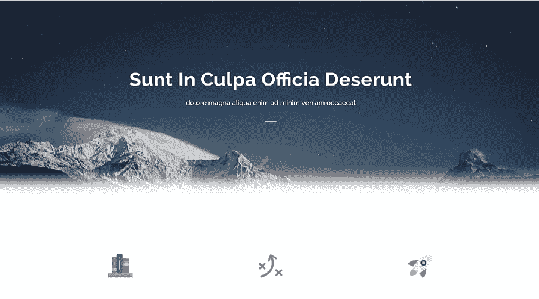
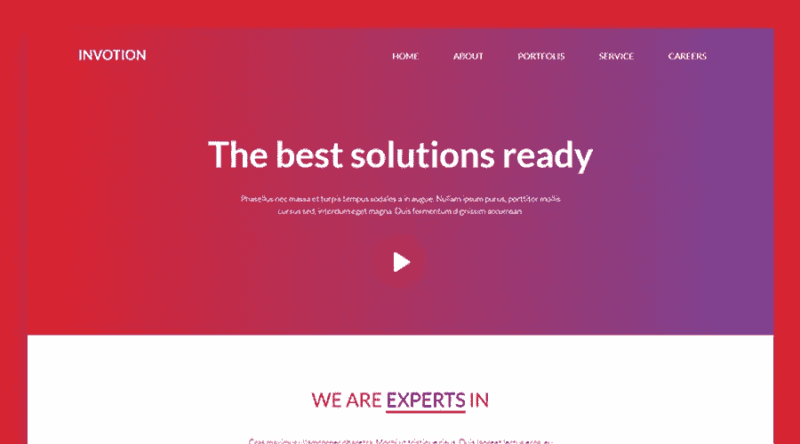
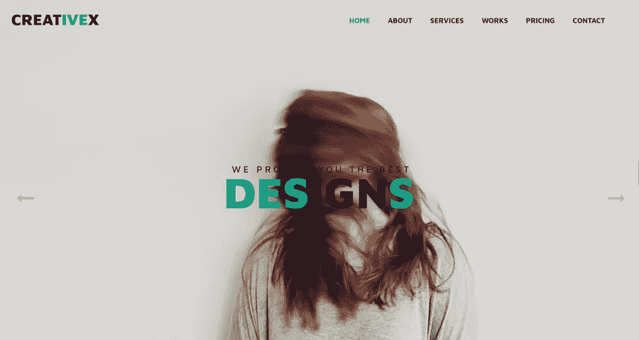
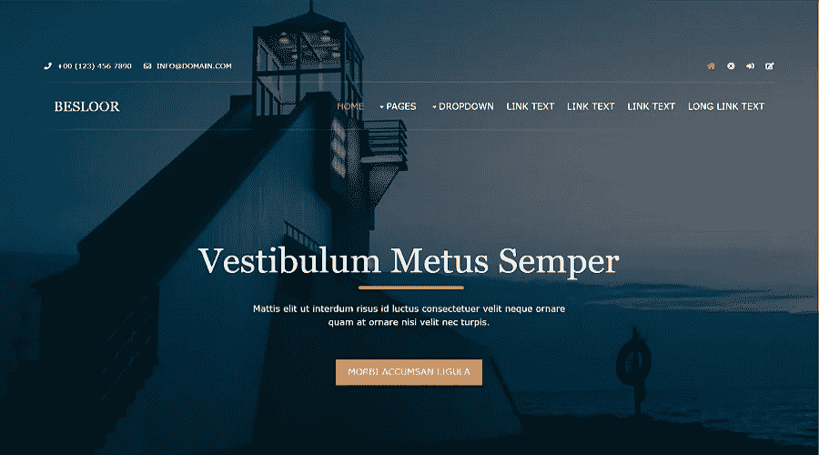
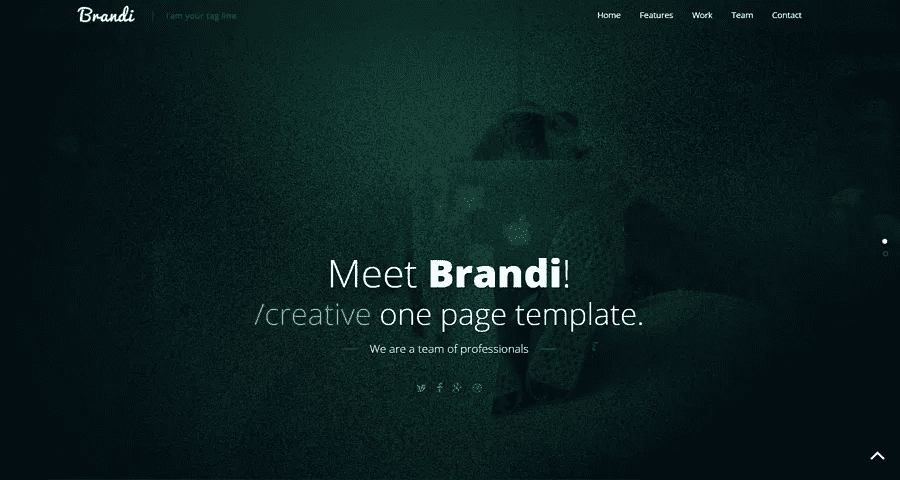
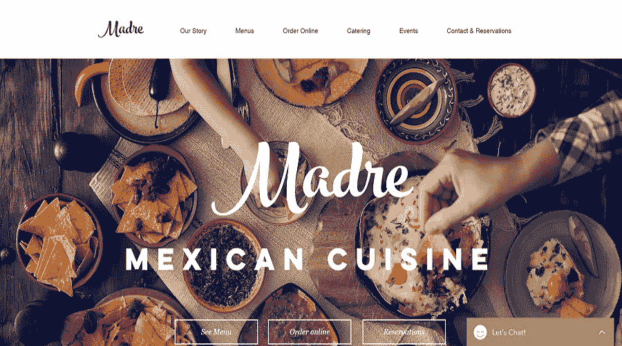
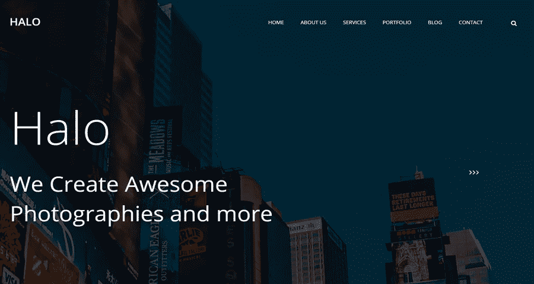

# 8 个最好的免费 CSS 网站模板

> 原文：<https://medium.com/hackernoon/8-best-free-responsive-css-website-templates-for-building-your-website-17323d254674>

网站模板是快速有效建站的最佳选择。8 个免费的 CSS 网站模板将会给你带来更多的启发和益处。

[层叠样式表(CSS)](https://en.wikipedia.org/wiki/Cascading_Style_Sheets) 是一种定义字体、颜色、位置等样式结构的语言。简单来说，CSS 就是一个网站的皮肤。**免费的 CSS 网站模板**是易于编辑的现成的[伟大的网页设计者的网页设计布局](https://www.mockplus.com/blog/post/website-layout-example)。

这种便利是 CSS 变得流行的原因之一，并且现在是构建网站的关键元素。开发人员只需要在 Dreamweaver 等 HTML CSS 编辑器中进行编辑，并使用 CSS 模板(其中许多是免费的)来创建网站。

之前创建网站的方式是涉及[原型设计](https://www.mockplus.com/)，编码，最后发布到网上。技术的介入和互联网的开放性使得普通用户更容易获得用于电子商务或其他目的的免费网站模板，他们可能没有所需的网页设计技能或时间来学习如何从头开始开发一个新的 HTML CSS 网站。

这里是由 Mockplus 为您选择的 8 个免费网站模板，包括免费的 CSS 网站模板和免费的响应式网站模板，您可以将它们用于您的下一个项目。

# 1.[安全](https://colorlib.com/preview/theme/security/index.html) —面向安全公司的免费 CSS 网站模板

**功能:**

*   完全基于 CSS 和 HTML
*   巨幅图像横幅

基于 CSS 和 HTML，安全是完全响应和高度可定制的。该模板非常适合基于安全的公司，因为它具有专业的外观。现代外观的界面突出了一个大的背景图像。该模板提供了一个精心设计的在线平台来发展您的业务。如果你需要传达严肃和专业的东西，这个免费的网站模板是最好的选择。

# 2.崇高的——一个令人惊叹的免费 HTML5/CSS3 网站模板

**功能:**

*   基于 HTML5/CSS3
*   响应式布局

Sublime 是一个干净漂亮的免费网站模板。现代化的流线型设计使 CTA 清晰可见，并使访问者能够轻松找到关于公司的信息。它非常适合初创企业、创意机构和投资组合网站。该模板响应两页布局以供选择。

# 3.一个免费的、有反应的、有创意的 HTML & CSS 网站模板

**特色:**

*   HTML5 和 CSS3 模板
*   完全响应
*   单页模板

Invotion 是一个免费的响应和创造性的 HTML& CSS 模板。渐变色搭配白色字体的使用，显得轻盈现代。此模板适用于多种用途，例如基于服务的营销网站、公司网站和软件服务。这些模板套件有多种用途，如基于服务、营销网站、企业网站和软件服务。

相关资源:[渐变色彩在 App 设计中的应用:趋势、实例&资源](https://www.mockplus.com/blog/post/gradient-color-app-design)

# 4.CreativeX —带有 HTML、CSS 和引导的创意平面网站模板

**功能:**

*   HTML5 和 CSS3 模板
*   动画作品集
*   完全响应设计

CreativeX 是一个创造性的平面网站模板，用于设计组织或企业网站。它是用 HTML、CSS 和 Bootstrap 惊人地设计的。这个模板带有 8 个 HTML 页面，包括主页和关于页面。它还包括具有单一视图的动画投资组合列表。

# 5.[底层](https://www.os-templates.com/free-website-templates/besloor)–免费网站模板

**功能:**

*   HTML5 文档类型
*   完全响应设计

Besloor 是一个完全免费的 HTML5 响应网站模板。它基于具有 4 列的响应式布局，并使用 HTML5 文档类型。它是由“OS 模板”开发的混合设计，适用于设计和商业网站。

# 6. [Brandi](https://themewagon.com/themes/brandi-free-one-page-responsive-html5-business-template/) -免费的单页响应 HTML5 业务模板

**功能:**

*   单页响应网站
*   全屏标题背景
*   使用 HTML5、CSS3、Bootstrap3 构建

Brandi 是最好的免费响应 HTML5 模板之一。它极简、简单、优雅、干净。响应式设计让它在任何类型的智能手机和其他移动设备上都有很高的可读性。粘性页眉的颜色选择看起来很舒服。此外，当用户向下滚动时，令人惊叹的内置字体和图标会改变颜色，从而增强用户体验。

# 7.免费响应的 HTML/CSS 网站模板

**特色:**

*   使用 HTML、CSS 构建
*   单页设计
*   图像背景

Madve 是一个丰富多彩的墨西哥美食网站模板。用 HTML 和 CSS 构建，这使得它可以很容易地为任何类型的餐馆网站定制。按钮显示良好，具有透明效果，使网站在视觉上更具吸引力。在线聊天增加了页面时间，有助于扩大客户群。

# 8.[光环](https://colorlib.com/preview/theme/halo/) —一个免费的多页面 CSS 网站模板

**功能:**

*   多页 CSS 网站模板

Halo 是一个用 CSS 搭建的摄影网站。这是个人网站最好的免费网站模板之一。这是一个多页 CSS 网站模板。整洁的分段和布局使这个模板与列表中的其他模板区分开来。这里没有古怪的动画和交互设计——只是简单。

# 你如何为你的网站做出最好的选择？

上面列出的所有免费 CSS 网站模板都是很好的选择。但是如何做出正确的选择呢？这取决于你的需求和偏好，而这又取决于你网站的核心特征。

额外收获:除了上面的免费 CSS 和响应式模板，你还可以从这些[免费响应式 HTML5 web 模板中获益。](https://www.mockplus.com/blog/post/free-responsive-html5-web-design-templates)

**关于免费网站模板的更多信息:**

[25 个最佳免费个人网站模板和资源](https://www.mockplus.com/blog/post/free-personal-website-templates)

[2018 年 12 个最佳网站模型模板和模型工具](https://www.mockplus.com/blog/post/website-mockup)

[2018 年免费下载的 20 个最佳 Bootstrap 网站模板](https://www.mockplus.com/blog/post/bootstrap-website-template)