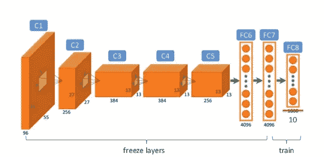
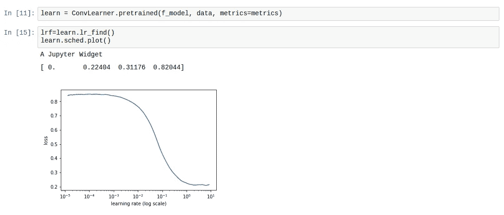
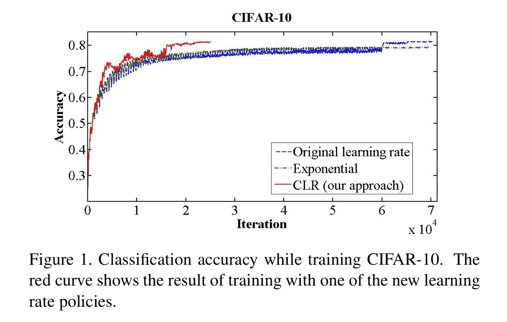
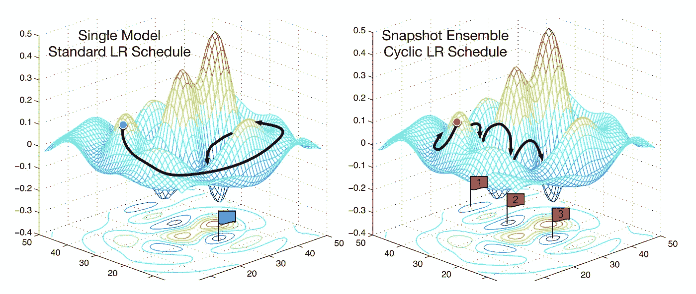
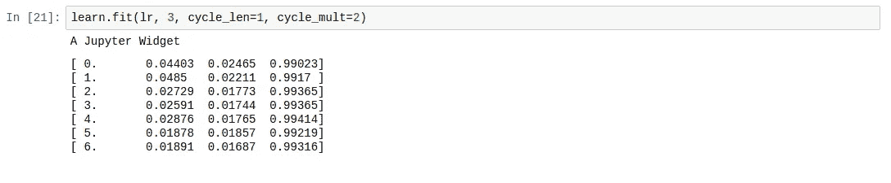
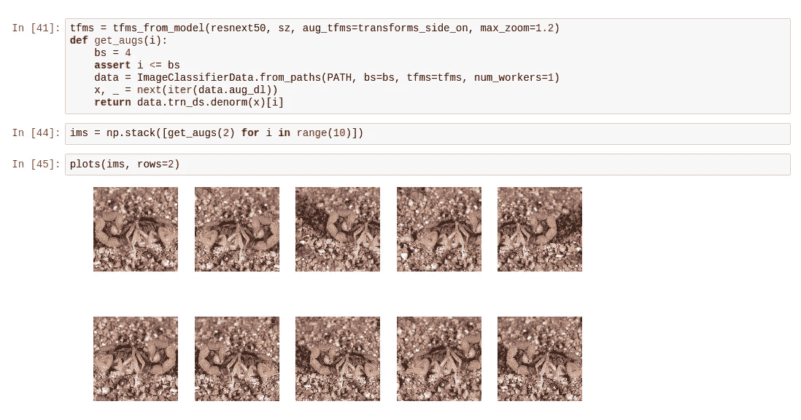
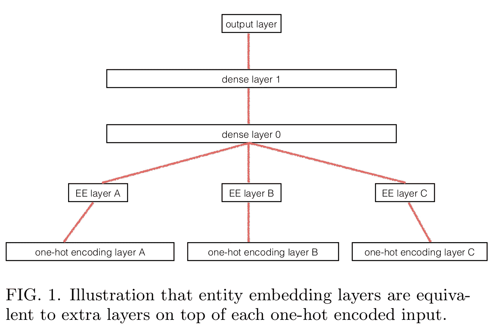

# 我在 2017 年了解到的 8 个深度学习最佳实践

> 原文：<https://medium.com/hackernoon/8-deep-learning-best-practices-i-learned-about-in-2017-700f32409512>

我在 2017 年真正高兴完成的事情是更多地实际参与现代人工智能。我学了很多数学，这当然很有趣，但是我没有做过任何实际的项目，因此我的努力没有任何成果。为了补救这一点，4 月份，我申请了[人工智能资助](https://aigrant.org)，目的是为肯尼亚语音建立 [FastText](https://fasttext.cc) skip-gram 模型。我进入了第一轮的决赛，但没有获得资助。

然后，今年 9 月，我申请了一个现在已经完成的课程的国际奖学金，该课程是**程序员实用深度学习，第一部分 v2** ，由 [fast.ai](http://fast.ai) 的杰瑞米·霍华德教授。它将于 2018 年 1 月的前两周左右作为 MOOC 向公众开放。在 7 周的时间里，我学会了如何使用 8 种技巧进行建筑:

1.  来自预训练模型的世界级图像分类器，
2.  情感分析工具通过从被调查的数据集构建语言模型，
3.  如何在结构化数据集上进行深度学习，以及
4.  如何利用深度学习通过协同过滤构建推荐引擎？

所有这些都是通过被称为 Jupyter Notebook 的极其高效的界面完成的，该界面由 PyTorch 支持的 fastai 深度学习库支持。

所以这里有 8 个技巧。在每种情况下，我都会用简短的`fastai`代码片段概述总体思路，并指出(在括号中)每种技术是否普遍适用(无论您是在为图像识别和分类、NLP、结构化数据建模或协作过滤做 DL，都很有用)，还是更具体地针对您试图应用深度学习的数据类型。在课堂上，使用 Kaggle challenges [狗与猫:内核版](https://www.kaggle.com/c/dogs-vs-cats-redux-kernels-edition/)、[狗品种识别](https://www.kaggle.com/c/dog-breed-identification)和[星球:从太空了解亚马逊](https://www.kaggle.com/c/planet-understanding-the-amazon-from-space)完成了图像识别课程。

因为这是互联网，我做了自己的挑战，就是克隆狗和猫，但是用蜘蛛和蝎子代替。蜘蛛大战蝎子。我通过搜索“蜘蛛”和“沙漠蝎子”并下载了大约 1500 张图片，从谷歌图片中获取了这些数据。显然，这是我自动完成的。我不想自动成为深奥的蜘蛛和右击的专家。我通过删除任何非 jpg 图像、任何非图像碎片和没有扩展名的图像来清理数据。当我过滤掉垃圾的时候，我有大约 815 张图片要处理。每个类`[spiders, scorpions]`在训练集中有 290 个，在测试/验证集中有 118 个蜘蛛和 117 个蝎子。令人惊讶的是(对我来说，当我得知这一点时)，它的工作！我的模型达到了大约 95%的准确率。

How to make a world-class image classifier

## 通过微调 VGG-16 和 ResNext50 进行迁移学习。(计算机视觉和图像分类)

对于图像分类工作，您可以通过针对您的特定问题进行微调来获得大量收益，这是一种在更普遍的挑战中表现良好的神经网络架构。一个例子是残差网络 [ResNext50](https://arxiv.org/abs/1611.05431) ，一个 50 层的卷积神经网络。它接受了 ImageNet 挑战的 1000 个类别的训练，因为它表现非常好，所以它能够从图像数据中提取的特征足够通用，可以重复使用。为了让它为我的问题域工作，我需要做的是用一个输出二维向量的层替换最后一个层，该层输出 ImageNet 预测的 1000 维向量。在上面的代码片段中，两个输出类是在名为`PATH`的文件夹中指定的。对于蜘蛛对蝎子的挑战，我有以下:

```
$ ls -lsh data/spiderscorpions/train/
128K drwxrwxrwx 1 bmn bmn 128K Jan  3 00:22 scorpions
148K drwxrwxrwx 1 bmn bmn 148K Jan  3 00:22 spiders
```

注意，`train`文件夹的两个内容本身就是文件夹，每个包含 290 张图片。

此处显示了微调程序的示例图，它重新训练了一个 10 维最终层:



Image obtained from [here](https://image.slidesharecdn.com/practicaldeeplearning-160329181459/95/practical-deep-learning-16-638.jpg)

## 周期性学习率(普遍适用)

学习率可能是[为训练深度神经网络](http://teleported.in/posts/cyclic-learning-rate/)而调整的最重要的超参数。在非适应性设置(即，不使用 Adam、AdaDelta 或它们的变体)中，通常由 DL 实践者/研究者并行运行多个实验，每个实验在学习速率之间具有小的 Delta 差异。如果你有一个大的数据集，这将花费非常长的时间，而且很容易出错，如果你在用随机矩阵建立直觉的*方面没有经验*。然而，在 2015 年，美国海军研究实验室的莱斯利·n·史密斯[找到了一种自动搜索最佳学习率的方法](http://arxiv.org/abs/1506.01186)，从一个非常小的值开始，通过网络运行几个小批量，在跟踪损失变化的同时调整学习率，直到损失开始减少。fast.ai 学生的两篇博文解释了循环学习率方法，分别是这里的[和这里的](http://teleported.in/posts/cyclic-learning-rate/)。

在 fastai 中，您通过在您的学习者对象上运行`lr_find()`来利用学习率退火，并运行`sched.plot()`来识别与最佳学习率一致的点。截图:



0.1 seems like a good learning rate

循环学习率论文的摘录显示，它的性能更好，达到了最高的精度，比让学习率呈指数衰减快两倍多。



Fig. 1: Smith (2017) “[Cyclical learning rates for training neural networks.”](https://arxiv.org/abs/1506.01186)

## **重启随机梯度下降(一般适用)**



Fig. 2: SGD vs. snapshot ensembles ([Huang et al., 2017](https://arxiv.org/abs/1704.00109))

另一种加速随机梯度下降的方法包括随着训练的进行逐渐降低学习速率。这有助于注意到学习速度的变化与损失的改善相一致。当您接近最佳权重时，您希望采取较小的步长，因为如果您采取较大的步长，您可能会跳过误差表面的最佳区域。如果学习率和损失之间的关系不稳定，也就是说，如果学习率的小变化导致损失的大变化，那么我们就不在稳定区域(上图 2)。那么策略变成周期性地增加学习率。这里的“周期”是一个数字，它决定了增加学习速率的次数。这是循环学习率时间表。在 fastai 中，使用`learner.fit`的`cycle_len`和`cycle_mult`参数进行设置。在上面的图 2 中，学习率被重置了 3 次。当使用正常学习速率时间表时，通常需要长得多的时间来找到最佳损失，在正常学习速率时间表中，开发人员等待直到所有时期完成，然后手动尝试不同的学习速率。



## **数据增强(计算机视觉和图像分类——目前)**

数据扩充是一种增加训练和测试数据量的简单方法。对于图像，这取决于手头的学习问题，因此取决于数据集中图像的对称数量。一个例子是蜘蛛与蝎子玩具挑战赛。这个数据集中的许多图片可以垂直反射，仍然显示动物没有奇怪的扭曲。这叫`transforms_side_on`。示例:



From top to bottom, notice the different angles, zoom and reflections.

## 测试时间增强(计算机视觉和图像分类——目前)

我们还可以在推理时(或测试时，因此得名)使用数据扩充。在推理的时候，你所做的只是做预测。您可以对测试集中的单个图像执行此操作，但是如果随机生成被访问的测试集中每个图像的一些放大图像，此过程会变得更加健壮。在 fastai 中，在预测中使用每个测试图像的 4 个随机增强，并且这些预测的平均值被用作该图像的预测。

## 用预训练的递归神经网络代替单词向量

在不使用词向量的情况下，获得世界级情感分析框架的一种方法是，获取您打算分析的整个训练数据集，并从中构建深度递归神经网络语言模型。当模型具有高准确度时，保存模型的编码器，并使用从编码器获得的嵌入来构建情感分析模型。这比从字向量得到的嵌入矩阵更有效，因为 RNNs 可以比字向量更好地跟踪长程相关性。

## 穿越时间的反向传播(BPTT) (NLP)

深度递归神经网络中的隐藏状态如果在反向传播一些时间步长后不重置，可能会增长到难以控制的规模。例如，在一个角色级别的 RNN 中，如果你有一百万个角色，那么你也有一百万个隐藏状态向量，每个向量都有它们的历史。为了调整神经网络的梯度，我们需要对每个字符、每批执行一百万次链式法则计算。这样会消耗太多内存。因此，为了降低内存需求，我们设置了反向传播的最大字符数。由于递归神经网络中的每个循环都被称为一个时间步长，因此限制反向传播保留隐藏状态历史的层数的任务被称为时间反向传播。这个数字的值决定了模型计算的时间和内存需求，但它提高了模型处理长句或动作序列的能力。

## 分类变量的实体嵌入。(结构化数据和自然语言处理)

当对结构化数据集进行深度学习时，它有助于区分包含连续数据(如在线商店中的价格信息)的列和包含分类数据(如日期和提货地点)的列。然后，可以将这些分类列的一次性编码过程转换为一个查找表，该查找表指向神经网络的全连接嵌入层。因此，您的神经网络有机会了解有关那些分类变量/列的信息，如果这些列的分类性质被忽略，这些信息就会被忽略。它可以学习周期性事件，例如一周中的哪一天销售额最高，公共假期前后发生了什么，以及多年的数据集。最终结果是一个非常有效的预测产品最优价格和协同过滤的方法。这应该是所有拥有表格数据的公司的标准数据分析和预测方法。也就是他们所有人。所有公司都应该使用这个。

郭和伯克哈恩在[Rossmann Store Sales](https://www.kaggle.com/c/rossmann-store-sales)ka ggle 比赛中应用了这种方法，即使他们只使用深度学习和最少的特征工程，也能获得第三名。他们在[的这篇论文](https://arxiv.org/abs/1604.06737)中概述了他们的方法。



[Guo, Berkhahn (2016)](https://arxiv.org/abs/1604.06737)

## 鳍。

随着图书馆越来越好，人工智能的深度学习子领域越来越容易进入。感觉就像研究人员和实践者已经开始爬山，通过努力编译大型数据集和强大的 GPU，他们的步伐越来越大，取得了巨大的成就，公开发布了一套有望颠覆人类历史进程的工具。在我看来，最大的潜力在于教育和医学，尤其是再生生物技术。甚至在我们[使用深度学习](https://nnaisense.com)来[创造人工通用智能](https://www.youtube.com/watch?v=V0aXMTpZTfc)之前，通过正确的政策、洞察力、动机和全球协调，我们将变得更聪明、更富有，并且应该有望在本世纪末活得更长、更健康，因为这些工具。