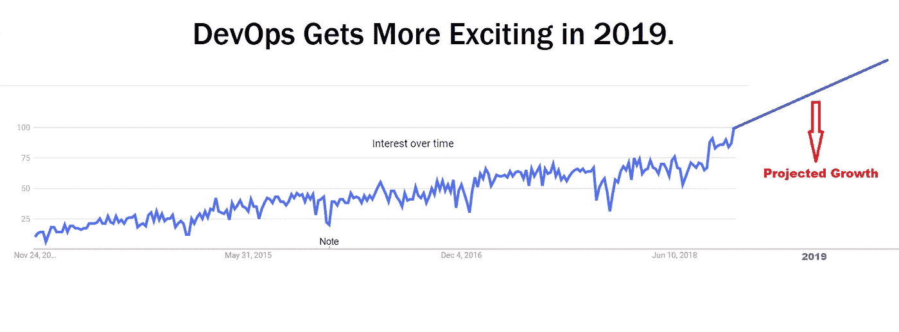
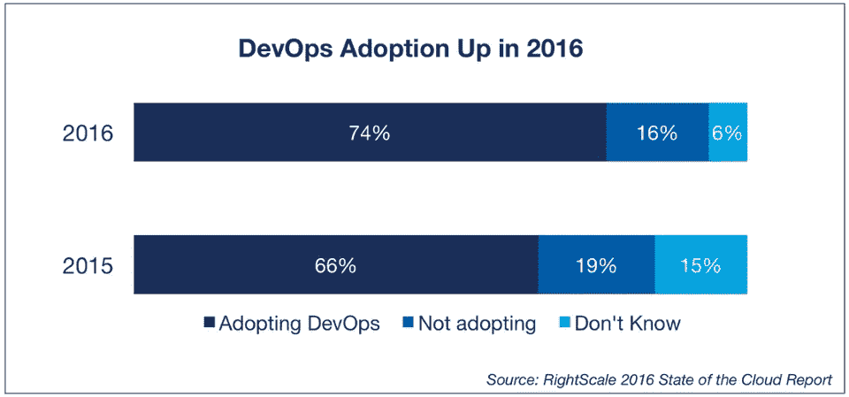
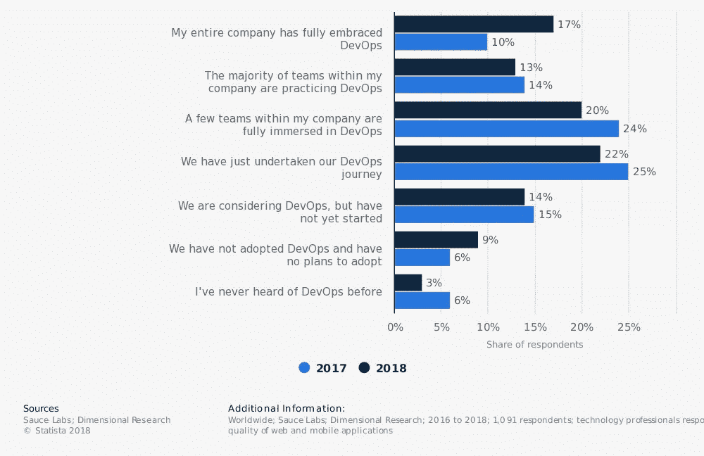
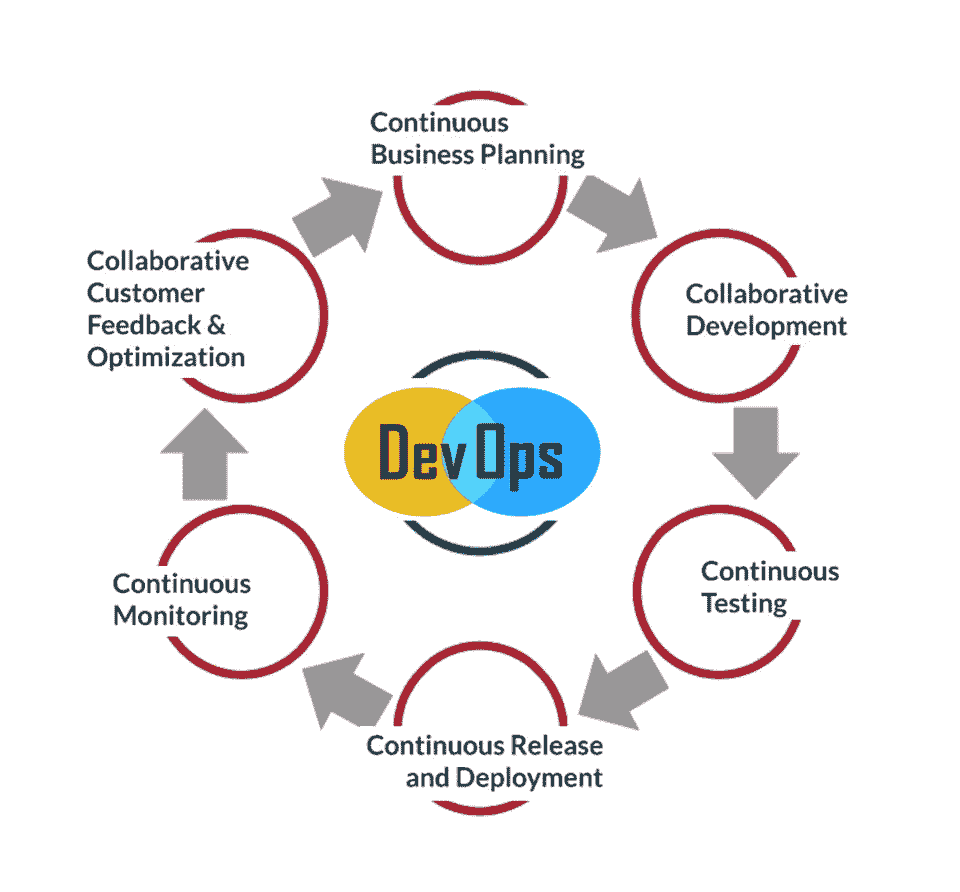
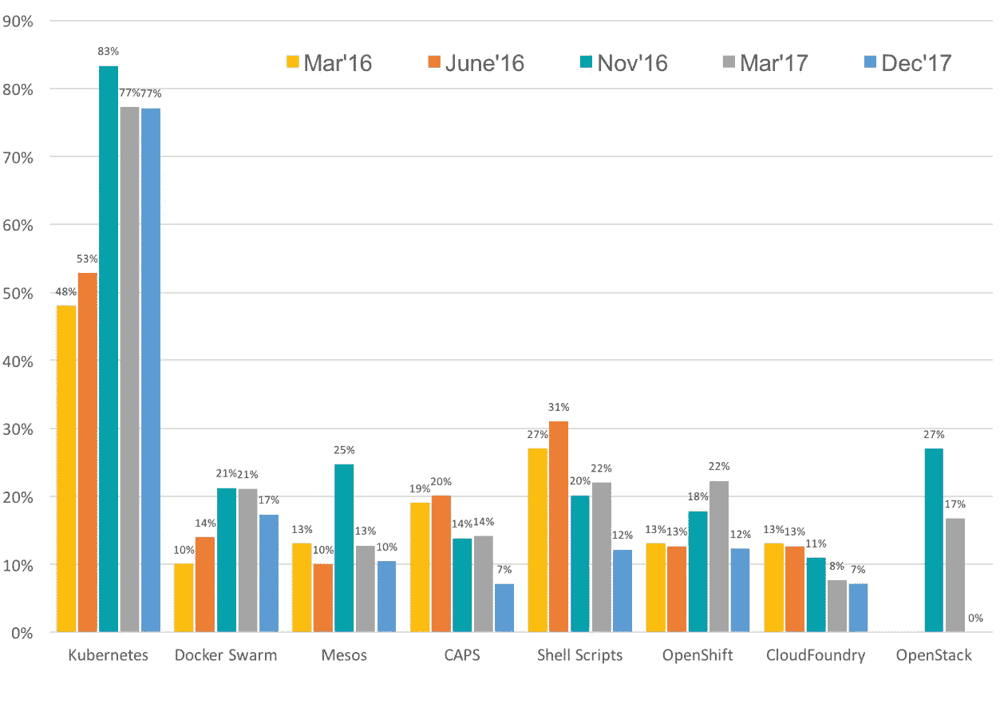
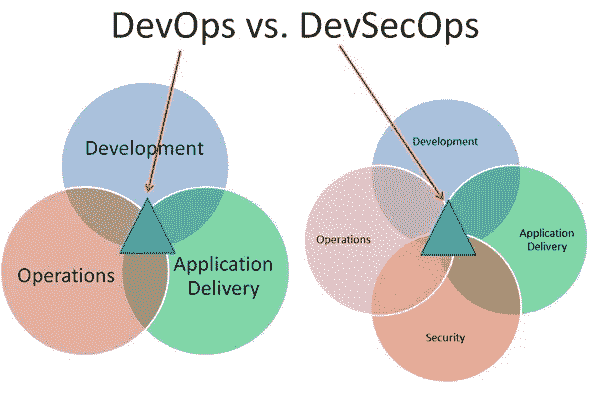

# 2019 年需要注意的 8 个开发运维趋势

> 原文：<https://medium.com/hackernoon/8-devops-trends-to-be-aware-of-in-2019-b4232ac8f351>

## 从微服务到 ML 到 AI 到…

Google Trends

DevOps 已经发展了很长时间，因为我们许多人认为它只是一个时髦的词。现在我们知道这是一个神话。DevOps 已经成为一个主要焦点，并在过去几年中塑造了软件世界。专家表示，DevOps 将成为主流，其受欢迎程度将在 2019 年达到顶峰。

以下是谷歌对“DevOps”一词的趋势以及对其 2019 年预计增长的假设。

Google Trends Showing the ‘DevOps’ Term Growth

说到统计数据，从 2015 年到 2016 年，DevOps 的采用率增加了约 8%，预计这一数字在 2019 年将大幅增长，如上图所示。

Image source: RightScale

根据 Statista 的数据，许多商业组织正在采用 DevOps，与 2017 年的 10%相比，2018 年的增长率高达 17%。

Image source: Statista

通过 [RightScale](https://www.rightscale.com/blog/cloud-industry-insights/new-devops-trends-2016-state-cloud-survey) 可以阅读整个报告。甚至 [Forrester 报告](https://go-forrester.clclp.me/blogs/2018-the-year-of-enterprise-devops)也明确提到 2018 年将是 DevOps 年。

我最近在[发表的关于 DevOps](https://www.linkedin.com/pulse/10-facts-stats-every-devops-enthusiast-must-know-pavan-belagatti-/) 的事实和统计的文章在 DevOps 爱好者中获得了巨大的反响，这表明许多技术传播者有兴趣了解更多并在他们的组织中实现 DevOps。

**今天，我们将看到塑造 DevOps 未来的五大事实。**

# 1.重心从 CI 管道向 DevOps 装配线的转移

管道向您展示了从源代码控制到生产的应用程序的完整可视化。你可以在一个单一的窗格中看到一切。现在不仅仅是做 CI，还有 CD(持续交付)；组织正在投入他们的时间和精力去理解更多关于自动化他们的完整软件开发过程。2019 年，这种转变将从 CI 管道转变为 [DevOps 装配线](http://blog.shippable.com/the-difference-between-ci-pipelines-and-devops-assembly-lines-0)。

# 2.自动化将成为主要焦点

在 DevOps 中，我们经常谈论自动化。如果可能的话，零接触自动化是未来的趋势。这并不意味着你必须自动化一切，但如果你必须这样做，那么你应该能够做到这一点。理解 DevOps 周期的 6 C 并确保在这些阶段之间应用自动化是关键，这将是 2019 年的主要目标。

Image: 6 C’s of DevOps Life Cycle

# 3.测试人员应该学习编码

在 DevOps 中，非常需要知道如何编码和自动化脚本来测试各种情况的测试人员。如果你是一名测试人员，在是否学习编码的问题上进退两难，我们建议学习编码。了解不同的 DevOps 工具和自动化脚本在当今的软件开发中起着至关重要的作用，这将在 2019 年占据主导地位。

如果测试人员不学习编码和编写他们自己的自动化测试脚本，他们将会灭亡。人工测试将在 2019 年过时，并且会消耗大量时间。测试的自动化不仅提高了效率，还确保了特性更快地投放市场。

# 4.微服务架构的采用增加

开发运维与微服务最近携手并进。微服务是独立的实体，因此不会产生任何依赖性，也不会在出现问题时破坏其他系统。微服务架构可帮助公司轻松进行部署和添加新功能。公司有望转向微服务架构，以提高运行时间和交付效率。不要因为别人采用了微服务架构就跟随他们，要了解自己并理解[为什么你应该采用微服务架构](https://dzone.com/articles/reasons-to-shift-to-microservices-architecture)。

# 5.预计会有更多的公司选择企业版

有许多公司仍然处于是建还是买的两难境地。但是，我们建议您做您最擅长的事情，并根据您的需求购买工具。这不仅有助于您专注于您的目标，而且通过完全依赖第三方平台来提高生产力。许多公司现在都在寻求企业版本，以获得自己的基础设施，并确保安全尽可能掌握在最好的手中。

# 6.Kubernetes 将会有很大的发展

Kubernetes 已经成为发展最快的容器技术，因为它的产品和易用性。Kubernetes 围绕它建立了一个很棒的开源社区。在世界各地，许多首席信息官和技术专家已经开始使用 Kubernetes，预计它将在 2019 年得到发展。

最近，在 [KubeCon + CloudNativeCon 北美](https://events.linuxfoundation.org/events/kubecon-cloudnativecon-north-america-2018/)(2017 年 12 月 6 日至 8 日)之前，云计算原生计算基金会进行了一项调查，并分享了容器编排格局如何变化并向 Kubernetes 发展。

*Source:* [*The Container Orchestration Landscape is Changing*](https://www.cncf.io/blog/2017/12/06/cloud-native-technologies-scaling-production-applications/)*.*

# 7.安全性将成为主要焦点— DevSecOps

[CICD 管道](https://www.youtube.com/watch?time_continue=4&v=j26OFEMlUm4)使得每天快速变化以满足客户需求成为可能。CI/CD 管道也可以自动化，因此安全性必须成为当今的设计约束。从一开始就考虑安全性就要求将安全性嵌入软件中，而不是附加在软件上，安全性不再是一个附加物。

最近，我们看到了 [DevSecOps](https://www.redhat.com/en/topics/devops/what-is-devsecops) 的兴起趋势，DevSecOps 是关于在应用程序开发的生命周期中首先注入安全性，从而减少漏洞，使安全性更接近 IT 和业务目标。这种模式假设每个人都对安全负责，因此减少了关于谁做了什么和什么出了问题的噪音和困境。

虽然开发运维与安全性应该携手并进，但确保您的开发人员在整个软件开发过程中使用相同的依赖项、环境和软件包是必须的，因此[让一个工件库经理就位是非常关键的](https://jfrog.com/artifactory/)。

Image: Difference between DevOps & DevSecOps

# 8.AI & ML 将促进 DevOps 的发展

AI 和 ML 非常适合 DevOps 文化。他们可以处理大量的信息，并帮助执行琐碎的任务，使 IT 人员能够从事更有针对性的工作。他们可以学习模式，预测问题并提出解决方案。如果 DevOps 的目标是统一开发和运营，那么 AI 和 ML 可以消除过去导致这两个学科分裂的一些紧张关系。(来源—[DevOps.Com](https://devops.com/6-ways-ai-and-ml-will-change-devops-for-the-better/))

## 不太远，[到 2020 年，每个公司都将成为 DevOps 公司](https://jfrog.com/blog/how-devops-empowers-maslows-hierarchy-of-needs-2-0/)