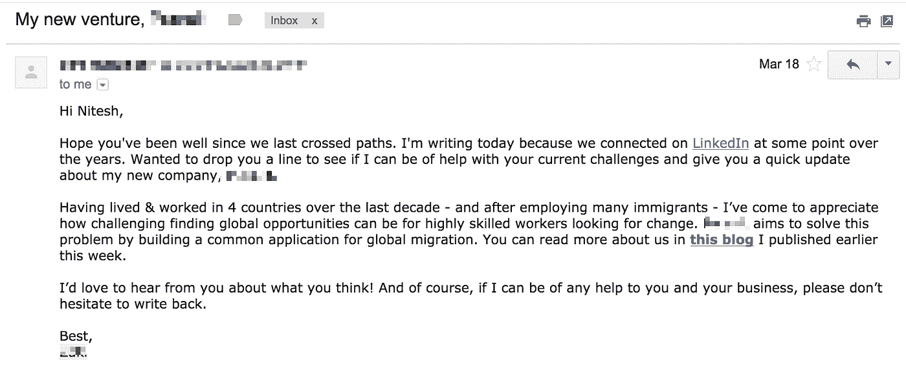
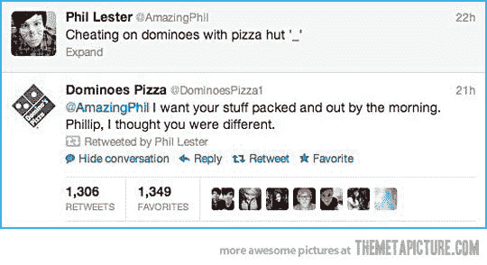
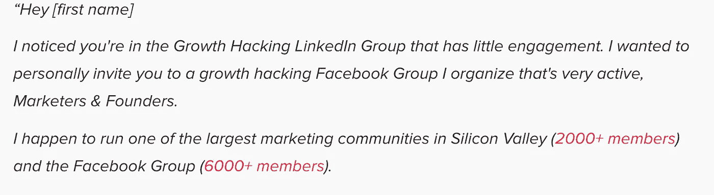
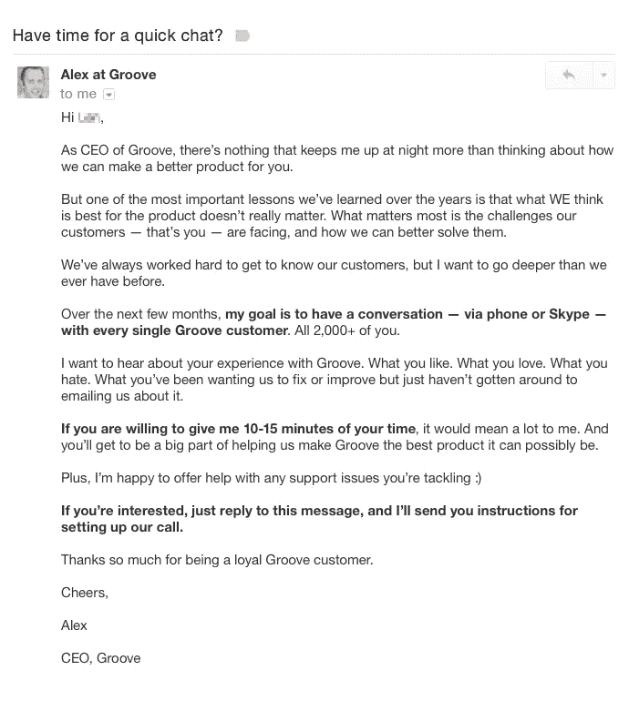
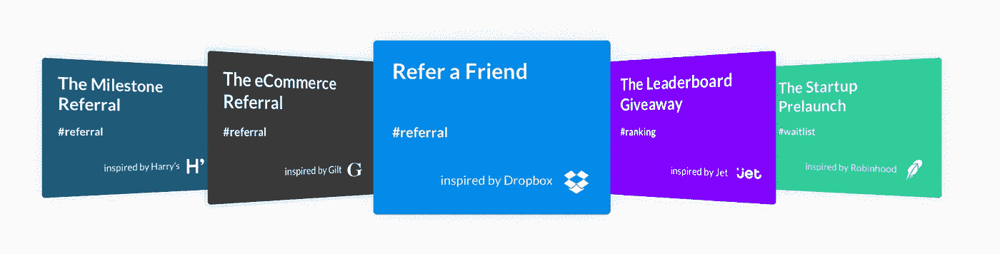
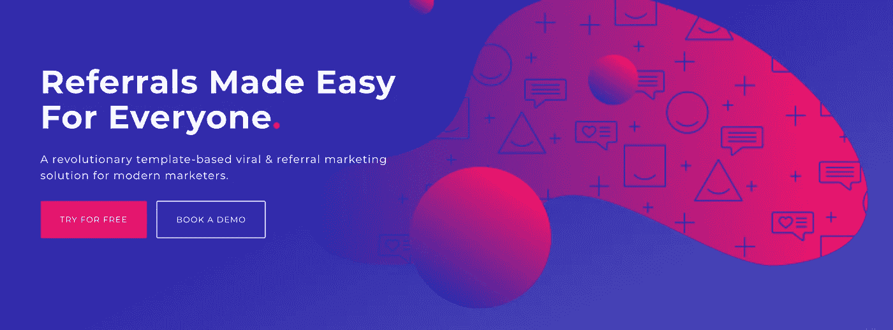
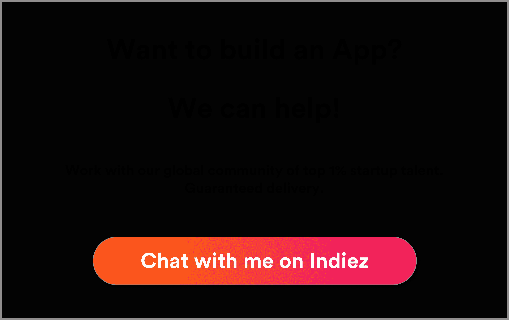

# 给非科技创业者的 8 个简单而惊人的成长技巧

> 原文：<https://medium.com/hackernoon/8-easy-and-amazing-growth-hacking-tips-for-non-tech-founders-e5b89d8828ca>

最好的部分——不需要编码，而且是免费的。

在 [Indiez](http://www.indiez.io?utm_source=Blog&utm_medium=medium_top&utm_campaign=growthhacks&utm_content=non_tech) 大会上，我们与 600 多名非科技公司的创始人交谈过，并与其中 100 多人有过密切的合作。我们知道一个事实，90%的创业失败是因为糟糕的[营销](https://hackernoon.com/tagged/marketing)。即使是最好的产品也失败了，因为他们无法接触到他们的用户。没有用户，没有增长，没有增长就是失败。

首先，对一个企业家来说，最重要的是努力。**好好干，坚持不懈地干。相信你所做的事情。这是一段艰难的旅程，每天都有很多学习和不学习。**

在你开始成长之前，确保你已经检查了这些东西

*   伟大的产品✅
*   产品✅中没有缺陷
*   你知道谁会成为你的潜在用户吗，✅
*   产品不是漏桶。✅

最重要的是，你必须知道如何讲述一个与你的潜在用户相关的精彩故事。

Indiez 社区已经为全球超过 200 家公司开发了令人惊叹的产品，因此我们看到了无法成长的创业公司，我们对此深恶痛绝！

因此，作为一种帮助，我们帮助了 10 多家初创公司进行增长型营销。令人惊讶的是，一些黑客在一天之内获得了 1000 个用户，而一些甚至连 1 个都没有。我们决定分享一些我们来之不易的知识，我们相信这些知识会让你受益。你不必是一个技术人员来执行这些技术。你只需要像一个真正的企业家一样努力工作。

以下是我们的一些经验:

# **获得第一批 100 名用户—**

# 首先联系你的联系人

你已经有了一个**免费的**选项来初步建立你的客户群——你认识的或者以前接触过的人。在你发布之前，在 Whatsapp、iMessage 或你使用的任何信息服务上创建一条群发消息，简单地告知他们你正在开发的项目，寻求帮助、建议，以及他们是否能就你的产品给你反馈。

Linkedin 上的人脉？脸书的朋友？每个人都有！你可以通过不同的方法下载他们的电子邮件地址。

通过[这个有用的页面导出您的 Linkedin 联系人。](https://www.linkedin.com/help/linkedin/answer/66844/exporting-connections-from-linkedin?lang=en)

通过[这个有用的页面导出您的脸书联系人。](http://www.idownloadblog.com/2018/01/31/how-to-export-facebook-contacts/)

如果你在这方面有任何困难，我们愿意帮助你，只要在这里联系[就可以了。](mailto:robert@indiez.io)

这是我从一个朋友那里收到的邮件的一个例子，他正在创建他的新公司。

# **在线社区——开始你自己的网络集体农场！**

确定你的目标用户，并在你的产品发布之前**接触他们！**

基于云计算的 SaaS 创业公司 Basecamp 就是一个很好的例子。在他们推出 Basecamp 之前，他们通过博客“信号与噪音对比”拥有多达 50，000 名粉丝这个内置的社区帮助 Basecamp 的推出取得了成功。Ryan Hoover，产品搜索的创始人，在他开始产品搜索之前有一个巨大的邮件列表。

***那么从哪里开始呢？***

社交活动正成为“让你的名字出现在那里”的关键，你甚至可以遇到专业人士，他们会帮助你，并为你介绍宝贵的联系人。这曾经是一种昂贵的社区建设形式，但我们看到像 MeetUp 和 EventBrite 这样的网站有时会为免费的 T21 网络和学习机会提供一个平台。

这些活动还将为您提供电子邮件、名片和机会，以跟进您通过参加活动创造的销售线索。

创业世界中的事件是冲突，但这不应该让你放弃，你甚至可以做一些古怪和原创的事情来确保你被记住！制作独特的名片真的可以做到这一点，[就连乐高也为员工制作特殊的个人形象，在活动中分发，让他们成为被记住的最佳对象。](https://mashable.com/2013/05/16/crazy-business-cards/?europe=true)

# **增加你的社交媒体游戏**

Twitter、Instagram、脸书——我们每个人都有，企业也有！它们是公司发展社区的有力工具，通过使用相关的#它将带你走上获得牵引力的道路。每天查看什么是*趋势*，看看你是否能从这些标签中关注你的推文。

从今天开始，社交媒体将成为你未来业务的核心。有数不清的机会让你了解如何开展业务以及如何在网上互动。

你甚至可以试着厚脸皮，通过机智的评论引起注意，但要始终小心，因为社交媒体是你品牌的“声音”。

***我们将加入社区但是我们去哪里呢？！***

你需要创建一个登陆页面，这比你想象的要容易得多，像 I[instapage](https://instapage.com/)、 [Wix](http://www.wix.com) 和 [Squarespace](http://www.squarespace.com) 这样的工具可以给你一个创建用户友好的相关页面的平台。你掌控着一切，可以随心所欲地做出改变，许多公司在开展业务的第一年都会定期改变网站和内容。

# **从 100 名用户增长到 1000 名用户🌱**

*我如何保持成长？*

现在你有了相关和不相关业务联系人的数据库，你可以使用 [MailChimp](https://mailchimp.com/) 等工具向你从 Linkedin、Gmail、Icloud 等网站下载的联系人发送有趣、有用的电子邮件。如果你给家人和朋友发了一条类似的短信，你应该会收到回复。在这个阶段，不要试图向社区推销，而是寻求帮助、反馈和建议。

你也可以从其他相关社区建立自己的社区。如果你加入他们，你可以看到类似的业务在做什么。另外，你会有引人入胜的讨论，分享出色的见解，并因你在该领域的渊博知识而闻名。如果你在其他社区做得好，你将获得稳固的声誉，人们自然会想更多地了解你。我喜欢乔希·费彻如何建立一个稳固的社区。

> 记住，相关性是关键🔑

谷歌你的竞争对手，搜索他们的社交媒体，了解他们在做什么，然后继续做得更好！

# 社区精神:每个用户都很重要。

每次有人加入您的社区时，让他们感受到这一点，并亲自与他们交谈:

*   自我介绍
*   向他们致以友好的问候
*   了解他们在你的社区中的经历
*   试着和他们安排一个电话！
*   为他们提供一次永生难忘的“入职”体验！

看看 Groove 创始人 Alex 发来的邮件。

这为你提供了一个极好的机会，让你充分了解社区的每一个成员。他们会觉得自己很特别，因为他们知道自己是“少数精英”中的一员，而你的竞争对手将很难发现你的独创性产品。

现在是你旅程中最困难的部分……推出产品后，将您的社区从 100 个增加到 1000 个。

继续在社交媒体上迭代，使用这些免费的有机渠道，因为它们是一个非常强大的工具。

# **对我，对你，对所有人！推荐很重要！👨‍👩‍👦‍👦**

推荐是最便宜和最简单的方式来继续增长。如果你给你的社区提供一个模板，他们可以很容易地把它发送给他们的朋友和家人，然后他们会把它发送给他们的朋友和家人，这样会一直持续下去！

提供 WordPress 主题的美国公司 Bourn Creative 100%通过推荐建立了他们的社区和客户基础。推荐是免费的，非常重要，你的产品是值得的，这就是为什么你创立了你的公司，其他人会分享相同的愿景。你可以使用像[病毒循环](http://viral-loops.com)这样的产品，启动 Rock 来建立一个独特的推荐[营销](https://hackernoon.com/tagged/marketinghttps://hackernoon.com/tagged/marketing)活动。

www.viral-loops.com

# **不要满足于没有内容！😌**

身体力行！我们创造内容，比如这篇文章，因为我们相信我们的读者，比如你，会从我们的故事中受益。

内容创作需要创造力，这将自然而然地发生在你身上，你已经创造了你的产品，这种激情将通过你在博客上讲述的任何故事来传达。它必须是真诚的，诚实的，发自内心的，这就是我们为你创建这个内容的确切原因，因为我们真的想以最简单的方式帮助你成长！

你原来的社区会很乐意为你分享这篇文章，请他们在他们的各种社交媒体平台上“转发”、“鼓掌”、“分享”和“喜欢”，你的社区就会有机地增长。

保持一致！如果你向你的社区提供频繁的内容，他们分享，追随者自然会来。**质量比数量更重要**正是质量会让一篇帖子变得‘病毒式’传播。坚持下面的内容流程:

更多的内容并不等于更好的内容，这一点再怎么强调也不为过。内容需要由可靠的产品研究、受众验证、竞争知识、高效的工作流程和核心战略声明来支持。 [UXPlanet 最近发布了](https://uxplanet.org/content-strategy-for-startups-the-complete-guide-554e44675f60)一篇有趣的博客，讲述如何从你的内容策略中获得最大收益，以及如何完美地实施它。

一旦你创建了你的博客文章，用相关标签将它们上传到[媒体](/)上。许多用户会搜索不同的文章来阅读，如果你已经让你的社区在 medium 上“鼓掌”你的文章，它将获得正确的观众的关注。

另一个有趣的平台是 [Quora](https://www.quora.com/) ，在这里，全球的人们可以询问任何事情！

搜索和识别相关问题，并提供这些答案。你可以用你所在领域的一个问题，给自己一个机会，让合适的人去看你的产品。

# **#社交媒体 GOALZ #️⃣**

现在你的社区在不断扩大，你提供有趣的内容，使用你的社交媒体渠道，做一些小预算的广告活动。脸书甚至为此向新企业提供免费信贷。访问你的分析将保证你接触到正确类型的人。

一个真正被低估的社交媒体工具是 [**Reddit**](https://www.reddit.com/) ，它拥有数百万日常用户，他们定期讨论适合自己的话题。如果你很活跃，经常在上面发帖，你会引起 reddit 用户的讨论，他们会推荐并告诉他们的朋友。你越积极，讨论就会越多。甚至有机会创建不同语言的 reddit 讨论，并确保您拥有真正的全球影响力！

影响者存在于所有的社交媒体平台，而不仅仅是 YouTube。伸出手，找到他们，给他们发邮件，介绍你自己和你的产品，他们甚至可能免费推广它。影响者的一次转发就能为你的企业赢得成千上万的新关注者。

所有类型的企业都采用社交媒体策略， [target internet](https://www.targetinternet.com/5-examples-of-incredible-social-media-community-management/) 给出了一些成功企业以最高质量管理其社交媒体的例子。

# **4–4–2，5–3–2，部署其他战术。🏅**

借助[对讲机](https://www.intercom.com/)等工具在游戏中领先一步，尤其是在你已经发布了你的产品之后。它让你可以在你的网站、社交媒体等平台上与你的客户直接互动。使用它将为任何希望自己的问题得到解答的人提供极好的体验，并且它还提供了“个人接触”。

[New Relic](https://newrelic.com/) 使用对讲机，因为他们想要关于新功能的有用反馈。他们决定使用 Intercom 来锁定该功能的高级用户，并将其发送到他们的收件箱中，这样就不会造成干扰，而不是向整个数据库发送调查。结果是 21%的人提供了反馈，比他们通常采用的策略增加了 2.5%。

你的产品和社区现在正以持续而有价值的速度增长。

你是一名非技术型创始人，我们希望你现在意识到，“增长黑客”不是一个可怕的词，它纯粹是一种从一开始就让你的业务增长的方式。

这篇文章是我们认为应该做什么的建议，但实际上，增长黑客正在尝试和测试。

您不必做本文中提到的所有事情，但是您需要:

*   **找到适合你和你的产品的产品**
*   **一旦发现，重复并缩放**
*   **不断迭代改进**
*   **保持信念、勤奋和坚持**

# **永远不要失去信心。🙏**

如果你竭尽所能去尝试和成长，那么如果你没有获得用户或牵引力，你永远不会受到责备。问题可能出在市场或产品本身，这就是为什么反馈阶段对成功至关重要。读一读这篇[保罗·格拉厄姆的文章——做出用户想要的东西](http://www.paulgraham.com/good.html),了解人们在寻找什么。

你可以通过[陈楚翔的博客](https://andrewchen.co/)、[布莱恩的博客](https://brianbalfour.com/)和[乔希·费彻的电子书了解一些关于成长的基本知识。](https://www.producthunt.com/posts/bamf-bible-2018)

## 让我们建造令人敬畏的。🙌

## 启动？好好做！加入 100 多位与 Indiez 一起打造成功产品的了不起的创始人。

## [在这里了解我们更多— Indiez.io](http://www.indiez.io/?utm_source=Blog&utm_medium=medium_bottom_inline_link&utm_term=serial_entrepeneurs)

如果你喜欢读这篇文章，你可以看看我们的其他文章:

 [## 我从最成功的非科技创业者身上学到的 9 件事

### 提示:这与你的编码技能无关。

hackernoon.com](https://hackernoon.com/9-things-that-i-learnt-from-the-most-successful-non-tech-founders-9525efd27163)  [## 7 分钟阅读，为您的应用创意节省 100，000 美元。

### 我喜欢创始人。我喜欢他们带给这个世界的能量。我喜欢他们如何找到商业问题来解决…

hackernoon.com](https://hackernoon.com/7-minute-read-to-save-100-000-on-your-app-idea-2d17db675a1)