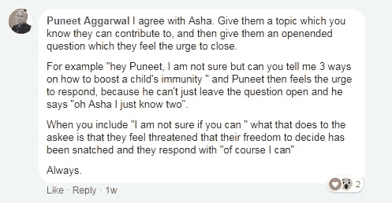

# 8 位专家的黑客创造了数不清的用户生成内容

> 原文：<https://medium.com/hackernoon/8-experts-hacks-to-generate-zillions-of-ugc-roundup-post-f1f203e9a4ef>

## 你还在为你的品牌制作用户生成的内容吗？不知道如何让你的用户创建它？

不要再失望了。我们的社区专家分享了一些技巧，通过这些技巧你可以很容易地获得 UGC 的社区参与。

UGC

**什么是 UGC？**

用户生成内容是品牌的粉丝/社区的成员/你平台的用户生成的内容，不包含任何金钱上的东西。它可以是任何形式，例如图像、视频、推文、信息图、评论、博客、广告、状态更新等。

根据 Reevoo 进行的一项研究，如今，如果广告包含用户生成的内容，人们会更多地与品牌联系在一起。

Source: Reevoo

> **UGC 有助于获得客户的信任，建立与客户的关系。**

Source: SalesForce

因此，为了更好地理解它，这个话题由我们社区上的[**Asha chaud hry**](https://www.facebook.com/asha.chaudhry?fref=gc&dti=1680349932274080&hc_location=ufi)**和社区专家分享了他们的学习。**

**在继续之前，我们先来了解一下如何按照[**Arbab us mani**](https://www.facebook.com/arbabusmani?fref=gc&dti=1680349932274080)**对我们社区的用户进行分类。****

**基本上，有四种类型的用户**

*   ****死了还是睡了****
*   ****支持者/管理员/志愿者****
*   ****参与人** —参与内容和我们的 UGC 目标的人**
*   ****推送者** —谁已经生成了内容**

**现在，关于这些用户，让我们学习一下社区专家给出的获取 UGC 的前 8 招**

1.  **我们可以无耻地要求参与者发布他们想要的东西。问的力量是社区经理生活中最强大的东西之一，问他们，把他们变成推动者。**【By-Arbab us mani】**
    据**阿莎**介绍，给他们发一个与他们专业领域相关的话题，有助于人们更好地表达自己。他们所有的学习都可以放在一个博客里，并向公众反馈。她称之为 **#WisdomoftheCrowd****

****

**By- [Puneet Aggrawal](https://www.facebook.com/Ayurvedic?fref=gm&dti=1680349932274080&hc_location=group)**

****2。用户努力的满足感** -认可你的成员的努力，建立对品牌的强大关系和联系。这可以通过直接的提示，满足重要的参与指标，如帖子、图片、回答等**【By-**[**Priya Sood**](https://www.facebook.com/priya.sood.9028?fref=gm&dti=1680349932274080&hc_location=group)**

****在时事通讯中特别提及顶级内容创作者，并分享他们文章的链接，是庆祝 UGC 的有效方式。给每周最佳贡献者一个特殊的徽章之类的虚拟奖励对 Asha 来说一直很有效。****

****下面是对我们社区的贡献者大声喊出来的例子。****

********

******Leaderboard******

******3。专家总结**——如果一个话题是由专家发起的，就更容易得到讨论。他总结了一个主题，这就从最好的东西中带出最好的东西。**【By-****Paras Pundir】******

****Anuj 说的是，任何能让一个人得到公众认可的事情都会有效果。例如，**“你会如何……”**向会员提出问题，并把他们中的佼佼者列入综述帖子和竞赛中，通常会让他们努力思考。下面是我们的博客，它是通过他的黑客技术开发的。****

********

****[http://bit.ly/BrandGrowthBlog](http://bit.ly/BrandGrowthBlog)****

******4。竞赛和赠品** -这适用于以下两种情况:****

****在节目过程中，要求演讲者在节目快结束时宣布他们所能选出的最佳问题的奖励，激励人们提出好的问题。****

****另一件可以做的事情是举办一场竞赛，让他们回答问题或提交参赛作品。一个小令牌总是有助于让我们的成员创造内容。**【By-】**[**Jatin chaud hry**](https://www.facebook.com/jatin10?fref=gm&dti=1680349932274080&hc_location=group)****

******在线竞赛有助于吸引更多的观众。竞赛是间接对话的一种方式。人们倾向于对包含奖品和赠品的竞赛做出反应。******

************

*******By- Jeremydavidson*******

*   ********标记社区中有影响力的人**——人们追随他人，尝试适应他们生活中的好品质。因此，针对社区中多个受尊敬的成员首先进行分享是一种很好的黑客技术。通常情况下，这会让其他人也开始分享。【**By-**[**Kartic Rakhra**](https://www.facebook.com/kartic.rakhra?fref=gm&dti=1680349932274080&hc_location=group)******
*   ********华而不实的用户模板**——人们通常希望在社交媒体平台上的某个地方获得特色或被提及，在那里他们能够分享它，并在他们的圈子中获得可见性。分享一个花哨、漂亮的模板，让他们毫不费力地填写，这是吸引人们的一个很好的方法。它可以像一个现成的帖子/博客。**【By-】**[**普拉尼迪普里**](https://www.facebook.com/pranidhi.puri?fref=search)******

************

********By- YoutQuote********

*   ********增强 UGC 和分享-** 会员提供的内容可以进一步增强为信息图、视频或幻灯片，并与社区分享。这为我们的成员所做的努力增加了价值，使他们感到重要，并鼓励他们分享更多内容。******

********

****Our Last Expert RoundUp****

*   ******瞄准诋毁者**——最后也是最重要的一点，诋毁者是那些不太可能推广品牌的用户。为此，我们试图衡量他们欣赏的事物，并为之创造一个环境。一旦这个用户被你控制住了，他/她就有可能在任何地方谈论这个品牌。虽然，这不会是一个自发的过程，但会产生影响。**【By-】**[**莫希特**](https://www.facebook.com/momahan?fref=gm&dti=1680349932274080&hc_location=group)****

******因此，在这个数字世界，品牌需要根据最新的趋势更新自己。这是他们吸引用户注意力的地方，用户以某种方式推广他们。******

******这些是我们的社区专家分享的一些技巧，将帮助您的品牌获得越来越多的用户生成内容，从而增强您的社区和品牌归属感的本质。******

******我们遗漏了什么重要的地方吗？这是一个社区驱动的博客，如果你有任何最新的黑客攻击，请在评论区添加你的想法，它会在这里更新。******