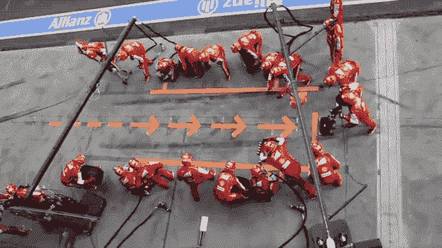
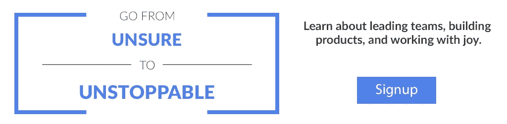
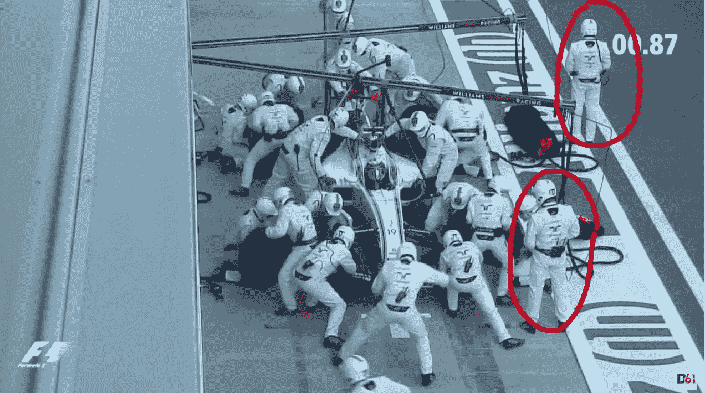

# 产品团队可以从 f1 进站中学到的 9 个教训

> 原文：<https://medium.com/hackernoon/8-lessons-product-teams-can-learn-from-formula-1-pit-stops-a2e23e22f9c>

Ferrari F1 Pitstop [https://youtu.be/aHSUp7msCIE?t=30s](https://youtu.be/aHSUp7msCIE?t=30s)

想让您的产品团队专注于 f1 维修站工作吗？当你停止浪费时间，避免浪费决策，并作为一个产品团队表现出精英水平时，这是很神奇的。

首先，这是一个伟大的 F1 进站的样子(23 个人在 2 秒内换了 4 个轮胎)

Ferrari F1 Pit Stop

令人着迷。虽然产品团队在他们的大部分工作中有更多的可变性，但我从研究 f1 进站中学到了产品团队的关键经验。这些经验说明了为什么[冲刺](https://blog.sprintwell.com/design-sprints/)有助于产品团队以精英水平表现。

# 1.每个人都知道自己的角色

所有的团队成员都知道他们的角色，什么在他们的控制范围内，以及其他人依靠他们做什么。没有人站在那里想知道发生了什么，或者他们可以做些什么。

关键问题:你能描述一下你的角色吗？你对什么负责？

# 2.流动很重要

知道目标，知道过程。这些对于保持心流状态非常重要。与我们大多数人需要换轮胎时的经历相比，完美的进站是流动的——许多尴尬、停顿和疑惑，显然我们不经常这样做，等等。

*关键问题:你哪里不流畅？你能做些什么来更好地进入心流？*

# 3.司机不是明星

这是一个团队作为一个整体运作。支持至关重要。人力资源、IT、市场营销…所有的支持功能对于打造优秀的产品都至关重要。如果一个项目经理或开发人员不得不花半天时间来解决一些福利问题，或者有一个计算机问题因为积压而无法解决，这会影响团队。仅仅因为某人是司机并不意味着其他人对确保一切顺利运行不重要。

*关键问题:你支持你的支持团队吗？*

# 4.在正确的时间专注于正确的事情

实践至关重要。每个人都知道自己的工作，知道需要发生什么。冲刺给你稳定和清晰的过程，让你可以专注于未知。

也就是说，如果你花几个小时发布，你就是在浪费时间。有更好的方法(请阅读 devops 上的任何 post/ [book](https://hackernoon.com/tagged/book) )。就好像你是 50 年代的维修人员一样(见下面的视频)。

*关键问题:你是否在每周或每月发生的流程上浪费时间？*

# 5.优先考虑

“做得更少，做得更好”是我们在 LinkedIn 的口号。说起来容易，做起来很难。伟大的中途停留的一个关键要素是只做几件事。限制你正在做的事情来提高速度和完成目标(回到赛道上)。他们过去常常加油，但现在不再加油了。取消这个步骤是今天 2 秒进站的主要部分。

关键问题:你能停止做什么？

# 6.准备

> *一次有人问一个樵夫:“如果你只有五分钟的时间砍倒一棵树，你会做什么？”他回答说，“我会花前两分钟磨我的斧子。”让我们花几分钟时间来理清我们的思路。*
> 
> *—匿名樵夫(不是亚伯拉罕·林肯)(* [*来源*](https://quoteinvestigator.com/2014/03/29/sharp-axe/) *)*

丰田通过致力于系统而使其系统变得伟大。在基础设施上投入更多时间是关键。这正是 f1 维修站工作人员做得非常好的地方。他们有合适的工具、合适的培训、合适的沟通等。一切都计划好了，调整好了。如果有人说“嘿，我想我知道一个我们可以做得更好的方法”，我相信每个人都会花一秒钟去听。

> 准备不足是最后一刻自私疯狂的糟糕借口。这种狂热让我们无法在下一次把事情做好。”
> 
> [*赛斯·戈丁*](https://seths.blog/2018/06/cold-yeast/)

同样与准备相关的是，伟大的团队使用回顾。最好的回顾是小型的(只有紧密团队的成员),很多时候只有团队，没有领导参加。为什么？你必须让提出瑕疵变得安全。这是一个很难创造的环境。但是做得好的话，会给团队带来有意义的进步。

*关键问题:在表演期间，你可以准备什么来给你力量？*

# 7.让它可视化

管理的主要工作是安全。

Williams Martini F1 Pit Stop [https://www.youtube.com/watch?v=tFwcq5lf0wU](https://www.youtube.com/watch?v=tFwcq5lf0wU)

这些人控制欲很强。前面的工作人员正在看着每个人做他们的工作。他在那里解决任何问题并控制交通灯。这类似于短跑中的决定者——他们控制灯光，并在需要时向团队的其他成员发出信号。

关键问题:你能让目前假定或隐藏的东西变得可见吗？

# 8.知道进化会发生

这段 5 分钟的视频展示了从 50 年代到 2017 年的 13 次 f1 进站。

1950 年，广播员说“只有 67 秒！”令人惊讶的是，今天最好的时代比现在快了 30 多倍。随着时间的推移，性能提高了 30 倍，这看起来很疯狂，但这就是马克·扎克伯格所说的最好的工程师。

> “在工作中出类拔萃的人不仅仅比优秀的人强一点点。他们好 100 倍。”([纽约时报](https://www.nytimes.com/2011/05/18/technology/18talent.html?_r=2&ref=todayspaper))

马克·安德森指出了类似的东西—

> “一个高产的人能做的和一个普通人能做的差距越来越大。五个伟大的程序员完全可以胜过一千个平庸的程序员。”( [HBR](https://hbr.org/2011/06/great-people-are-overrated)

虽然今天有些事情看起来很棒，但仍有重大突破需要实现。20 年后，我们会回顾今天有多少产品团队在运作，并嘲笑它们的笨拙。今天最好的产品团队已经在效率和有效性方面取得了指数级的收益。

这就是为什么成长心态是关键。如果我们固定在我们能做什么的想法上，我们可能会停在 67 秒的休息站，认为我们很棒。不要停止改进。

*关键问题:有没有你已经做得很好的事情，你可以进一步改进？*

# 9.失败令人痛苦

这是做得不好时的样子。

对于产品团队来说，我们必须小心谈论失败。即使是精英团队，大多数产品创意也不会创造出你想要的结果。当结合健康的学习和测试文化时，你实际上想要一个体面的失败率。这意味着你越来越接近知道什么是有效的。

你想在产品团队中避免的失败是过程的失败。并不是说一个想法不起作用。但是执行的很差。坚持一个小小的过程，可以消除没有清晰的问题陈述、没有在过程中尽早涉及所有功能、得到自上而下的法令来构建“已经被审查”的东西或者解决方案太早的笨拙。

最后再看一眼做得好的话会是什么样

*关键问题:流程失败会给你的团队带来什么损失？*

当你停止浪费时间和决策，并作为一个产品团队表现出精英水平时，这是不可思议的。希望这些问题对你和你的团队有帮助。

如果你真的想研究这个，看看这个维修站的详细情况—

最初发表于 [Sprintwell](https://blog.sprintwell.com/9-lessons-product-teams-can-learn-from-formula-1-pit-stops/)

加入[我的时事通讯](https://ryanseamons.com/)，在那里我会分享一些实用的链接和我所了解到的关于产品和育儿的建议。也可以在 LinkedIn 或 Twitter 上向我问好。