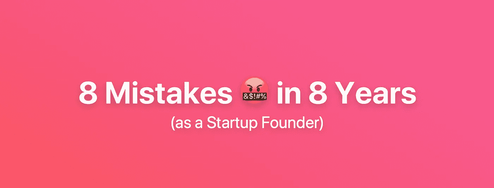
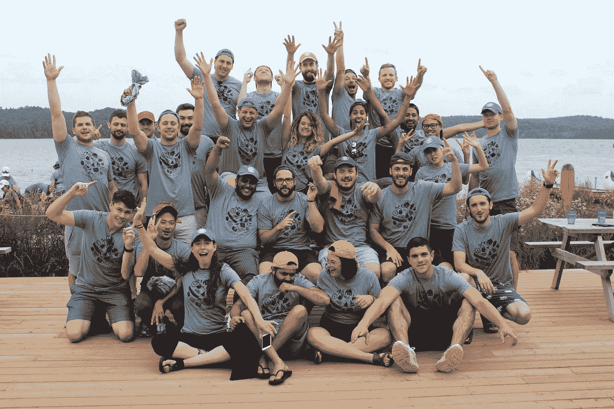
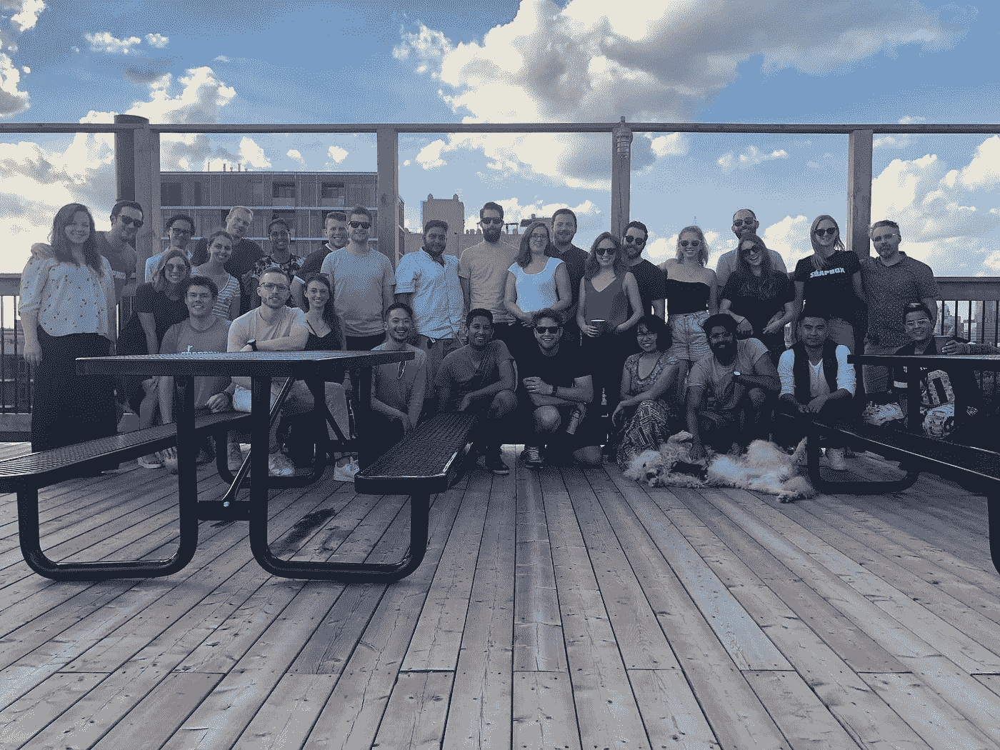

# 我们在公司的前 8 年犯下的 8 个错误

> 原文：<https://medium.com/hackernoon/8-mistakes-we-made-in-our-companys-first-8-years-3d38422333b>

## 是的，我们仍然是一家初创公司。

当你第一次开始时，一切都是错误的。一切都是失败，生活糟透了。但是，错误实际上是个人的天赐之物，因为你可以从中学习。你克服挑战。你创造了更好的东西或服务，因为你犯的错误帮助了你成长。

今年夏天早些时候， [SoapBox](https://soapboxhq.com/) 庆祝了它的第八个生日——尽管，因为这些错误，我们不得不重启公司。因此，这里是我们在创业的前八年犯的八个错误。😖

# **1。我们发明了。我们没有创新。哎呀。再也不会了。**

人们想要发明一些东西。我们想发明一些东西。但事实上，很少有东西真的被发明出来。为了实际的、真实的生活，为了全新的*发明*起飞，许多事情需要走上正轨。

看着你的手可能正在悬停的键盘。移位键被称为“shift ”,因为自 1878 年以来，打字机会物理地移动寄存器。然而，它仍然在我们 2018 年 iPhone X 的虚拟键盘中，因为人们不喜欢改变。你不能告诉世界要有一个新的键盘。

Me. Using a Dell. 🤮A long time ago

八年前，我们开始[重塑员工反馈](https://soapboxhq.com)——通过发明一个新的数字建议箱。但六年后，尽管我们有了收入，我们意识到我们真正需要做的是创新反馈在工作场所的流动方式。而不是重新发明。让它变得更好。让它更快，更容易，更酷，一步一步来。

那时，我们改进了产品。我们专注于人们每天经历的核心问题。这就是我们试图解决的问题，而不是建造一个我们想在世界上推出的很酷的新东西。这就是你今天看到的肥皂盒:在工作中获得 10 倍的反馈。简单。容易被人们接受。给了我们一个发明的基础。

# **2。销售驱动，而不是产品驱动。**

**也就是说，我们试图创造一个成品，并过早地关注增长。**

这听起来可能有点争议。当我们开始时，我们是自举式的，所以这迫使我们在产品和销售上快速前进。我认为这很聪明也很好。

一旦我们有了工作，我们就在跑道上获得了喘息的空间，但我们没有利用这个空间并在产品概念上进行更深的投资，而是在收入上花了更多的钱。我们专注于推动销售和单位经济。回过头来看，我们为时过早。[应该听过](https://www.outseta.com/posts/customer-success-unit-economics-then-growth)。

通过关注更大的合同，我们需要更大规模的产品。然后，进一步推进，我们出售多年合同，以增加我们的 LTV。

问题是，我们要花两到三年的时间才能真正发现我们的产品是否能留住大客户。我们花了很多年才真正发现我们是否做得很好。

换句话说，如果你看一下保留曲线，我们几乎只关注 365 天及以上的保留。那是一个愚蠢的错误。

因为在你专注于长期记忆之前，在你专注于 14 天记忆之前，你需要专注于前五分钟。创造惊人的登机体验。甚至更小——为您的入职计划迈出令人惊叹的第一步。并不断重复，直到有 90%的人留下来。然后移到第一天。然后第一周。

常见的类比是，一个伟大的 SaaS 产品是一个桶。你的客户群是水。营销把水倒进去了，目标是尽可能多地留住这些水。我们试图堵住桶上的几个小洞——尽管整个桶底都不见了。当没有水到达这些小洞时，关注这些小洞是没有意义的。

我说的是无情的优先考虑你的产品。不要只关注成长。不要专注于经济学。在最初的五分钟里，集中精力获得最大的记忆——然后从那里开始。

这听起来不是显而易见就是愚蠢。开始就开始，开始就失败。学习，迭代，再尝试。不要在 365 天后才知道你需要 x%的采用率才能留住企业客户。太晚了。

产品驱动型公司的重点是更快反馈周期的策略——通常这意味着更小的、早期采用者类型的公司，因为他们可以更快地做出决策并给出反馈。销售驱动型公司的重点是增加订单，通常是更大、更慢、更大的交易。

# **3。与人一起缩放**

作为一家白手起家的公司，我们一直在追逐金钱。我们建立了一个销售团队，该团队不断寻找线索，并通过销售漏斗转移潜在客户。部分是因为这是我们作为联合创始人所做的，部分是因为这种暴力方法奏效了:偶尔，我们会有所收获，然后兑现支票。支付工资。然后我们会重新开始整个过程。

但是，为了增长，我们不得不派出销售人员来解决这个问题。为了实现销售，我们的团队会花时间定制与每个销售线索相关的推介。最终，这将导致每个客户的不同期望…这意味着我们的开发团队忙于为每个客户微调产品，以至于他们没有时间实际制作一些*神奇的*。而且，我们的营销团队找不到足够一致的主题来扩展...所以我们依赖更多的销售人员

开始时，你甚至不会注意到这是个问题，因为感觉很棒。它得到了巨大的反响。人们问:“你的团队有多大？”而且一直说大数感觉很好。

我们认为拥有 500 名员工的公司比拥有 50 或 5 名员工的公司更酷或更成功。也许吧。但这只是故事的一半。哪个更酷:10 美元的 1B 公司和 1000 美元的 1B 公司？我对那个 10 人公司超级好奇。他们究竟是怎么做到的？

我刚和一家有兴趣收购整个公司的公司通了电话。他们是一个古老的学校生意。5 亿收入和 23 个人。😳

在今天的技术中，你肯定想用电而不是人来扩展你的业务。让你的人想出怎么做。

# **4。一个杀手级的招聘过程…有点太晚了**

这就是几年前世界是如何在我头上崩溃的。

因为作为一家初创公司，做任何事情都像是安装一台大型的鲁比·戈德堡链式反应机器。要获得收入，你需要客户。要获得客户，你需要线索。要获得线索，你需要销售人员。因此，如果你从未来几年的收入目标开始，你所要做的就是向后工作，了解你的转换指标，你会意识到… *废话*，*为了在未来 12 到 18 个月内达到这个数字，我现在需要招聘人员。*

好吧——那就和你的董事会谈谈。锁定你的收入目标。锁定招聘目标。

然后奇怪的事情发生了。

这两件事成为董事会文件包中的独立幻灯片，成为不同人的不同职责。突然间，人们忘记了你的公司是一台无形的互联机器，它变成了一些需要完成的任务。

因此，你每天早上都要推进交易，在一天结束时发送一些招聘电子邮件。还有…哎呀！雇佣那个代表要多花一周时间，下一个要多花两周时间。那么你会比预期多花六个月的时间来雇佣这个团队。

然后嘣💥你完蛋了。突然间，你错过了你的收入目标。但你还不知道。

几个季度后，一旦你的团队完全壮大，我敢打赌你在谈论裁员。

为什么？因为我认为我可以自己招聘，因为我没有制定招聘流程，所以我们花了太长时间招聘，这使得我们无法达到销售目标。因为我们没有达到销售目标，我们没有生存下去所需的现金流，结果我不得不在一天之内解雇了六名销售代表。

很多创业公司都经历了完全相同的过程。

你需要有一个合适的招聘流程。你需要有人帮你招人。这是关键的第一步。否则，你的招聘速度太慢，或者招错了新员工——无论哪种情况，结果都是你在大出血。

# **5。不相信我的直觉**

作为一名第一次创业的人和首席执行官，你的工作很大一部分归结于招聘那些在很多职位上都比你优秀的人。

我知道这听起来很疯狂，但当你开始时，很容易患上冒名顶替综合症和自我怀疑。当你感到不确定时，你就不再听从你的直觉——那个让你走到今天的东西。因为不是每个人都适合做创始人。不是每个人都适合开公司。如果你已经相信你的直觉，你需要坚持下去。

这变得很棘手:我不是我们公司所有事情的专家。我们有工程师、营销人员和设计师，他们比我做得更好。所以你会有这样的想法，“哦，让我们做他们想做的事情吧。”在某种程度上，给你的团队这种所有权对他们成长和学习很重要。但同时，我在这里也是有原因的。

对我们的投资者也是一样——我觉得因为他们给了我钱，我就应该照他们说的做。但他们没有投资自己，而是投资了我们。如果他们想让某人做他们想做的事情，他们可以开自己的公司并雇人来经营。

相信我。

作为一名创始人，你的直觉建立在许多数据点、经验和信息之上，而这些都是别人所没有的。

你的内脏包含成千上万的小数据点，你可能不总是擅长发声——但它们就在那里。

如果你听从你的直觉，相信它，并用它来领导你的团队，从长远来看，你会过得更好。

八年后，你不会坐在那里，手里拿着一张清单，上面列着你希望第一次就做对的事情。在你的公司里，没有人比你更聪明。

# **6。认为它会变得更好**

它不会随着时间变得容易。

我记得坐在书桌前，想着💭*如果我能招到五名员工，我就不用自己编码和销售了，我就有更多的时间陪我妈妈了*。

但我得到了那五名员工，还有十亿其他事情要做——比如管理那五名员工。一边编码。和销售。所以我坐在那里想，💭我*如果我只有 15 名员工…*

这是我在过去几年里学到的一个重要教训——也是早期创始人听到后总是感到震惊的一个教训。

**不见好转**。所以不要耽误事情。

不要一直等待更多的时间。我已经积累了这么多的关系债务，这么多的个人债务，这么多的家庭债务，因为我在等待事情不那么疯狂。永远不会不疯狂。你必须同时完成你的其他工作——如果 10 个人做不到，100 或 1000 个人也做不到。

我不是说这很容易——它需要一些重新编程。所以，你经常在私人时间把创业作为一种爱好——然后你的爱好变成了工作，突然之间，你一周工作七天，偶尔挤出时间和你的妻子共进晚餐，并告诉她一两年后会好起来。我不是一个人在这里。它不会变得更好，所以你必须改变你的思维——以及你的工作生活平衡。

# **7。不投资自己**

我认为这非常普遍——作为一名创始人，你忙于建立和扩大你的公司，而忘记了衡量自己。

SoapBox 是分阶段发展的。一开始只有我和[格拉汉姆·麦卡锡](https://medium.com/u/bbb8e801468d?source=post_page-----3d38422333b--------------------------------)，非常简单。然后是三个人，我们差不多只是坐在一起，讨论我们正在做的事情。后来我们有了 10 名员工，突然间我成了经理。我开始专注于投资我的团队。投资于他们需要的工具，投资于他们的学习，投资于他们的成长。沿着这条线的某个地方，我形成了我不重要的心态。

由于没有投资自己，我阻碍了公司的发展。该公司受限于我自己的学习和专业知识的进度。然而我忽略了这一点。

在某种程度上，一家公司的成功取决于创始人的能力。

所以你要么需要投资自己，要么换掉自己。

# **8。没有利用我的网络**

生活中的大多数事情都是有赢有输的——有人得到，有人失去。但是网络是少数双赢的事物之一。

如果你向你的人际网络中的某人寻求介绍或一些指导，你也会让他们感觉良好——人们确实想互相帮助。这是双赢。

不过，我认为社交网络的诀窍是不要滥用这个系统，要确保你在长期培养这些关系。因为如果你不断加强这些关系，回报是巨大的。

我的错误是没有兑现那个回报。

因为寻求帮助很难。你可能会认为他们会说不，或者会生气或被冒犯——所以你不会去打扰他们。因此，我犹豫是否利用我拥有的这个极其强大的工具——后来才发现它已经准备好并愿意提供帮助。

PS:正题，我不是要说每个创业公司创始人都需要导师。但是如果你有一个的话就简单多了。

# **9。没有 1:1**

**是 9！**我答应了 8！但我给了你 9 分。👏

我知道这对员工参与工具的创始人来说听起来很疯狂。但是员工保留在一开始并不是最重要的——这是一个巨大的失误。

第一个因为你而退出**的员工，就是一个警钟。**

这是你第一次不得不解雇某人。

因为在这两种情况下，你都认为，*【哦 s***。这一切都是因为我。发生这种情况是因为我没有和他们谈得足够多*。

从那时起，我开始和每个人一对一。

作为一个第一次做经理的人，一开始我也不确定。我想知道，对我来说，花 10%的时间让人们从他们正在做的事情上分心，去问他们感觉如何，真的有成效吗？

事实证明答案是肯定的。这是对我时间的极大有效利用。

它解决了我们 90%的问题。有很多被压抑的反馈，我发现了很多危险信号。

但是我也意识到我们已经建立了默认不共享的文化。尽管只有 10 个人我们没有分享。因此，一对一也非常有助于建立融洽的关系，并鼓励他们彼此分享反馈——包括我自己。

几年后，我们会结束[围绕这种学习建立一个应用](https://soapboxhq.com/?utm_source=medium&utm_medium=referral&utm_campaign=8-mistakes)。

# 你坚持到了最后！

我希望通过整理这个列表，我可以帮助一些年轻的自己开始踏上创业之旅。还有其他需要补充的吗？下面回复。

布伦南

另外，如果你的创业公司雇佣了几名员工(或者你是一名经理)，你现在真的应该看看我们的产品[肥皂箱](https://soapboxhq.com/?utm_source=medium&utm_medium=referral&utm_campaign=8-mistakes)。

## 布伦南是加拿大最佳工作场所 [SoapBox](https://soapboxhq.com/?utm_source=medium&utm_medium=referral&utm_campaign=8-mistakes) 的首席执行官兼联合创始人。 [SoapBox](https://soapboxhq.com/?utm_source=medium&utm_medium=referral&utm_campaign=8-mistakes) ，是一个应用程序和助手，帮助经理们与他们的团队进行更好的一对一、团队会议、ama、市政厅等。

如果你喜欢这篇文章，你应该给它 9 分👏s(每个错误一个)帮别人找！👇