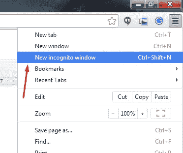
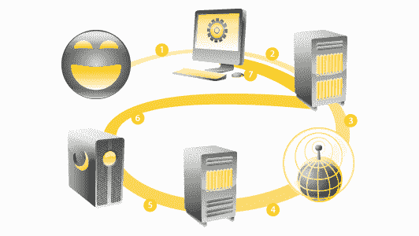
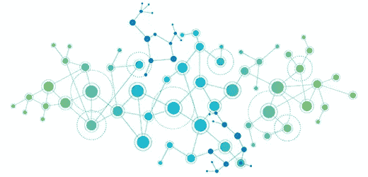

# 8 种保护数字隐私的聪明方法

> 原文：<https://medium.com/hackernoon/8-smart-ways-to-maintain-your-digital-privacy-13bdec734912>

“grayscale photo of woman doing silent hand sign” by [Kristina Flour](https://unsplash.com/@tinaflour?utm_source=medium&utm_medium=referral) on [Unsplash](https://unsplash.com?utm_source=medium&utm_medium=referral)

不管你如何使用互联网，几乎可以肯定的是，你正以某种方式被跟踪。Natalie Triedman 最近分享了人们如何在不知不觉中分享他们在 T2 的位置。我们并不是说你应该害怕并停止使用互联网，但明智地浏览是一个好主意。

遵循这些提示，开始保护您的在线信息。我们包括了一些每个人都可以做的快速步骤，以及一些更难和更高级的方法来保护您的 web 数据的安全。

# 保护您在线隐私的快速方法

## 禁用 Cookies

如果你不熟悉 cookies 是如何工作的:它们是储存在你电脑上的小块数据。它们用于记忆信息(比如你的在线购物车中的物品、姓名、密码等。)关于你的浏览活动。更安全的网站通常有更安全的 cookie，但其他网站的 cookie 根本没有任何加密。

您可以选择想要达到的安全级别，方法是允许一些 cookiess，例如只允许来自您经常访问的站点的 cookie，或者完全阻止它们。

禁用 cookies 在桌面浏览器和移动浏览器上都有效(比如 iOS 版 Safari 和 Android 版 Google Chrome)。

## 使用私人浏览器窗口

大多数浏览器——包括 Chrome、Firefox 和 Safari——都提供某种私人浏览窗口。使用这些窗口会告诉您的浏览器不要保存您的浏览历史记录，并防止网站跟踪您。

当你使用一个私人窗口时，浏览器不会保存你的浏览数据或活动，但网站、你的雇主或你的互联网服务提供商(ISP)仍会看到你的活动。因此，这不是对您信息的全面保护。

## 使用安全、注重隐私的搜索引擎

基于隐私的搜索引擎有很多选择。这些搜索引擎与谷歌或雅虎等大型搜索引擎的工作方式不同，因为它们的商业模式完全不同。他们中的许多人依靠搜索结果中的广告来获取收入，而不是出售他们的用户信息。

以下是关注隐私的搜索引擎的一些好选择:

*   [duck duck go](http://duckduckgo.com)
*   [**起始页**](http://startpage.com)
*   [**搜索加密**](http://searchencrypt.com)
*   [**wolfram alpha**](https://www.wolframalpha.com/)

 [## 哪个搜索引擎最能保护隐私？

### 最近，世界上最受欢迎(也是最强大)的搜索引擎出现在很多新闻中。隐私倡导者是…

medium.com](/@stewofkc/which-search-engine-is-best-for-privacy-704f4f80c0af) 

# 保护互联网数据的中间方法

这些方法不一定“困难”，因为任何具有基本计算机知识的人都可以完成它们。他们将只需要几分钟的时间来安装或设置。

## 安装加密的浏览器

虽然大多数主流浏览器都提供了安全功能，并允许用户在某种程度上保护他们的信息，但这些浏览器将安全性带到了另一个层次。这些浏览器消除了许多不必要的功能，以提供更安全(和极简)的体验。

以下是一些值得尝试的加密浏览器:

*   [Tor](https://www.torproject.org/projects/torbrowser.html.en)
*   [**勇敢**](https://brave.com/)
*   [**史诗隐私浏览器**](https://www.epicbrowser.com/)

## 使用虚拟专用网络(VPN)

VPN，或[虚拟专用网](/searchencrypt/does-a-privacy-based-search-engine-exist-273170797b85)，允许你通过远程(或虚拟)服务器连接到互联网。因此，在您的设备和该服务器之间发送的数据会得到安全加密。使用 VPN 可以隐藏您的互联网行为，不让您的 ISP 和任何其他可能跟踪您浏览信息的团体知道，从而保护您的隐私。这些工具还可以访问被屏蔽的网站，否则由于互联网过滤，你将无法在学校或工作场所访问这些网站。

VPN 有很多可靠的选择。他们通常每月花费 5-10 美元。不过，如果你需要在旅途中远程访问一个不可用的服务器或网站，拥有 VPN 可能会很方便。

## 推荐的 VPN 提供商

1.  [**ExpressVPN**](https://www.linkev.com/?a_fid=cstewart-20)
2.  [**NordVPN**](https://go.nordvpn.net/aff_c?offer_id=15&aff_id=15989)
3.  [**私人上网**](https://www.privateinternetaccess.com/pages/buy-vpn/stewofkc)
4.  [**PureVPN**](https://www.purevpn.com/order-now.php?utm_medium=referral&utm_source=aff-36667)
5.  [**完美隐私**](https://www.perfect-privacy.com/?a_aid=cstewart-20)

## DNS 泄漏测试

在使用 [VPN](https://hackernoon.com/tagged/vpn) 的时候，即使你的 IP 地址被隐藏，仍然有可能通过你的 DNS 流量泄露你的身份。DNS 的工作原理是将一个可读的网址转换成计算机能够理解的 IP 地址。如果泄露了这个过程的信息，就可以泄露浏览信息。幸运的是，有[工具](https://hackernoon.com/tagged/tools)会告诉你你的连接是否泄露了 DNS 数据。试试 DNSLeakTest.com，看看你的连接是否真的安全。

# 保护数据的高级方法

## 使用虚拟机

使用 VPN 和加密浏览器将保护您免受大多数威胁。网络浏览器是数据泄露最容易受到攻击的因素之一。然而，窥探和数据抓取可以通过 pdf 之类的文件进行。虽然这些文件可能看起来无害，但它们可以充当导航信标，并在您查看“违禁”文件时潜在地提醒监控实体。设置虚拟机有助于消除您的风险。

虚拟机就像在您的计算机中运行一个独立的操作系统。如果某个文件可疑，将其下载到虚拟机上，断开互联网连接，然后打开该文件。这可以确保即使该文件是有害的，它也不会有效地跟踪或窥探您的计算机。

[VMWare](https://www.vmware.com/) 和 [VirtualBox](https://www.virtualbox.org/) 是两款可靠的免费虚拟化解决方案。

## 使用实时 USB 操作系统

几乎任何电脑都可以通过 u 盘或 DVD 启动实时操作系统。他们的目标是维护隐私和匿名，或者绕过审查。

爱德华·斯诺登(Edward Snowden)的 live OS 偏好设置 [Tails](https://tails.boum.org/) ，使用加密工具来加密你的文件、电子邮件和信息。当你使用完系统后，只需拔掉 USB 或弹出 DVD，主机上就不会有你使用过的痕迹。

# 你们分享多少信息？

不管你对与谷歌这样的大公司分享你的数据有什么看法，至少理解你正在分享的信息是很重要的。这八种方法当然不能保证你的数字隐私被完全锁定，但它们是朝着正确方向迈出的一步。

如果你正在寻找更多关于如何保护你自己和你的数据免受数字威胁的信息， [Tobias van Schneider](https://medium.com/u/7ee29b787e9?source=post_page-----13bdec734912--------------------------------) 给出了一些[的好建议](/desk-of-van-schneider/trading-design-for-something-else-than-money-47f85d01b81f)。