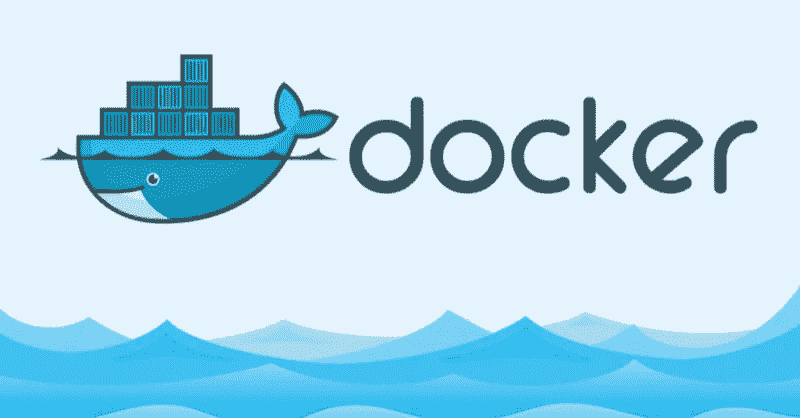
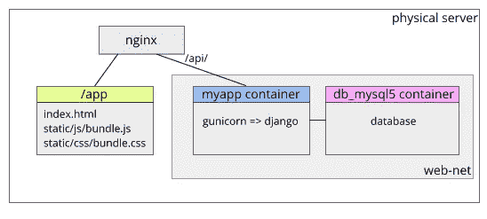

# 容器化 Django 应用的 8 个技巧

> 原文：<https://medium.com/hackernoon/8-tips-for-containerizing-django-apps-5340647632a4>



最近我和 Django 一起做了一个小网站，反应非常快，但是当涉及到部署时，我开始感到恼火。我必须写部署脚本和詹金斯的工作，还必须处理生产配置以及秘密！我开始考虑对这类小网站使用容器。我从阅读一本 docker 书开始，令人惊讶的是，我只用了一个小时就看完了这本书！(三年前我读了同一本书，读了大约两周，仍然不知道它在讲什么，所以看看当你实际上有需求时，效率有多高。)

第二天，当我试图将我网站的 API 服务容器化时，我遇到了很多问题。虽然有很多关于 docker 的教程，但是很少有关于最佳实践的。所以我觉得如果我能把我的问题和解决方法写下来会有所帮助。现在我们开始吧。

# 体系结构

我做的网站由一个用 Django 写的 API 服务组成，用 [gunicorn](http://gunicorn.org/) 服务，一个用 React 写构建的前端。数据库是 MySQL。nginx 服务于前端静态文件，并将`/api/`代理给 API 服务。

最初，我考虑将所有东西都打包到一个容器中，但发现这种方法没有可伸缩性(尽管个人服务没有可伸缩性)。所以最后我决定只将 Django API 服务部分容器化。主机上的 nginx 将代理 API 对容器的请求。nginx 将直接从一个目录中提供前端静态文件。这样，我可以在必要时将静态文件转移到 AWS S3 或将 API 转移到 EC2。



# 技巧 1:在开发和生产中使用相同的操作系统

我的开发环境是 Ubuntu 18.04，所以使用 Ubuntu 进行生产也是很自然的。然而，我想尝试一下 [Alpine](https://alpinelinux.org/) ，因为它很安全，而且非常小，所以它非常适合容器(压缩后，[最新的 alpine:3.8 图像只需要 2.1MB](https://hub.docker.com/r/library/alpine/tags/3.8/) ！).

我从`python:3.6.6-alpine3.8`开始，一切都很顺利，直到我开始安装依赖项。我的项目的一些依赖依赖于本地库(如`libxslt`和`libmysqlclient`)并包含 C 代码，所以我必须安装`gcc`、`g++`和许多库和头文件。而且将来还有潜在的其他兼容性问题！这原来是一项繁琐的工作，很快让我放弃了。

最后，我决定从`ubuntu:18.04`开始建立自己的形象。我从中得到的教训是，如果你不熟悉 alpine，坚持使用你用于开发的 OS。这可能会导致更大的图像尺寸，但会为您节省大量时间。

# 技巧 2:调整 Dockerfile 以减小图像大小

`apt`在没有任何选项的情况下调用时会安装很多“建议”但通常无用的包。然而，在容器上下文中，我们需要精确的包来使容器映像小而安全。

第一个窍门是添加`--no-install-recommends`选项。此选项可以显著减小图像大小。在下面的例子中，`3.6–1`由`apt install -y --no-install-recommends python3 python3-pip wget`产生，`3.6`由相同的命令产生，除了`--no-install-recommends`选项。看看差别有多大！

```
REPOSITORY          TAG    IMAGE ID        CREATED             SIZE
odacharlee/python   3.6-1  ffe5c583b8c4    3 minutes ago       124MB
odacharlee/python   3.6    188132621a87    3 hours ago         405MB
```

第二个技巧是在安装后删除缓存。添加`rm -rf /var/lib/apt/lists/*`将减少图像大小约 40MB。

最后一个技巧是对`apt update`和`apt install`只使用一个`RUN`语句。这可以在图像中生成较少的层。

总而言之，您的 docker 文件应该是这样的:

```
RUN apt update \
    && apt install -y --no-install-recommends python3 python3-pip \
    && rm -rf /var/lib/apt/lists/*
```

# 技巧 3:处理 pip 依赖性

对于 python 应用程序，我们需要`pip`来安装依赖项。如果有任何包依赖于本地库，那就变得更棘手了，因为`pip`需要从源代码中编译依赖项。

例如，我的应用程序要求在运行`pip`之前安装`libmysqlclient-dev`、`python3-dev`，以便安装`mysqlclient`包。当然还需要一个编译器`gcc`。然而，这些包在`pip install`完成后就没用了，可以移除。所以 Dockerfile 可以写成:

```
RUN buildDeps='gcc libmysqlclient-dev python3-dev' \
    && apt update \
    && apt install -y --no-install-recommends $buildDeps \
    && pip install wheel setuptools \
    && pip install -r requirements.txt \
    && apt purge -y --auto-remove $buildDeps \
    && apt install -y libmysqlclient20 \
    && rm -rf /var/lib/apt/lists/* \
    && rm -rf /root/.cache
```

`apt purge`行删除这些包，`rm -rf /root/.cache`删除 pip 缓存。注意`libmysqlclient20`在`apt purge`之后被重新安装，因为运行时需要这个包。

# 技巧 4:在云服务上构建注册中心

一个注册服务用来存储你的 docker 镜像，比如 [Docker Hub](https://hub.docker.com/) 。但有时我们需要为私有图像创建自己的注册表。

虽然你可以在`docker run registry`之前启动一个注册服务，但我建议你使用云服务，而不是自己托管你的注册。谷歌和亚马逊都提供容器注册服务。

*   [谷歌容器注册表](https://cloud.google.com/container-registry/):存储:0.026 美元/GB/月，数据传出:0.12 美元/GB
*   [亚马逊弹性容器注册表](https://aws.amazon.com/ecr/):存储:$ 0.10/GB/月，数据转出:$0.09/GB，每月第一 GB 免费

根据您的使用情况选择一个。

# 技巧 5:为 MySQL 设置根密码

如果你知道正确的命令，MySQL 容器非常容易设置。看起来是这样的:

```
$ **docker run -d \
    --name db_mysql5 \
    --network web-net \
    --env MYSQL_RANDOM_ROOT_PASSWORD=1 \
    mysql:5**
```

`-d`会将您的终端从集装箱上拆下。没有`-d`，你将被困在集装箱里，唯一的出路就是从另一个码头运行`docker stop db_mysql5`。

`--name db_mysql5`给容器命名，`--network web-net`将容器连接到一个名为`web-net`的网络，这个网络是我事先用`docker network create -d bridge web-net`创建的。

`--env MYSQL_RANDOM_ROOT_PASSWORD=1`告诉 MySQL 在初始化时为 root 用户生成一个随机密码。可以从容器控制台看到密码:

```
$ **docker logs db_mysql5 2>/dev/null**
Initializing database
Database initialized
Initializing certificates
Certificates initialized
MySQL init process in progress...
GENERATED ROOT PASSWORD: raew8pej9noomohGhaew3WoP4euch6za
```

mysql 容器启动后，您可以像这样更改 docke 密码:

```
$ **docker exec -i -t db_mysql5 mysql -uroot -p**
Enter password: **raew8pej9noomohGhaew3WoP4euch6za**
...
mysql> **alter user 'root'@'localhost' identified by 'mypassword';**
```

# 技巧 6:对 MySQL 用户主机使用%

这是关于为您的 web 应用程序创建 mysql 帐户。

由于 app server 与 mysql 不在同一个容器上运行，所以它不能使用“localhost”用户(比如`web@localhost`)连接 mysql。所以我们必须指定`%`作为用户的主机部分:

```
mysql> create user 'web'@'%' identified by 'webpassword';
```

# 技巧 7:将秘密传递给应用程序容器

mysql 用户名和密码之类的秘密不能写入源代码(例如 django 的`settings.py`),所以我们需要另一种方法将它们传递给 app 容器。虽然 [docker secrets](https://docs.docker.com/engine/swarm/secrets/) 可以优雅地做到这一点，但是只能在 Swarm 中使用，我感觉对我的服务来说大材小用了。所以我决定简单地使用环境变量。

我在我的应用程序容器中创建了一个入口点脚本:

```
#!/bin/sh# Check production environment variables
if [ -z "$EC_MYSQL_USER" -o -z "$EC_MYSQL_PASS" ]; then
    echo >&2 'error: Must specify EC_MYSQL_USER and EC_MYSQL_PASS'
    exit 1
fiif [ "$1" = "gunicorn" ]; then
    ./manage.py migrate
fi# Start process
exec "$@"
```

在 Dockerfile 中:

```
ENTRYPOINT ["/app/entrypoint.sh"]
CMD ["gunicorn", "-c", "/app/gunicorn.conf", "myapp.wsgi"]
```

不要忘记在 django `settings.py`中使用这些变量:

```
DATABASES = {
    'default': {
        'ENGINE': 'django.db.backends.mysql',
        'NAME': 'mydatabase',
        'HOST': 'db_mysql5',
        'USER': os.environ.get('EC_MYSQL_USER'),
        'PASSWORD': os.environ.get('EC_MYSQL_PASS'),
    }
}
```

因此可以在 docker 命令行中指定这些秘密:

```
$ docker run -it --network web-net --name myapp \
    --env EC_MYSQL_USER=web \
    --env EC_MYSQL_PASS=mysecret \
    -p 12345:12345 \
    myapp:latest
```

在实际部署中，秘密将存储在詹金斯和[屏蔽密码](https://plugins.jenkins.io/mask-passwords)插件可用于隐藏从詹金斯日志的密码。

# 技巧 8:向所有接口公开端口

gunicorn 用于运行应用服务器。如果没有容器，我们会让 gunicorn 监听`127.0.0.1:12345`，nginx 会将请求代理到这个端口。但是当应用服务器在容器内部运行，而 nginx 在主机上时，gunicorn 必须监听所有接口:

```
# gunicorn.conf
bind = '0.0.0.0:12345'   # '127.0.0.1:12345' will not work!
```

只有这样，容器端口映射才能工作:

```
$ docker run -it --network web-net --name myapp \
    --env EC_MYSQL_USER=web \
    --env EC_MYSQL_PASS=mysecret \
    -p 12345:12345 \
    myapp:latest
```

我们今天的问题不是缺乏信息。问题是我们有如此多的信息，以至于我们无法找出哪一部分最符合我们的需求。希望这篇帖子可以帮助初学者在学习 docker 后开始第一个 docker 项目时做出正确的决定。

感谢阅读，如果觉得有用请为我鼓掌！