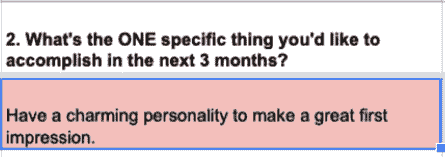
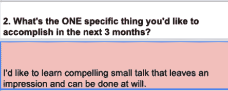
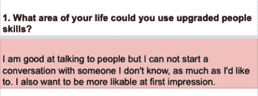
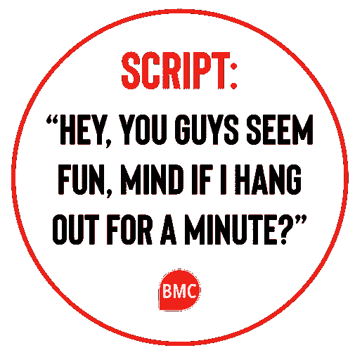
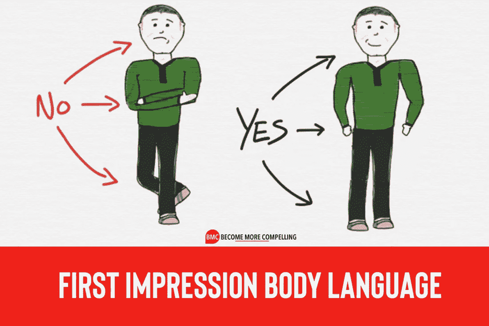
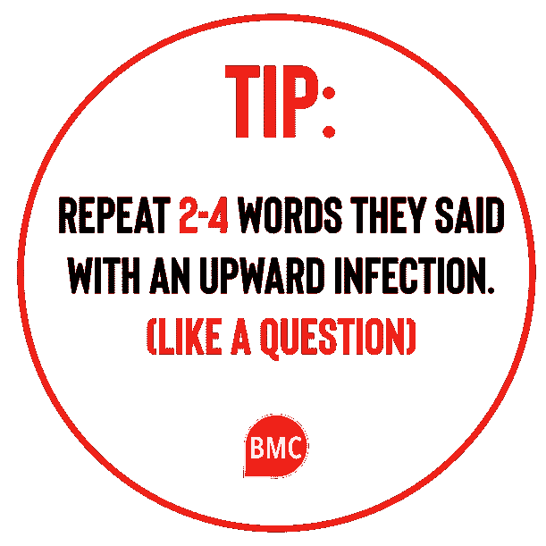

# 给人留下良好第一印象的 8 个不同寻常的技巧

> 原文：<https://medium.com/hackernoon/8-uncommon-hacks-to-make-a-great-first-impression-2d332f8ad728>

Photo by [rawpixel](https://unsplash.com/photos/NI45DHxKM6g?utm_source=unsplash&utm_medium=referral&utm_content=creditCopyText) on [Unsplash](https://unsplash.com/search/photos/meeting?utm_source=unsplash&utm_medium=referral&utm_content=creditCopyText)

如果你想知道如何给人留下美好的第一印象，你并不孤单。

这里有一些来自我的读者的信息，他们想掌握第一印象。

如果你已经给人留下了一些值得炫耀的第一印象，那也没关系。

拿我妻子的这件宝贝来说吧:几年前，她在老板家参加一个聚会。​

她在和她的一些同事开玩笑，他们在房间的另一边。

她顽皮地伸出中指。

就在那时，她老板的父亲转过身来，截住了她的中指。​

我想象当我妻子看着他经历不同的情绪时，空间和时间都慢了下来:

迷茫，不相信，否认，震惊，悲伤，最后是不屑。

当现实的结构稳定下来后，他看向别处，同时说:“真粗鲁。”

这个故事每次都让我发笑。

第一印象至关重要:

*   当你走进理想工作的面试时。
*   当你遇到你另一半的家人时。
*   当你遇到你公司的潜在商业伙伴时。

第一印象是这样的:当人们对你有了想法后，([一些研究称在短短的 1/10 秒内](https://www.psychologicalscience.org/observer/how-many-seconds-to-a-first-impression))他们会使用确认偏见来寻找支持他们最初印象的证据。我不是来粉饰太平的。我是来增强你的人际交往能力的。

那么，你能做些什么来给你遇到的几乎所有人留下良好的第一印象呢？

这一切都始于你的心态，因为 80%的工作都是在你握手之前完成的…

# 1.期待伟大的事情发生。培养 Pronoia。

有一个鲜为人知的概念叫做 Pronoia，我想把它推荐给我的私人教练客户。

简而言之，这是一种观念，即这个世界正在密谋对你做好事。

由于消极偏见，我们大多数人在大多数社交场合都会假设最坏的结果。

当我们进入一个“结识新朋友”的情况时，我们绝对希望假设好事会发生。我们往往会找到我们寻找的东西。总的来说，我宁愿寻找积极的一面，而不是消极的一面。

## **如何培养 pronoia:**

《万分感谢》一书的作者 AJ Jacobs 在他最近主持的蒂姆·费里斯节目中说，克服消极偏见的最好方法是从你的一天中抽出一点时间，心怀感激，专注于一切顺利的事情。

点击这里，跳到 14:19 分，了解雅各布斯如何向消极偏见宣战。

花一分钟时间，记下你目前感激的五件事。这些事情可以简单到:*“我很感激我的手机加载中等。”*

当我们花一秒钟去注意我们生活中经常被忽视的许多事情时，它微妙地推动了我们的视角。雅各布斯说，他试图平衡自己的两半:悲观的拉里·戴维和乐观的罗杰斯。平衡是件好事。

我会做什么:睡觉前我会花 30 秒时间，挑选三件我感激的事情。

消极偏见很强。当我们遇到新朋友时，期待好的事情是至关重要的。

当我们期待好的事情时，更容易留下好的第一印象。

# 2.选择你想成为的人

我能听到你在外面。嘲笑和摇头。

*“杰夫，我不想做假！”*

好消息，我也不希望你是假的！考虑一下，你在大学老朋友面前的表现可能会不同于在董事会上。

这是否意味着你不真实，因为你没有和你的朋友讨论季度目标，没有使用协同效应和透明度这样的词？没有。

你只是在适应当前的社会形势。

当遇到新朋友时，你可以展示你想要的任何一部分。要有思想，要专注。或者合群风趣。虽然没有任何错误的答案，但考虑以下问题是有用的:

*   *“在这种情况下，***我身体的哪个部位最有效？”**

*在与潜在投资者的推介会议上，你可能需要展示自己善于沟通的一面。“我能搞定一切。”*

*第一次约会见某人？你可能想打开“好玩的和喜欢乐趣的”氛围。*

*这也有助于调整你向听众传达的信息。如果你和一个棒球迷交谈，当你谈论最近的胜利时，“打一个本垒打”是有意义的。艾米·卡迪的这段话很好地总结了这一点:*

> *“自我可以是你想要的任何样子。它甚至可以是新的，但这并不意味着它不真诚或不真实。”
> ——阿米卡迪，光临*

**

# *行动步骤:*

*写下最近三次你遇到新朋友的场景。示例:*

1.  *在工作中遇到了一个新客户。*
2.  *在酒吧第一次约会遇到一个人。*
3.  *在婚礼上遇到了一个朋友的朋友。*

*回答这些问题:*

*   *我展示了我性格的哪些部分？*
*   *如果让我重新来过，我会有什么改变吗？*
*   *下一次我在这种环境下遇到某人时，我可以做哪些不同的事情？*

# *3.积极主动*

*我过去曾谈过大胆的好处，第一印象是大胆的好地方，即使你天生保守或害羞。*

*想象一下:你正在参加一个会议，在发言者之间有一次休息。​*

*你看到一个演讲者和一群人，你可以走向他们。大多数胆小的人会怎么做？*

*   *查看 Instagram*
*   *去洗手间，即使他们不需要去。*
*   *阅读安全出口标志。又来了。*

*一个大胆的人会怎么做？*

*他们走上前[加入了群体对话](https://www.becomemorecompelling.com/blog/the-ultimate-guide-to-joining-enjoying-group-conversations)。*

*他们可能会说这样的话:*“嘿，你们看起来很有趣，介意我出去玩一会儿吗？我叫名字"**

**

*通常，大胆并不意味着从吊灯上摇摆，它只是意味着挤出大多数人认为他们没有的那 10%的额外收入。*

*你拿到了。*

*当我们把积极主动和 pronoia 放在一起，它就变成了一杯美妙的社交鸡尾酒。*

*那就是…如果你有以下技能…*

# *4.积极开放的非语言*

*你没说的话说明了很多。当我们第一次与某人见面时，对方试图在短时间内“精简”大量信息:*

*-这个人是威胁吗？*

*-他们可信吗？*

*-他们有没有收集到的虫子想告诉我非常详细的细节？*

*研究表明，在别人对我们做出决定之前，我们只有 1/10 秒的时间。*

*之后，他们打卡去确认偏见镇，人口:他们。*

*接近一个陌生人时，你的肢体语言应该是什么？微笑！这会让你感觉很棒，对方也感觉很棒。这也会让人们知道你可能不是杀人犯。*

*重要的是要表现出“我很高兴来到这里”的氛围。本视频将对此有所帮助:*

*手臂，(以及延伸开来的)手应该放松并张开。我喜欢坐立不安…但是在交谈中，你的肢体语言越冷静越好。*

*如果你穿了鞋，试着一起摩擦你的脚趾，而不是用你的手坐立不安。*

*说真的。*

*《魅力神话》的作者奥利维亚·福克斯说，揉脚趾能让你在交谈中更有存在感。*

*脚应该不交叉，有支撑力。不要换脚。避免崩溃的肢体语言，占空间没问题！​*

*忍住双臂交叉、双肩塌陷的冲动。*

*这是我为你制作的一张方便的图片，可以随意保存为你的 iPhone 壁纸:*

**

# *5.快速建立融洽关系*

*到目前为止你已经给人留下了很好的第一印象。*

*你的工作已经结束了，对吗？不对。你现在的工作就是不要搞砸了！这是大多数人在 1 码线上失球的地方。*

*(可能是因为大部分关于第一印象的文章都止于此)不是这篇。*

*我们将讨论如何通过问一些很棒的问题，并把焦点(主要)放在你的谈话伙伴身上，来快速建立融洽的关系。*

*开放式问题是你的朋友。*

*假设你和某人握手，你注意到他们有一块有趣的手表。*

*你可以问:“这是一块有趣的手表。背后有什么故事？”*

**“哦，这是我父亲传给我的卡地亚……”*现在你要去比赛了。你给了他们一个故事，现在他们会给你一个。问开放式问题是一个很好的策略，因为开放式问题不能用简单的“是”或“不是”来回答。*

*另外三个 mad-libs 风格的例子供你借鉴:*

> **“你最喜欢的 ______________ 是什么？”**
> 
> **“你是怎么 ________________ 的？”**
> 
> **“做 _______________ 是什么感觉？”**

***后续问题是你的其他好朋友。***

*在我的播客上，我总是试图挖掘更好、更全面的答案。跟进问题是一个很好的方法。*

**

***这里有五个你可以偷的跟进问题的例子:***

> **“为什么要 _________？”**
> 
> **“那对你来说是什么感觉？”**
> 
> **“你是什么时候意识到 _ _ _ _ _ _ _ _ _ _ _ _ _ _ _”**
> 
> *“那一刻你在想什么？”*
> 
> **“你怎么知道 _ _ _ _ _ _ _ _ _ _ _ _ _ _ _？**

*像一个好的面试官一样，你在挖掘更深层次的情感和对他们经历的更清晰的描述。*

*您可以在小组中、一对一地使用跟进问题，甚至作为对其他人提出的问题的跟进。它们被设计成让人们思考，超越自动驾驶的反应。*

# *6.避免审讯陷阱*

*你有没有问过一些很有见地的问题，只是为了看着你的对话伙伴的眼睛变得呆滞，他们贪婪地盯着开着的窗户，把它当成一个逃生出口？*

*问题可能是你掉进了“审讯陷阱”。平衡问题和观察是至关重要的。这在实践中可能是这样的:*

> ***Ted:** *“这一周太疯狂了。我在一个项目上工作了 42 个小时。当我闭上眼睛，我看到电子表格！”**
> 
> ***你:** *“哇！你必须真正致力于完成工作！”**

*在这里，你可以称赞 Ted，同时对他的陈述进行评论。在人际交往方面，很少有硬性规定。然而，你应该试着在你提出的问题和你给出的观察之间保持 50/50 的平衡。*

*这将帮助你避免“审讯陷阱”*

# *7.让他们和这个 FBI 人质谈判专家保持对话*

*联邦调查局前首席人质谈判代表克里斯·沃斯有一种让人们说话的方法，这种方法非常微妙，他甚至没有意识到这种方法在一次员工考核中被用在了 T2 身上。*

*这是什么？用向上的疑问语调重复 2-4 个单词。让我们以之前的例子为例:*

> ***Ted:** *“这一周一直很疯狂。我在一个项目上工作了 42 个小时。当我闭上眼睛，我看到电子表格！”**
> 
> ***你:** *“上一个项目？”**
> 
> *Ted: *“是的，我们带来了一个新的大客户，我负责安排一切。”**
> 
> ***你:** *“一个新的大客户？”**

**

*这种方法的出现是因为，在谈判中，通常更多的信息意味着更多的优势。*

*一个绑匪*可能*不想分享他的人生故事。*

*通过用向上的音调重复 2-4 个单词，这个人会(通常在不知不觉中)给你更多的信息。*

*在谈话的这一点上，你应该和你的谈话对象保持融洽的关系。*

*但是你怎么能确定呢？如果有某种测试就好了…*

# *8.镜像测试*

*如果你曾经和某人交谈时想:“我想知道这个人是否喜欢我们的谈话？”*

*你有三个选择:*

1.  *问他们“嘿，你喜欢我们的谈话吗？”“还有:我们能成为最好的朋友吗？请不要离开我！”*
2.  *2.试着像查尔斯·泽维尔教授一样读他们的思想。如果你真的会读心术，那你就知道我刚才给你发了什么短信了。*
3.  *3.使用镜像测试。*

*当我们与某人“关系融洽”时，我们会自然地反映我们的肢体语言，甚至我们的呼吸。科学术语称之为[边缘共振](https://psychcentral.com/blog/a-general-theory-of-love-part-2-the-science-of-attraction/)。*

*人类很奇怪。*

*你如何用这个来判断你是否在和你的对话伙伴交流呢？*

*当你问这些问题和做这些观察的时候，快速地拍一下，看看你们两个是不是在镜像。以下是一些例子:*

*   *当一个人喝酒时，另一个人也喝。*
*   *当一个人靠在吧台上时，另一个人也会这样做。*
*   *当一个人微笑时，另一个人也会微笑。*

*如果你们两个还没有自然镜像，开始镜像:*

*   *当他们喝酒时，你也喝。*
*   *当他们靠在吧台上时，你也一样。*
*   *当他们笑的时候，你也会笑。*

*然后，在模仿它们一段时间后，注意当你喝酒、倚靠或微笑时，它们是如何开始模仿你的。*

*众所周知，我们喜欢和信任与我们相似的人，模仿肢体语言是引发喜欢和信任的一个好方法。*

*有了这些技巧，你会知道如何给人留下良好的第一印象。*

# ***下一步？***

*我会给你发送我的免费的 56 分钟音频培训，教你如何加入和享受群体对话。*

*它甚至有美味的逐字逐句的脚本，你可以在下次大脑一片空白时使用！*

*[**在此获得免费的群组对话音频培训。**](https://www.becomemorecompelling.com/uggc-audio.html)*

*【www.becomemorecompelling.com】最初发表于**。***