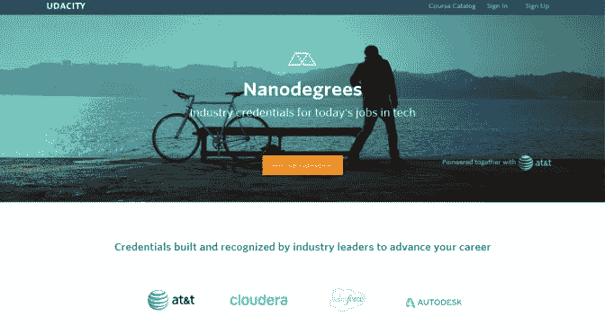

# 85 门免费的 Udacity 纳米学位课程

> 原文：<https://medium.com/hackernoon/85-free-udacity-nanodegree-courses-4be88d76e379>

## 全栈 Web 开发者纳米学位、iOS 开发者纳米学位、机器学习工程师纳米学位等等

*本文最初发表于我的* [*博客*](https://www.fatosmorina.com/free-udacity-nanodegree-courses-full-stack-web-developer-nanodegree-ios-developer-nanodegree-machine-learning-engineer-nanodegree-and-more/)

我们可以学习的东西太多了，我们可以选择学习的资源太多了，这使得选择正确的资源来帮助我们获得更好的工作或改善我们的职业生涯变得非常具有挑战性。Udacity 提供了许多纳米学位，我们可以利用这些课程来提升我们的职业生涯，这些课程经过组织和准备，可以帮助我们从初级水平进步到更高级的高质量内容。设法完成项目的学生获得学位，并保证获得与学位相关的工作。如果你负担不起这些纳米学位的费用，幸运的是，你仍然可以参加属于这些纳米学位的许多课程，而不必支付任何费用。

以下列表最初发布在这个 [Github 库](https://github.com/mikesprague/udacity-nanodegrees)上，在撰写本文时，它包含了属于以下纳米学位的课程链接:

*   前端 Web 开发人员 Nanodegree
*   高级网络开发人员纳米学位
*   全栈 Web Developer 纳米度
*   数据分析师纳米度
*   机器学习工程师纳米学位
*   科技企业家纳米学位
*   Android 基础纳米学位
*   Android 开发者纳米学位
*   iOS 开发者纳米度
*   手机游戏开发商 Nanodegree
*   商业纳米度的预测分析

## **前端 Web 开发者纳米度**

掌握成为前端 Web 开发人员所需的技能，并开始构建针对移动和桌面性能优化的漂亮、响应迅速的网站。

学习网络如何工作的基本原理，并获得支持每个网站的三种基本语言的工作知识:HTML、CSS 和 JavaScript。

1.  [HTML 和 CSS 简介](https://www.udacity.com/course/intro-to-html-and-css--ud304)
2.  [响应式网页设计基础](https://www.udacity.com/course/responsive-web-design-fundamentals--ud893)
3.  [响应图像](https://www.udacity.com/course/responsive-images--ud882)
4.  [JavaScript 基础知识](https://www.udacity.com/course/javascript-basics--ud804)
5.  [jQuery 简介](https://www.udacity.com/course/intro-to-jquery--ud245)
6.  [面向对象 JavaScript](https://www.udacity.com/course/object-oriented-javascript--ud015)
7.  [HTML5 画布](https://www.udacity.com/course/html5-canvas--ud292)
8.  [网站性能优化](https://www.udacity.com/course/website-performance-optimization--ud884)
9.  [浏览器渲染优化](https://www.udacity.com/course/browser-rendering-optimization--ud860)
10.  [AJAX 简介](https://www.udacity.com/course/intro-to-ajax--ud110)
11.  [JavaScript 设计模式](https://www.udacity.com/course/javascript-design-patterns--ud989)
12.  [JavaScript 测试](https://www.udacity.com/course/javascript-testing--ud549)

## **高级 Web 开发者 Nanodegree (n *o 不再在 Udacity 上市)***

该计划从我们的前端 Web 开发人员 Nanodegree 计划开始，旨在为中级开发人员提供建立现有前端技能和掌握最新可用技术的机会。

这个项目确保你做好充分的准备，在高级网站开发人员的角色中取得成功。

1.  [构建高转化率 Web 表单](https://www.udacity.com/course/building-high-conversion-web-forms--ud890)
2.  [网络工装&自动化](https://www.udacity.com/course/web-tooling-automation--ud892)
3.  [JavaScript 承诺](https://www.udacity.com/course/javascript-promises--ud898)
4.  [离线网络应用](https://www.udacity.com/course/offline-web-applications--ud899)
5.  [网络无障碍](https://www.udacity.com/course/web-accessibility--ud891)
6.  [前端框架](https://www.udacity.com/course/front-end-frameworks--ud894)
7.  [客户端-服务器通信](https://www.udacity.com/course/client-server-communication--ud897)

## **全栈 Web Developer 纳米度**

这个项目将帮助你成为一名全栈 web 开发人员，并教你构建复杂的服务器端 Web 应用程序，这些应用程序使用强大的关系数据库来持久存储数据。

您将学习构建可以支持任何前端的应用程序，并扩展到支持成千上万的用户。

1.  [Python 编程基础](https://www.udacity.com/course/programming-foundations-with-python--ud036)
2.  [HTML 和 CSS 简介](https://www.udacity.com/course/intro-to-html-and-css--ud304)
3.  [响应式网页设计基础](https://www.udacity.com/course/responsive-web-design-fundamentals--ud893)
4.  [响应图像](https://www.udacity.com/course/responsive-images--ud882)
5.  [后端介绍](https://www.udacity.com/course/intro-to-backend--ud171)
6.  [关系数据库简介](https://www.udacity.com/course/intro-to-relational-databases--ud197)
7.  [全堆叠基础](https://www.udacity.com/course/full-stack-foundations--ud088)
8.  [认证&授权:OAuth](https://www.udacity.com/course/authentication-authorization-oauth--ud330)
9.  [AJAX 简介](https://www.udacity.com/course/intro-to-ajax--ud110)
10.  [JavaScript 设计模式](https://www.udacity.com/course/javascript-design-patterns--ud989)
11.  [用 Python 开发可扩展的应用](https://www.udacity.com/course/developing-scalable-apps-in-python--ud858)
12.  [Linux 命令行基础知识](https://www.udacity.com/course/linux-command-line-basics--ud595)
13.  [配置 Linux Web 服务器](https://www.udacity.com/course/configuring-linux-web-servers--ud299)
14.  [使用 Git 进行版本控制](https://www.udacity.com/course/version-control-with-git--ud123)
15.  [GitHub 和协作](https://www.udacity.com/course/github-collaboration--ud456)
16.  [壳牌车间](https://www.udacity.com/course/shell-workshop--ud206)
17.  [HTTP &网络服务器](https://www.udacity.com/course/http-web-servers--ud303)
18.  [设计 RESTful API](https://www.udacity.com/course/designing-restful-apis--ud388)

## **数据分析师纳米度**

我们与领先技术公司的专家分析师和科学家一起建立了这个计划，以确保您掌握在数据科学领域发展职业所需的确切技能。

学会清理杂乱的数据，发现模式和见解，使用机器学习进行预测，并清楚地传达关键的发现。

1.  [描述统计学简介](https://www.udacity.com/course/intro-to-descriptive-statistics--ud827)
2.  [推断统计学简介](https://www.udacity.com/course/intro-to-inferential-statistics--ud201)
3.  [数据分析介绍](https://www.udacity.com/course/intro-to-data-analysis--ud170)
4.  [与 MongoDB 的数据争论](https://www.udacity.com/course/data-wrangling-with-mongodb--ud032)
5.  [带 R 的数据分析](https://www.udacity.com/course/data-analysis-with-r--ud651)
6.  [机器学习简介](https://www.udacity.com/course/intro-to-machine-learning--ud120)
7.  [数据可视化和 D3.js](https://www.udacity.com/course/data-visualization-and-d3js--ud507)
8.  [HTML 和 CSS 简介](https://www.udacity.com/course/intro-to-html-and-css--ud304)
9.  [JavaScript 基础知识](https://www.udacity.com/course/javascript-basics--ud804)
10.  [A/B 测试](https://www.udacity.com/course/ab-testing--ud257)

## **机器学习工程师纳米学位**

机器学习代表了计算机科学、数据分析、软件工程和人工智能领域的一场关键变革。

这个项目将教你如何成为一名机器学习工程师，并将预测模型应用于金融、医疗保健、教育等领域的海量数据集。

1.  [描述统计学简介](https://www.udacity.com/course/intro-to-descriptive-statistics--ud827)
2.  [数据科学简介](https://www.udacity.com/course/intro-to-data-science--ud359)
3.  [人工智能简介](https://www.udacity.com/course/intro-to-artificial-intelligence--cs271)
4.  [强化学习](https://www.udacity.com/course/reinforcement-learning--ud600)
5.  [深度学习](https://www.udacity.com/course/deep-learning--ud730)
6.  [机器人的人工智能](https://www.udacity.com/course/artificial-intelligence-for-robotics--cs373)
7.  [机器学习交易](https://www.udacity.com/course/machine-learning-for-trading--ud501)

## **科技企业家纳米学位**

## ***不再上市***

我们的科技企业家 Nanodegree 项目向您传授创建您自己的创收应用程序所需的技能，并围绕它建立成功的业务。你将学会以硅谷的方式成功！

该项目与谷歌合作，将理论和实践相结合，向学生展示如何将想法转化为市场现成的产品。

1.  [产品设计](https://www.udacity.com/course/product-design--ud509)
2.  [应用货币化](https://www.udacity.com/course/app-monetization--ud518)
3.  [快速成型](https://www.udacity.com/course/rapid-prototyping--ud723)
4.  [App 营销](https://www.udacity.com/course/app-marketing--ud719)
5.  [开始创业](https://www.udacity.com/course/get-your-startup-started--ud806)

## **安卓基础纳米度**

Android 应用无处不在，学习开发这些应用可能是一个奇妙的职业发展。没有编程经验？没问题！你在这个初级的 Nanodegree 项目中学到的技能将加速你成为一名工作 Android 开发者的旅程。

1.  [安卓基础:用户界面](https://www.udacity.com/course/android-basics-user-interface--ud834)
2.  [安卓基础:用户输入](https://www.udacity.com/course/android-basics-user-input--ud836)
3.  [安卓基础:多屏应用](https://www.udacity.com/course/android-basics-multi-screen-apps--ud839)
4.  [安卓基础:网络](https://www.udacity.com/course/android-basics-networking--ud843)
5.  [安卓基础:数据存储](https://www.udacity.com/course/android-basics-data-storage--ud845)

## **安卓开发者纳米度**

对于追求 Android 专业化的中级 Java 开发人员来说，这个项目教授作为所有 Android 开发基础的工具、原则和模式。

你在这个 Nanodegree 项目中学到的技能将帮助你掌握现有的平台，并为你在 Android 未来的激动人心的机会做好准备。

1.  [开发安卓应用](https://www.udacity.com/course/new-android-fundamentals--ud851)
2.  [高级安卓应用开发](https://www.udacity.com/course/advanced-android-app-development--ud855)
3.  [安卓和 Java 的 Gradle](https://www.udacity.com/course/gradle-for-android-and-java--ud867)
4.  [面向 Android 开发者的材料设计](https://www.udacity.com/course/material-design-for-android-developers--ud862)
5.  [Android Wear 开发](https://www.udacity.com/course/android-wear-development--ud875A)

## **iOS 开发者纳米度**

作为一名 iOS 开发人员是一份非凡的职业，我们设计了这个纳米学位项目来教你开启职业生涯所需的技能。

对于以前有面向对象编程经验的人，您将学习 Swift 并构建大量有价值的 iOS 应用程序，以展示您作为 iOS 开发人员的专业技能。

1.  [Swift iOS 应用开发简介](https://www.udacity.com/course/intro-to-ios-app-development-with-swift--ud585)
2.  [UIKit 基础知识](https://www.udacity.com/course/uikit-fundamentals--ud788)
3.  [iOS 与 Swift 联网](https://www.udacity.com/course/ios-networking-with-swift--ud421)
4.  [iOS 持久性和核心数据](https://www.udacity.com/course/ios-persistence-and-core-data--ud325)
5.  [如何制作一个 iOS 应用](https://www.udacity.com/course/how-to-make-an-ios-app--ud607)
6.  [Swift 开发人员的目标 C](https://www.udacity.com/course/objective-c-for-swift-developers--ud1009)

## **手机游戏开发商 Nanodegree**

*不再在 Udacity 上市*

如果你想要把你的游戏想法变成现实的技能，或者准备投入到专业的游戏开发中，这就是适合你的计划！

这个 Nanodegree 计划的核心是 libGDX，这是一个强大的跨平台游戏开发框架，允许您在各种设备和操作系统上发布您的游戏。

1.  [用 libGDX 开发 2D 游戏](https://www.udacity.com/course/2d-game-development-with-libgdx--ud405)
2.  [如何用 libGDX 制作平台游戏](https://www.udacity.com/course/how-to-make-a-platformer-using-libgdx--ud406)
3.  [参与度&货币化|手机游戏](https://www.udacity.com/course/engagement-monetization-mobile-games--ud407)

## **业务纳米度预测分析**

随着越来越多的公司将预测分析纳入其数据战略，对具备这些技能的业务分析师的需求迅速增长，薪资也在上涨。这个 Nanodegree 项目将让你具备这些非常抢手的技能，而且报名时不需要任何编程经验！

您将掌握最重要的预测技术，使用该领域的领先工具，并学习为重要的业务问题提供高价值的解决方案。

1.  [利用高级分析解决问题](https://www.udacity.com/course/problem-solving-with-advanced-analytics--ud976)
2.  [创建分析数据集](https://www.udacity.com/course/creating-an-analytical-dataset--ud977)
3.  [分类模型](https://www.udacity.com/course/classification-models--ud978)
4.  [Tableau 中的数据可视化](https://www.udacity.com/course/data-visualization-in-tableau--ud1006)
5.  [业务分析师的 A/B 测试](https://www.udacity.com/course/ab-testing--ud979)
6.  [时间序列预测](https://www.udacity.com/course/time-series-forecasting--ud980)
7.  [分割和聚类](https://www.udacity.com/course/segmentation-and-clustering--ud981)

Udacity 也有其他纳米学位，但这个列表只包括那些免费课程的学位。通过实际纳米学位的学生有机会受益于 protect 审查、额外的学生和职业指导以及工作保障。尽管如此，您仍有一些很棒的内容可供学习。

快乐学习！