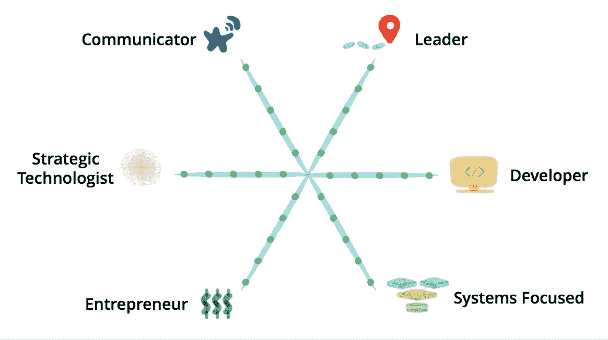

# 成为更好的端到端软件开发人员的 88 种方法

> 原文：<https://medium.com/hackernoon/88-ways-to-become-better-end-to-end-software-developer-6e0ae2fdb652>

What it takes to be a well-rounded architect by [Pat Kua](https://medium.com/u/4ef627af4a72?source=post_page-----6e0ae2fdb652--------------------------------)

# 谁是端到端软件工程师？

端到端[软件工程师](https://hackernoon.com/tagged/software-engineer)是一个软件工程师，他可以接受一个想法，并将其转化为成功的业务。从定义来看，很明显，它并不适合每个人，许多人都会有一些专业和技能差距。这很正常。

# 为什么？

你越是全面的端到端工程师，就越容易谋生:

*   创建自己的公司/产品/业务
*   加入重视和需要通才的小公司
*   做一个在特定领域的交叉领域努力的顾问
*   强调并更好地理解你的同事，这样你就能把你和他们的工作做得更好
*   开展副业。这里有一个[非常有用的链接](https://www.sideprojectchecklist.com/marketing-checklist/)。
*   [1-(二)人创业](http://venturehacks.com/articles/1-wo-man-startups)
*   您自己想了解更多信息的理由在此:)

# 名单

只是要清楚，这些事情都不容易，你需要不断努力，让它成为一种习惯，并获得一种特殊的技能。

## **通信**

对于任何严肃的工作来说，沟通都是非常重要的，没有人会在山洞里工作，也没有人愿意和一个笨蛋一起工作

1.通过个人博客或向其他出版物投稿来提高你的书面交流技巧。

2.在像 [Hacker Noon 这样的网站上写对其他博客的回复。](http://hackernoon.com)

3.写一本你感兴趣的或者你独特知识的小电子书。

4.通过在聚会或会议上向你的同事展示来提高你的口语交流技巧。

5.对着演讲会唱歌，完成一条能帮助你更好地影响他人的道路。

6.通过领导新兵训练营来提高你的演讲技巧，拥有你自己的 youtube 频道，在那里你可以教人们你知道的技巧。

7.有一个播客，你采访某个特定领域的专家。

8.阅读关于演讲、谈判、公共演讲的书籍。

9.从 TED 演讲中学习，训练自己一有机会就去演讲。

10.去找其他企业，为自己协商一个更好的交易。例如，当你维修汽车时，降低价格。

11.写一本书或者电子书。

## **工程**

12.订阅[一种云大师](https://medium.com/u/c73bfd51b440?source=post_page-----6e0ae2fdb652--------------------------------)、 [Udemy](https://medium.com/u/b32aa0132f1b?source=post_page-----6e0ae2fdb652--------------------------------) ，Coursera，练习获得技能。

13.做一个辅助项目，帮助你学习和练习

14.为开源项目做贡献。

15.为市场制造解决问题的小产品。

16.试着每月做一些新的有用的事情。例如，每月学习一门新语言或一个框架。

17.找到 5 个 SaaS 服务，通过开发它们之间的集成来学习 API。

18.开发[一个可以和 SaaS](https://www.getally.com) 一起工作的聊天机器人。

19.开发一个简单的游戏。

20.参加黑客马拉松，在线或离线。

21.回到 uni，虽然我自己不会做，但对某些目标和人可能有用。

22.获得 f88king MBA。

23.参加会议和聚会来学习，交朋友和分享你知道的东西。

24.上[栈溢出](https://medium.com/u/d53dd768d047?source=post_page-----6e0ae2fdb652--------------------------------)， [Quora](https://medium.com/u/3853f85f7d5e?source=post_page-----6e0ae2fdb652--------------------------------) 还有帮助人，很多。

25.创建一个开源项目，并说服人们和你一起工作。

26.为一个非盈利组织开发一个网站，移动应用程序。

27.教孩子编程。例如，谷歌的 CS First 就是一个很好的例子。

28.掌握你使用的工具，并不时学习新的工具。

29.找老师/导师。

30.面试求职者学习和实践，自己参加一些面试。

31.投资了解机器学习和数据科学—[http://aiplaybook.a16z.com/](http://aiplaybook.a16z.com/)和[https://developers . Google . com/machine-learning/crash-course/](https://developers.google.com/machine-learning/crash-course/)

## **设计**

32.读几本关于视觉设计和 UX 的书，找一个导师/顾问。

33.掌握素描或 Photoshop，让你拥有一个设计工具。

34.在 10 周内完成 10 个端到端的项目。

35.为你的朋友免费设计一个应用程序或网站。试着为你的工作收费。运用你的谈判技巧。

36.学习 inVision，Figma 和类似的工具。

37.收集一些链接，在那里你可以看到最佳实践以及其他人是如何做得很好的。

## **操作**

38.学习和练习 DevOps。阅读像 DevOps 手册，加速和精益企业这样的书籍。

39.了解有助于您了解生产系统运行情况的服务。像 [Datadog HQ](https://medium.com/u/acdb626ac40c?source=post_page-----6e0ae2fdb652--------------------------------) 、 [Splunk](https://medium.com/u/d48f0bcd440a?source=post_page-----6e0ae2fdb652--------------------------------) 、NewRelic、PagerDuty 等服务。

40.学习 CircleCI，团队城市，TravisCI 和其他建筑系统。

41.熟悉事故管理流程和事故后审查。

42.阅读贵公司感兴趣的条款和条件以及隐私政策。

43.创建一个多区域 web 应用程序，将位置和位置内的事物记录下来，并学习如何创建有弹性的应用程序。

## **品质**

44.学习如何进行不同类型的测试:单元、集成、浏览器/用户界面、性能、渗透、探索等。

45.练习进行数据驱动测试。

46.了解 OWASP Top 10 的最新 3 个版本。

47.了解一些适合您工作环境的测试框架，发表您的看法。

48.实践质量工程师帽，在每一个特性之前进行质量启动，为每一个任务编写重要的测试用例以及完成的定义。

49.为他人扮演质量工程师的角色。

## **产品管理**

50.学习如何采访客户/人。

51.确保你了解如何进行研究，并在此基础上做出判断。

52.学习一些记录需求的方法(要做的工作，给定时间内的用户故事等等)。

53.在这里学习线框图软件，比如 Balsamiq 和其他一些产品管理技术[https://www.productmanual.co/](https://www.productmanual.co/)

54.学习并练习与利益相关者的沟通。

55.采访 30 位产品经理(支付他们的午餐或咖啡费用)。我保证这将会非常有帮助。观看[产品学院](https://www.youtube.com/channel/UC6hlQ0x6kPbAGjYkoz53cvA/videos)对产品经理的采访。

56.学习在没有直接管理关系的情况下传达要求和激励员工的最佳实践。学会如何影响他人。

57.学习如何测试想法，用 A/B 或多变量测试验证一个变量。

58.确保你了解竞争对手，观察他们，并且可以忽略他们。

59.看一些产品学校或者类似 youtube 频道的视频。

60.您当前公司的产品领先功能、创新计划或类似实践。

61.订阅 Teresa Torres，Intercom 的播客，Masters of Scale 和其他有助于你成长的信息来源。

## **项目管理**

62.学习一些项目/计划管理的技巧和技术。

63.提高你的时间管理技巧和路线图计划。

64.学习一些项目管理工具，比如吉拉、[、阿萨纳](https://medium.com/u/4fecc4c082c?source=post_page-----6e0ae2fdb652--------------------------------)、[特雷罗](https://medium.com/u/fb5dd2d116a1?source=post_page-----6e0ae2fdb652--------------------------------)。

65.了解大型物理项目是如何完成的。例如，学习建造一座桥或一座建筑需要什么。

## **营销**

66.了解所有营销渠道，如搜索引擎优化(包括网站性能，链接建设等)，付费搜索，电子邮件，社会，推荐等。

67.了解内容营销、文案写作，并利用你的书面沟通技巧与他人分享他们的问题解决方案、产品更新等。

68.收集一套最佳营销文案、广告和其他材料，用作灵感。

69.了解基础分析(包括工具和方法)、漏斗分析、客户流失和其他您希望在营销中推广的产品指标。

70.阅读关于市场营销、人际影响和品牌的顶级书籍。“市场营销的 22 条不变法则”及其他。

## **商业头脑**

71.获得商业的财务基础知识。这会让你更加务实。想象一下，如果你从口袋里支付所有费用，你会做出同样的决定吗？

72.了解公司中人员的主要角色和职责。

73.找到并深入了解至少 10 个行业。阅读或聆听《从优秀到卓越》和其他商业书籍

74.如果你还没有做，试着雇佣几个人。从小工作开始。你将学会面试、交流和商务谈判。

## **风险规避**

75.玩扑克，投资股票，尝试赌博和类似的事情，在这些事情上你可以锻炼自己的冒险精神，并了解自己。

76.了解主要的软件和业务风险。了解尽可能多的案例，风险何时有回报，何时没有回报。

77.熟悉基于风险的测试和方法。

78.做一些体力和冒险的事情。例如，为一场超级马拉松或爬山而歌唱。

## **构思**

79.在 30 天内每天产生 10 个新产品/商业想法。如果看起来很容易，那就坚持每天 50 个想法。

80.与他人讨论尽可能多的想法，了解什么是有风险的。做一个网站只是为了测试想法和学习。

81.观看[启动](https://hackernoon.com/tagged/startup)节距天数。

82.永远想 10 倍，而不只是 30%。

83.在像 [Hacker Noon](http://hackernoon.com) 这样的网站上公开发表博客观点，招致一些批评。

## **复合效果**

84.每天做一点点进步，以受益于复合效应。每周或每月做更大的事情。

85.每周至少读或听一本书，同时放弃社交媒体、连续剧和电视，以赢得更多时间做重要的事情。

## **理论与实践**

86.学习以上所有的理论，但是每天花时间练习，这对你和你的职业生涯都很重要。

87.经常学习新东西。学习更大的东西，比如一门新的外语，比如西班牙语或日语。

88.加入一个小企业或者自己创业。你会学到很多东西。如果你很年轻，我强烈建议你考虑加入一家初创公司，而不是大公司，以最大限度地提高你的学习。

# 摘要

专注和自律，每天朝着你的目标努力，剩下的就会到来。