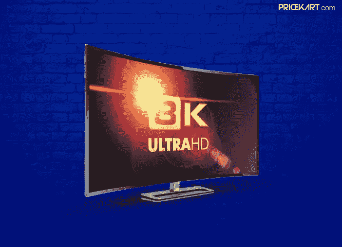
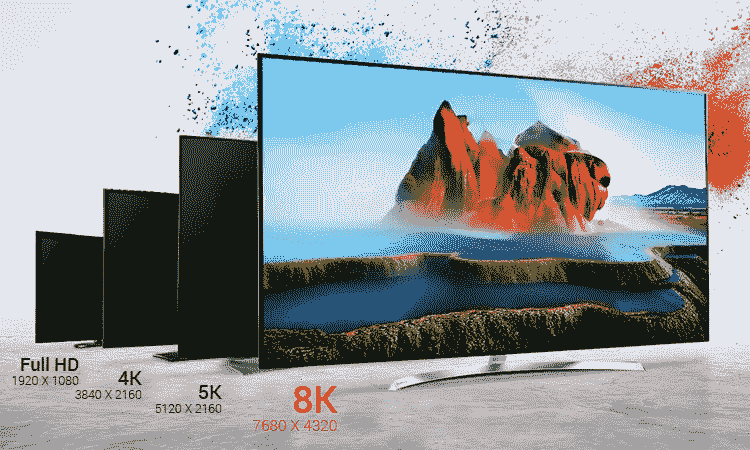
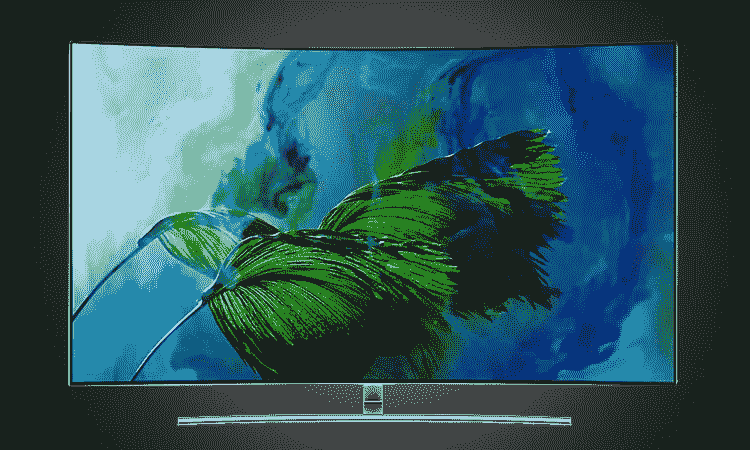
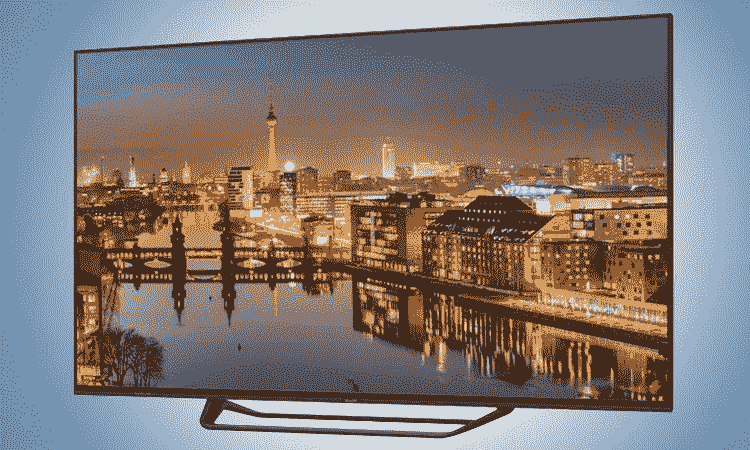

# 8K 电视即将到来，为什么它将成为游戏规则的改变者

> 原文：<https://medium.com/hackernoon/8k-tvs-are-coming-and-why-it-will-be-a-game-changer-68a8caa71832>

Pricekart.com

感觉就像是最近我们看到 4K 电视冲击全球市场。当 4K 电视的概念最终开始深入人心时，嘭，我们被引入了 8K 电视的概念。技术世界中没有什么是永恒不变的，一切都在进化，变得更好更大。同样，8K 电视将在电视市场上扮演一个改变游戏规则的重要角色。

事实是，即使在今天的现代世界，我们的生活也依赖电视作为主要的娱乐来源。当电视的分辨率从全高清到 4K 时，这被认为是图像质量的一大飞跃。随着趋势的变化，我们可能很快就会有机会观看 8K 分辨率的内容。以下是我们对 8K 电视的期望。

## 什么是 8K 电视？

当我们刚买了 4K 电视时，大多数人都想知道 8K 电视到底是什么。简单地说，如果我们认为 4K 是我们见过的最清晰的图像分辨率，那么 8K 分辨率就是未来的里程碑。就在短短几周前，[**LG 在 CES 2018 上宣布了有史以来第一款 8K 电视**](https://www.pricekart.com/blog/lg-announcing-worlds-first-8k-oled-tv/) 。

Pricekart.com

新推出的电视使 8K 电视的像素达到 7680 x 4320，这不仅是 4K 分辨率的两倍，而是四倍。屏幕上总共有 **33，177，600 个像素**，区分像素结构变得几乎不可能。将它命名为 8K 或[超高清 8K](https://en.wikipedia.org/wiki/Ultra-high-definition_television) 的另一个原因是图像宽度约为 8000 像素。

## 8K 分辨率是不是有点过了？

它肯定不是。8k 分辨率也称为 4320p，由 7680 x 4320 像素组成。尽管屏幕分辨率之间的差异对人眼来说不是很明显，但这是一个很大的因素。全高清电视提供 200 万像素的图像质量，4K 电视提供 800 万像素的图像质量，最后，8K 电视拥有 3300 万像素的图像质量。凭借 3300 万像素的图像质量，我们终于可以享受期待已久的令人印象深刻的电视观看体验。

Pricekart.com

## 8K 电视何时上市？

大多数高端电视品牌都在努力让 8K 电视进入市场。这意味着我们可以期待 8K 电视在 2018 年至 2020 年间随处可见。另一个要考虑的主要因素是，4K 电视对市场来说仍然相对较新，因此 8K 电视可能需要一段时间才能在观众中引起兴奋的反响。

因此，如果你一直在考虑 [**购买一台新电视**](https://www.pricekart.com/electronics/televisions) 或者考虑等待 8K 分辨率，最好的选择将是从广泛的选项中选择一台 4K 电视。此外，随着新的 8K 电视在市场上的推出，用户也必须为全新的观看设备做好准备。从电缆、媒体流、蓝光播放器和游戏系统，一切都必须升级到支持 8K 分辨率。

Pricekart.com

## 8K 电视会被认为是游戏改变者吗？

目前，还不清楚 8K 电视是会席卷市场还是会在其统治时期销声匿迹。然而，可以肯定的是，他们将成为游戏规则的主要改变者。与猫或鹰不同，人眼几乎不可能区分 4K 和 8K。但同样重要的是要记住，电视的屏幕尺寸和观众与屏幕的距离是两个主要因素。

因此，屏幕尺寸和距离越大，沉浸式观看体验就越好。毕竟，即使是 4K 电视也不是一夜之间开始流行的。甚至对 4K 电视的宣传也需要时间。我们可以期待 8K 电视也是如此。此外，一旦这些电视开始进入消费者的头脑，就没有什么能阻止它们了。