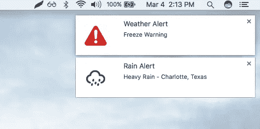
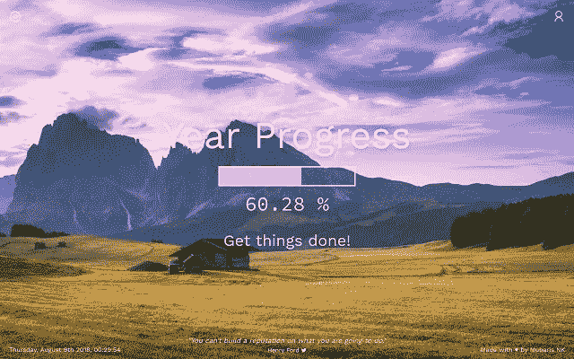
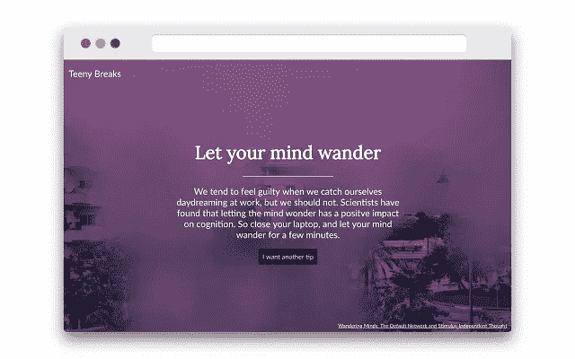
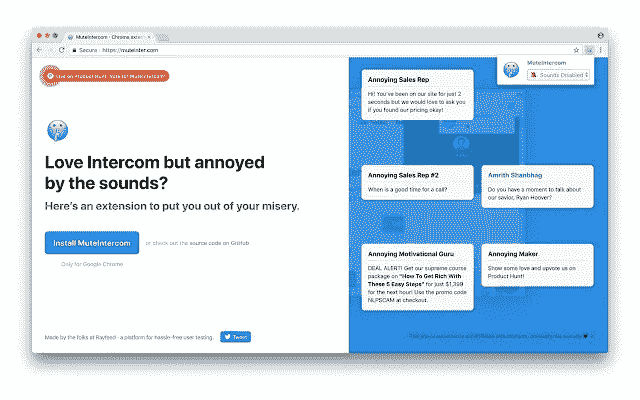
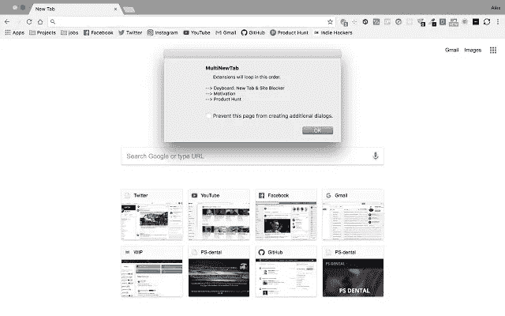
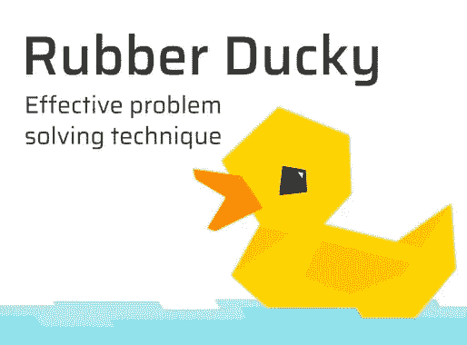
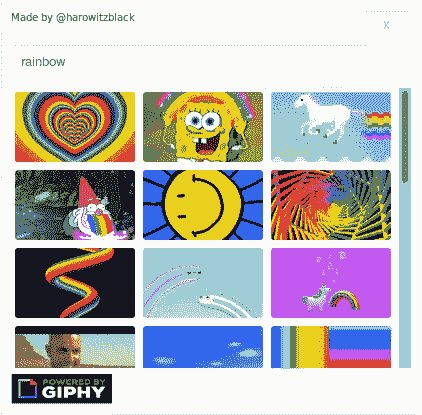
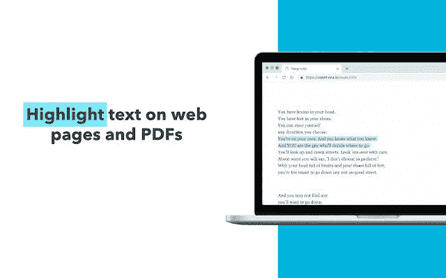

# 独立制作人打造的 10 款最佳 Chrome 扩展

> 原文：<https://medium.com/hackernoon/9-best-chrome-extensions-built-by-indie-makers-d74f91217cb2>

2018 年，我们看到了许多独立制造商推出的新产品。独立制作人周围的生态系统正在快速增长，像[这样的小社区正在发展](http://wip.chat)、[妇女制作](https://womenmake.com/)、[独立黑客](https://indiehackers.com)、[制作人杂志、](https://makermag.com/)、[制作人厨房](https://makers-kitchen.slack.com/)激励更多的人成为独立制作人。独立制作人的趋势不可阻挡。2019 年独立制造商将推出越多的产品。

谷歌 [Chrome](https://hackernoon.com/tagged/chrome) 已经成为趋势中使用最广泛的[浏览器](https://hackernoon.com/tagged/browser)。有了可用的 Chrome 开发工具、插件和附件，网络开发变得更加容易。这一次，我们将重点关注由独立制造商构建并在网络商店中提供的 chrome 扩展。看看这些最好的 chrome 扩展:

# [1。快速编码—免费在线编程课程](https://chrome.google.com/webstore/detail/quickcode-free-online-pro/nnigpbiaggiephcndokoaongeefpbdcj?hl=en&ref=producthunt)

Chrome 的快速代码是一个扩展，每天在浏览器的新标签中提供免费的在线编程课程。通过此扩展，您可以获得与以下内容相关的免费在线课程的更新:

*   各种编程语言
*   Web 开发
*   前端开发
*   移动应用开发
*   区块链
*   机器学习
*   数据库ˌ资料库
*   数据科学

# [2。天气延期](https://weatherextension.com/)

天气扩展是一个浏览器扩展(Chrome|Firefox|Opera ),用来满足你在浏览器中快速查看天气预报的愿望。这是蒂姆发来的。

该扩展在全球拥有超过 133，000 名用户，并被翻译成 12 种语言。此扩展中可用的功能有:

*   由黑暗天空 API 提供动力
*   多语言支持
*   地理/自定义位置
*   选择华氏或摄氏
*   每小时预报
*   5 天预报
*   12 小时/24 小时时间格式
*   天气警报

# [3。年进度](https://chrome.google.com/webstore/detail/eternity/hmejblemllciaklhffpinjgkbngcoopb)

Mubaris Nk 通过让您对其功能和结构保持动力，创建了这一扩展。使用此扩展，您可以:

*   用进度条记录你的成长。
*   用(有趣和丰富多彩的)动机取代(无聊和白色的)新标签页。
*   每当你打开一个新的浏览器标签，就可以精确地看到一天、一周、一月和一年的进度百分比。
*   如果你喜欢，可以在每个标签或渐变上欣赏美丽的新图像。
*   在每个标签上获得新的激励性报价。

# [4。小小的突破](https://chrome.google.com/webstore/detail/teeny-breaks/gfcfendehdonmfflgpkkaijdfbafkdfa)

Teeny Breaks 是由[安妮-劳雷·勒康夫](https://medium.com/u/c7f1dfa30a15?source=post_page-----d74f91217cb2--------------------------------)创建的 Chrome 扩展，用于在你每次打开新标签页时向你展示一个基于科学的正念技巧。这一扩展为您带来:

*   基于科学的注意休息小贴士。
*   在你打开的每一个新标签里都有正念提示，这样你就可以充分利用你的短暂休息，所有这些都有科学研究的支持。

# [5。静音对讲机](https://chrome.google.com/webstore/detail/muteintercom/gfcdbfadghgpcbaiiedpdhpdolffkojl)

Mute Intercom 是一个免费的 Chrome 扩展，可以阻止来自 Intercom 小工具的恼人的通知声音。由[沃伊泰克·维特科夫斯基](https://medium.com/u/2e6819c722b2?source=post_page-----d74f91217cb2--------------------------------)创作

# [6。MultiNewTab](https://chrome.google.com/webstore/detail/multinewtab/dcekaapllellbikbhfgbacoebbopjhbl)

从 [Alexander Sideris](https://medium.com/u/b59ba6d065c1?source=post_page-----d74f91217cb2--------------------------------) 开始，使用这个免费的 chrome 扩展，您可以:

*   同时使用多个“新标签”chrome 扩展。
*   使用多个“新标签”扩展，无需手动启用和禁用它们。

# [7。橡胶鸭子](https://chrome.google.com/webstore/detail/rubber-ducky/hjfbmplihnjfnkdfhkjcddhflcheeoik?ref=producthunt)

橡皮鸭是一种基于心理学的技术，它能让你集中注意力，有意识地更快找到解决方案。

决定不了今天选什么口味的咖啡？试图理解代码中的错误？想找到一种方法让你的车自动驾驶吗？不知道如何使用新的小工具？和橡皮鸭说话！Gleb Sabirzyanov 创造了这个惊人的扩展。

# [8。用于产品搜索的 Gif 选择器](https://gifkitty.xyz/)

由[本](https://medium.com/u/c1cf3116944?source=post_page-----d74f91217cb2--------------------------------)创建的 GifKitty 可以让你通过在商品搜索上添加 gif 来表达更多。加个 gif 给创客加油。让他们笑或让他们哭，这完全取决于你。

# [9。雅典娜](https://chrome.google.com/webstore/detail/athena/ngkinkknobojamikjhodnojnpkbgpddp)

Athena 是一个免费的 chrome 扩展，用于在 pdf 和网页上高亮显示文本和做笔记。您的文章和重点会自动整理到一个地方。这个扩展来自于[乔纳斯 max sota](https://medium.com/u/cfba375bf76e?source=post_page-----d74f91217cb2--------------------------------) 。

# [**10。社交分享预览**](https://chrome.google.com/webstore/detail/social-share-preview/ggnikicjfklimmffbkhknndafpdlabib)

通过社交分享预览扩展，你可以看到一个网站在 Twitter、脸书、LinkedIn 或 Google+上分享时的预览效果。我们将向您展示预览片段将如何在所有这些平台上显示，包括标题、描述和图像。这是一个免费的简单的小扩展，可以帮助你作为一个开发者、博客所有者或社交媒体的男孩或女孩。由[阿明·乌尔里希](https://medium.com/u/f465d383dea7?source=post_page-----d74f91217cb2--------------------------------)创作

给我鼓掌！你可以给 clap 50 次，让更多的人发现和知道这个帖子，当然，不要忘记分享。

让我们看看掌声！