# 你不能错过的 9 个最佳酒店网站设计的例子！

> 原文：<https://medium.com/hackernoon/9-examples-of-the-best-hotel-website-design-you-cannot-miss-out-11a4c9e6236f>

酒店网站设计应该美观和吸引人，以建立品牌和提高销售。这里有 9 个最好的酒店网站设计例子脱颖而出。

舒适的住宿体验将是一次愉快旅行的额外收获。因此，通过酒店网站在网上预订酒店成为一种趋势。做一个巧妙的酒店网站设计是获得良好印象和增加销售额的保证。

# 9 个你应该看看的最佳利基酒店网站设计

# 1.【Risveglio 赤坂酒店

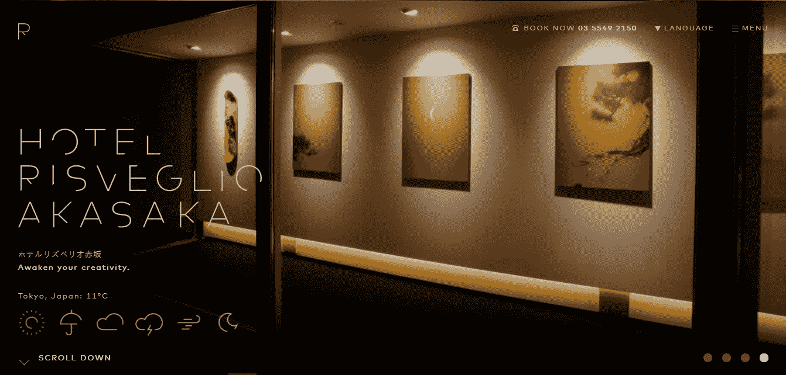

地点:日本

酒店网站设计特点:

*   动态天气图标
*   酒店内部背景

Risveglio Akasaka 酒店是一家 2015 年开业的酒店。从用户反馈来看，这是一家在家具、室内装饰等各个方面都体现设计的酒店。酒店房间和酒店大堂的设计都赢得了用户的好评。

网站整体 [UI 设计](https://www.mockplus.com/blog/post/best-app-ui-design/?r=grace)风格简洁明了。酒店网站首页以酒店内部装修为背景。简单的字体和图标，界面干净优雅。

旋转图的显示为用户提供了多维空间体验感。建筑设计和灯光的色彩非常舒适，不单调。

网站底部的动态天气图标看起来很醒目，很温馨。对于其他酒店网站来说太容易被忽略了。但是从用户体验的角度来说，酒店 Risveglio Akasaka 做得非常好。此外，滚动导航自然地将用户引导到预订页面，提高了网页对话率和订单数量。

# 2.[卡赞吉莉娜](http://www.casangelina.com/)

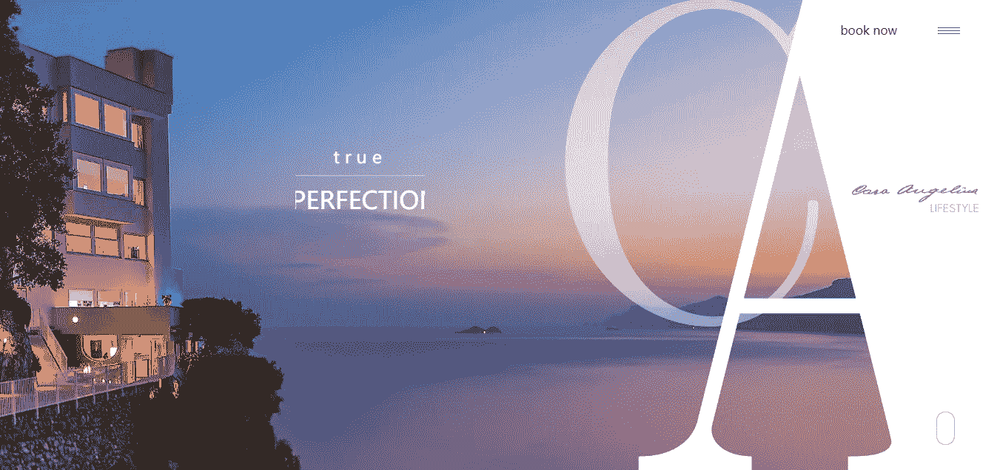

地点:意大利

酒店网站设计特点:

*   页面动画
*   页面背景音乐

世界十大悬崖酒店之一的 Casangelina 酒店坐落在阿马尔菲海岸的悬崖上。客人可以在酒店露台的全景室外游泳池放松。有一个摩洛哥风格的酒吧，客人可以在那里享受一杯香槟。当然，包括私人厨房和管家服务。电梯下降 200 级台阶到达海滩，可以乘坐酒店的私人游轮到其他岛屿享受阳光。

通过极简主义的用户界面设计，滚动区中图片和字体的融合增强了网页浏览的沉浸感。这是 UI 设计和用户体验的良好结合。背景音乐和动态酒店全景视频增加了视觉真实性，让用户从其网页设计中感受到整个酒店的优雅。

# 3.[海港套房](http://www.harbor-suites.com/)

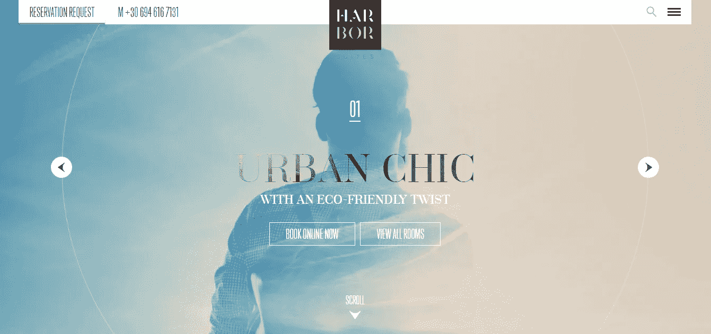

地点:希腊

酒店网站设计特点:

响应式设计

网站的[导航设计](https://www.mockplus.com/blog/post/mobile-navigation-menu-design/?r=grace)反映出这是一家为商务和休闲旅客设计的酒店。优越的地理位置为商务人士或休闲游客提供了极大的便利。

网站的响应性布局使 CTA 在 PC 和移动设备上保持用户的视觉焦点。在线预订、房间预览和网站导航对用户来说总是显而易见的，可以引导用户方便快捷地打开网页。

进化的页面动画和卡片设计是网站介绍和增加对话的好例子。

# 4. [NISEKO HAKUUNSO](https://nisekohakuunso.com/ja/)

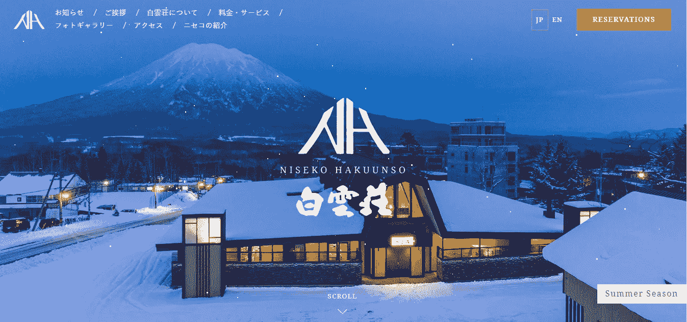

地点:日本

酒店网站设计特点:

针对季节的用户界面设计

冬夏不同的 UI 设计集，是酒店网站的一个创意设计。飘散的雪花和远处的富士山与酒店的“白云”主题相呼应。虽然 Snow 的动态 UI 设计引人注目，但这并不妨碍用户注意到深色背景上的白色导航栏。

# 5.瑞士酒店

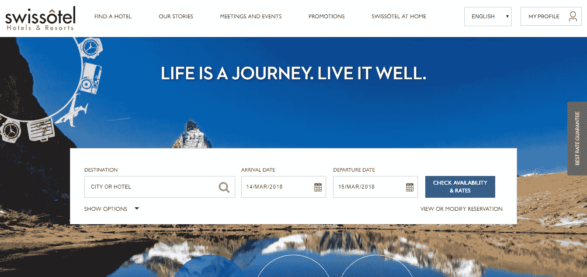

地点:瑞士

酒店网站设计特点:

横幅设计

瑞士酒店是一家国际连锁酒店，白色背景，深色色调。横幅整齐分开，使网站整体看起来整洁干净。请注意，CTA 位置的空白让你的网页布局对比清晰，也是迎合用户阅读习惯的好方法。

# 一些度假酒店网站设计:

# 6.世界之巅

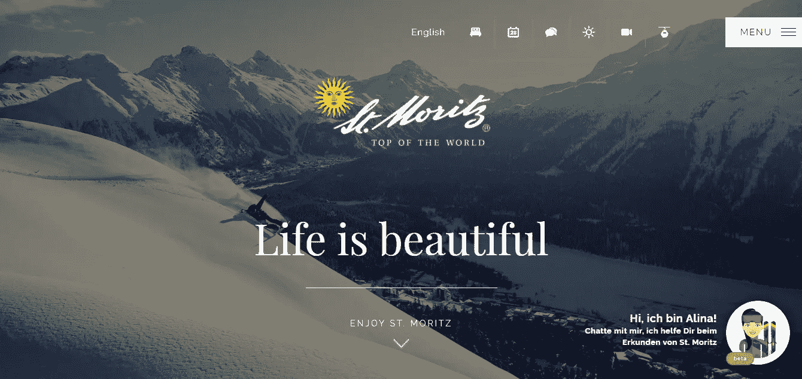

# 7.[承运人](http://www.carrier.co.uk/) -享受奢华定制假期

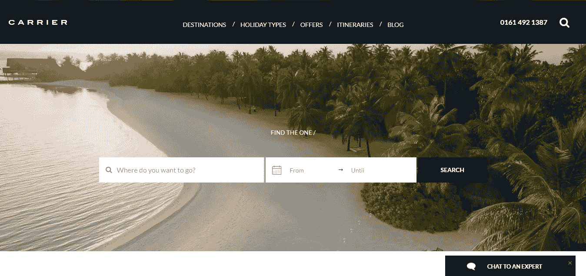

# 8.[韦斯拉科](http://www.weslacotx.gov/)——韦斯拉科市。谢谢

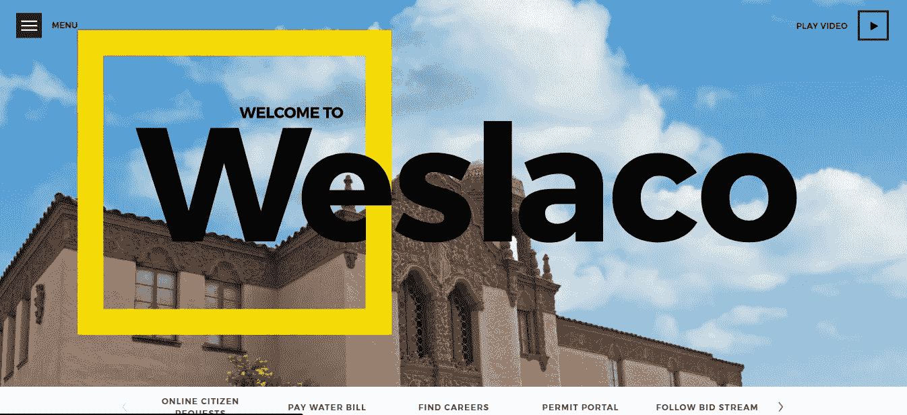

# 9.芸香属森林探险网站

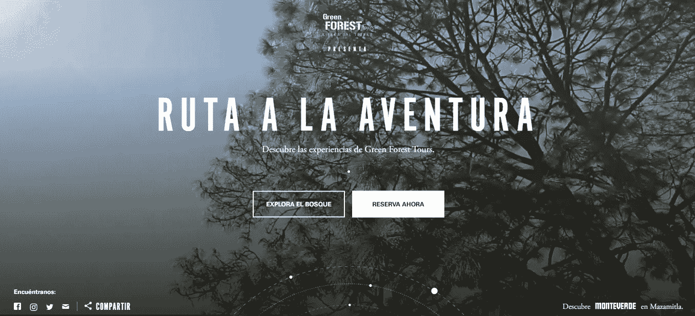

# 如何打造一个现代化的酒店网站设计？

在我看来，也许你可以遵循 5 条规则:

**1。** [**响应式设计**](https://www.mockplus.com/blog/post/best-responsive-web-design/?r=grace) :酒店网站应该在所有设备上都得到很好的支持。

2.卓越的用户体验:简化的网站浏览流程可以带来良好的用户体验。因为如果很难找到共同页面或者到达预订页面完成购买，很可能会失去很多潜在用户。

3.讲故事:一旦客人入住酒店，你的网站知道下一步该做什么吗？能聪明的指导下一次行程吗？

4.便捷预订:尽可能简化预订过程，以获得最大回报。繁琐的用户信息和支付信息填写可能导致用户流失。

5.视觉现实:最好最有效的网站是吸引访问者花时间去探索的网站。专业摄影和视频是讲述故事的绝佳媒体，尤其是对酒店和度假村而言。

一个酒店网站设计的成型一般要经历很多设计流程。从一开始，在原型设计阶段，它就决定了网站的页面布局。好的工具将帮助你事半功倍。我就以 [Mockplus](https://tower.im/projects/4d5e9e452f424e3aa5f06b52f45382a1/docs/e6fe88800608423d9917ad954ce2e40a/www%E3%80%82mockplus.com/?r=grace) 制作的一个网站原型为例，向大家展示一下这个快速原型工具的魅力。

# 如何从原型阶段用 Mockplus 制作自己的酒店网站设计？

在开始之前，让我们看看上面列出的 9 个最好的酒店网站设计的共同点:

*   大图片背景
*   酒店名称或酒店主题标志居中
*   导航栏信息显示在网站的边缘
*   功能图标
*   GIF 动态图片

总结了这些共同点之后，就可以开始用 Mockplus 做酒店网站设计或者其他类型的网站设计了。

温馨提示:如果你是喜欢自由快速原型化的个人用户，可以选择 Mockplus 个人版。如果是 5 人左右的小团队，需要团队合作和项目管理，可以使用 Mockplus 3.3 Team Edition 功能。(Mockplus3.3 新增，免费体验团队管理和所有专业功能！)

好吧，我们开始吧！哎呀，你得提前处理好 Mockplus 账号和软件。(如果有，就登录进去。如果没有，可以[免费注册一个账号](https://www.mockplus.com/register/?r=grace)。)

第一步。打开软件，选择创建一个 web 项目。

第二步。熟悉软件界面:

从左到右，左侧是常用工具菜单栏、隐藏项目树、图标库、组件库及其细分。

软件的中间区域是原型设计界面

右边是一个组件属性、交互参数属性和页面属性的组合面板。

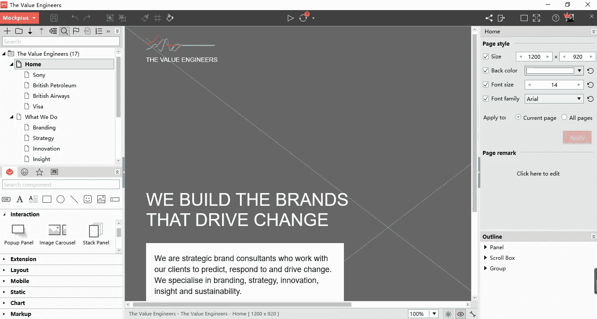

步骤 3:使用“Image”组件导入徽标图像和大页面图像作为网页的背景

步骤 4:使用 Mockplus 快速功能进行快速设计:

网格和自动填充功能可以快速创建相似格式的页面。

组件样式功能可以同时为同类型的多个组件设置样式，省时又方便

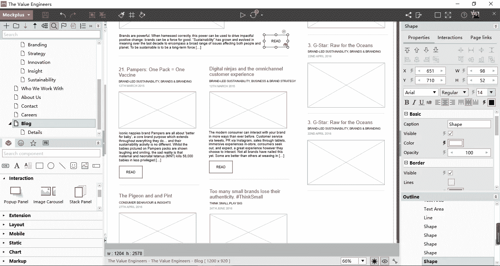

步骤 5:添加交互:页面之间的交互，或者组件之间的交互。([如何在 Mockplus 中设置交互](http://doc.mockplus.com/?p=119))

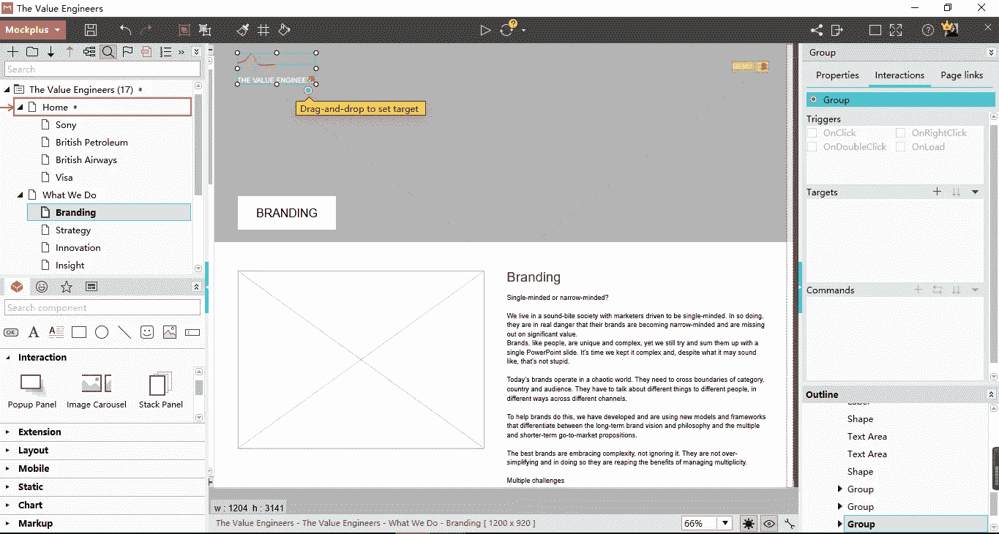

第六步:点击 F5 实时预览或导出演示包预览。

# 结论:

以上 9 个最佳酒店网站设计案例，非常漂亮，很励志。希望这些网站设计的例子能激励你做出更多伟大的设计。你可以在 [TheHotSkills](https://www.thehotskills.com/) 中找到更多的网页设计灵感。熟能生巧。无论是网站原型设计还是手机 app 原型设计，用 Mockplus 练习一下自己的设计原理和技巧都还不错。

【www.mockplus.com】最初发表于**。**