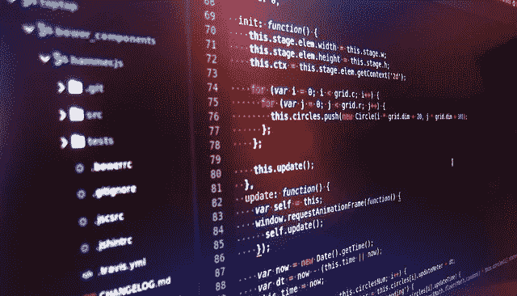
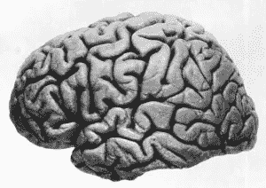

# 我在编写棋盘游戏规则时学到的 9 件有趣的事情

> 原文：<https://medium.com/hackernoon/9-fascinating-things-i-learned-while-coding-up-the-rules-of-a-board-game-81df3330b938>

我最近决定将棋盘游戏[禁岛](https://boardgamegeek.com/boardgame/65244/forbidden-island)的规则写成代码。

我想这听起来像是一个奇怪的决定，不是吗？这实际上是我现在的一个更大目标的一部分，教我自己一些实用的机器[学习](https://hackernoon.com/tagged/learning)。作为这次旅程的一部分，我从 [YouTuber Jabrils](https://twitter.com/sefdstuff) 那里听到了一个伟大的想法，那就是给自己设定一个你感兴趣的重大挑战，并努力克服这个挑战。对于贾布里勒来说，他的挑战是让一个人工智能控制一个阿甘正传角色在游戏中跑来跑去。对于我的挑战，我已经决定我要建立一个可以玩禁岛的人工智能。(而且赢！)

显然，如果你要让一个人工智能玩游戏，你首先需要一个数字版本的游戏让人工智能玩。我知道写游戏规则会有点分散注意力，但我还是决定试一试。我在 [fast.ai 机器学习课程](http://forums.fast.ai/t/another-treat-early-access-to-intro-to-machine-learning-videos/6826)上取得了一些不错的进展，但这是一项艰苦的工作，我认为这将是一次有趣的绕道。

结果花的时间比我预期的要长。虽然我最初只打算将游戏规则编码成代码，但我最终被编写一个可以玩这个游戏的程序的想法所诱惑。在玩游戏的时候，把我自己的自动想法转化成可以自动执行的代码是一个相当大的挑战。以下是我在这次旅程中学到的九件最重要的事情:

# 学习#9: Kotlin 是一种很棒的编程语言

我在 [Kotlin](https://kotlinlang.org/) 中为这个项目写了代码。我已经在工作中使用 Kotlin 大约六个月了，[在业余时间用它练习](http://www.grahamlea.com/2018/04/exercism-io-kotlin/)，我真的开始喜欢它了。现在，当你做一些 Kotlin 已经融入语言的事情时，比如创建一个数据类或者过滤一个列表，它有明显的好处。然而，我发现在商业环境中编写的许多其他代码并不复杂，不足以真正理解拥有一种功能性很强的语言的好处。

然而，通过这个项目，我看到了科特林真正脱颖而出。有很多次，我能够用两三行代码编写相对复杂的逻辑，我坐下来想，“伙计，如果我必须用 Java 写，那会很粗糙，很吵杂，很恶心。”我充分利用了密封类、智能强制转换和高级集合函数链(无需学习全新的集合库)，同时利用了一些 Java 可用的最佳工具，如 JUnit 5 和 AssertJ。事实上，有时候我真的怀疑，如果我开始用 Java 而不是 Kotlin 来编写它，我会不会因为沮丧而半途而废。

# 学习#8:简单游戏的规则实际上非常复杂

《禁岛》不是我所说的复杂游戏。大概和垄断在一个层次上。当然，你第一次玩的时候需要花 20 分钟来阅读和理解规则，但是之后你可以教一个 6 岁的孩子，他们可以玩得相当熟练。

然而，将这 7 页的规则转化为代码却是一项艰巨的任务。我用 854 行相当简洁的功能代码和 2783 行测试复制了它们。这是相当多的计算机指令，尤其是考虑到这些指令设法用不到 200 行描述相同的功能。

# 学习#7:游戏的书面规则可能是模糊的

在编写规则时，我发现自己至少有两次需要在一个实现和另一个实现之间做出决定，但是规则并没有指定哪个是正确的。我最终在谷歌上搜索了这个歧义，发现其他人也遇到了同样的问题(可能是在玩游戏的时候，而不是在编码的时候)，并且游戏的设计者已经在线解决了这个歧义。

这是一个我在工作中多次观察到的现象的例子，代码迫使我们对所有的可能性都非常精确，但那些规定规则(或要求，视情况而定)的人并不一定考虑到每一种可能性——只有当我们试图将他们*规定的*转化为覆盖所有情况的明确的机器指令时，我们才能发现未知的分支。

# 学习#6:人类不会考虑所有的可能性

用代码实现这个游戏的部分工作是实现一个函数，返回给定状态下所有可能的动作。当我完成的时候，我首先被这个函数需要多少代码的复杂性震惊了，其次被它的输出震惊了:这个函数返回超过 60 个可能被执行的操作是很常见的情况。当然，当我玩这个游戏的时候，我从来没有想过，“嗯。我有 60 种可能的移动方式。让我一个一个检查。”代码告诉我，当人类玩游戏时，我们一定在做计算机做不到的事情:我们在走捷径。

# 学习#5:我们的大脑非常擅长匹配模式和排除大量选项

我不同时考虑所有可能选项的原因是因为我潜意识里意识到许多选项都是垃圾！当玩这样的游戏时，人类的头脑中通常会有一些当前的目标，我认为我们的潜意识正在根据这些目标对选项进行模式匹配。不像电脑，我在寻找好的事情去做，而不是所有我能做的事情。在我考虑之前，我的大脑已经排除了太多的坏选择，所以只有潜在的有利选择才会浮现在我的意识中，让我进行详细的比较。

# 学习#4:获得统计显著性真的很有挑战性

当你创建一个用来玩游戏的程序时，唯一能知道它好不好的方法就是让它玩*很多*游戏。当您迭代解决方案时，能够检查您的更改是改善了解决方案还是使其变得更糟变得很重要。起初，这很容易。我从一个完全随机的游戏玩家开始，并添加了对结果有明显影响的简单规则。我让代码在各种不同的配置下随机玩 1000 次游戏。我选择 1000 是因为我编写了一个小程序，测试了不同批量的随机游戏玩家的方差，发现在 1000 左右，不同批次之间的方差基本上已经收敛了。

然而，随着我的深入，我发现有时我的改变对结果的改善很小，有时，毫无意义地，一个新的重要规则使结果变得更糟。有一段时间，我选择对这些异常现象保持困惑，只是放弃那些看似糟糕的想法。然而，在发生了几次之后，我开始好奇了。我想到要对我的基于规则的自动机运行差异检查代码。你能猜到我发现了什么吗？当基于规则的游戏玩家玩 1000 个随机批次的游戏时，批次之间的结果差异是巨大的！事实上，基于规则的播放器的方差只在我将批量增加到*32000*时才收敛。当我添加了一个规则并看到结果变得更糟时，我实际上看到的只是统计噪声！比我忽略的规则更糟糕的是，许多我看到轻微改进的规则可能*也*只是统计噪音。这并不意味着它们是哑弹，但我没有可靠的数据来证明它们不是哑弹。我认为 1，000 个随机游戏很多，但事实证明，在像棋盘游戏自动机这样复杂的东西中获得具有统计意义的样本需要大量的数据点。

# 学习#3:简单的规则赢不了游戏

我在我的基于规则的游戏播放器上工作了几个星期。我花了大部分时间坐火车来研究它。我晚上花了很多时间在这上面。我对此明知故犯地过度兴奋了。我妻子听腻了这件事。你认为这些努力给我带来了什么？嗯…它可以赢…一些游戏。可悲的是，如果你在我开始之前就问我，花那么多时间编写解决方案能得到什么样的结果，这远不是我想象中的惊人解决方案。当我的自动机玩游戏中最简单的配置时，它基于规则的方法可以赢得令人印象深刻的(*咳*) 20%的游戏！在最难的硬配置上，它只赢了 0.2%。与我自己的结果相比:我认为我已经在最简单的配置上玩了六七次游戏，我的胜率是 100%。

我不认为这以任何方式表明计算机不可能擅长赢得这场游戏(我会说“好”最好被定义为明显超过一半的时间)。然而，它确实表明，像这样的游戏并不容易通过简单的形式规则来赢得，“如果游戏目前符合这种状态，就采取这种行动”。有时候，当我们决定如何玩游戏时，我们可能会觉得这就是我们正在做的事情，但实际上还有更多。我们知道在这次转弯之后的几个转弯中可能会发生什么。我们可以意识到游戏中已经发生的事情可能会影响未来的状态。我们能够制定中期目标，并坚持朝着目标努力，同时也能够在看到灾难临近时放弃这些目标。追踪目标、回顾历史和进行前瞻性预测都是可以添加到自动化游戏玩家身上的东西，尽管复杂性不断增加。然而，作为人类，我们几乎不假思索地做这些事情，这难道不令人着迷吗？

# 学习#2:游戏令人着迷

你坐下来玩一个[桌游](https://hackernoon.com/tagged/board-game)。你可能要花 5-20 分钟来阅读规则。这似乎很简单。你通过它，找到一些挑战和如何克服它们，学习什么是关键的机制，以及如何操纵它们为自己的利益服务。我们玩的大多数游戏都简单有趣。但事实并非如此。我是说，它们很有趣，但不简单。对人类来说，它们看起来很简单，但许多游戏非常复杂，以至于对它们的计算解决方案是一个巨大的挑战。

这一挑战如此之大，以至于游戏给数学的整个分支命名为[博弈论](https://en.wikipedia.org/wiki/Game_theory)，它实际上远远超出了社交游戏的范畴，分析了大量涉及理性、战略互动的情况:这是决策的数学。事实上，许多游戏和相关问题非常复杂，以至于我们很难准确理解*它们有多*复杂。那是什么意思？计算机科学中最重要的未解决问题之一是确定解决方案容易*验证*的问题是否也可以容易*解决*(其中“容易”意味着验证或解决方案可以在不随问题规模增长呈指数增长的时间内完成)。[这里有一个很棒的视频，更详细地解释了这个问题](https://www.youtube.com/watch?v=YX40hbAHx3s)。简而言之，尽管我们对游戏的数学知识了解得还不够多，还不足以确定地说其中一些问题是容易解决的还是不容易解决的。如果这听起来像是一个有趣的问题，也许你应该试一试:如果你解决了它，将有 100 万美元的奖励。

# 学习#1:在你的脑袋里有一台肉做的电脑，而且功能强大得离谱

随着我艰难地完成这个练习，并以一种产生上述所有认识的方式对它进行反思，有一件事变得越来越清晰:人类的大脑是惊人的。在我们的一生中，我们可能都听过或说过很多次，但我认为我们仍然普遍低估了我们大脑工作的复杂性和它的简易性。当然，计算机可以将两个十位数相乘，然后以比我们呼吸还快的速度找到平方根，但是人类可以只使用身体姿势和眼神交流等微妙的线索来做像在涩谷过马路这样的事情，而不会撞到任何人。给人工智能机器人团队一个目标，看他们笑。我们如何完成如此复杂的壮举？带电荷的 [*肉*](http://www.terrybisson.com/page6/page6.html) ！

将来我可能会尝试一些其他的方法来创建一个禁岛解算器。在这一点上，我不知道我会有多成功，甚至不知道如何计算与糟糕的结果相比什么是好的结果。然而，无论我多么接近完美的电脑播放器，我的大脑和我的笔记本电脑之间总会有一点不同。虽然一个程序可能最终在禁岛取得 100%的成功，但只有人类的大脑才会在游戏结束时——无论是赢还是输——对自己说，“那很有趣”。

# 想试试用代码解决禁忌岛吗？

到目前为止，作为这个项目的一部分，我写的所有代码都可以在 GitHub 上找到。我已经构建了代码，让其他人可以轻松编写自己的游戏自动机，在[自述文件](https://github.com/GrahamLea/forbidden-island-kotlin/blob/master/README.md)中有如何做的说明和提示。如果你尝试了，一定要联系我，让我知道你做得怎么样！

【grahamlea.com】这个故事最初发布于**。**

**图片演职员表:
'* [*游戏卡壳时的酷 JavaScript 代码*](https://www.flickr.com/photos/qubodup/16258492451) *'作者伊旺·加博维奇
'* [*暧昧标志*](http://www.geograph.ie/photo/4311125) *'作者伊恩·卡珀
'* [*抛硬币*](https://www.flickr.com/photos/icma/3635981474) *'作者 ICMA 照片
'* [*对*](https://commons.wikimedia.org/wiki/File:Right_hemisphere_of_J._Pi%C5%82sudski%27s_brain.jpg)*