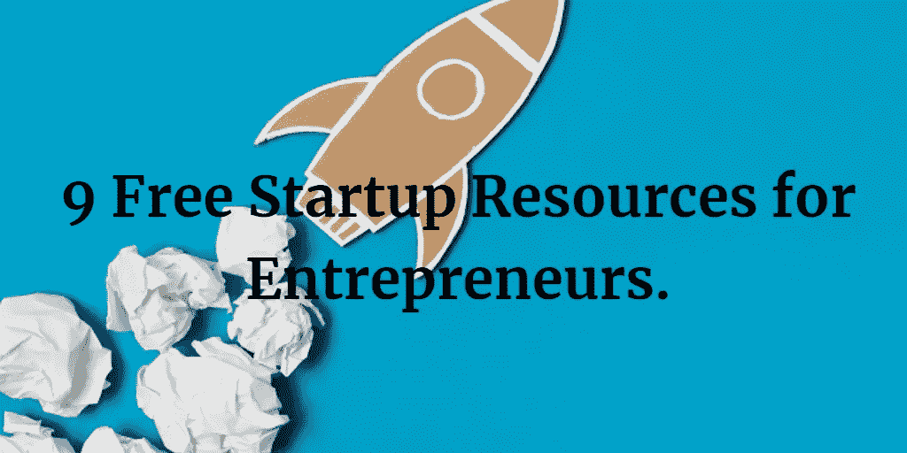
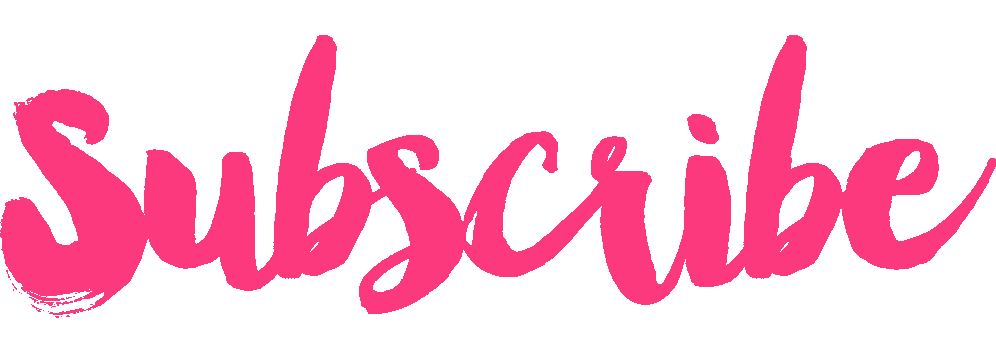

# 9 为创业者提供的免费创业资源。

> 原文：<https://medium.com/hackernoon/9-free-startup-resources-for-entrepreneurs-c71304c2b40c>

你是企业家吗？

你是否也希望节省一些钱，并为你的创业获得最好的资源？

9 Free Startup Resources for Entrepreneurs.

省钱不是坏事，但是以牺牲质量为代价来省钱绝对是坏事。

但是如果我说你可以在不影响质量的情况下省钱，那么你会给我什么呢？

开玩笑的。(但是，如果你仍然想给我一些东西，那么就给这篇文章一些掌声，我会很高兴。)

是的，有很多工具会在你的创业之旅中给你很大帮助，而且不会让你付出任何代价，相信我，它们是我一生中测试过的最好的工具之一。

感谢上帝和开发者，他们给了我们很棒+免费的东西。

现在，不要浪费太多时间，让我们探索 9 个免费的创业者创业资源-

1.  中等-我怎么能不在这里列出中等。媒体是如此强大和易于使用，以至于许多企业家已经转向媒体并离开了他们的个人博客。媒体已经给了博客们最好的工具，现在它也影响了很多人，他们已经成为这里的全职博客，也赚了很多钱。(我不是，因为 Stripe 在印度没有。可怜的印度人！)
2.  谷歌分析-没有其他分析工具比这个工具更好。谷歌已经为我们提供了一堆很棒的免费工具，比如文档、表格等等。但是，对于每个需要跟踪广告的所有流量和投资回报率的企业家来说，分析是必不可少的。
3.  这是我在所有网站上使用的工具。SumoMe 提供了一套免费工具，如电子邮件列表生成器、社交分享按钮、联系表格等。它甚至可以与高级工具竞争。
4.  作为一个博客作者，我总是需要高质量的图片来添加到我的博客文章中，但是我也需要注意图片的版权。所以为了得到最好的无版权图片，我去了 Pixabay。Pixabay 是找到没有版权的图片的最好地方。
5.  Canva- Canva 让创建信息图表变得如此简单，以至于现在我们不需要专业人士来做这项工作。现在我们可以创建信息图、博客图、facebook 封面等。只需几分钟，无需任何专业技能，而且还是免费的。
6.  Yoast SEO——如果你在 WordPress 写博客，你一定听说过 Yoast。Yoast 是对你的网站和博客文章进行 SEO 的最佳工具。
7.  邮件营销巨头。MailChimp 允许你创建一个 2000 名用户的名单，而不收取一分钱。
8.  缓冲——社交媒体从不睡觉，所以你也需要一直保持活跃。Buffer 是我迄今为止用来在不同平台上安排你的社交媒体帖子的最好工具。
9.  SEMRush-终极关键词研究工具。SEMRush 是可用于内容营销策略的最佳工具之一。每次我开始写一篇新的博文，我做的第一件事就是去 SEMRush，然后决定与我的博文想法相关的最佳关键词。

如果你想在列表中添加一些东西，请随意使用评论框，帮助我增加列表。

也发表在 iStartup 的博客上。

你喜欢这个吗？

如果是的话，我还有很多给你。点击下图订阅我的时事通讯。

