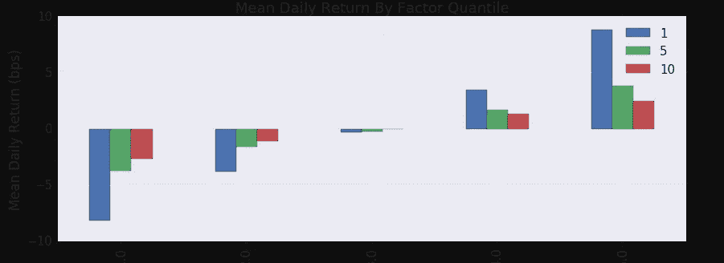

# 算法交易的 9 大工具

> 原文：<https://medium.com/hackernoon/9-great-tools-for-algo-trading-e0938a6856cd>

Photo by [Adrian Curiel](https://unsplash.com/photos/PwQHfxo3Q2Y?utm_source=unsplash&utm_medium=referral&utm_content=creditCopyText) on [Unsplash](https://unsplash.com/search/photos/nine?utm_source=unsplash&utm_medium=referral&utm_content=creditCopyText)

在过去的 5-10 年里，算法交易，或称[算法交易](https://hackernoon.com/tagged/algo-trading)，受到了个人投资者的欢迎。受欢迎程度的上升伴随着工具和服务的激增，既测试也交易算法。我列出了 9 个工具，你应该考虑用在你的算法交易过程中。

# Web 服务:

以下是可以通过 web 浏览器使用的托管服务，不需要用户做太多设置。作为一个刚进入这个领域的人，我发现新的算法交易者很容易尝试。

## :

总部位于波士顿的众包对冲基金 Quantopian 提供了一个在线 IDE 来回溯测试算法。他们的平台是用 python 搭建的，所有算法都是用 Python 实现的。在测试算法时，用户可以选择快速回溯测试，或者更大的完整回溯测试，并且可以看到投资组合的表现。

直播交易于 2017 年 9 月停止，但仍提供大量历史数据。他们也有一个严肃的开发者社区，并发布一个正在进行的每日竞赛，每天有 10 名获胜者获得每月 5000 美元的奖金(*从以前的“定期举行竞赛”更新而来)。Quantopian 为获胜的算法提供资金。

 [## 量子竞赛

### 在这场量化金融竞赛中，算法编写者每月能赢得数千美元。Quantopian 提供教育…

www.quantopian.com](https://www.quantopian.com/contest) 

## (2) [QuantConnect](https://www.quantconnect.com/) :

QuantConnect 是另一个为回溯测试和实时交易算法提供 IDE 的平台。他们的平台是使用 C#构建的，用户可以选择用多种语言测试算法，包括 C#和 Python。

QuantConnect 还包含了一个来自世界各地的伟大社区，并提供股票、期货、外汇和[加密交易](https://hackernoon.com/tagged/crypto-trading)的访问。他们提供与各种名称如 InteractiveBrokers、OANDA 和 GDAX 的实时交易集成。

## (3) [量子火箭:](https://www.quantrocket.com/)

QuantRocket 是一个平台，提供回溯测试和与交互式经纪人的实时交易，具有外汇和美国股票的实时交易功能。它是专门为与交互式经纪人进行交易而设计的，以其灵活性脱颖而出。

QuantRocket 支持多种引擎——它自己的 Moonshot，以及用户选择的第三方引擎。虽然 QuantRocket 没有传统的 IDE，但它与 Jupyter 集成得很好，可以产生类似的东西。需要记住的一点是，QuantRocket **不是免费的**。定价计划起价为 19.99 美元/月，有年度选项。

# 本地回溯测试/实时交易引擎:

在今天的软件世界里，如果你在那些管理服务之外做一些努力，你会有更多的自由。如果您喜欢这种方式，我建议使用以下工具在本地进行回测:

## (4) [Zipline/Zipline-Live](https://github.com/quantopian/Zipline) :

 [## 量子/滑索

### 一个 Pythonic 算法交易库

github.com](https://github.com/quantopian/Zipline) 

Quantopian 的 IDE 建立在 Zipline 的基础上，zip line 是一个用于交易算法的开源回溯测试引擎。Zipline 在本地运行，也可以配置为在虚拟环境和 Docker 容器中运行。Zipline 带有 Quantopian 的所有功能，但不是它的所有数据。为了平衡这一点，用户可以编写自定义数据来进行回溯测试。Zipline 还提供回溯测试的原始数据，允许可视化的多种用途。

Zipline 在 2017 年停止了直播交易，但有一个开源项目 [Zipline-live](http://www.zipline-live.io/) 与互动经纪人合作。它有许多与 Zipline 相同的功能，并提供实时交易。

## (5) [反向交易者](https://www.backtrader.com/):

 [## 反向交易者-反向测试/交易

### 从 datetime 导入 datetime 导入 backtrader 作为 bt 类 SmaCross(bt。signal strategy):params =((' pfast '，10)…

www.backtrader.com](https://www.backtrader.com/) 

Backtrader 是目前最流行的回溯测试引擎之一。它是使用 python 构建的，有一个干净、简单、高效的本地运行的界面(没有 Web 界面)。需要记住的一点是，backtrader 不附带任何数据，但是你可以很容易地将你自己的市场数据以 csv 和其他格式连接起来。

从版本 1.5.0 开始，BackTrader 具有实时交易功能。这一直是 algo 交易者的热门选择，尤其是在 Zipline 停止实时交易之后。

## (6) [IBPy](https://github.com/blampe/IbPy) :

 [## blampe/IbPy

### 交互式经纪人在线交易系统的 IbPy - Python API。

github.com](https://github.com/blampe/IbPy) 

IBPy 是一个独立的第三方 python 包装器，用于 InteractiveBroker 的交易工作站 API。在 IB 开始为 python 提供官方 API 库之前，这是用 python 编写的算法连接到 TWS 的唯一方式。

IB 已经发布了一个官方的 python SDK，并且这个库正在走向过时(同时仍然与 python2 用户相关)。但是仍然有大量的实时交易引擎/工具在使用这个库，对于想学习实现 API 的人来说，这是很好的学习材料。

虽然了解这个库很好，因为它无处不在，但是如果你是新手，我们推荐 IB 的官方 python SDK。

[羊驼贸易 API Python SDK](https://pypi.org/project/alpaca-trade-api/) 用起来就更简单了！

# 分析工具:

回溯测试会输出大量的原始数据。一些 IDE 将提供基本的可视化和分析，通常是算法性能。如果您正在寻找更深入的评估，我推荐这些工具:

## (7) [Pyfolio](https://github.com/quantopian/pyfolio) :

 [## 全托派/派弗利派

### Python 中的投资组合和风险分析

github.com](https://github.com/quantopian/pyfolio) 

Pyfolio 是 Quantopian 开发的另一个开源工具，专注于评估投资组合。Pyfolio 的与众不同之处在于，它能够将不确定度引入一组静态数据点，并从用户的投资组合中评估贝叶斯指标。Pyfolio API 提供了许多可视化功能，这些功能可以在 GitHub 资源库中找到。

## (8) [Alphalens](https://github.com/quantopian/alphalens) :

 [## 量子/阿尔法透镜

### alphalens -预测性(alpha)股票因素的绩效分析

github.com](https://github.com/quantopian/alphalens) 

Alphalens 也是 Quantopian 的分析工具。与 Pyfolio 不同，Alphalens 可以很好地处理 Zipline 输出的原始数据，而不是评估投资组合，而是对预测性股票因素进行性能分析。Alphalens 在他们的 GitHub 库中有自己的可视化范围。

Median Daily Returns by Factor Quantile — one of the visualizations that alphalens offers

## (9) [交易视图](https://www.tradingview.com/):

TradingView 是一个可视化工具，有一个充满活力的开源社区。它完全基于网络，允许用户可视化数据，无论数据是纸上交易还是算法回溯测试的结果。像 Quantopian 一样，TradingView 允许用户与社区中的其他人分享他们的结果和可视化，并接收反馈。

# (奖金)执行平台又名经纪自营商:

## (10)互动经纪人:

InteractiveBrokers 是一个面向活跃交易者的在线经纪交易商。自 1978 年以来，他们一直在市场上。算法交易不是 IB 的重点，但多个引擎通过与交易者工作站的集成提供实时交易。我们在这篇文章中多次提到 IB——它们就是那么好！

## (11)羊驼毛:

最后羊驼！羊驼成立于 2015 年，是一家新兴的免佣金经纪交易商，专门为 algo trading 设计。羊驼也有一个贸易 api，以及多个开源工具，其中包括一个针对时间序列金融数据优化的数据库，称为 [MarketStore](https://github.com/alpacahq/marketstore) 。

该经纪公司计划于今年 9 月公开上市(你现在就可以使用 MarketStore)，但如果你等不及了，请访问我们的网站并[加入等候名单](https://alpaca.markets/)，争取尽早上市的机会！

 [## 羊驼| Algo 交易佣金免费，含 REST API

### 降低成本，最大化利润。Algo 贸易委员会免费。

羊驼市场](https://alpaca.markets/) 

# 要了解的其他工具:

*   [qtpylib](https://qtpylib.io/docs/latest/)——另一个简单的 python 回溯测试引擎
*   [多交易平台](https://www.multicharts.com/) —外汇和股票的自营交易平台
*   [WealthLab](https://www.wealth-lab.com/) —桌面工具，支持 C#回溯测试，富达独家实时交易
*   [eny GMA](https://enigma.co/)[Catalyst](https://enigma.co/catalyst/)—用于加密交易
*   [MetaTrader](https://www.metatrader5.com/en) —回溯测试/livetrading 桌面应用，外汇中的事实

我希望这篇关于目前可用工具的快速入门是有用的。如果你喜欢，请留下一个掌声(或两个，我不介意)。如果你认为有我错过的工具，请在下面留下评论！我总是感谢所有的反馈。

*由* [*饶*](/@raobvinnakota)

## ***请跟随*** [***羊驼***](/@alpacahq) ***和*** [***自动生成***](https://medium.com/automation-generation) ***获取金融市场、算法交易、技术方面的新鲜帖子。***

## ***你可以找我们***[***@羊驼 HQ***](https://twitter.com/AlpacaHQ) ***，如果你用 twitter 的话。***

如果你是一名黑客，并且能够创造出在金融市场上运行的很酷的东西，**请查看我们的项目“** [**免佣金股票交易 API**](https://alpaca.markets/?utm_source=medium&utm_medium=blog&utm_campaign=strategy_list&utm_content=part1) **”，在这里我们免费提供简单的 REST 交易 API 和实时市场数据。**

经纪服务由 FINRA/SIPC 成员 Alpaca Securities LLC([Alpaca . markets](https://alpaca.markets/?utm_source=medium&utm_medium=blog&utm_campaign=strategy_list&utm_content=part1))提供。羊驼证券有限责任公司是 AlpacaDB，Inc .的全资子公司。