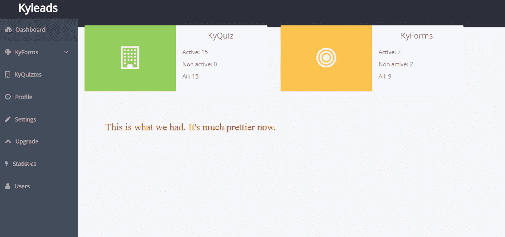

# 将软件开发人员作为非技术型创始人的 9 条经验

> 原文：<https://medium.com/hackernoon/9-lessons-learned-hiring-software-developers-as-a-non-tech-founder-a654b0ad36ac>

大约一年前，我开始考虑雇佣软件开发人员来建造 [KyLeads](https://www.kyleads.com/) 并策划统治世界。

事实证明，这比我预想的更具挑战性。我进去的时候觉得这不会比雇佣一个虚拟助理更难。

我错了。

在我创办 KyLeads 之前，我唯一一次雇佣科技人才的经历是为 WordPress 提供一次性定制或插件。

与从头开始构建产品相比，你需要理解的东西就相形见绌了。

在一年的时间里，我犯了很多错误，也学到了宝贵的经验。

现在，我更适合雇佣软件开发人员。

这篇帖子详细描述了我们在 MVP 和 [KyLeads](https://www.kyleads.com/) v1 的道路上经历的得失。

# 如果听起来好得不像是真的，那么它可能就是真的

当我决定建造 KyLeads 时，一切都是为了快速和肮脏的 MVP(最小可行产品)。我想尽快把它展示给潜在客户。

一旦他们得到了它，他们会告诉我他们喜欢什么，他们讨厌什么，我们就知道哪里需要改进。

首先，我在 UpWork 和其他几个平台上寻找人才。我建立了我的工作列表，收到了很多看起来有能力的申请。

当我问他们是否需要任何澄清时，他们会告诉我不，他们理解。

我曾以顾问的身份与客户共事过。在你理解他们的愿景之前，他们总是需要解释更多。

我得到的软件开发人员让我感到不安，因为他们缺乏准备。我放弃了自由职业网站，开始寻找代理机构或低成本服务来完成这项工作。

这时我发现了 Pebbled.io。

他们标榜自己是开发和设计工作的一站式商店。我加入了他们最底层的团队来测试服务。

我对他们的设计工作很满意，尽管它很慢，所以我升级到了服务的最高级别。

我们确定了项目的可交付成果，他们在告诉我他们做不了之前已经做了一个月。

我很生气，但他们给了我一个月的自由来补偿浪费的时间。

我还是很生气。

这好得令人难以置信。

这是我第一次考虑辞职，但也不会是最后一次。

# 外包你的核心产品从来都不是一个好主意

大约在这个时候，我随口向朋友 Eco 提到了我的项目。他没有多说，但建议我外包给一家刚刚起步的小公司。

他们更有可能给我一笔交易来扩大他们的投资组合。我接受了他的建议，回到 UpWork 寻找那里的组织代表。

我决定在印度开一家开发店，然后我们开始工作。他们给我报价 2500 美元来做一个 MVP。

从一开始，就有危险信号。他们给我介绍的人似乎和我面试的人不一样。我想我被他们队里的一个年轻队员缠住了。

他花了很长时间来设置，有可怕的沟通，通常是草率的。几个星期后，我付给他们 500 美元，要求我的工作，并结束了合同。

人们已经看到了外包产品初始开发的良好效果，但对我们来说，这是一个糟糕的举动。

我们只剩下勉强可用的代码，我对我们的进展感到沮丧。这是我第二次想放弃。

# 根据您现在的需求进行招聘，而不是根据人们将来的发展

有了外包经验后，我决定直接为我的团队雇佣软件开发人员。

我知道我负担不起美国的全职开发人员，所以我看了看聚集国外人才的不同平台。

在做了一些研究后，我发现菲律宾是一个越来越多的科技人才的目的地。我注册了 Onlinejobs.ph，设置了详细的职位描述。

我得到了很多申请人，并尽我所能进行了面试。

大约一周后，我收到了一份引起我兴趣的申请。

一个高级开发人员，让我们称他为约翰，正在培养一群学生去公司工作。他担任项目经理，同时指导他们并确保他们按时交付。

他向我保证他们很有才华，能够完成工作。

我雇佣了其中的两个。不到一周，他们就开始写代码和发货了。

我的新员工没有经验。他们边走边学，我们遇到了一个又一个问题。他们需要在项目中途学习新技术，一次拖慢我们几个星期。

我知道我将要面对的是什么，所以我努力保持耐心，但是几周拖到几个月，我需要结果。在一家自举式创业公司，你没有时间或资源在一开始就培养人才。

我犯了一个错误，低估了新员工的学习曲线。这时，我们决定请另一位高级开发人员来帮忙。

# 对你的队友有明确的责任

我回去继续工作，但这次我更有信心，因为我有约翰在那里帮我审查申请人。

我张贴了一个工作岗位，申请人蜂拥而至。约翰帮我审查了他们的技术能力。我会进行最后的面试。

我们经过一周的寻找找到了一个人，并把他融入了团队。我对技术方面需要做的事情没有清晰的认识，而且我之前的员工似乎很难与他们的新队友沟通。

我们给了他任务，但他没有按我们需要的方式完成。从我的角度来看，他也是一个关于里程碑的家伙。

我尽我所能和他一起工作，但他一直抱怨他的工作。

我的一个队友说他向他解释了一切。另一方面，他说没人告诉他任何事。

我召集了一次全体会议。

我们参加了一个电话会议——我们五个人——解决了所有的问题。在一切再次恶化之前，这帮助了我们大约一个星期。

我受够了我们的 UpWork 雇佣，并要求他交付他所做的并取消工作。他对此提出异议，并决定公开争论。

我们友好地解决了它。

回想起来，我意识到是我的错。我试图把他的任务交给另一个队友。问题是我一开始就没有明确定义我需要从他那里得到什么。

我觉得他们最有资格告诉他，因为他们需要额外的帮助。

**吸取的教训**。除非你有一个负责设定队友职责的经理，否则这是你的工作。

# 依靠你的关系网来帮助你审查人们的技术专长

我们让我们的 UpWork 雇佣走了，不久之后，我雇佣的开发团队就放弃了我。

我很生气，因为我在谈恋爱的时候保证他们会履行承诺。

**吸取的另一个教训**。

负责培养他们的约翰向我保证，他会发现新的人才。这是二月底，我们的预测差了大约三个月。

我们在 Onlinejobs.ph 上创建了另一个职位，我给了他访问我的账户的权限。在一个月的时间里，我们采访了几十名软件开发人员。约翰拒绝了他们所有人，因为他觉得他们的技能没有达到标准。

我真希望他当初能和他带来的两个人一起这么做。

继续前进。

这种情况持续了大约一个月，我最终关闭了我在 OnlineJobs 的账户，并给我的朋友 Eco 打了电话。聊了几分钟后，我告诉他我正在经历的挑战。

他嘲笑了我一会儿，然后答应帮忙雇佣软件开发人员。没几天，他为自己的技术担保后，带了个人来给我做兽医。

我们进行了一次谈话，他问我关于这个项目的问题。我无法告诉你我有多高兴，因为根据我过去的经验，不问问题的人不会给你想要的东西。

我分享了我的代码，他把它拆开，我们扔掉了一半以上。我们同意在 60 天内达成一个 MVP。

我把他加入了 slack，开始了我们下一阶段的旅程。

# 招聘软件开发人员时，要确保他们能很好地沟通

我朋友带来的开发商价值连城。他速度快，效率高，知识丰富。Eco 和我开始称他为我们的超级开发者。

我们将两个应用合二为一。我们首先完成了[选择加入表格](https://www.kyleads.com/forms)，然后进入测验。

有两个问题。

*   没有 UI 设计供他使用，所以我们花了很多时间来来回回地澄清事情。
*   第二是他没有领域专业知识。我觉得显而易见的东西对他来说是陌生的。

我们浪费了很多时间来推敲我们在[测验](https://www.kyleads.com/quizzes)中需要的东西。他认为这是有教育意义的，并开始用对我们的用户来说无关紧要的大量功能来构建测验。

当时，他每周发布一次更新。那是每个星期五。我们会讨论它们，然后计划下周要做的最重要的事情。

我注意到我们不得不回滚一些更改，因为它们是不需要的。

我们转向更短的运输时间，并开始每天轻松交谈。我们比 60 天的期限晚了一周，[敲定了项目的范围](https://m.signalvnoise.com/how-we-set-up-our-work-cbce3d3d9cae)，但我仍然很高兴。

**我们终于获得了 MVP。**

# 你需要某种类型的项目管理工具。

出货 MVP 后，我加紧了推广游戏，得到了一百个 beta 用户。他们给我们发送了宝贵的反馈、投诉和错误报告。

我们需要一种方法来持续开发 KyLeads，同时满足他们的需求。起初，我们只是使用 Slack 来跟踪 bug 和特性。很快就恶化了。

没有真正的方法来区分我们正在做的事情的优先顺序。对话会被埋没，而且由于我们使用的是免费版本，我们可以搜索的内容有所限制。

我开始寻找一种方法来为我自己和我的队友区分任务的优先级。我尝试了一段时间——这是一个强大的工具——但是免费计划只允许一个用户使用。

那是没用的。

之后看了一篇关于 Trello 做项目管理的文章。这正是我们所寻找的。

我们建立了一个开发板，我添加了所有我们需要、想要和正在开发的功能。现在，有关开发的一切都放在那里，很容易看到正在进行的工作和即将发生的事情。

一旦团队扩大一点，我们可能会转而做[体式](https://asana.com/)——然后是手工艺。

# 确保最后期限很重要

我们没有处理好最后期限。他们基本上不重要。

我会设定一个艰难的日期，我们会错过它，然后我们会重新校准。这在我和所有与我们合作的承包商心中滋生了一种自满情绪。

这要从我用 Pebbled 的经历说起。最小的任务也要花很长时间。

人们一致认为，截止日期是一个用粘土制成的粗略指南。如果它们不起作用，我们可以重塑它们。

这伤害了我们，因为我们在这一点上有实际的用户，我们做出了承诺，但我们并没有满足。对于这样一个年轻的品牌来说，如果我们建立了一个违背承诺的名声，我们将无法生存。

我直面这种情况。我的方法很简单。

*   我问你做 xyz 要多久？
*   他们会告诉我需要多长时间，我会再加几天。
*   我会给他们回复一个艰难的完成日期。
*   当那一天来临时，我没有我需要的东西，我会给他们一个艰难的时刻，直到它完成。

这很有效，因为我会提醒他们，我没有给他们强加时间表。他们说他们可以在那个时候完成，我甚至增加了额外的时间。

我解雇了两个承包商，因为他们经常迟到。团队的其他人(注意，当我说团队时，我指的是在 [KyLeads](https://www.kyleads.com/) 上一起工作的软件开发人员、营销团队和承包商)得到了消息，并开始更好地估计他们的时间。

现在，我们对最后期限很在行。我们并不完美，但我们正在变得更好。

# 从第一天开始开发流程

这是我们面临的最后一个挑战，我们仍在努力克服它。我们已经变得更好，但还有很长的路要走。

开始的时候，我们只是给自己任务，尽自己最大的能力去做。

问题是，如果有人从我们后面进来，要想启动并运行起来需要做很多工作。在招聘软件开发人员时，这种情况经常发生。

我已经开始尝试为营销方面的事情创建流程，我也已经让我们的超级开发人员在编程方面做同样的事情。

这很慢，需要大量的测试，但这是值得的。

我们的内容制作和开发流程变得更快了。在接下来的几个月里，我们将记录我们的主要流程，并为新员工做好准备。

# 结论

雇佣软件开发人员说起来容易做起来难。作为一名非技术型的创始人，这可能会令人望而生畏。

在一年的时间里，我经历了许多随之而来的不幸。有些人利用了我缺乏经验，部分原因是我没有做准备工作。

我最终吸取了教训，和伟大的队友们在一起了。他们见证了我经历的许多起起落落，而我们才刚刚开始。

常识会帮你度过很多难关，但当你身处战壕时；你并不总是做出最好的决定。雇佣合适的软件开发人员可以为你节省大量的时间、金钱和精力。

让我知道你从雇佣软件开发人员中学到的经验，或者我的任何经验。

*原载于 2018 年 10 月 31 日*[*【www.kyleads.com*](https://www.kyleads.com/blog/hiring-software-developers/)*。*