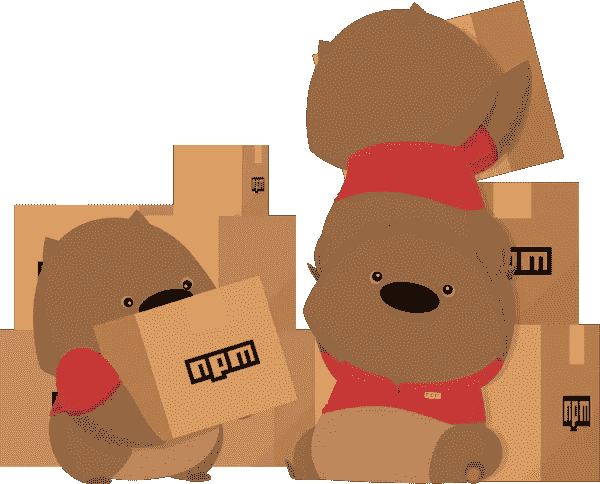

# NPM 套餐初学者指南

> 原文：<https://medium.com/hackernoon/9-npm-packages-to-explore-in-your-next-node-js-application-2018-ec4aac0ca723>

# Node.js 是什么？什么是 npm？

Node.js 是一个 Javascript 运行时，可以在浏览器之外的 V8 引擎上运行。V8 引擎是用 C++构建的。它的工作是将 Javascript 代码转换成机器代码，赋予它与一些后端脚本语言(如 Python)相同的功能。节点是单线程和非阻塞的。这是什么意思？我们来看看这个例子: