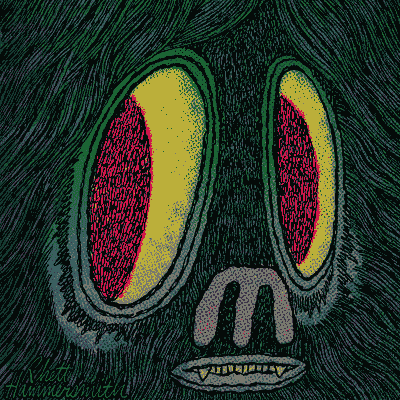

# 高效开发人员的 9 种性格特征

> 原文：<https://medium.com/hackernoon/9-personality-traits-of-an-effective-developer-c22c3c96720e>

虽然这不是一个详尽的列表，但也不是一个需求列表。

许多特征是矛盾的。事实上，它们之间的平衡是最吸引人的。

你很少会在一个人身上发现它们，这也是组建团队如此有趣的原因。

一个人很难完美平衡地概括以下特质，但雇佣或组建一个团队来展示这些特质是比较容易的。

这通常是优越的，因为个体极端者通常可以合作生产出比处于中间水平的群体更好的产品。

无论如何，这篇文章应该持保留态度。

像软件中的所有东西一样，这是一个人基于他们的经验的观点，可能与你的不同。

# 坚定的自信

坦率地说，作为软件开发人员，我们正在用自己的想象力创造新世界。

仅仅是开始这种努力而不害怕逃跑就需要一点点自信。

对于一个其他人依赖的系统的大部分来说，这样做需要很大的勇气。

对于宇宙的这一小部分，你是上帝，是你所观察的一切的主宰，你将会不断地被问及为什么事物是现在这个样子。

如果你是仁慈的上帝，为什么用户不能存储他们最喜欢的甜甜圈口味？一个明智而公正的上帝肯定会允许这样的事情发生吗？！

这种信心通常是从初级开发人员到首席开发人员(或者你的公司可能使用的任何名称)的过程中辛苦获得的。

在这一过程中的每一步，都应该有比你级别高的人对你的每一个决定提出质疑，这不一定是因为他们认为你的决定是错的，而是为了帮助你理解为什么你认为它是对的。

只有通过你的知识来之不易和战斗的考验，你的自信才不会动摇。

# 坚定的自我怀疑

同样地，你需要自信地宣称水是酒，你需要怀疑你是否正确地实现了水到酒的算法。

信心是一种非常强大的东西，但是如果不被怀疑所控制，它可能会被误导，造成比它的价值更大的伤害。

如果没有自我怀疑，你为什么要写测试呢？你肯定不需要验证你的代码完全自信地工作吗？

# 极度的谦卑

谦逊是将自信和自我怀疑结合在一起的粘合剂。

这让你可以从“我 99%确定这是最好的方法，但我真的想听听你的想法”的立场来接近你的同事。

从“我真的不知道该做什么”开始谈话是长谈的秘诀。

自信地从一个特定的角度开始对话有助于缩短对话。

带着自我怀疑和谦逊的态度去寻求对话有助于改善你的思维。

当你在谈话中犯了错误时，谦逊地承认有助于达到最好的结果。

# 过度帮助

无论是一个正在学习诀窍的初级开发人员，一个在使用你负责的系统时遇到困难的客户，还是一个想知道某件事情是如何工作的同事，你的默认状态应该是让别人的日子过得更好。

开发团队之外的所有人经常听到的是“不”。

抓住每一个机会说“是”，让别人的事情变得更容易或更好，这是值得的。这也增加了你说“不”的分量，因为你将是那个通常说“是”的人！

如果要在或许太有帮助和拒绝一个请求之间做出决定，总是选择太有帮助。你永远不知道什么时候你会需要别人以同样的方式来回报你的恩惠。

# 非常感同身受

这在某种程度上与乐于助人有关，但如果有一个特质是我最想强调的，那就是这个。

我所知道的最好的开发人员总是对他们正在开发的系统有更广泛的了解。

有时会给他们提供他们渴望的上下文，否则他们会问“为什么这很重要？”一遍又一遍，直到他们理解潜在的动机。

这并不是因为他们不同意改变，而是因为他们想深入了解为什么要进行改变。他们明白自己是所在公司的催化剂，希望尽可能地高效。

作为一名开发人员，您通常是唯一能够理解系统能力的人。

经常有人向你提出解决未阐明问题的方法。

只有同理心能帮助你发现正在解决的问题，这能带来更好的解决方案。

# 正常水平的偏执

高效的开发人员知道总有人想抓住你。

即使你深刻地理解了一个问题，与你的同行合作实现了最优解，并且完美地实现了，也有人在试图找到一种方式在你的游行上拉屎。

这就是我们防范 SQL 注入、跨站点脚本、封锁一切可能的东西等等的原因。

这主要不是因为我们不信任他人，而是因为我们不信任任何人，甚至是我们自己。

最糟糕的是，扫兴的人很可能是你自己。

在六个月内，你可能会因为最善意的理由而非常积极地改变事情的实施方式。

然而，如果过去的你没有足够的安全防护(测试、文档等)，你可能会无意中破坏现有的功能。

# 非常好奇

最好的开发人员不仅知道他们自己的代码是如何工作的，他们还知道代码下面的库和运行时是如何工作的。

这通常是因为需要了解“香肠是如何制作的”。很好地理解你正在工作的层次之下的几个抽象层通常有助于你在你正在工作的抽象层次上编写更好的代码。

最常见的情况是了解哪些调用会导致外部调用，哪些调用不会导致外部调用，了解哪些模式会导致过多的内存或对象分配，从而导致膨胀或垃圾收集。

我喜欢我第一次从马丁·汤普森那里听到的这个术语:机械同情。许多方法都可行，许多方法都易于维护，但通常会有一种方法特别适合您正在使用的库、您正在其中执行的运行时或您正在部署的硬件。

只有了解更广泛的情况，你才能选择一种比别人更有同情心的方法，并从中获益。

# 毅力

软件开发在智力上具有挑战性，并且可能是情绪上的过山车。

有发布一个非常需要的功能的高潮，发现 bug 的低谷，在预算有限的情况下不可行的功能的低谷，花费数小时研究 bug 的低谷，确定为什么某个东西只在你的机器上工作的低谷，积压的增长比你可以实现它的速度更快的低谷，平凡的副本修改和其他这样的琐碎工作的低谷，这些琐碎工作在多年的打磨后只是微不足道的，还有…

实际上，这是一个非常糟糕的过山车。

这就是为什么坚持不懈是关键。

你常常不得不趟过绝望的深渊或悲伤的低谷。

但是偶尔会有一些事情，一些你需要做出的改变，一些你需要实现的特性，基于之前 6 个月的努力工作和训练，会变得如此容易，以至于你会欢欣鼓舞。

以至于你可以面对接下来 6 个月的杀戮直到下一次。

# 轻松的心情

软件开发可能非常严肃。

这是一个二元世界，零和一，黑和白，对和错。

但是太多的是主观的，一些人的正确可能是另一个人的错误，紧张局势可能会变得很高。

简单的错误可以让世界崩溃，稳定的系统可以自发着火，忍者攻击可以随时发生，那些忍者也可能着火。

软件开发应该被认真对待，但它确实需要用一点幽默来反击；一点戏谑。

否则事情会变得太严重，人们会感到压力，他们会停止享受生活，然后他们会无法专注于手头的工作。

打破这种紧张关系并不需要太多——一个精心挑选的 GIF，完美的表情符号，或者分享一个有趣的链接。

这可能是阻止事情失控的唯一办法。

到头来只是一堆 0 和 1。

# 对以前的错误有良好的记忆

有效的开发人员努力不犯两次同样的错误。

你经常会发现他们在个人流程中有一些帮助他们避免这些错误的做法。

例如，编写测试，记录特定事物的推理，使用代码工具，等等。

小错误可能很容易犯，但仍然需要时间来解决。

如果你能创建一个流程或使用一个工具来帮助你避免犯小错误，你就能腾出更多的注意力来避免更大、更昂贵的错误。

# TL；速度三角形定位法(dead reckoning)

一个有效的开发人员通常具有以下性格特征:

*   坚定的自信
*   坚定的自我怀疑
*   极度的谦卑
*   过度帮助
*   非常感同身受
*   正常水平的偏执
*   非常好奇
*   毅力
*   轻松的心情
*   对以前的错误有良好的记忆

什么样的特质会成为你的清单？[让我们知道](https://twitter.com/cronofy)。

这篇文章最初分享在 [Cronofy 博客](https://www.cronofy.com/blog/9-personality-traits-of-an-effective-developer/)上。前往那里，获得更多关于软件开发、创业生活和日历 API 的见解。

***还有，如果你是特雷罗的粉丝，别忘了看看我们新推出的*** [***特雷罗日历连接器加电***](https://www.cronofy.com/calendar-connectors/trello-calendar-connector/) ***。***