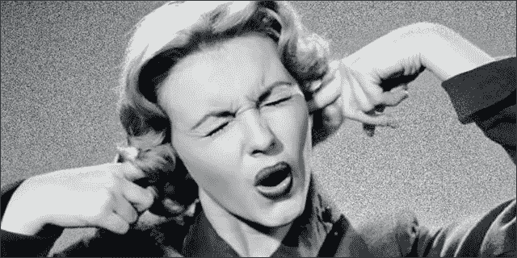

# ico 将消亡的 9 个原因

> 原文：<https://medium.com/hackernoon/9-reasons-icos-will-die-out-6d5dbdd87aee>

本文的目的是展示 ico 在未来几年将被抛弃的原因。我们以前的一些文章涵盖了加密投资的其他领域。你可以在这里阅读:

[再平衡与 HODL:技术分析](/@ShrimpyApp/rebalance-vs-hodl-a-technical-analysis-6f341b0db9cd)

[创建黑仔加密货币投资组合的 10 个技巧](/@ShrimpyApp/10-tips-for-creating-a-killer-cryptocurrency-portfolio-447f1a191a9c)

[重新平衡加密组合的简单回溯测试](https://hackernoon.com/the-simple-backtest-for-rebalancing-a-portfolio-3289bc8ee618)

[如何避免这 24 种加密货币红旗的诈骗](https://hackernoon.com/24-cryptocurrency-red-flags-21362adba27a)

[加密货币的投资组合再平衡](/@ShrimpyApp/portfolio-rebalancing-for-cryptocurrency-7a129a968ff4)

在过去的一年里，ico 已经攀升到了荒谬的地步。虽然它们似乎不会消失，但我相信在不久的将来会有触发因素将它们推出。有充分的理由相信，我们今天想到的 ICO 不会存在太久。

# 1.过高的估价

几年前，当我第一次看到 ico 出现时，他们筹集了超过 100 万美元。即使在那个时候，我也很震惊。我不明白成千上万的人怎么会聚集在一起，把他们的钱投在一个可能会失败的项目上。他们不仅经常没有产品，很多时候甚至没有团队。

嗯，我们对最近几批 ico 毫无准备。筹集了超过 10 亿美元的资金。我不知道你怎么想，但我还是很困惑。哪些人认为这很划算？对于一个甚至还不存在的东西来说，这不是一个合理的估值。我想人们也会开始注意到。人们会意识到 ICOs 一直在滥收费用。他们会发现，只要硬币一上市，他们就能得到更好的交易。他们本可以通过实际做研究而不是向最大的营销团队砸钱来获得更好的交易。他们本可以通过发现未经加工的钻石得到更好的交易。

# 2.风险大，回报低

加密货币诈骗屡见不鲜。更常见的是在 ICO 过程中撒谎。对团队成员撒谎，对开发或原型做出错误的声明，夸大预期。投资者会意识到这种难以置信的风险是不值得的。人们携款潜逃的风险；失去一切的风险；团队无法兑现承诺的风险。所有这些因素都会产生复合效应，导致低回报。

source: [https://xkcd.com/1827/](https://xkcd.com/1827/)

现在，你可能会感到困惑，因为毕竟，最近有太多成功的 ico。至少我们在投资时是这么告诉自己的，但我们大错特错了。我们被生存偏见蒙蔽了双眼。目前，每天有 10 到 20 个新 ico 发布。你没听错，每天。所以，虽然有少数成功的 ico。那只是少数。每一个为投资者带来正回报的成功 ICO，都有数百个彻底的失败。这相当于不到 1%的成功率，我们都同意这是非常糟糕的。更不用说，没有地方让所有这些硬币上市。顶级交易所每个月只增加一位数的硬币。当每个月有超过 500 个 ico 发生时，这意味着不到 1%的硬币会在一个声誉良好的交易所上市。

这些业绩问题将把投资者拉进投资周期的后期。投资者更愿意等到看到吸引力后再融资。这种心态将有助于市场成熟。投资者将开始寻找更具体的指标，以表明这些资金将得到很好的利用。团队将被迫更早地开始开发，并展示执行其愿景的能力。

# 3.规章制度

恐惧是人类最强烈的情感之一。它的力量阻止了进步，冻结了挑战未知的意志。对于很多对 ico 感兴趣的人来说，这种担心将源于监管。监管整顿可能会在 2018 年进行。我想，对于一些更狡猾的 ico 来说，这不会是一件愉快的事。可能会有几个项目被轻判。然后，我希望会有一些人被简单地处决。把这些公司作为一个公开的例子。这将粉碎许多潜在的 ICO 创作者的兴趣，甚至在这些公开展示后考虑这个选项。法规将开始打击骗子，吓跑许多更合法的 ico。

除了打击之外，还将出台具体的法规来指导 ico 必须如何进行。虽然对于市场的持续增长是必要的，但监管的增加将阻止大量 ico，他们根本没有资金或资源来克服法律障碍。因此，如果监管没有吓跑人们，障碍的数量可能会变得越来越难以克服。

# 4.钱用完了

很多 ico 以惊人的速度烧钱。我们已经看到公司花费超过 100 美元来获得一笔投资。光是想想就可能让你大吃一惊。一些 ICO 为每个参与他们 ICO 的人花费超过 100 美元用于营销和广告。如果他们的 ICO 有 10，000 名投资者，他们将花费 1，000，000+美元做广告来获得这些投资者。最糟糕的是，这一切都发生在 ICO 期间的几个月内。

一旦他们筹集到资金，这并不能结束他们的疯狂消费。大多数 ico 都拥有庞大的高管、顾问和昂贵的工程师名单。如今，即使是小型 ico 也声称有多达 20 人与该公司有关联。这些人没有一个是免费工作的，这意味着他们是在掏钱来维持团队。

在花完所有这些钱之后，你会认为这个团队是清白的。他们有一个团队。他们正在创造一种产品。一切似乎都很顺利。然而，人们不记得 ICO 创造了一个非常具体的硬币数量。这筹集了一笔非常具体的资金。随着团队继续开发产品，资金慢慢枯竭。没有像传统投资轮次那样的额外投资轮次，也没有其他收入来源。除非他们迅速扩张，否则他们注定会以稳定的速度烧钱。直到他们用完为止。在这一点上，开发人员离开，社区失去了兴趣，没有营销或支持，硬币慢慢地降低自己进入坟墓。

我预计，许多几年前完成的 ico 将开始耗尽资金。一开始不会被看做负面。人们会简单地拒绝，说这些是没有很好地管理他们的基金的例外，或者是糟糕的团队…或者任何其他借口。事情的真相会更简单。大多数加密货币都会随着有限的资本供给而消亡。当资金耗尽时，发展就结束了。投资者将意识到，如果不能产生正现金流，ico 就不是一个实用的商业模式。

# 5.普通人不能投资

证券交易委员会将阻止普通人投资。这意味着只有机构投资者会投资。由于这些投资者将更加反对风险，这可能会给团队带来无法验证其提议的问题。机构投资者的投资标准通常比普通人严格得多。这将排除潜在的有前途的项目，因为它们不符合这些严格的指导方针。那么，最糟糕的情况将是，这些大型机构投资者由于一些糟糕的投资决策而在早期损失惨重。这将吓跑这些投资者，在市场上只留下较小的投资者，他们将无法为越来越多的项目提供投资。

最后，投资者将意识到他们拥有这枚硬币，但他们在创造这枚硬币的公司中没有任何价值。这意味着，如果该公司去创造另一个产品，他们将没有该项目的所有权。这也意味着从长远来看，公司持有的大部分价值可能不是硬币或代币，而是其他产生收入的项目。这将让投资者感到沮丧。一旦一枚硬币不再为公司创造价值，就没有理由继续为其开发投入大量时间和精力。在这一点上，公司将离开，并开始建立其他项目，可能完全无关的目的，他们的硬币或令牌。

# 6.压抑的噪音

每个人和他们的祖母都在经营 ICO。这些 ico 中的每一个都用他们令人难以忍受的营销活动在网络上炸开了锅。目前 ico 有太多的噪音。这创造了大量的选择，从每一个选择中去除了价值。当每个人都想做同样的事情时，这伤害了每个人。

除了噪音之外，区分项目也变得很困难。ICOs 曾经对可以通过区块链解决的问题有着有趣的看法，但最终会变成对现有解决方案的公然复制。数百枚硬币将基本上是同一技术的微小变化。这将导致品牌混乱。从本质上讲，人们会投资知名品牌的硬币。

# 7.失去兴趣

人们会失去兴趣。这些将会改变世界的有趣项目将会开始显露出它们完全无用。它们解决不了任何实际问题，而且使用起来非常复杂和麻烦，没有任何价值。我们将开始一遍又一遍地看到同样的事情。市场上将充斥着几乎不做任何改变的克隆产品，人们会厌倦看到同样的东西。这些新的克隆产品不会给用户带来什么刺激。整个行业将变得如此分散，大多数硬币将毫无用处，因为没有简单的方法将它们与所有其他类似的硬币一起投入市场。

# 8.后来者意味着更少的吸引力

随着时间的推移，既定的硬币将继续在市场上站稳脚跟。随着他们的发展，最成功的硬币将占据大部分市场份额。这导致市场的新进入者需要迅速赶上这些老牌巨头。这就像一家初创公司试图创建一个搜索引擎来挑战谷歌……这根本不会发生。真正的人才大部分会集中到少数顶尖公司，而外行则会分散到其他杂七杂八的公司。ico 将努力赶上或跟上更大的硬币。随着越来越多的克隆出来，他们将无法跟上已经存在多年的大型硬币的步伐。这意味着新的 ico 不会很快获得牵引力，很可能会死亡。这反过来导致未来几年失败的 ico 越来越多。

# 9.更好的选择

最后，也不全是坏消息。ICOs 消亡的最大好处是会有一些东西准备好取代它的位置。我敢打赌，新的筹资流程将更加稳健、值得信赖，并解决当今 ico 中存在的许多问题。这份名单没有什么可怕的，而是值得欢迎的。ico 是有缺陷的，应该像它们真正变得一团糟一样对待它们。我们需要一个提供信任的系统。我们需要一个提供一系列资金或收入流的系统。我们需要让投资者投资代币和公司的方法。我们需要更好的公司结构，让区块链等同于股权。在加密领域有很多东西需要探索，但在这个探索阶段，这将是一个痛苦的过程。你会被骗，被利用，失去希望。最终，会有更好的方法来资助这些项目。我还不知道是什么。它可能看起来像 ICO，但也可能不是。不管它是什么，你可以肯定它将改善这些项目的融资过程。

# 结论

我认为黑暗堡垒说得最好。

> ico 是百分之十的运气；20%的人对顾问撒谎；15%假装你有一个原型；百分之五抄袭别人的白皮书；50%在营销上花费数百万；还有百分之百的先令。

如果你来自未来，告诉我 5 年后 ICOs 还会像现在一样运行，还会受欢迎，我不会相信你。接下来的 5 年将揭示 ICO 实验是加密货币市场的原始时期。那是区块链科技公司的西部荒原。虽然取得了一些成功，但现在判断这些公司是否会成为市场的长期推动者还为时过早。

别忘了查看一下 [Shrimpy 网站](https://www.shrimpy.io/)，在 [Twitter](https://twitter.com/ShrimpyApp) 和[脸书](https://www.facebook.com/ShrimpyApp)上关注我们的更新，并在[Telegram](https://t.me/ShrimpyGroup)&[Discord](https://discord.gg/gXyy95y)上向我们令人惊叹的活跃社区提问。

留下你的评论，让我们知道你的平衡经验！

*捕虾队*