# 你的 ICO 顾问募集资金失败的 9 个原因

> 原文：<https://medium.com/hackernoon/9-reasons-why-your-ico-advisor-fails-to-raise-funds-f0f01a23a562>

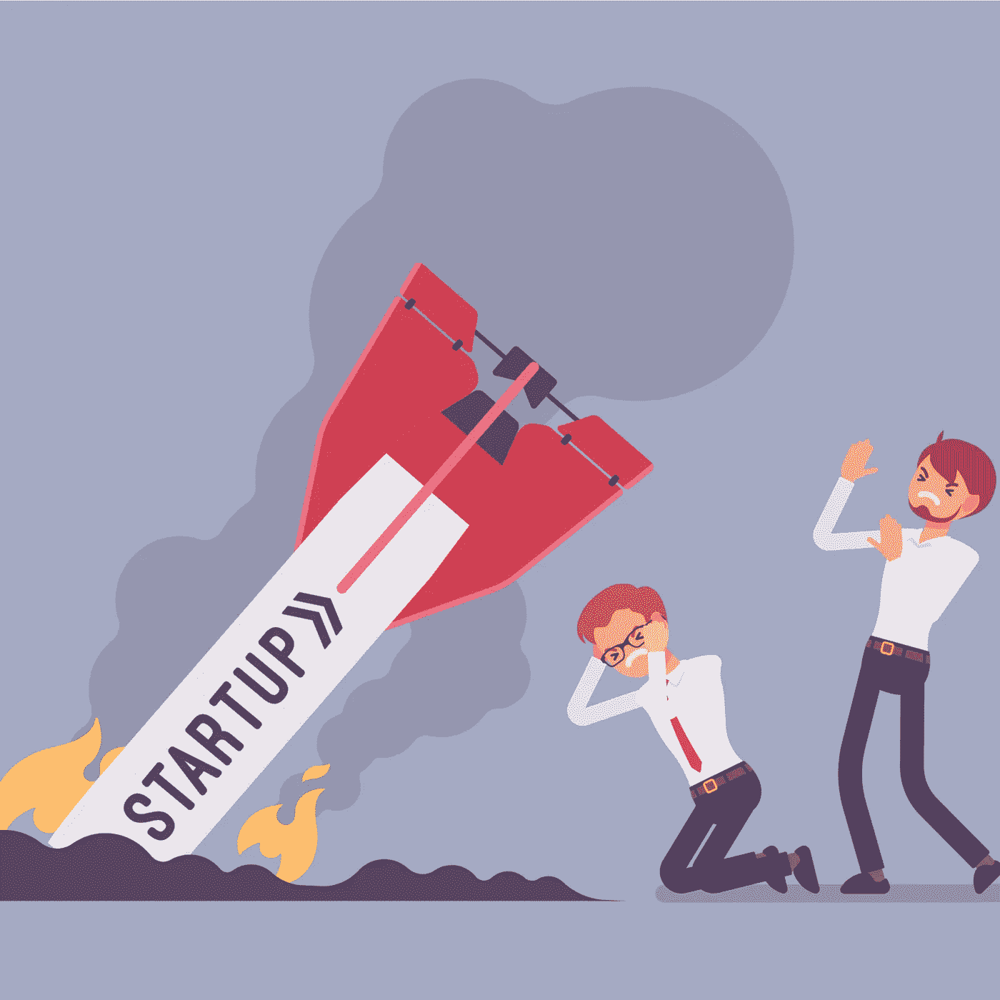

Source: Bitcoin News

加密货币已经从 2017 年 11 月的高点大幅下跌。当世界其他地方都在兴高采烈地等待新年夜午夜钟声敲响的时候，全世界的密码交易员都在不停地登录他们最喜欢的密码交易所，希望出现奇迹来逆转[密码价格的突然下跌](https://www.forbes.com/sites/jessedamiani/2017/12/22/6-possible-explanations-why-bitcoin-and-cryptocurrency-prices-dropped-so-low-yesterday/)。他们[安慰自己说这是暂时的。](https://cryptodigestnews.com/reasons-given-by-experts-for-the-falling-bitcoin-prices-dcfb899de21c)

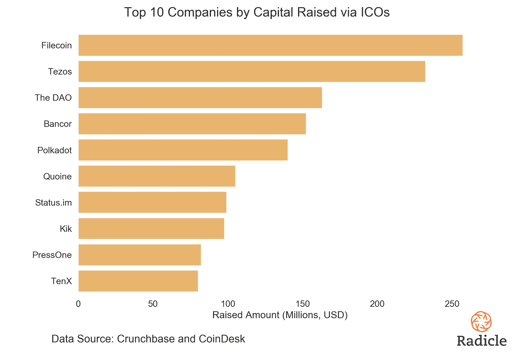

> 那些在 2017 年 12 月购买了第一枚比特币的人直接了解了为什么加密货币被称为新的狂野西部。

快进到 2018 年 7 月，加密货币价格停留在 2017 年 12 月高点的三分之一，没有迹象表明会重复他们早先的壮举。约翰·迈克菲声称 [BTC 的价格到 2020 年将达到](https://www.ccn.com/despite-bitcoin-crash-mcafee-holds-his-1-million-by-2020-bet/)50 万美元，一份 [ICOBENCH 报告](https://icobench.com/ICO%20Market%20Weekly%20June%201.pdf)称市场将在 2018 年 8 月(7 月，如果俄罗斯被淘汰出 FIFA 世界杯)后回升。

这些说法产生的问题是缺乏对权力下放的理解。这些人可能是最好的营销人员、分析师等等，但当谈到理解分权时，根据他们的这些独特言论，他们似乎缺乏对分权的理解。

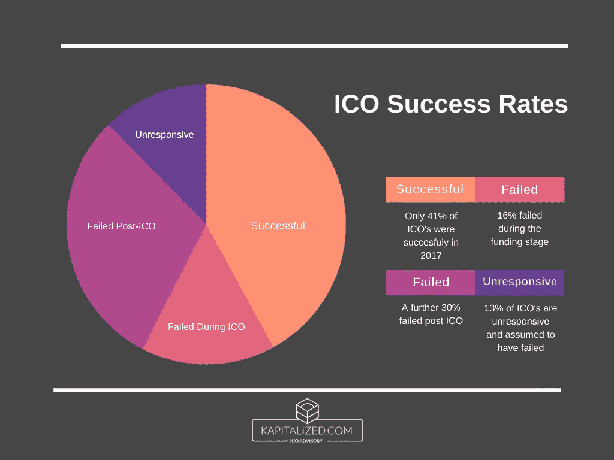

> 作为 ICO 顾问，我们开始听到另一个小道消息——没有人再投资 ICO 了。是的，围绕 ico 的监管已经收紧，一个又一个国家起草了关于我们亲切地称之为“公用令牌”的政策。但是，这不一直是计划吗？当没有法律的时候，我们跑到巴巴多斯、马耳他和直布罗陀，因为他们有“友好的法律”。

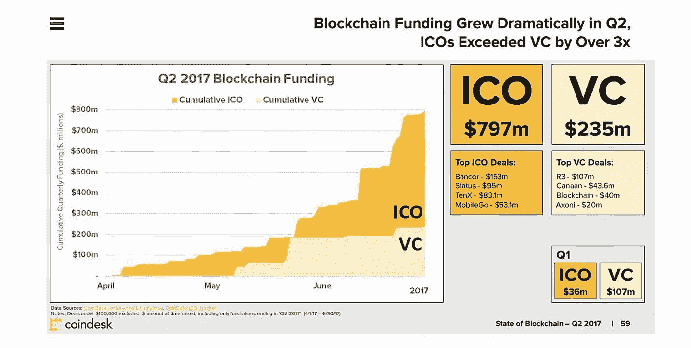

既然新加坡、美国和英国即将出台相关法律，我们为什么还要跑到避税天堂？是的，[马耳他颁布了一项新法律](https://www.coindesk.com/malta-proposes-test-to-define-when-icos-are-securities/)，允许 DAO 获得与公司类似的法律地位，但有多少 ico 正计划创建 DAO 呢？

> 如今，大多数 ico 都类似于种子网站。他们列出内容*，但并不托管它。*唯一的区别在于他们的商业模式。所以，是的，我们应该原谅投资者，呃..贡献者没有对此类 ico 感到非常兴奋。

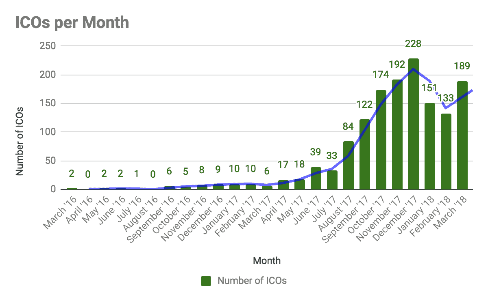

Source: Icofunding

那么，人们真的不再购买代币了吗？事实并非如此。事实上，在过去的一年中，流入 ico 的资金量以惊人的速度增长。

ICO 顾问会很快指出，这不是大众投资，而是来自天使和风投的私人投资。是的，确实如此。购买代币的非认可投资者数量并不相同。投资于股票和其他资本市场产品的非合格投资者的数量预计将达到相同的数量。

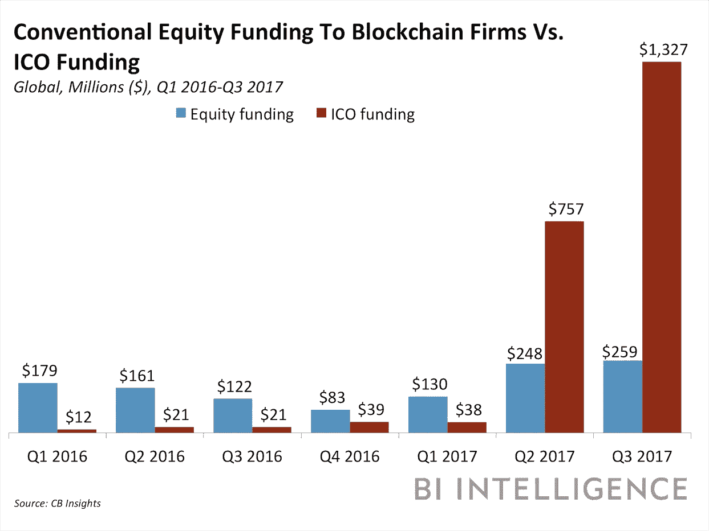

我们不能责怪小投资者，因为我们试图蒙骗他们，但是他们抓住了我们的[把柄。我们向他们兜售权力下放协议，作为引领我们进入公平财富分配时代的银弹。这被证明是一个谎言。](https://hackernoon.com/learnings-from-a-47-million-ico-scam-e9592b7a76bf)

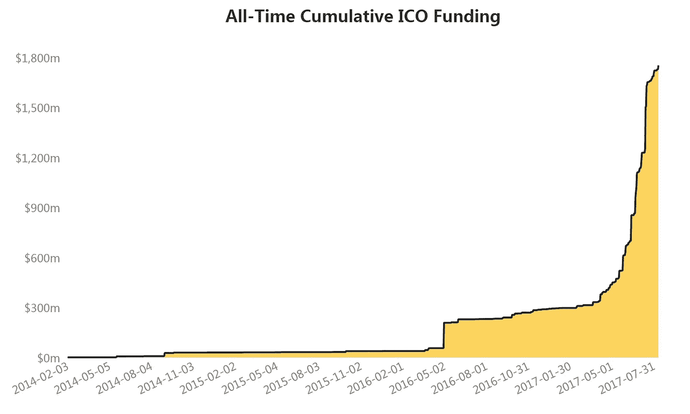

Source: Steemkr

> 随着比特大陆危险地接近拥有比特币区块链 51%的散列权，另一个区块链能有多安全？

对小投资者来说，另一个阻碍交易的因素是令人恐惧的频繁抛售替代硬币(俗称 shitcoins)。“买者自负”听起来再真实不过了。

> 因此，通过区块链支持的去中心化向小投资者承诺的伊甸园被证明只是另一个诡计。

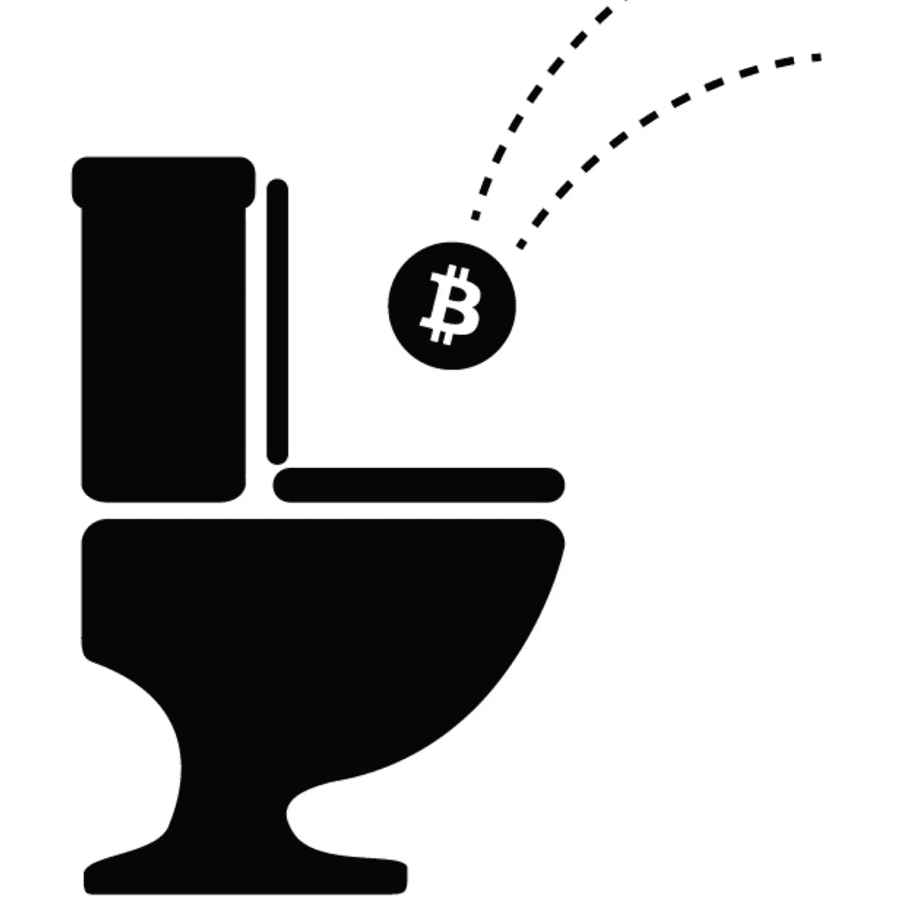

Source: Bitcoin News

从 ICO 淘金热中浮现的故事并不都是坏的。是的，一些 ico 将不得不关门大吉，因为没有商业模式已经不行了。另一方面，其他 ico 利用这一机会变得对监管者友好，并阐明了它们的令牌组学和商业模式。

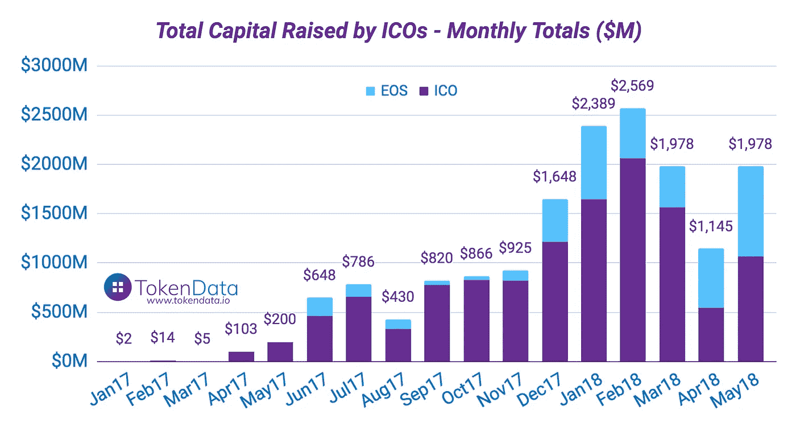

区块链顾问 Madhuri Walia 表示，在与私人或其他投资者会面之前，ICO 必须拥有/创建以下文件。没有这些，任何 ICO 顾问，尽管他们声称，将无法为您的 ICO 筹集资金。

*   **代币组学，数字相加** —代币组学的设计必须遵循一定的标准，以得出代币价格、效用和挖掘的代币总数。请参考[这本关于记号组学的指南](/coinmonks/what-is-tokenomics-and-how-it-can-make-or-break-your-ico-52484c861663)来更好地理解。
*   可扩展的商业模式——商业模式是你的平台赚钱的计划。它不是关于令牌效用的增值和未售出令牌的燃烧。解释为什么人们会来你的平台，你将如何利用他们的兴趣。
*   **防弹令牌化** —如果你走实用令牌路线，你必须找出最适合令牌化的方法。如今，大多数 ico 对平台的访问进行令牌化，并不比我们购买令牌玩几分钟游戏的视频游戏厅好多少。在 [LaneAxis](https://www.laneaxis.io/) 中可以看到一个很好的令牌化模型，它将他们为卡车运输行业创建的供应链进行了令牌化。
*   **包含细分数字的投资者推介资料** —投资者推介资料必须明确阐述商业模式、现有用户群和团队资质。此外，它必须有一个你的产品的功能和可伸缩性潜力的解释。
*   **电梯间推介** —电梯间推介经常被大多数 ico 忽略。这有助于向你可能在会议和研讨会上遇到的潜在投资者推销你的想法。最好进行电梯推介，这样你就不用在晚宴上向别人解释白皮书了。
*   **一个拥有良好资质的团队** —是的，你有一个好主意。是的，智能合同可以确保任何人都可以为任何行业创建解决方案。但经营那家企业完全是另一回事。这就是人们寻找那些在特定领域有合法经验的团队成员的原因。有一个加密货币顾问，他唯一的名声是他们成为了 ICObench 上的“专家”,这不再是投资者的话题了。看[方舟 ICO](http://arkholding.io/) 。他们有一个管理海鲜物流业务超过 50 年的团队。
*   一个 MVP(最有价值球员)——用一个我联系过的老派投资者的话说，“我想看看你在这个游戏里有多少皮。”我从那次谈话中了解到，如果 ICO 没有从自己的口袋里拿出至少 30%的计划投资资金，投资者是不会喜欢它的。
*   **社交媒体上的牵引力** —如果产品如此具有革命性，它一定会在社交媒体上有所反映。虽然你的社交媒体拓展的一部分可以无机播种，但你必须避免让它超过 20%。有工具可以在 Telegram 等社交渠道上发现参与情况，如果这些报道是负面的，就会反映不良。
*   **实用的上市策略**——蓝光和 HD-DVD 都有合法的上市策略。然而，我们今天只记得其中的一个。你知道 HD-DVD 得到了微软和英特尔的支持吗？还没有。它。失败了。投资者和买家有一种不可思议的能力，能够找出坏鸡蛋并拒绝它们。

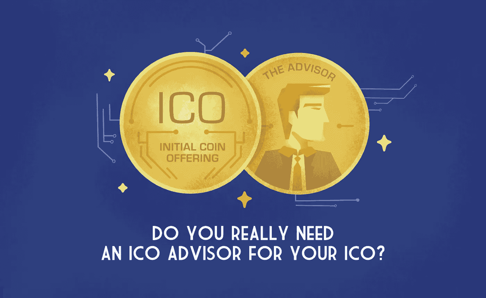

Source: Cyberius

这让我们得出结论，ico 不再是快速致富的计划。仅仅从白皮书中筹集资金的时代已经一去不复返了。如果你想通过 ICO 途径筹集资金，你现在必须注意几个抵押品，并确保你的营销宣传类似于传统的融资轮，采用混合发行模式。如果你真的资金短缺，你可能不得不将股权转让给私人投资者。

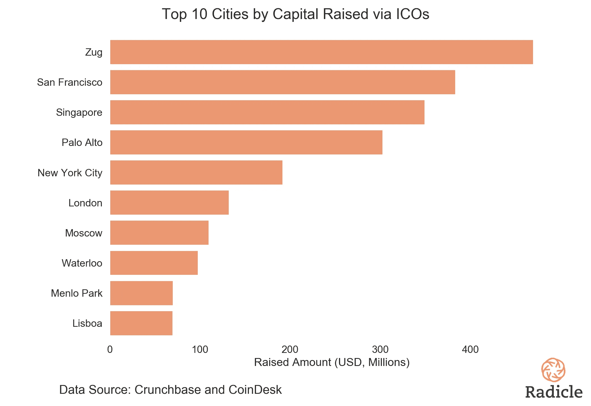

没有筹集资金的灵丹妙药，现在是我们开始相信它而不是认为 ICO 市场处于下降趋势的时候了。如果你的营销、产品开发和团队资质都很好，你会筹集到资金。投资枯竭的市场是不存在的。

> 即使在艰难和灾难的时候，人类也投资，为了利润或为了娱乐。

请在下面的评论区告诉我你对这篇文章的看法。欢迎各种观点。

在 [Twitter](https://twitter.com/StartUp_Vulture) 和 [LinkedIn](https://www.linkedin.com/in/utsavjaiswal/) 上关注我，不要错过我的任何一个故事。