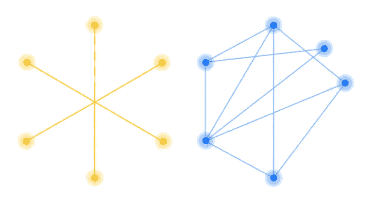
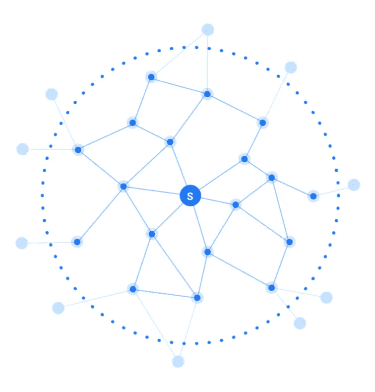
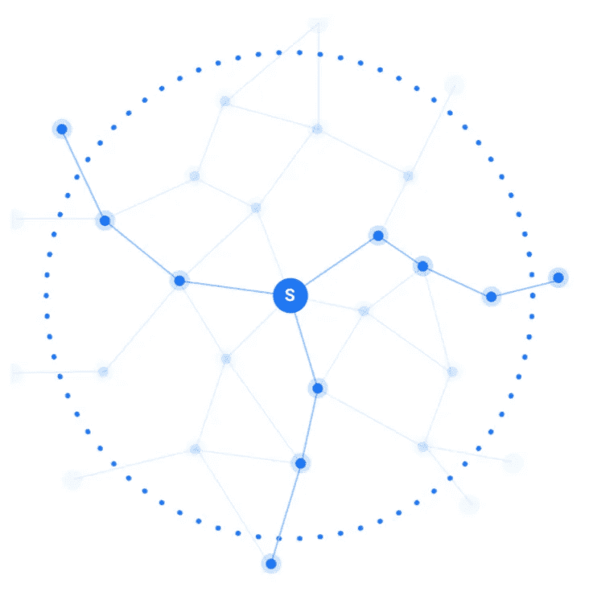
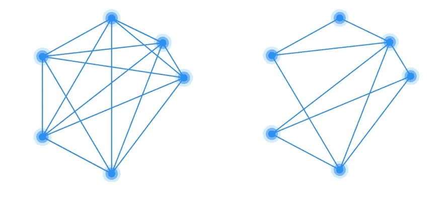

# 关于网状网络你需要知道的 9 件事

> 原文：<https://medium.com/hackernoon/9-things-you-need-to-know-about-mesh-networks-f61a77e5751a>

[Mesh network](https://www.hypelabs.io/?utm_source=medium&utm_medium=social_networks_lara&utm_campaign=fundamentals_peopleinstreet_image)

## 了解最新的发展。

尽管在过去的几个月里你可能已经听到越来越多的关于它的消息，网状[网络](https://hackernoon.com/tagged/network)实际上已经存在了一段时间。这不是一时的技术炒作。它们有相当大的好处，将使我们更接近一个人和物无缝连接的世界。但是花里胡哨的文字背后是什么技术呢？本文解决了关于网状网络的常见问题。大多数人经常需要想象上下文来完全理解一个人以前从未听说过的概念。因此，为了更好地解释什么是网状网络拓扑，本文将解释更大的图片，并辅以可视化图表。

**OSI 模型— 7 层**

[The OSI model](https://commons.wikimedia.org/wiki/File:Osi-model-jb.svg)

首先，我们正在谈论互联网、网络和设备之间的连接。因此，引入 OSI 模型非常重要，它是系统如何通过网络进行通信的参考模型。这一交流过程可以分为七组不同的相关功能。在网络中，所有设备(也称为节点)都使用这七层来相互通信。OSI 模型中的每一层都服务于其上一层，而上一层又服务于其上一层。例如，当信息在节点之间交换时，过程将是这样的:数据流通过发送消息的机器的各层向下循环，然后穿过网络，最后通过接收设备的各层向上流动。为什么这与本文相关？在网状网络的环境中，该模型在网络上活动的系统中使用。因此，要讨论的最重要的层是媒体层，即第 3 层和下面的层，这将在后面描述。

**1。拓扑——环形、总线形、树形、星形和网状**

在了解 OSI 模型中的节点如何工作之前，首先要定义什么是拓扑，并解释网状网络与拓扑的关系。拓扑是指计算机网络上互连设备的虚拟布局(但不一定是物理布局)。例如，一个高中网络中的计算机可以在教室中排列成圆形，但在那里不是环形拓扑。不同的现有拓扑结构组织如下:有总线、环形、树形、星形和网状拓扑结构。当然，这些也可以组合起来形成混合拓扑，但是我们不打算在本文中讨论这些。

我们想了解什么是网状拓扑，并解释，我们将继续与今天最常用的拓扑进行比较。这种拓扑是星形的，其中设备连接到一个中央接入点(集中式网络)。相反，在网状网络中，节点直接相互连接(分散式网络)。下面的两个图表说明了这两个例子。

[Star and mesh topologies](https://www.hypelabs.io/?utm_source=medium&utm_medium=social_networks_lara&utm_campaign=fundamentals_starandmeshtopologies_image)

那么这意味着什么呢？在星型拓扑中，中心点必须处理网络中的所有流量。它还必须代表源将信息转发到目的地。相反，在网状网络拓扑上，节点允许点对点或对等(P2P)通信。这消除了对中央实体的需要。可以想象，这些不同的布局对网络的使用既有好处也有坏处。这些将在后面详细讨论。

**2。网状网络**

从拓扑结构来看，让我们更深入地探讨一下网状网络。首先，网格指的是交错结构。在网络中，它是指许多节点的互连，这些节点可以建立链接以连接到其他节点。由于所有节点都连接在一个波动的网络中，设备可以充当路由器，将流量转发给其他设备。这使得内容能够在它们之间跳跃，直到它到达目的地。

**3。多传输与单传输连接**

[Node with Bluetooth 5, Wifi and ZigBee radios.](https://www.hypelabs.io?utm_source=medium&utm_medium=social_networks_lara&utm_campaign=9_things_you_need_to_know_about_mesh_networks_image_node)

现在我们已经定义了更大的上下文，让我们更仔细地看看节点本身。我们这里指的是 OSI 模型的第 1 层。网状网络提供商之间的不同之处在于它们支持多传输还是单传输连接。在前一种情况下，这意味着网状网络可以同时在几种类型的无线电(无线电接入技术 RAT)上实现(例如:蓝牙、WIFI、移动运营商等)。在这种情况下，他们被称为多运输。这些设备从只能接入[、蓝牙](https://hackernoon.com/tagged/bluetooth)、Wi-Fi 和电话载体(例如今天的智能手机)，一直到支持所有可能的连接平台的节点。这是通过将支持网状多传输的软件开发工具包(也称为 SDK)下载到设备上来实现的。

其含义是不言而喻的:可以访问不同类型无线电的节点更加实用。然而，它也可能成本更高，开发难度更大。然而，很明显，在未来，人们只能期待多平台可用。

**4。路由协议**

流量流动的方式或节点如何通信被称为路由协议。它指的是 OSI 模型的第 3 层。网状网络路由协议分类将自己呈现为三种主要类型的协议:主动式、反应式或混合式。这些类型的协议在很大程度上不同于它们用来执行网络发现的范例。这最终会影响性能和规模。

[Proactive protocol](https://www.hypelabs.io/?utm_source=medium&utm_medium=social_networks_lara&utm_campaign=fundamentals_proactiveprotocol_image)

主动协议保持一个持续的发现过程。它的节点自动地相互通知路由(路径)的变化，例如，一个节点故障导致流重新路由。它对链路中断反应良好。因此，它是自我修复的:它更有弹性，能够从失败中恢复。主动式协议在静态场景中表现更好，在静态场景中，网络路径很少或从不改变。在具有高节点速度的快速变化路径的情况下(动态环境)，它将耗尽更多资源，导致网络流量、增加冲突和降低带宽等。为了保持低成本，因此有必要选择适合环境的协议。

[Reactive protocol](https://www.hypelabs.io/?utm_source=medium&utm_medium=social_networks_lara&utm_campaign=fundamentals_reactiveprotocol_image)

相反，反应式协议按需建立路由。对于每个连接，它们必须查询整个网络来搜索正确的路径。因此，反应式网络可以更好地扩展，但需要更多时间来建立连接，因为路径可能事先不知道。

混合协议继承了主动式和反应式协议的特点，因此得名。它们通常用于更具体的情况，在这种情况下，主动和被动的负面影响非常明显或不受欢迎。混合协议可以适应任何一种技术都适用的条件。

**5。全网状与部分网状**

在网状网络中，有两种连接方式:全网状拓扑或部分网状拓扑。这些可能与 OSI 模型的第 3 层相关。当网络被称为满网络时，每个节点都直接连接到网络中的所有其他节点。相比之下，部分网络是指只有一些节点连接到所有其他节点，而其他节点只连接到与它们交换最多数据的节点。下面的两张图片再次说明了这两个例子。

[Full and partial mesh networks](https://www.hypelabs.io/?utm_source=medium&utm_medium=social_networks_lara&utm_campaign=fundamentals_fullandpartialmeshnetworks_image)

这又意味着什么呢？在一个节点出现故障的情况下，网络具有自我修复的特性。后者相应地重新路由网络流量，不会中断服务或给用户带来麻烦。全网状拓扑更密集，因为它需要更多节点。拥有更多的节点意味着网络更加冗余，但这也意味着构建自己的网格会更加昂贵。它通常用于主干网络，而不太密集的部分网状拓扑更常见于连接到全网状主干的边缘网络。

**6。为什么是今天**

网状网络的概念最早出现在 20 世纪 80 年代的军事实验中，并在 20 世纪 90 年代开始商用。这项技术已经存在了一段时间，为什么我们今天才开始听说它呢？这是因为在过去，网状网络必须是有线的。由于每个节点都必须与其他节点进行物理连接，因此大规模建立这种拓扑既昂贵又复杂。今天，无线通信已经有了相当大的进步。这意味着不再需要电线。此外，短程无线个人网络(WPAN)规范消除了过去存在的物理和财务障碍。然而，在很大程度上，它是硬件、无线电和频谱需求；成本；和可用性，这使得网状网络的商业化到现在才变得可行。这些就是我们看到这项技术商业化如此繁荣的原因。

我们对技术的细节有一些了解。现在我们可以探索其潜在的优势和劣势。

7 .**。优势**

*   不再有单点故障的问题，这是星型拓扑中的问题(在总线拓扑中甚至更糟)。如果一个节点不能再运行，网络能够重新路由，这使得它仍然能够在其余节点之间通信。
*   除非发生某种全球性的灾难，摧毁世界上所有的电子设备，否则瘫痪网络是不可能的。
*   该网络只需最少的基础设施，因此部署速度更快，成本比传统基础设施更低。
*   由于网状网络中的设备可以进一步转发信号，因此它们有能力连接广域范围内(例如城市)的数千个传感器。其他的例子包括在人群密集的地方操作(例如:音乐会、节日等等)或者在偏远地区连接设备(例如:在山上或者在地下的公共交通中)，等等。
*   网状网络中没有集中的权力机构。出于这个原因，一些人将其与当年的互联网相提并论:本地化、匿名、基于公民的安全通信。

**8。缺点**

*   市场和监管力量使得网状网络难以部署。
*   网状网络可以取代 Wi-Fi 提供商、电话运营商和其他中间人，为人们提供连接。结果，中间商就输了，所以对他们来说，没有开发这种技术的经济动机。
*   网状网络很难管理和排除故障。对于大型网络来说，需要强大的网格技术来使其物有所值。这可能很难找到。
*   电池寿命会影响节点的可用性。例如，电池耗尽的手机可能会中断网络，导致更多的路由开销和更低的可靠性。
*   在某些情况下，部署成本有时会成为问题。但是，它可以通过下载一个软件开发工具包来兑换，也称为 SDK，它使您能够成为整个网格中的参与者节点，而不是从头开始构建。

**9。关于应用领域的最终想法**

[Mesh networks in use cases](https://www.hypelabs.io/?utm_source=medium&utm_medium=social_networks_lara&utm_campaign=fundamentals_usecase_image)

网状网络中没有权威。这种去中心化的机会开启了数百种新形式的技术和商业理念的可能性，它们将扰乱市场。特别是随着物联网领域的兴起，网状网络将开始占据巨大的空间。用例范围从智能计量到对象集群。人们还预测，网状网络将出现在实施稳健安全规则的行业中。例如，在物流、采矿、石油和天然气、公用事业和能源领域。预计网状网络在轻型商业应用中的使用也会增加。示例包括大型仓库、农业、配送中心，以及车对车连接等。这是因为传统 Wi-Fi 覆盖的区域太大太贵，无法与传统基础设施连接。但最重要的是，这项技术在人道主义方面有巨大的潜力。在发生风暴或地震时，当地的基础设施经常遭到破坏，导致人们失去通信手段。网状网络使得连通性在这些情况下不受影响。另一个例子是水泵。当它们被损坏时，人们可能几个月没有水喝。有了物联网和网状网络，当地社区只需几天就能修好水泵。