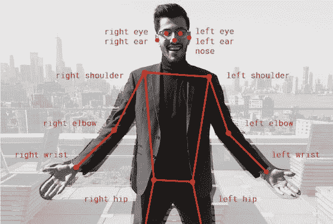

# 关于 TensorFlow 你应该知道的 9 件事

> 原文：<https://medium.com/hackernoon/9-things-you-should-know-about-tensorflow-9cf0a05e4995>

今天早上，我发现自己总结了我在旧金山 Google Cloud Next 的演讲中最喜欢的片段，[*tensor flow 有什么新功能？*](https://www.youtube.com/watch?v=MR7w8ARAS2Y)

然后我想了一会儿，找不到不与你分享我的超短总结的理由(除了你可能不会看视频——你完全应该去看看，[演讲者](https://twitter.com/lmoroney)很棒),所以我来了…

I made a video version of this article that’s even shorter, in case you’re in a hurry and/or you prefer information to be injected into your brain via your ears.

# #1 这是一个强大的机器学习框架

TensorFlow 是一个[机器学习](https://hackernoon.com/the-simplest-explanation-of-machine-learning-youll-ever-read-bebc0700047c)框架，如果你有大量数据和/或你在追求人工智能的最先进水平，它可能是你新的最好的朋友:[深度学习](https://github.com/kozyrkov/deep-learning-walkthrough)。神经网络。大的。这不是数据科学的瑞士军刀，这是[工业车床](http://www.industrytap.com/worlds-largest-lathe-sale/14280) …这意味着如果你想做的只是在 20×2 的电子表格中放一条回归线，你可以停止阅读。

但是如果你追求的是大，那就兴奋起来吧。TensorFlow 已经被用于寻找新的行星，通过帮助医生筛查糖尿病视网膜病变来预防失明，通过提醒当局非法砍伐森林的迹象来拯救森林。AlphaGo 和 Google Cloud Vision 都是建立在这个基础上的，它是你的了。TensorFlow 是开源的，你可以[免费下载](https://www.tensorflow.org/install/)和[立即上手](https://www.datacamp.com/community/tutorials/tensorflow-tutorial)。

Discovered with the help of TensorFlow, the planet Kepler-90i makes the Kepler-90 system the only other system we know of that has eight planets in orbit around a single star. No system has been found with more than eight planets, so I guess that means we’re tied with Kepler-90 for first place (for now). Learn more [here](https://www.nbcnews.com/mach/video/nasa-s-kepler-telescope-discovered-a-new-exoplanet-with-google-s-help-1121785923978).

# #2 奇怪的方法是可选的

我对 [TensorFlow 渴望](https://www.tensorflow.org/guide/eager)神魂颠倒。

如果您在过去尝试 TensorFlow，却因为它迫使您像一个学者/外星人而不是像一个开发人员那样编码而尖叫着跑开了，来吧！

TensorFlow 急切执行让您可以像一个纯 Python 程序员一样与之交互:一行一行地编写和调试的所有即时性，而不是在构建那些巨大的图形时屏住呼吸。我自己也是一个正在恢复的学者(很可能是一个外星人)，但自从 TF eager execution 问世以来，我就爱上了它。如此渴望取悦！

# #3 你可以逐行构建神经网络

Keras + TensorFlow =更容易的神经网络构建！

[Keras](https://keras.io/) 是关于用户友好和简单的原型制作，这是老 TensorFlow 非常渴望的。如果你喜欢面向对象的思维，喜欢一次一层地构建神经网络，你会喜欢 *tf.keras* 。在下面的几行代码中，我们创建了一个序列神经网络，带有 dropout 之类的标准附加功能(提醒我有时对 dropout 的比喻要抒情，它们涉及到订书机和流感)。

哦，你喜欢拼图，是吗？耐心。不要过多考虑订书机。

# #4 不仅仅是 Python

好吧，你已经抱怨 TensorFlow 的 Python 偏执狂有一段时间了。好消息！TensorFlow 不再只是 Pythonistas 的专利了。它现在可以在多种语言中运行，从 R 到 Swift 到 JavaScript。

# #5 你可以在浏览器中做任何事情

说到 JavaScript，可以用 [TensorFlow.js](/tensorflow/introducing-tensorflow-js-machine-learning-in-javascript-bf3eab376db) 在浏览器中训练和执行模型。出去玩酷演示吧，你回来的时候我还会在这里。

Real-time [Human Pose Estimation](/tensorflow/real-time-human-pose-estimation-in-the-browser-with-tensorflow-js-7dd0bc881cd5) in the browser with TensorFlow.js. Turn on your camera for a demo [here](https://storage.googleapis.com/tfjs-models/demos/posenet/camera.html). Or don’t get out of your chair. ¯\_(ツ)_/¯ Up to you.

# #6 微型设备有一个精简版

从博物馆买了一个旧桌面？烤面包机？(一样的东西？) [TensorFlow Lite](https://www.tensorflow.org/mobile/tflite/) 为各种设备带来了模型执行，包括移动和物联网，使您的推理速度比原始 TensorFlow 提高了 3 倍以上。是的，现在你可以在你的树莓派或手机上获得机器学习。在[演讲](https://www.youtube.com/watch?v=MR7w8ARAS2Y)中，劳伦斯做了一件勇敢的事情，他在数千人面前现场演示了 Android 模拟器上的图像分类...这很有效。

1.6 seconds to compute? Check! Banana with over 97% probability? Check! Toilet tissue? Well, I’ve been to a few countries where I suppose a sheet of paper like the one Laurence is holding up counts.

# #7 专用硬件变得更好

如果你厌倦了等待你的 CPU 处理完你的数据来训练你的神经网络，你现在可以使用专门为这项工作设计的硬件[云 TPUs](https://cloud.google.com/tpu/) 。T 代表张量。就像 TensorFlow 一样…巧合？我觉得不是！几周前，谷歌在 alpha 中宣布了第 3 版 TPUs。

# #8 新的数据管道有了很大的改进

你和那边的 [*numpy*](https://docs.scipy.org/doc/numpy/reference/) 在做什么？如果您想在 TensorFlow 中完成它，但又突然退出，那么 [*tf.data* 命名空间](https://www.tensorflow.org/guide/datasets)现在会使您在 TensorFlow 中的输入处理更具表现力和效率。 *tf.data* 为您提供[快速、灵活且易于使用的](https://www.youtube.com/watch?v=uIcqeP7MFH0)与培训同步的数据管道。

# #9 你不需要从头开始

你知道开始机器学习有什么不好玩的吗？您的编辑器中有一个空白的新页面，并且没有示例代码。有了 TensorFlow Hub，您可以从事一种历史悠久的传统的更有效的版本，即帮助自己使用他人的代码并将其称为自己的代码(也称为专业软件工程)。

[TensorFlow Hub](https://www.tensorflow.org/hub/) 是一个可重用的预训练机器学习模型组件的存储库，打包用于一行重用。请自便！

虽然我们在社区的主题上并不孤独，但你可能想知道 TensorFlow 刚刚获得了官方的 YouTube 频道和博客。

*更新！截至 2019 年 3 月，有第 10 件事你应该知道……*

# #10 TensorFlow 刚刚获得用户友好！

现在我们已经完成了去年的新闻，是时候做一件你最需要知道的事情了: [TensorFlow 2.0](http://bit.ly/quaesita_tf2) 终于来了！这是一次彻底的改造，目的是让 TF 超级容易使用。后果将对每个行业产生重大连锁反应，你等着瞧吧。在这里阅读我的更新。

我的总结到此结束，下面是接下来 42 分钟的全部内容。

# 感谢阅读！YouTube 课程怎么样？

如果你在这里玩得开心，并且你正在寻找一个为初学者和专家设计的有趣的应用人工智能课程，这里有一个我为你制作的娱乐课程:

Enjoy the entire course playlist here: [bit.ly/machinefriend](http://bit.ly/machinefriend)

# 喜欢作者？与凯西·科兹尔科夫联系

让我们做朋友吧！你可以在 [Twitter](https://twitter.com/quaesita) 、 [YouTube](https://www.youtube.com/channel/UCbOX--VOebPe-MMRkatFRxw) 、 [Substack](http://decision.substack.com) 和 [LinkedIn](https://www.linkedin.com/in/kozyrkov/) 上找到我。有兴趣让我在你的活动上发言吗？使用[表格](http://bit.ly/makecassietalk)取得联系。