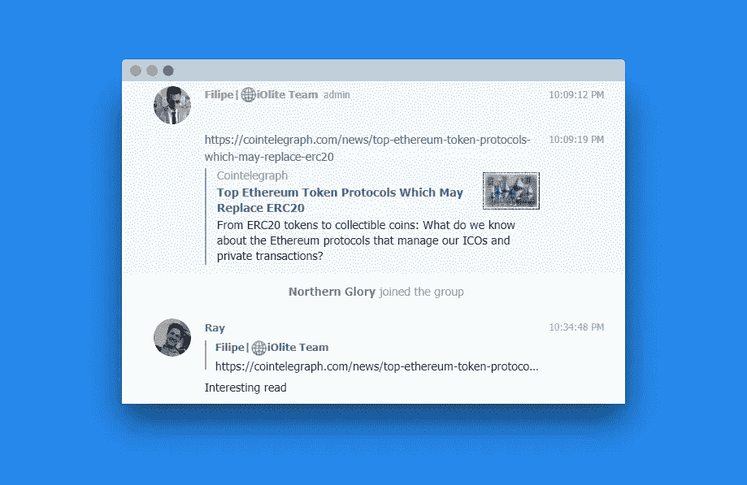
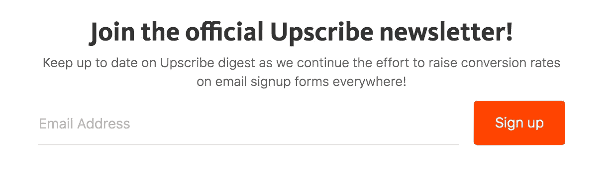
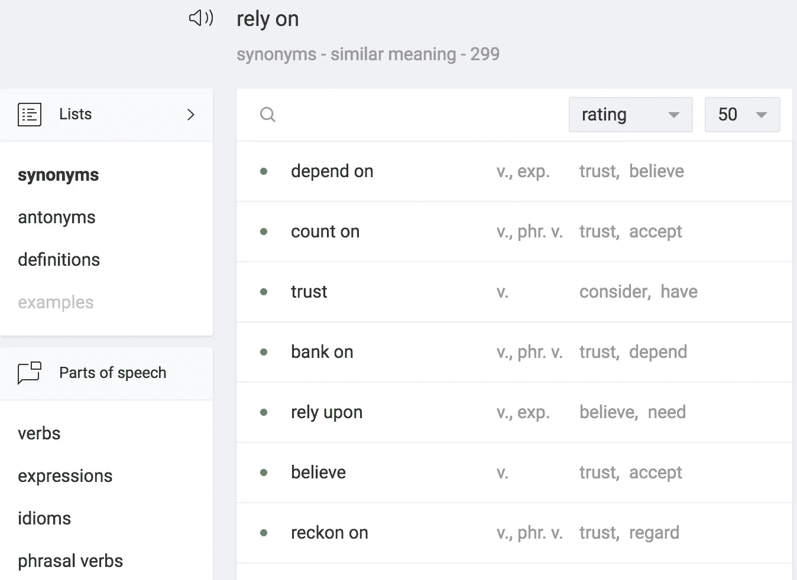
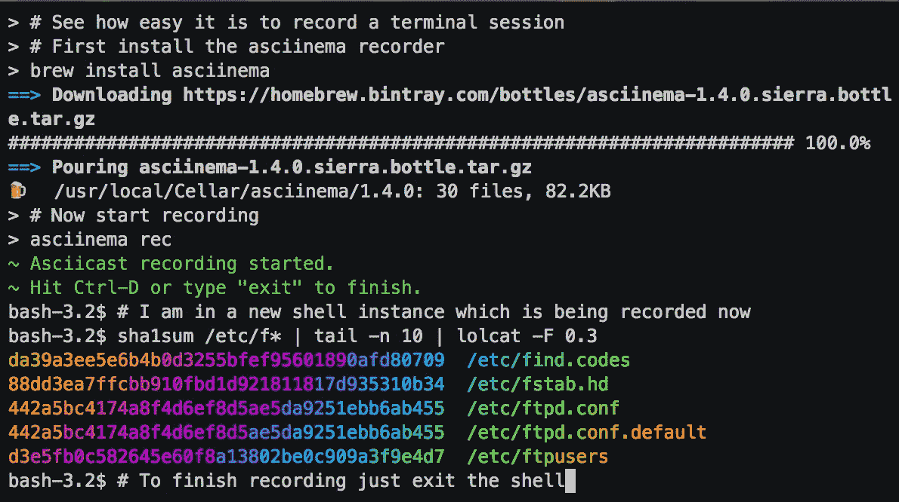

# 每个作家都应该知道的 9 个工具

> 原文：<https://medium.com/hackernoon/9-tools-every-writer-should-know-about-f923743a9cbb>

作为一名开发人员，我喜欢使用可以帮助我写作的工具。在过去的几年里，我创建了一个有用资源的扩展列表。

## [1。海明威 App](http://www.hemingwayapp.com/)

这可能是最知名的检查语法、可读性、内容难度和结构的工具。

## [2。尖叫](https://www.screely.com/?ref=producthunt)

最近，我通过 ProductHunt 偶然发现了 Screely。该产品允许你上传截图，并添加一个假的窗口，阴影或背景，使它看起来很好。由于产品仍在开发中，他们不断增加更多的功能。这里有一个例子。

## [3。复印场景](http://www.copyscape.com/)

尤其是对你的客户来说，仔细检查你的内容是否抄袭是至关重要的，因为独特的内容在谷歌上得分更高。一个非常好的工具是 Copyscape，因为它显示了你从哪里复制的内容和匹配率。要使用这个工具，你必须至少购买价值 10€的信用点。

## [4。Mockdrop](http://mockdrop.io/)

Mockdrop 允许你模仿 iPhone、iPad、iMac 等设备中的图像。他们提供不同的布局和背景图像，使其看起来真实。这里有一些例子。

## [5。经纬度图](http://www.gratisography.com/)

你曾经为你的文章需要一个疯狂的库存照片，Gratisography 提供了广泛的疯狂的图像，包括人，自然，物体，…

My favourite Gratisography [image](https://gratisography.com/photo/man-dogs-playing-cards/).

## [6。众筹](https://www.crowdfireapp.com/?request_locale=en_US)

营销你的文章和创造它们同样重要。Crowdfire 帮助你增加你的在线观众。它提供的功能:

*   自动发现您的读者会喜欢的文章和图片，这样您就可以将它们分享到您的所有社交资料中，并让您的时间表保持活跃！
*   关注正确的人，取消不活跃的账户，与你的粉丝和关注者互动，关注竞争对手的关注者。
*   提前预定内容，并在最佳时间自动发布。

## [7。升级](/upscribe/hey-medium-4071fad281ec)

如果你想为你的读者提供邮件列表服务，Upscribe 可以帮你。该工具最大的好处是为中型文章提供了一个嵌入片段。这是它的样子。

## [8。超级同义词库](https://www.powerthesaurus.org/rely_on/synonyms)

我不喜欢同义词词典给我的提示，它们大多不相关或过于模糊。这就是为什么我开始寻找一个更好的同义词查找服务。PowerThesaurus 为您提供评级和一系列额外信息，帮助您找到最佳同义词，为您的文本增添趣味。伟大的 UX！

## [9。asci NEMA](https://asciinema.org/)

对于想要记录终端会话并在网上分享的技术作者来说，这是一个非常有用的工具。该工具可以通过“brew”软件包管理器安装。

## 奖金:【Grammarly.com 

理想的工具，检查你的内容的问题:拼写，语法，公约，同义词，…