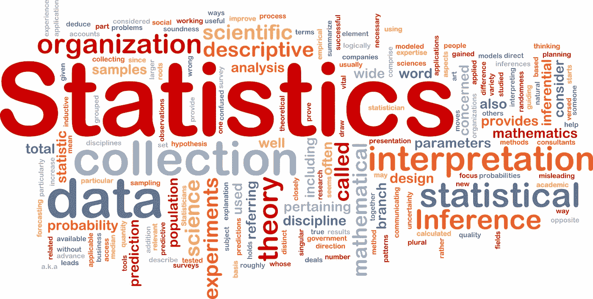
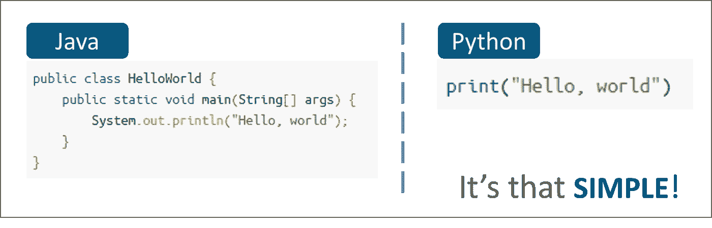
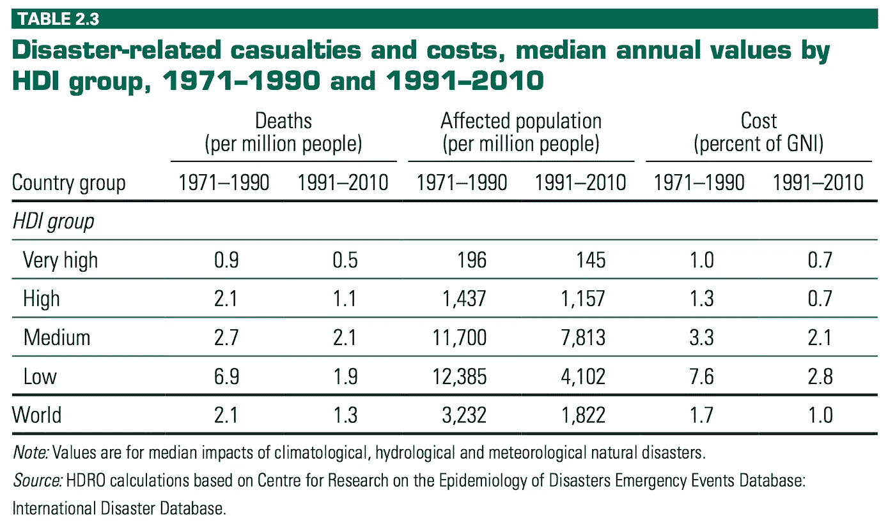
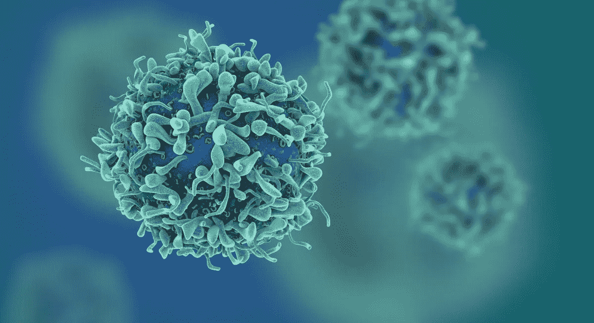
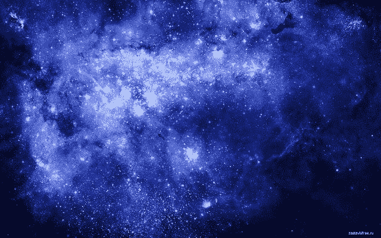
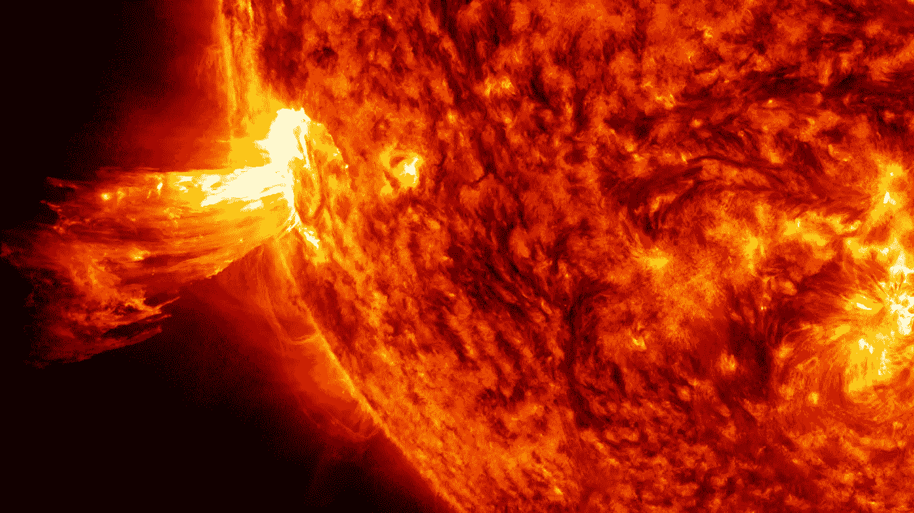

# 使用数据科学可以解决的 9 个异常问题

> 原文：<https://medium.com/hackernoon/9-unusual-problems-that-can-be-solved-using-data-science-e7dbb89aa0c4>

1.  将一种编程语言翻译成另一种语言。例如:java 到 python 的转换，反之亦然。这种技术可以解决许多问题，因为用一种语言开发的库将变得与其他语言兼容，从而创建一个开放的编程环境，在这个环境中，具有不同编程技能的人可以协作创建精彩的应用程序。

2.随着对政党的捐款达到新高，政治战略家开始在大型政党的竞选活动中发挥重要作用。然而，通过使用大数据和[数据科学](https://hackernoon.com/tagged/data-science)可以在这一领域取得优势。例如:利用大数据和数据科学，可以很容易地在社交媒体上发布针对用户的帖子，开展突出当地问题和创造政党正面形象的区域性活动。

3.地图中的交通预测。例如:-当你想从 Warangal 去 Hyderabad，Google Maps 的时间预测使用当前的交通状况来预测旅行时间。相反，它应该使用预测分析来预测特定时间位置的交通，然后使用它来预测行程时间。

4.根据一项研究，在过去的二十年里，有 23 亿人受到洪水的影响。利用数据科学和[人工智能](https://hackernoon.com/tagged/artificial-intelligence)，可以预测未来 100-500 年即将到来的洪水。这些预测可以用来在正确的位置建造水坝，以尽量减少损失。

5.将数据科学用于国防的广泛研究正在进行。数据科学可用于防止非法移民，识别拥挤区域的可疑活动，预测敌国核武器的位置和移动，识别和跟踪恐怖分子，检测暴力，驾驶无人机，引导导弹等。

6.使用数据科学来预测地震是一个具有挑战性的问题，研究人员多年来一直试图解决这个问题，但收效甚微。这个问题的解决方案可以拯救成千上万无辜的生命，并彻底改革灾害管理。

7.你有没有想过，为什么我们不能成功地为人们接种疫苗来抵抗像 H1N1 病毒和尼帕病毒这样的致命病毒，原因是这些病毒每年都在进化，使得以前的疫苗接种变得无用。然而，使用数据科学，我们可以预测这些病毒的演变，并相应地为人们接种疫苗。这可以大大减少这些致命病毒造成的死亡人数。

8.世界各地的太空研究人员将大部分宝贵时间花在寻找能够支持生命的行星上。然而，数据科学和人工智能系统可以通过搜索行星本身来大大减少他们的努力。这种智能系统也将比人类系统执行得更快，精度更高。

9.太阳耀斑是太阳亮度突然增强的闪光，通常在太阳表面附近观察到。强大的耀斑经常(但不总是)伴随着日冕物质抛射，最强大的耀斑在太阳总辐照度中几乎检测不到。太阳耀斑会造成巨大的破坏，因为它们携带有害的辐射。它们可以破坏通信基础设施，导致停电。数据科学可以用来提前预测这些太阳耀斑，以便做出安排，将损失降至最低。

如果你喜欢这个故事，请为它鼓掌并分享。

**跟随 *NITW 技术评论*上** [**脸书**](https://www.facebook.com/NITWTechnoreview/) **和** [**推特**](https://twitter.com/NTechnoreview)