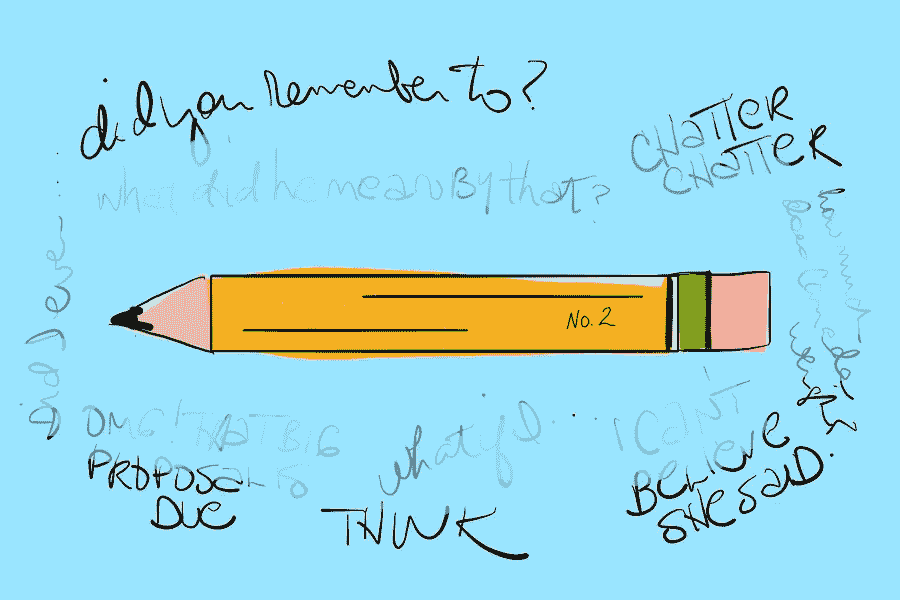

# 一支不起眼的铅笔可以让大脑停止喋喋不休的 9 种方式

> 原文：<https://medium.com/hackernoon/9-ways-a-humble-pencil-can-silence-brain-chatter-a77658750d75>

你有没有坐下来做某件事，突然你的思维就像一只狗追着一只兔子一样偏离了轨道？

如果你能坚持下去，那就太好了，但是:

松鼠！！！

然后它就朝另一个方向开了。

你知道，如果你能集中注意力，你就能把事情做好，但是你的大脑就是不闭嘴。

相反，它开始提醒你，你朋友的生日是在上周，而你从未送过一张卡片，卡片什么时候变得这么贵了，哦，对了，在上次你去参加的聚会上，大卫表演了那个很酷的卡片魔术——他是怎么做到的？

有时候，你只需要停止大脑的喋喋不休，这样你就能获得享受生活所需的平静和安宁。

好消息是，你有一个实现和平的秘密魔法工具，花费不到一美元。它是木制的，黄色的。有一块方便的粉红色橡皮擦。经常会在侧面印上 2。

这里有 9 种方法可以让一只不起眼的铅笔轻松快捷地让大脑停止喋喋不休:

# 在 pings 上按暂停键。

你的大脑知道什么时候它已经致力于一项尚未完成的任务。事实上，它会不停地提醒你。毕竟，大脑的部分工作是记录事情，直到事情完成。

花点时间让你的大脑把那些未完成的任务以列表的形式写在纸上，这会让它有信心完成任务。随着宽慰，它释放了令人担忧的提醒。仅仅通过一个清单，你就向你的大脑保证“我已经得到了这个”

《T2》一书的作者大卫·艾伦把它框定为封闭的开放循环。虽然艾伦有一个伟大的系统来提高[的生产力](https://hackernoon.com/tagged/productivity)，如果你真的被大脑喋喋不休所淹没，最好的开始是创建一个简单的待办事项列表。此外，一旦你完成了一件事，划掉它会有一种独特的快感。

# 用活页纸做你的大脑，就像用纸巾做你的鼻子一样。

有时，我们的大脑喋喋不休，以至于我们甚至无法列出清单。我们需要排除堵塞。

在她的书《写下来，让它发生》中，亨利埃特·安妮·克劳斯分享道:“我鼓励一种表达想法的方式，我称之为快速写作。它意味着快速写作，不要停下来思考、编辑、重新安排或评论。当你覆盖整个页面时，使用快速书写法，费力地处理异议，抑制批评你每一个字的内心声音。写下你的想法。说实话。烧掉你的快速写作页面，咆哮和胡言乱语是没关系的。”

快速书写的重要之处在于你不能使用过滤器。通常，当我们写下东西时，我们会停下来思考并在脑海中构思。跳过这一步。直接从大脑到纸张。就像面巾纸一样。之后你可以把这些纸扔掉。

# 如果你的大脑感觉像爆米花机，在纸上模仿那个模式。

当我们的大脑处于爆米花模式时，很难找到清晰度。我们没有行动计划。

将爆米花式的想法洒在纸上，然后在相关项目之间画出联系，这被称为思维导图。当你的大脑被想法淹没时，这种形式的计划尤其有用。在相关的想法之间画线创造了结构——并且经常创造出洞察力的闪光。

有许多思维导图程序可以让你数字化地做到这一点，但使用铅笔和纸可以更有效地让大脑安静下来——即使成品看起来不那么整洁。

# 用 Zentangles 找到你的禅

Zentangle 是一种从你的手到页面自由流动地绘制结构化的重复图案的方法。这个绘图绕过了你通常的计划功能，所以你可以享受这个过程而不用担心结果。

画 Zentangles 是冥想，它让你的大脑在你玩的时候放松。从跳跃的思绪到平静平和的大脑，并不需要很长时间。

最重要的是，这种方法简单易学。你画一个形状(或大而多圈的涂鸦)，然后把形状分成几部分。每个部分都有自己的模式。简单或复杂——随你喜欢。要了解更多关于这种方法的信息，请查看 https://zentangle.com/的。

# 如果你的大脑喋喋不休围绕着被卡住，开始一个想象的通信。

有时候，我们的喋喋不休是因为不确定我们到底想要什么。我们的思想变成了试图像解决问题一样解决生活的循环，而不是充满生活的乐趣。

受亨丽埃特·安妮·克劳斯的[中的一个练习的启发，我开始给我的新工作写信，当时我正处于平台期。我买了一个作文笔记本，像写日记一样写下一些条目。“亲爱的新工作，我太兴奋了，我可以每天花这么多时间写作。”还有，“亲爱的新工作，我很感激我有这么多机会在群体中发言。”](https://amzn.to/2MhqLfQ)

有趣的是，写这些信帮助我非常清楚自己想要什么——这促使我用我的时间做出有启发性的选择。有趣的是，在这个过程中，我并没有找到新的工作。事情是这样的，我现在的工作开始变得像我最想要的样子。

# 利用教室惩罚来说服你的大脑在更积极的轨道上运行。

有老师罚你写 100 个句子吗？这是最糟糕的，对不对？很有可能，这些话已经烙进了你的灵魂。你记得你写了什么。

尽管我们大多数人对写句子有负面的理解，但这种练习可以用来为我们的大脑创造积极的、新的、无喋喋不休的轨迹。重复的、动觉的写句子的任务可以用来帮助我们重新编程我们的潜意识。

选择一个肯定，一个目标，一个你想要加强的信念，或者一段经文，然后拿起铅笔开始写。你会发现，不仅你的大脑开始平静下来，而且无论你写什么都成为你自然思维模式的一部分。

# 回放尴尬的互动？为了更好的结果重写剧本。

有时候，我们头脑中的喋喋不休只是我们在重复对话。我们要么说我们希望我们说过的话，要么修改我们说过的话，一遍又一遍。

下一次发生这种情况时，把它从你的脑海中抹去，写在纸上。

也不要把自己局限在对方实际说的话里。按照你希望发生的方式重写剧本。你的大脑会停止回放，因为你已经在印刷品中捕捉到了它——即使你通过给它一个好莱坞式的结局获得了创作许可。

# 你知道吗，铅笔根本不需要接触纸张就能让你的大脑安静下来。

重复的、有节奏的运动模式让人平静。当我们感到焦虑时，这就是我们坐立不安的原因。

所以，如果写下东西对平静喋喋不休的大脑没有吸引力，把铅笔头举在空中，学会用拇指旋转它。维基百科有一个教程:[https://www.wikihow.com/Spin-a-Pencil-Around-Your-Thumb](https://www.wikihow.com/Spin-a-Pencil-Around-Your-Thumb)

它会把你的铅笔变成一个老式的坐立不安的旋转器，从你的大脑储备中吸取足够的能量来阻止它追赶那只松鼠。

# 想要长期解决大脑喋喋不休的问题吗？在它开始之前主动排出。

朱莉娅·卡梅伦每天练习“晨读”是重新训练一个喋喋不休的大脑的最佳长期练习之一。

在她的书《艺术家之路》中，卡梅隆写道:“为了找回你的创造力，你需要找到它。我要求你们通过一个明显毫无意义的过程来做到这一点，我称之为晨页……晨页是三页的手写文字，完全是意识流:“哦，上帝，又是一个早晨。我无话可说。我需要洗窗帘。我昨天拿到我要洗的衣服了吗？废话，废话，废话……'他们也可能，更不体面地被称为人才外流，因为这是他们的主要职能之一。”

卡梅隆断言，做早报版面没有错。这是一个简单的写作过程——手写——想到什么就写什么。卡梅伦说，“尽管偶尔会有色彩缤纷的内容，但晨报通常是负面的，经常是支离破碎的，经常是自怜的，重复的，做作的或幼稚的，愤怒的或平淡的——甚至听起来很傻。”随着时间的推移，晨读的练习重新训练大脑在安静的状态下活动，因为你开始看清喋喋不休是什么了。只是聊天。

# 想象自己有一个平静的大脑。

大脑喋喋不休最糟糕的部分是它让我们疲惫不堪。这就像有一个室友一直站在我们旁边，用不完整的句子说话，而且永远不会闭嘴。

试想下一次那位内部舍友喋喋不休的时候，把他们赶出去该是多么令人欣喜的事情。

最棒的是，这不费吹灰之力就能实现。

你只要用这些技巧中的一种从抽屉里抽出一支铅笔，过一会儿大脑就会安静下来。

听到——感受到——寂静。内外兼修。甚至那只松鼠也很安静。

//想要另一种方法让你的大脑安静下来？试试[记笔记](https://yourvisualjournal.com/how-to-sketchnote/)。